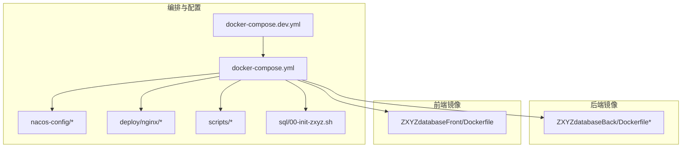
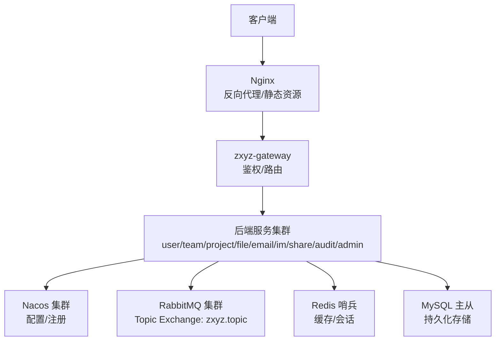
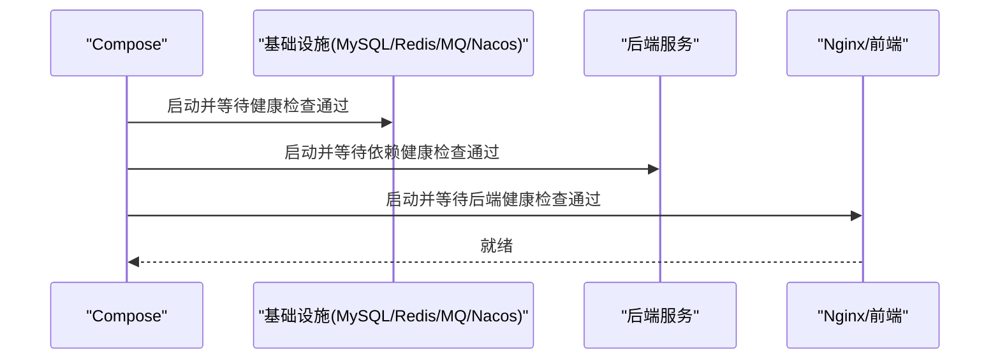

# Docker Compose编排配置

<cite>
**本文引用的文件**   
- [docker-compose.yml](file://docker-compose.yml)
- [docker-compose.dev.yml](file://docker-compose.dev.yml)
- [Dockerfile](file://ZXYZdatabaseBack/Dockerfile)
- [Dockerfile.base](file://ZXYZdatabaseBack/Dockerfile.base)
- [Dockerfile](file://ZXYZdatabaseFront/Dockerfile)
- [default.conf](file://deploy/nginx/default.conf)
- [entrypoint.sh](file://deploy/nginx/entrypoint.sh)
- [promtail-config.yml](file://deploy/promtail-config.yml)
- [zxyz-admin-service.yml](file://nacos-config/zxyz-admin-service.yml)
- [zxyz-audit-service.yml](file://nacos-config/zxyz-audit-service.yml)
- [zxyz-email-service.yml](file://nacos-config/zxyz-email-service.yml)
- [zxyz-file-service.yml](file://nacos-config/zxyz-file-service.yml)
- [zxyz-gateway.yml](file://nacos-config/zxyz-gateway.yml)
- [zxyz-im-service.yml](file://nacos-config/zxyz-im-service.yml)
- [zxyz-project-service.yml](file://nacos-config/zxyz-project-service.yml)
- [zxyz-share-service.yml](file://nacos-config/zxyz-share-service.yml)
- [zxyz-team-service.yml](file://nacos-config/zxyz-team-service.yml)
- [zxyz-user-service.yml](file://nacos-config/zxyz-user-service.yml)
- [zxyz-dynamic.yml](file://nacos-config/zxyz-dynamic.yml)
- [zxyz-static.yml](file://nacos-config/zxyz-static.yml)
- [import.sh](file://nacos-config/import.sh)
- [backup.sh](file://scripts/backup.sh)
- [dev-up.sh](file://scripts/dev-up.sh)
- [health-check.sh](file://scripts/health-check.sh)
- [validate-env.sh](file://scripts/validate-env.sh)
- [00-init-zxyz.sh](file://sql/00-init-zxyz.sh)
- [DEPLOYMENT.md](file://DEPLOYMENT.md)
</cite>

## 目录
1. [简介](#简介)
2. [项目结构](#项目结构)
3. [核心组件](#核心组件)
4. [架构总览](#架构总览)
5. [详细组件分析](#详细组件分析)
6. [依赖关系与启动顺序](#依赖关系与启动顺序)
7. [网络拓扑与服务发现](#网络拓扑与服务发现)
8. [环境变量与配置管理](#环境变量与配置管理)
9. [性能与资源限制](#性能与资源限制)
10. [故障恢复与备份策略](#故障恢复与备份策略)
11. [开发与生产差异化配置](#开发与生产差异化配置)
12. [排错指南](#排错指南)
13. [结论](#结论)
14. [附录](#附录)

## 简介
本文件为 ZXYZ 项目的 Docker Compose 编排配置文档，覆盖 18 个容器的完整编排策略：5 类基础设施服务（MySQL 主从、Redis 哨兵、RabbitMQ 集群、Nacos 集群、Nginx）以及 10 个后端服务的容器化部署。文档重点说明服务依赖与健康检查、网络隔离与端口映射、服务发现机制、环境变量与配置管理、开发/生产环境差异、监控日志与故障恢复等关键主题，帮助读者快速理解并落地部署。

## 项目结构
- 根目录包含 docker-compose 编排文件、Nacos 配置、脚本与 SQL 初始化脚本等。
- 后端镜像构建定义位于 ZXYZdatabaseBack 目录；前端静态资源构建定义位于 ZXYZdatabaseFront 目录。
- Nginx 反向代理与日志采集配置位于 deploy 目录。
- nacos-config 目录集中管理服务配置项，便于通过 import.sh 导入到 Nacos。

图表来源
- [docker-compose.yml](file://docker-compose.yml)
- [docker-compose.dev.yml](file://docker-compose.dev.yml)
- [Dockerfile](file://ZXYZdatabaseBack/Dockerfile)
- [Dockerfile.base](file://ZXYZdatabaseBack/Dockerfile.base)
- [Dockerfile](file://ZXYZdatabaseFront/Dockerfile)
- [default.conf](file://deploy/nginx/default.conf)
- [entrypoint.sh](file://deploy/nginx/entrypoint.sh)
- [promtail-config.yml](file://deploy/promtail-config.yml)
- [import.sh](file://nacos-config/import.sh)
- [backup.sh](file://scripts/backup.sh)
- [dev-up.sh](file://scripts/dev-up.sh)
- [health-check.sh](file://scripts/health-check.sh)
- [validate-env.sh](file://scripts/validate-env.sh)
- [00-init-zxyz.sh](file://sql/00-init-zxyz.sh)

章节来源
- [docker-compose.yml](file://docker-compose.yml)
- [docker-compose.dev.yml](file://docker-compose.dev.yml)
- [DEPLOYMENT.md](file://DEPLOYMENT.md)

## 核心组件
- 基础设施服务
  - MySQL 主从：提供持久化数据库能力，支持读写分离与数据一致性保障。
  - Redis 哨兵：提供缓存与会话存储的高可用方案。
  - RabbitMQ 集群：作为异步消息总线，支撑审计、邮件、文件处理等场景。
  - Nacos 集群：配置中心与服务注册发现。
  - Nginx：统一入口网关、静态资源托管与反向代理。
- 后端服务（10 个）
  - zxyz-gateway：API 网关，鉴权与路由转发。
  - zxyz-user-service：用户服务。
  - zxyz-team-service：团队服务。
  - zxyz-project-service：项目服务。
  - zxyz-file-service：文件服务。
  - zxyz-email-service：邮件服务。
  - zxyz-im-service：即时通讯服务。
  - zxyz-share-service：分享服务。
  - zxyz-audit-service：审计服务。
  - zxyz-admin-service：配置管理服务。
- 前端服务
  - frontend-nginx：静态页面与 API 反向代理。
- 日志与监控
  - promtail：日志采集。
  - （可选）其他监控组件可通过扩展编排接入。

章节来源
- [docker-compose.yml](file://docker-compose.yml)
- [docker-compose.dev.yml](file://docker-compose.dev.yml)

## 架构总览
整体采用微服务架构，Nacos 负责服务注册与配置分发，RabbitMQ 承担异步解耦，MySQL 与 Redis 提供数据与缓存能力，Nginx 作为统一入口。前后端通过 Gateway 暴露内部接口，外部仅访问 Nginx 与必要的公开端点。

图表来源
- [docker-compose.yml](file://docker-compose.yml)
- [default.conf](file://deploy/nginx/default.conf)
- [zxyz-gateway.yml](file://nacos-config/zxyz-gateway.yml)

## 详细组件分析

### 基础设施服务编排要点
- MySQL 主从
  - 主库：写入节点，开启 binlog 与复制参数。
  - 从库：只读节点，用于读多写少场景或报表查询。
  - 健康检查：基于 TCP/命令探测主从状态与连接可用性。
  - 数据卷：持久化 /var/lib/mysql，确保重启不丢数据。
- Redis 哨兵
  - 哨兵节点：监控主从切换，对外提供哨兵端口。
  - 应用侧使用哨兵地址进行连接，自动故障转移。
  - 健康检查：ping + info replication。
- RabbitMQ 集群
  - 多节点组成集群，共享 Erlang Cookie。
  - 队列与交换器由应用创建或使用预置策略。
  - 健康检查：rabbitmqctl status 或 HTTP API。
- Nacos 集群
  - 多实例以 raft 模式运行，共享持久化目录。
  - 通过 import.sh 批量导入服务配置。
  - 健康检查：HTTP 探针。
- Nginx
  - 反向代理至 Gateway 与各内部服务。
  - 静态资源由前端镜像提供。
  - 健康检查：HTTP 200。

章节来源
- [docker-compose.yml](file://docker-compose.yml)
- [docker-compose.dev.yml](file://docker-compose.dev.yml)

### 后端服务容器化要点
- 通用镜像基础
  - 使用 ZXYZdatabaseBack/Dockerfile.base 作为基础镜像，统一运行时环境与依赖。
  - 各服务模块独立构建镜像，减少镜像体积与构建时间。
- 配置注入
  - 通过 Nacos 动态拉取配置，环境变量用于敏感信息（如 Jasypt 密钥）。
  - 每个服务在 nacos-config 下有对应配置文件，便于版本化管理。
- 健康检查与依赖
  - 各服务通过 depends_on 与 healthcheck 声明依赖关系，确保启动顺序。
  - 重试机制配合健康检查避免瞬时失败导致的服务不可用。

章节来源
- [Dockerfile](file://ZXYZdatabaseBack/Dockerfile)
- [Dockerfile.base](file://ZXYZdatabaseBack/Dockerfile.base)
- [zxyz-admin-service.yml](file://nacos-config/zxyz-admin-service.yml)
- [zxyz-audit-service.yml](file://nacos-config/zxyz-audit-service.yml)
- [zxyz-email-service.yml](file://nacos-config/zxyz-email-service.yml)
- [zxyz-file-service.yml](file://nacos-config/zxyz-file-service.yml)
- [zxyz-gateway.yml](file://nacos-config/zxyz-gateway.yml)
- [zxyz-im-service.yml](file://nacos-config/zxyz-im-service.yml)
- [zxyz-project-service.yml](file://nacos-config/zxyz-project-service.yml)
- [zxyz-share-service.yml](file://nacos-config/zxyz-share-service.yml)
- [zxyz-team-service.yml](file://nacos-config/zxyz-team-service.yml)
- [zxyz-user-service.yml](file://nacos-config/zxyz-user-service.yml)

### 前端服务编排要点
- 构建产物由 ZXYZdatabaseFront/Dockerfile 生成静态资源。
- Nginx 反向代理至 Gateway，并提供静态页面访问。
- 环境变量控制 API 前缀与超时等。

章节来源
- [Dockerfile](file://ZXYZdatabaseFront/Dockerfile)
- [default.conf](file://deploy/nginx/default.conf)

## 依赖关系与启动顺序
- 启动顺序原则
  - 先启动基础设施（MySQL、Redis、RabbitMQ、Nacos），再启动后端服务，最后启动 Nginx 与前端。
  - 使用 depends_on 与 healthcheck 组合保证依赖就绪。
- 健康检查策略
  - MySQL：TCP 连通性与登录测试。
  - Redis：PING 与 INFO 检查。
  - RabbitMQ：CLI 或 HTTP API 检查。
  - Nacos：HTTP 探针。
  - 后端服务：HTTP 健康端点。
- 示例流程（概念性）

[此图为概念流程图，不直接映射具体源码文件]

## 网络拓扑与服务发现
- 自定义网络
  - 使用单一自定义网络隔离所有容器，内部通过服务名解析。
  - 端口映射仅暴露必要端口（如 Nginx 80/443、Nacos 控制台端口等）。
- 服务发现
  - 后端服务通过 Nacos 注册与发现，实现动态扩缩容与负载均衡。
  - 内部调用通过 ServiceClient 与 X-Internal-Service-Token 鉴权。
- 端口映射策略
  - 开发环境：开放更多调试端口。
  - 生产环境：仅开放最小必要端口，结合防火墙与网关策略。

章节来源
- [docker-compose.yml](file://docker-compose.yml)
- [docker-compose.dev.yml](file://docker-compose.dev.yml)

## 环境变量与配置管理
- 环境变量
  - 数据库连接池：URL、用户名、密码、最大连接数、超时等。
  - Redis：主机、端口、密码、哨兵地址、连接池大小。
  - RabbitMQ：主机、端口、用户名、密码、虚拟主机、交换器名称。
  - Nacos：地址、命名空间、分组、Jasypt 加密密钥。
- 配置优先级
  - 环境变量 > Nacos 配置 > 默认配置。
- 敏感信息
  - 使用 Jasypt 加密敏感字段，密钥通过环境变量注入。
- 初始化脚本
  - 数据库初始化脚本 00-init-zxyz.sh 在首次启动时执行。

章节来源
- [zxyz-dynamic.yml](file://nacos-config/zxyz-dynamic.yml)
- [zxyz-static.yml](file://nacos-config/zxyz-static.yml)
- [import.sh](file://nacos-config/import.sh)
- [00-init-zxyz.sh](file://sql/00-init-zxyz.sh)

## 性能与资源限制
- 资源限制
  - 为各服务设置 CPU 与内存上限，防止资源争抢。
  - 数据库与缓存服务适当提高资源配额。
- 连接池优化
  - 根据并发量调整数据库与 Redis 连接池大小。
- 日志级别
  - 开发环境启用 DEBUG，生产环境调整为 INFO/WARN。
- 监控集成
  - 通过 Promtail 采集容器日志，可对接 ELK 或 Loki。

章节来源
- [docker-compose.yml](file://docker-compose.yml)
- [promtail-config.yml](file://deploy/promtail-config.yml)

## 故障恢复与备份策略
- 自动重启
  - 设置 restart: unless-stopped 或 on-failure，确保服务异常后自动恢复。
- 数据持久化
  - MySQL、Redis、RabbitMQ、Nacos 均挂载数据卷，避免重启丢失。
- 备份方案
  - 使用 backup.sh 定时备份数据库与关键配置。
  - 备份文件落盘并定期上传至对象存储或远端仓库。
- 灰度与回滚
  - 通过脚本 deploy-fast.sh 与 rollback.sh 实现快速发布与回滚。

章节来源
- [docker-compose.yml](file://docker-compose.yml)
- [backup.sh](file://scripts/backup.sh)
- [deploy-fast.sh](file://scripts/deploy-fast.sh)
- [rollback.sh](file://scripts/rollback.sh)

## 开发与生产差异化配置
- 开发环境
  - 使用 docker-compose.dev.yml 叠加开发配置，开启调试端口与详细日志。
  - dev-up.sh 一键启动开发环境。
- 生产环境
  - 使用 docker-compose.yml 生产配置，关闭调试功能，启用安全策略。
  - validate-env.sh 校验环境变量完整性。
- 镜像构建
  - CI/CD 基于 GitHub Actions 选择性构建，推送 GHCR。

章节来源
- [docker-compose.dev.yml](file://docker-compose.dev.yml)
- [dev-up.sh](file://scripts/dev-up.sh)
- [validate-env.sh](file://scripts/validate-env.sh)
- [DEPLOYMENT.md](file://DEPLOYMENT.md)

## 排错指南
- 常见问题
  - 服务无法启动：检查依赖健康状态与环境变量。
  - 数据库连接失败：确认账号权限与网络连通性。
  - Redis 连接失败：检查哨兵配置与密码。
  - RabbitMQ 连接失败：确认虚拟主机与权限。
  - Nacos 配置未生效：检查命名空间与分组。
- 诊断工具
  - health-check.sh 检查各服务健康状态。
  - 查看容器日志定位问题。
- 回滚与恢复
  - 使用 rollback.sh 快速回滚到上一版本。
  - 使用 backup.sh 恢复最近备份。

章节来源
- [health-check.sh](file://scripts/health-check.sh)
- [rollback.sh](file://scripts/rollback.sh)
- [backup.sh](file://scripts/backup.sh)

## 结论
通过 Docker Compose 编排 ZXYZ 项目，实现了基础设施与后端服务的标准化部署。借助 Nacos 与 RabbitMQ 提升系统的可扩展性与解耦能力，结合健康检查、资源限制与备份策略保障系统稳定性。开发与生产环境的差异化配置提升了交付效率与安全性。

## 附录
- 常用命令
  - 启动开发环境：dev-up.sh
  - 验证环境变量：validate-env.sh
  - 健康检查：health-check.sh
  - 备份数据：backup.sh
  - 快速部署：deploy-fast.sh
  - 回滚版本：rollback.sh
- 参考文档
  - DEPLOYMENT.md 提供部署细节与最佳实践。

章节来源
- [dev-up.sh](file://scripts/dev-up.sh)
- [validate-env.sh](file://scripts/validate-env.sh)
- [health-check.sh](file://scripts/health-check.sh)
- [backup.sh](file://scripts/backup.sh)
- [deploy-fast.sh](file://scripts/deploy-fast.sh)
- [rollback.sh](file://scripts/rollback.sh)
- [DEPLOYMENT.md](file://DEPLOYMENT.md)