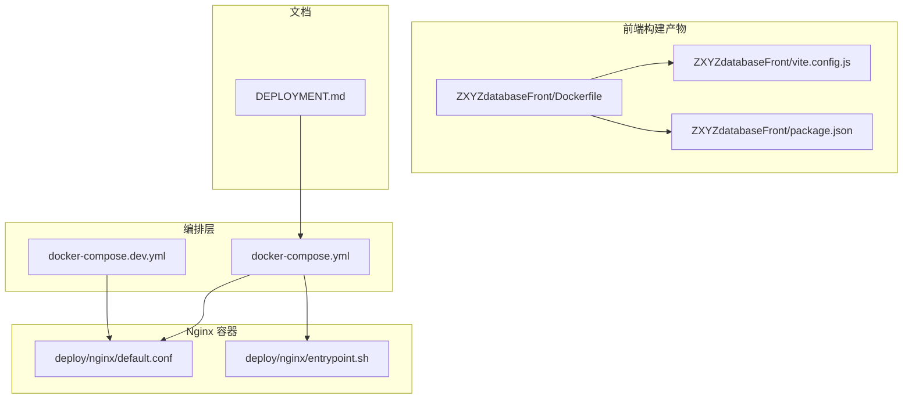
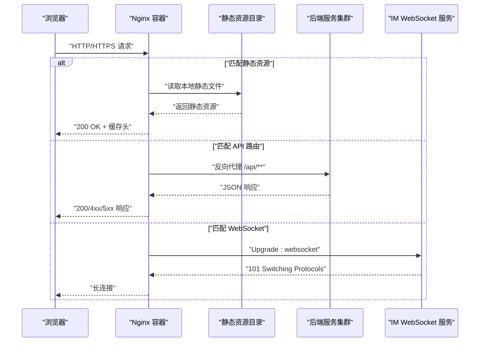
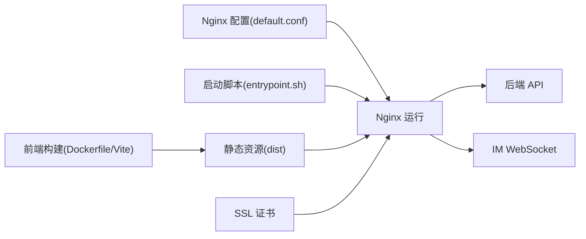

# 前端Nginx服务编排

<cite>
**本文引用的文件**   
- [docker-compose.yml](file://docker-compose.yml)
- [docker-compose.dev.yml](file://docker-compose.dev.yml)
- [deploy/nginx/default.conf](file://deploy/nginx/default.conf)
- [deploy/nginx/entrypoint.sh](file://deploy/nginx/entrypoint.sh)
- [ZXYZdatabaseFront/Dockerfile](file://ZXYZdatabaseFront/Dockerfile)
- [ZXYZdatabaseFront/vite.config.js](file://ZXYZdatabaseFront/vite.config.js)
- [ZXYZdatabaseFront/package.json](file://ZXYZdatabaseFront/package.json)
- [DEPLOYMENT.md](file://DEPLOYMENT.md)
</cite>

## 目录
1. [简介](#简介)
2. [项目结构](#项目结构)
3. [核心组件](#核心组件)
4. [架构总览](#架构总览)
5. [详细组件分析](#详细组件分析)
6. [依赖关系分析](#依赖关系分析)
7. [性能优化](#性能优化)
8. [故障排查指南](#故障排查指南)
9. [结论](#结论)
10. [附录](#附录)

## 简介
本文件面向 ZXYZ 项目的前端 Nginx 服务，提供基于 Docker Compose 的完整编排与配置说明。内容涵盖：
- Nginx 容器的静态资源服务、反向代理、WebSocket 支持、SSL 证书挂载与缓存策略
- 前端构建产物挂载、开发热重载与错误页面定制
- 后端 API 路由转发、跨域与安全头设置
- Gzip 压缩、静态资源缓存、连接池调优等性能优化
- 开发与生产环境的差异化配置（调试模式、日志级别）

## 项目结构
围绕前端 Nginx 的关键文件分布如下：
- 编排文件：docker-compose.yml、docker-compose.dev.yml
- Nginx 配置：deploy/nginx/default.conf、deploy/nginx/entrypoint.sh
- 前端镜像构建：ZXYZdatabaseFront/Dockerfile
- 前端构建脚本与运行时依赖：ZXYZdatabaseFront/vite.config.js、ZXYZdatabaseFront/package.json
- 部署说明：DEPLOYMENT.md

**图表来源** 
- [docker-compose.yml](file://docker-compose.yml)
- [docker-compose.dev.yml](file://docker-compose.dev.yml)
- [deploy/nginx/default.conf](file://deploy/nginx/default.conf)
- [deploy/nginx/entrypoint.sh](file://deploy/nginx/entrypoint.sh)
- [ZXYZdatabaseFront/Dockerfile](file://ZXYZdatabaseFront/Dockerfile)
- [ZXYZdatabaseFront/vite.config.js](file://ZXYZdatabaseFront/vite.config.js)
- [ZXYZdatabaseFront/package.json](file://ZXYZdatabaseFront/package.json)
- [DEPLOYMENT.md](file://DEPLOYMENT.md)

**章节来源**
- [docker-compose.yml](file://docker-compose.yml)
- [docker-compose.dev.yml](file://docker-compose.dev.yml)
- [deploy/nginx/default.conf](file://deploy/nginx/default.conf)
- [deploy/nginx/entrypoint.sh](file://deploy/nginx/entrypoint.sh)
- [ZXYZdatabaseFront/Dockerfile](file://ZXYZdatabaseFront/Dockerfile)
- [ZXYZdatabaseFront/vite.config.js](file://ZXYZdatabaseFront/vite.config.js)
- [ZXYZdatabaseFront/package.json](file://ZXYZdatabaseFront/package.json)
- [DEPLOYMENT.md](file://DEPLOYMENT.md)

## 核心组件
- Nginx 主配置 default.conf：定义 HTTP/HTTPS 监听、静态站点根目录、反向代理规则、WebSocket 升级头、缓存与压缩、安全头等。
- 启动入口 entrypoint.sh：用于在容器启动时注入或替换 Nginx 环境变量（如域名、协议、上游地址），便于多环境复用同一镜像。
- 前端镜像构建 Dockerfile：将 Vite 构建产物复制到 Nginx 静态目录，确保运行期只包含静态资源。
- 前端构建配置 vite.config.js：控制构建输出目录、代理（开发）、路径解析等，影响最终静态资源结构与路径。
- 编排文件 docker-compose.yml / docker-compose.dev.yml：定义 Nginx 容器、端口映射、卷挂载、环境变量、网络与依赖服务。

**章节来源**
- [deploy/nginx/default.conf](file://deploy/nginx/default.conf)
- [deploy/nginx/entrypoint.sh](file://deploy/nginx/entrypoint.sh)
- [ZXYZdatabaseFront/Dockerfile](file://ZXYZdatabaseFront/Dockerfile)
- [ZXYZdatabaseFront/vite.config.js](file://ZXYZdatabaseFront/vite.config.js)
- [docker-compose.yml](file://docker-compose.yml)
- [docker-compose.dev.yml](file://docker-compose.dev.yml)

## 架构总览
下图展示浏览器到 Nginx，再到后端服务的请求流程，包括静态资源、API 与 WebSocket 的路由分发。

**图表来源** 
- [deploy/nginx/default.conf](file://deploy/nginx/default.conf)
- [docker-compose.yml](file://docker-compose.yml)

## 详细组件分析

### Nginx 主配置（default.conf）
- 静态资源服务
  - 指定站点根目录为前端构建产物目录
  - 开启目录浏览关闭（仅允许 index.html 作为入口）
  - 针对常见静态类型设置缓存头（js/css/img/fonts）
- 反向代理
  - /api/** 转发至后端网关或服务集群
  - 透传必要头部（Host、X-Forwarded-For、X-Real-IP、Authorization）
  - 超时与缓冲参数调优（proxy_connect_timeout、proxy_read_timeout、proxy_send_timeout、proxy_buffering）
- WebSocket 支持
  - 对 IM 相关路径启用 Upgrade 与 Connection 头透传
  - 设置合理的超时与缓冲以支撑长连接
- SSL 证书
  - 监听 443 并加载证书与私钥文件
  - 强制 HTTPS 重定向（可选）
  - 推荐启用 TLS 1.2+ 与合适密码套件
- 缓存策略
  - 静态资源 Cache-Control 与 Expires
  - 版本化文件名避免缓存污染
- 错误页面定制
  - 自定义 404/502/503/504 等错误页
  - 指向静态目录中的错误页面文件

**章节来源**
- [deploy/nginx/default.conf](file://deploy/nginx/default.conf)

### 启动入口（entrypoint.sh）
- 作用
  - 根据环境变量生成或覆盖 Nginx 配置片段（如 upstream、server_name、ssl_certificate、proxy_pass）
  - 支持多环境一键切换（dev/prod）
- 关键变量
  - NGINX_SERVER_NAME、NGINX_UPSTREAM_BACKEND、NGINX_SSL_CERT、NGINX_SSL_KEY、NGINX_PROXY_PASS、NGINX_WS_PATH
- 最佳实践
  - 使用模板文件 + envsubst 动态替换
  - 启动前校验必填变量与证书存在性

**章节来源**
- [deploy/nginx/entrypoint.sh](file://deploy/nginx/entrypoint.sh)

### 前端镜像构建（Dockerfile）
- 构建阶段
  - 基于 Node 镜像执行 npm install 与 Vite 构建
  - 输出目录通常为 dist
- 运行阶段
  - 基于 Nginx 镜像，复制 dist 到 /usr/share/nginx/html
  - 暴露 80/443 端口
- 优化点
  - 多阶段构建减小镜像体积
  - 缓存 node_modules 提升构建速度

**章节来源**
- [ZXYZdatabaseFront/Dockerfile](file://ZXYZdatabaseFront/Dockerfile)
- [ZXYZdatabaseFront/vite.config.js](file://ZXYZdatabaseFront/vite.config.js)
- [ZXYZdatabaseFront/package.json](file://ZXYZdatabaseFront/package.json)

### 编排文件（docker-compose.yml / docker-compose.dev.yml）
- 服务定义
  - frontend-nginx：Nginx 容器，挂载静态资源与配置文件
  - 可选：backend-api、im-ws、redis、rabbitmq 等（按实际编排）
- 端口映射
  - 80/443 对外暴露
- 卷挂载
  - 静态资源目录、Nginx 配置、SSL 证书
- 环境变量
  - 传入 entrypoint.sh 所需变量
- 网络
  - 统一 network 以便服务间通信
- 健康检查
  - 通过 curl 探测 / 或 /healthz

**章节来源**
- [docker-compose.yml](file://docker-compose.yml)
- [docker-compose.dev.yml](file://docker-compose.dev.yml)

### 前端构建与热重载（Vite）
- 构建产物
  - 默认输出到 dist，包含 index.html 与资源文件
- 开发代理
  - 开发模式下通过 Vite 代理转发 /api/** 到后端，便于本地联调
- 路径与基础路径
  - base 配置需与 Nginx 静态根一致
- 热重载
  - 开发环境通过 Vite HMR 实现，生产环境无需热重载

**章节来源**
- [ZXYZdatabaseFront/vite.config.js](file://ZXYZdatabaseFront/vite.config.js)
- [ZXYZdatabaseFront/package.json](file://ZXYZdatabaseFront/package.json)

## 依赖关系分析
- Nginx 依赖
  - 静态资源目录（前端构建产物）
  - SSL 证书文件（生产环境）
  - 后端服务可达（API 与 WebSocket）
- 前端构建依赖
  - Node.js 与包管理器（npm/pnpm/yarn）
  - Vite 插件与依赖
- 编排依赖
  - Docker 与 Compose
  - 可选：外部存储（证书、日志）

**图表来源** 
- [ZXYZdatabaseFront/Dockerfile](file://ZXYZdatabaseFront/Dockerfile)
- [ZXYZdatabaseFront/vite.config.js](file://ZXYZdatabaseFront/vite.config.js)
- [deploy/nginx/default.conf](file://deploy/nginx/default.conf)
- [deploy/nginx/entrypoint.sh](file://deploy/nginx/entrypoint.sh)
- [docker-compose.yml](file://docker-compose.yml)

**章节来源**
- [ZXYZdatabaseFront/Dockerfile](file://ZXYZdatabaseFront/Dockerfile)
- [ZXYZdatabaseFront/vite.config.js](file://ZXYZdatabaseFront/vite.config.js)
- [deploy/nginx/default.conf](file://deploy/nginx/default.conf)
- [deploy/nginx/entrypoint.sh](file://deploy/nginx/entrypoint.sh)
- [docker-compose.yml](file://docker-compose.yml)

## 性能优化
- Gzip 压缩
  - 启用 gzip 与 gzip_types，覆盖 html/js/css/json/svg 等
  - 合理设置 gzip_min_length 与 gzip_comp_level
- 静态资源缓存
  - 为 js/css/img/fonts 设置长期缓存（Cache-Control: max-age=31536000）
  - 使用版本化文件名（Vite 默认已处理）
- 连接池与并发
  - worker_processes auto；worker_connections 根据 CPU 核数调整
  - keepalive_timeout 与 sendfile/tcp_nopush 优化
- 代理优化
  - proxy_cache 与 proxy_cache_valid（按需启用）
  - 合理设置 proxy_buffer_size、proxy_buffers、proxy_busy_buffers_size
- 带宽与限流
  - limit_req_zone 与 limit_req 限制恶意请求
  - client_max_body_size 控制上传大小

**章节来源**
- [deploy/nginx/default.conf](file://deploy/nginx/default.conf)

## 故障排查指南
- 常见问题
  - 404：静态资源路径错误或未正确挂载
  - 502/503：后端不可达或上游超时
  - WebSocket 失败：缺少 Upgrade/Connection 头或后端不支持
  - SSL 握手失败：证书不匹配或权限不足
- 诊断步骤
  - 查看 Nginx 访问与错误日志
  - 验证环境变量与 entrypoint.sh 生成的配置
  - 检查端口占用与防火墙规则
  - 使用 curl -v 测试上游连通性与响应头
- 建议
  - 开发环境开启详细日志，生产环境降低日志级别
  - 增加健康检查与告警

**章节来源**
- [deploy/nginx/default.conf](file://deploy/nginx/default.conf)
- [deploy/nginx/entrypoint.sh](file://deploy/nginx/entrypoint.sh)
- [docker-compose.yml](file://docker-compose.yml)

## 结论
通过合理的 Nginx 配置与 Docker Compose 编排，ZXYZ 前端服务可实现高性能的静态资源交付、稳定的 API 反向代理与可靠的 WebSocket 长连接。结合 Gzip、缓存、连接池与错误页定制，可在不同环境下获得一致的体验。建议在 CI/CD 中固化镜像构建与部署流程，确保配置与代码同步演进。

## 附录
- 参考部署说明：[DEPLOYMENT.md](file://DEPLOYMENT.md)
- 常用命令
  - 启动：docker compose up -d
  - 查看日志：docker compose logs -f frontend-nginx
  - 重建镜像：docker compose build frontend-nginx