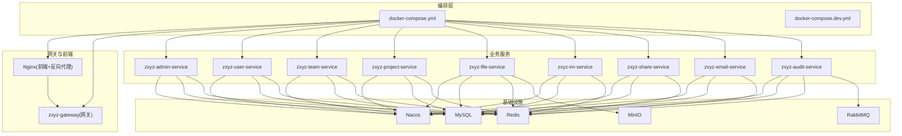
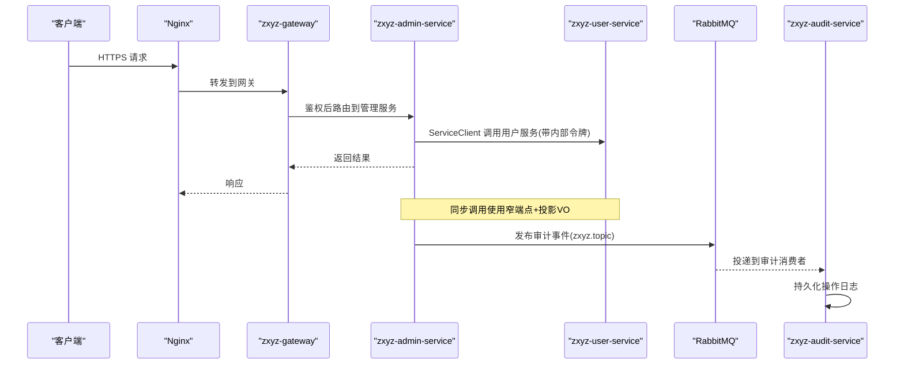
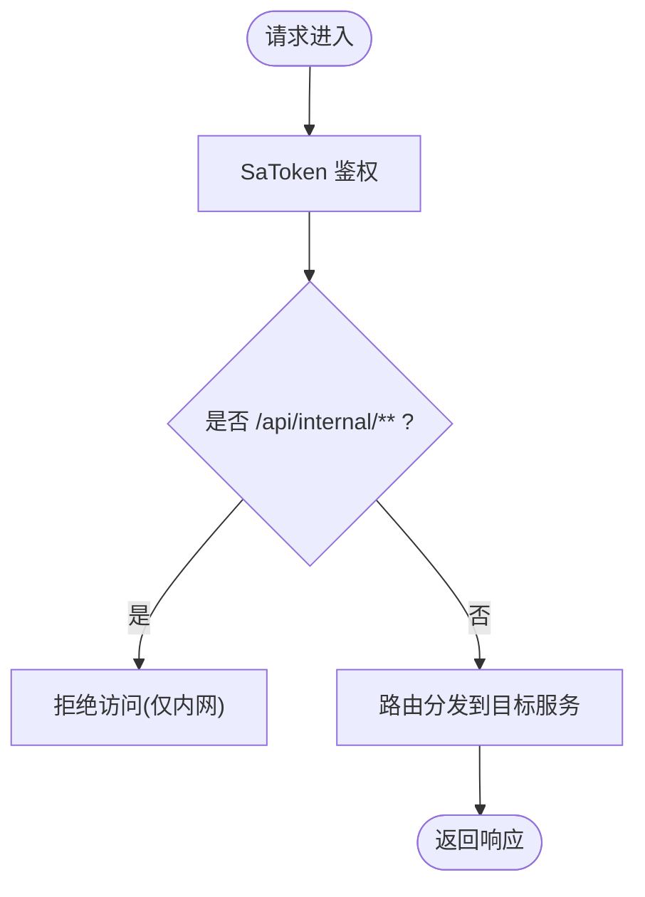
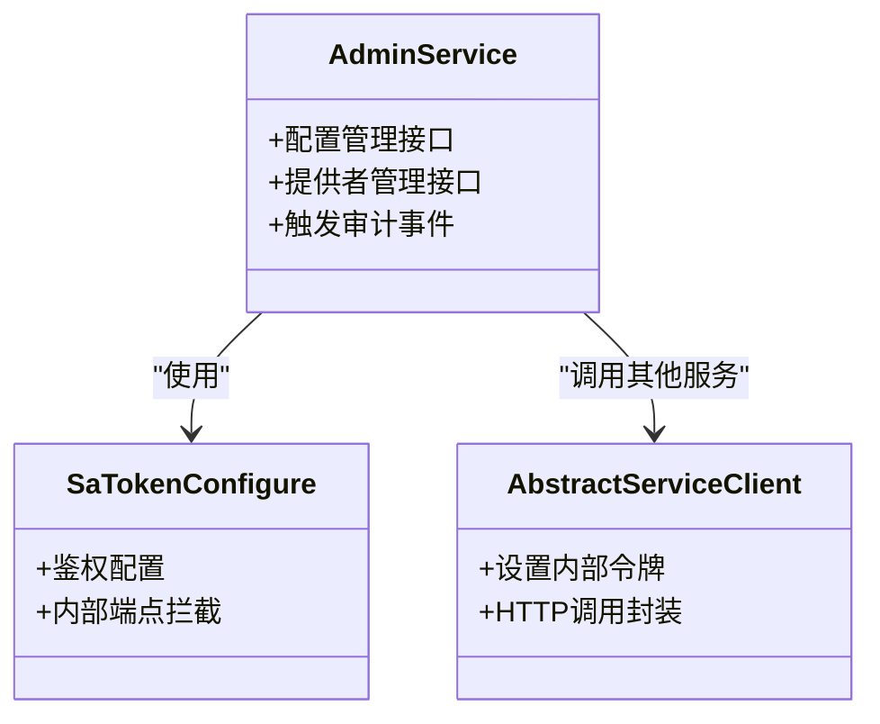
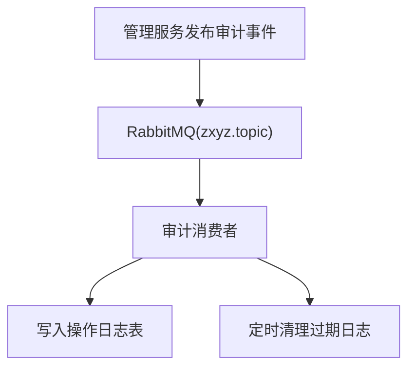
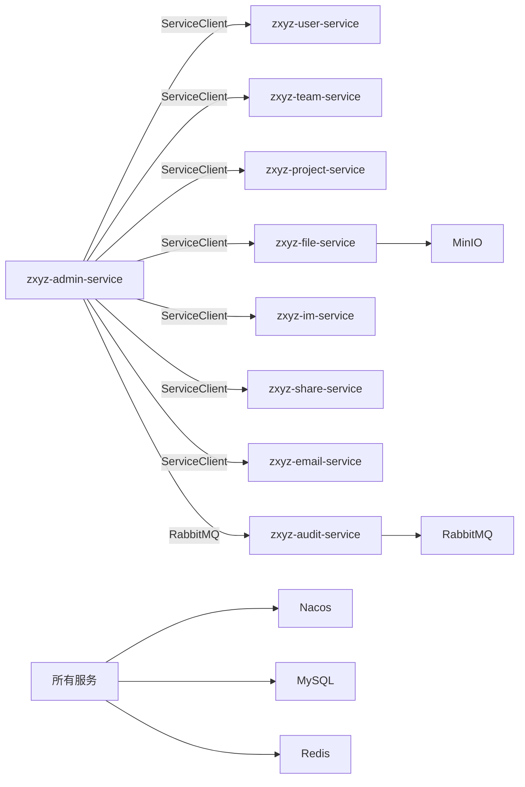

# 后端服务编排

<cite>
**本文引用的文件**   
- [docker-compose.yml](file://docker-compose.yml)
- [docker-compose.dev.yml](file://docker-compose.dev.yml)
- [Dockerfile](file://ZXYZdatabaseBack/Dockerfile)
- [Dockerfile.base](file://ZXYZdatabaseBack/Dockerfile.base)
- [.dockerignore](file://ZXYZdatabaseBack/.dockerignore)
- [zxyz-gateway.yml](file://nacos-config/zxyz-gateway.yml)
- [zxyz-admin-service.yml](file://nacos-config/zxyz-admin-service.yml)
- [zxyz-user-service.yml](file://nacos-config/zxyz-user-service.yml)
- [zxyz-team-service.yml](file://nacos-config/zxyz-team-service.yml)
- [zxyz-project-service.yml](file://nacos-config/zxyz-project-service.yml)
- [zxyz-file-service.yml](file://nacos-config/zxyz-file-service.yml)
- [zxyz-im-service.yml](file://nacos-config/zxyz-im-service.yml)
- [zxyz-share-service.yml](file://nacos-config/zxyz-share-service.yml)
- [zxyz-email-service.yml](file://nacos-config/zxyz-email-service.yml)
- [zxyz-audit-service.yml](file://nacos-config/zxyz-audit-service.yml)
- [zxyz-dynamic.yml](file://nacos-config/zxyz-dynamic.yml)
- [zxyz-static.yml](file://nacos-config/zxyz-static.yml)
- [application.yml](file://ZXYZdatabaseBack/zxyz-gateway/src/main/resources/application.yml)
- [application-dev.yml](file://ZXYZdatabaseBack/zxyz-admin-service/src/main/resources/application-dev.yml)
- [application-prod.yml](file://ZXYZdatabaseBack/zxyz-admin-service/src/main/resources/application-prod.yml)
- [application.yml](file://ZXYZdatabaseBack/zxyz-admin-service/src/main/resources/application.yml)
- [RabbitMqConfig.java](file://ZXYZdatabaseBack/zxyz-audit-service/src/main/java/uno/acloud/audit/config/RabbitMqConfig.java)
- [AbstractServiceClient.java](file://ZXYZdatabaseBack/zxyz-common/src/main/java/uno/acloud/client/AbstractServiceClient.java)
- [SaTokenConfigure.java](file://ZXYZdatabaseBack/zxyz-admin-service/src/main/java/uno/acloud/admin/config/SaTokenConfigure.java)
- [health-check.sh](file://scripts/health-check.sh)
- [promtail-config.yml](file://deploy/promtail-config.yml)
- [default.conf](file://deploy/nginx/default.conf)
- [entrypoint.sh](file://deploy/nginx/entrypoint.sh)
</cite>

## 目录
1. [简介](#简介)
2. [项目结构](#项目结构)
3. [核心组件](#核心组件)
4. [架构总览](#架构总览)
5. [详细组件分析](#详细组件分析)
6. [依赖关系分析](#依赖关系分析)
7. [性能与资源建议](#性能与资源建议)
8. [故障排查指南](#故障排查指南)
9. [结论](#结论)
10. [附录](#附录)

## 简介
本文件为 ZXYZ 项目的 10 个后端微服务提供完整的 Docker Compose 编排文档，覆盖容器化配置、服务间通信（ServiceClient + 内部鉴权、RabbitMQ Topic Exchange）、JVM 参数调优、日志收集、健康检查与监控集成，以及各服务的内存/CPU/磁盘资源限制建议。编排基于多环境 compose 文件与 Nacos 配置中心，结合 Gateway SaToken 过滤与 RabbitMQ 异步解耦，确保高可用与可观测性。

## 项目结构
- 后端服务模块：zxyz-gateway、zxyz-admin-service、zxyz-user-service、zxyz-team-service、zxyz-project-service、zxyz-file-service、zxyz-im-service、zxyz-share-service、zxyz-email-service、zxyz-audit-service
- 基础设施：Nacos、MySQL、Redis、RabbitMQ、MinIO（由 compose 管理）
- 前端与网关：nginx（静态资源与反向代理）
- 日志栈：Promtail（采集容器日志）

图表来源
- [docker-compose.yml](file://docker-compose.yml)
- [docker-compose.dev.yml](file://docker-compose.dev.yml)

章节来源
- [docker-compose.yml](file://docker-compose.yml)
- [docker-compose.dev.yml](file://docker-compose.dev.yml)

## 核心组件
- 网关 zxyz-gateway：统一入口、路由转发、SaToken 鉴权、拒绝公网访问 /api/internal/**
- 管理服务 zxyz-admin-service：系统配置、提供者管理等
- 用户服务 zxyz-user-service：用户信息、认证相关
- 团队服务 zxyz-team-service：团队、成员、权限等
- 项目服务 zxyz-project-service：项目生命周期、协作
- 文件服务 zxyz-file-service：文件上传下载、存储抽象
- 即时通讯 zxyz-im-service：会话、消息、实时通信
- 分享服务 zxyz-share-service：分享链接、访问控制
- 邮件服务 zxyz-email-service：模板渲染、发送、记录
- 审计服务 zxyz-audit-service：操作日志、消息消费、清理

章节来源
- [zxyz-gateway.yml](file://nacos-config/zxyz-gateway.yml)
- [zxyz-admin-service.yml](file://nacos-config/zxyz-admin-service.yml)
- [zxyz-user-service.yml](file://nacos-config/zxyz-user-service.yml)
- [zxyz-team-service.yml](file://nacos-config/zxyz-team-service.yml)
- [zxyz-project-service.yml](file://nacos-config/zxyz-project-service.yml)
- [zxyz-file-service.yml](file://nacos-config/zxyz-file-service.yml)
- [zxyz-im-service.yml](file://nacos-config/zxyz-im-service.yml)
- [zxyz-share-service.yml](file://nacos-config/zxyz-share-service.yml)
- [zxyz-email-service.yml](file://nacos-config/zxyz-email-service.yml)
- [zxyz-audit-service.yml](file://nacos-config/zxyz-audit-service.yml)

## 架构总览
- 外部请求经 Nginx 进入 zxyz-gateway，网关进行鉴权与路由分发
- 服务间同步调用通过 ServiceClient 发起 HTTP 请求，并携带 X-Internal-Service-Token 进行内部鉴权
- 异步事件通过 RabbitMQ Topic Exchange zxyz.topic 发布/订阅，如审计日志、删除用户事件等
- 配置与服务注册由 Nacos 统一管理，敏感配置使用 Jasypt 加密
- 数据库 MySQL、缓存 Redis、对象存储 MinIO、消息队列 RabbitMQ 作为共享基础设施

图表来源
- [zxyz-gateway.yml](file://nacos-config/zxyz-gateway.yml)
- [zxyz-admin-service.yml](file://nacos-config/zxyz-admin-service.yml)
- [zxyz-user-service.yml](file://nacos-config/zxyz-user-service.yml)
- [RabbitMqConfig.java](file://ZXYZdatabaseBack/zxyz-audit-service/src/main/java/uno/acloud/audit/config/RabbitMqConfig.java)
- [AbstractServiceClient.java](file://ZXYZdatabaseBack/zxyz-common/src/main/java/uno/acloud/client/AbstractServiceClient.java)

## 详细组件分析

### zxyz-gateway 网关服务
- 功能：统一入口、路由、SaToken 鉴权、拦截 /api/internal/** 防止公网访问
- 关键配置：应用配置 application.yml；Nacos 配置 zxyz-gateway.yml
- 健康检查：暴露健康端点，供编排脚本检测
- 部署：独立容器，端口映射至宿主机

图表来源
- [application.yml](file://ZXYZdatabaseBack/zxyz-gateway/src/main/resources/application.yml)
- [zxyz-gateway.yml](file://nacos-config/zxyz-gateway.yml)

章节来源
- [application.yml](file://ZXYZdatabaseBack/zxyz-gateway/src/main/resources/application.yml)
- [zxyz-gateway.yml](file://nacos-config/zxyz-gateway.yml)

### zxyz-admin-service 管理服务
- 功能：系统配置、提供者管理、审计触发
- 关键配置：application.yml、application-dev.yml、application-prod.yml；Nacos 配置 zxyz-admin-service.yml
- 鉴权：SaToken 配置 SaTokenConfigure.java
- 调用其他服务：通过 AbstractServiceClient 发起内部调用，携带 X-Internal-Service-Token

图表来源
- [SaTokenConfigure.java](file://ZXYZdatabaseBack/zxyz-admin-service/src/main/java/uno/acloud/admin/config/SaTokenConfigure.java)
- [AbstractServiceClient.java](file://ZXYZdatabaseBack/zxyz-common/src/main/java/uno/acloud/client/AbstractServiceClient.java)

章节来源
- [zxyz-admin-service.yml](file://nacos-config/zxyz-admin-service.yml)
- [application.yml](file://ZXYZdatabaseBack/zxyz-admin-service/src/main/resources/application.yml)
- [application-dev.yml](file://ZXYZdatabaseBack/zxyz-admin-service/src/main/resources/application-dev.yml)
- [application-prod.yml](file://ZXYZdatabaseBack/zxyz-admin-service/src/main/resources/application-prod.yml)
- [SaTokenConfigure.java](file://ZXYZdatabaseBack/zxyz-admin-service/src/main/java/uno/acloud/admin/config/SaTokenConfigure.java)
- [AbstractServiceClient.java](file://ZXYZdatabaseBack/zxyz-common/src/main/java/uno/acloud/client/AbstractServiceClient.java)

### zxyz-user-service 用户服务
- 功能：用户信息管理、认证数据支撑
- 关键配置：Nacos 配置 zxyz-user-service.yml
- 依赖：MySQL、Redis、Nacos

章节来源
- [zxyz-user-service.yml](file://nacos-config/zxyz-user-service.yml)

### zxyz-team-service 团队服务
- 功能：团队、成员、权限管理
- 关键配置：Nacos 配置 zxyz-team-service.yml
- 依赖：MySQL、Redis、Nacos

章节来源
- [zxyz-team-service.yml](file://nacos-config/zxyz-team-service.yml)

### zxyz-project-service 项目服务
- 功能：项目生命周期、协作管理
- 关键配置：Nacos 配置 zxyz-project-service.yml
- 依赖：MySQL、Redis、Nacos

章节来源
- [zxyz-project-service.yml](file://nacos-config/zxyz-project-service.yml)

### zxyz-file-service 文件服务
- 功能：文件上传下载、存储抽象（对接 MinIO）
- 关键配置：Nacos 配置 zxyz-file-service.yml
- 依赖：MySQL、Redis、MinIO、Nacos

章节来源
- [zxyz-file-service.yml](file://nacos-config/zxyz-file-service.yml)

### zxyz-im-service 即时通讯服务
- 功能：会话、消息、实时通信（DDD 分层）
- 关键配置：Nacos 配置 zxyz-im-service.yml
- 依赖：MySQL、Redis、Nacos

章节来源
- [zxyz-im-service.yml](file://nacos-config/zxyz-im-service.yml)

### zxyz-share-service 分享服务
- 功能：分享链接、访问控制（DDD 分层）
- 关键配置：Nacos 配置 zxyz-share-service.yml
- 依赖：MySQL、Redis、Nacos

章节来源
- [zxyz-share-service.yml](file://nacos-config/zxyz-share-service.yml)

### zxyz-email-service 邮件服务
- 功能：模板渲染、发送、记录（DDD 分层）
- 关键配置：Nacos 配置 zxyz-email-service.yml
- 依赖：MySQL、Redis、Nacos

章节来源
- [zxyz-email-service.yml](file://nacos-config/zxyz-email-service.yml)

### zxyz-audit-service 审计服务
- 功能：操作日志持久化、消息消费、清理任务
- 关键配置：Nacos 配置 zxyz-audit-service.yml；RabbitMQ 配置 RabbitMqConfig.java
- 依赖：MySQL、Redis、RabbitMQ、Nacos

图表来源
- [RabbitMqConfig.java](file://ZXYZdatabaseBack/zxyz-audit-service/src/main/java/uno/acloud/audit/config/RabbitMqConfig.java)
- [zxyz-audit-service.yml](file://nacos-config/zxyz-audit-service.yml)

章节来源
- [zxyz-audit-service.yml](file://nacos-config/zxyz-audit-service.yml)
- [RabbitMqConfig.java](file://ZXYZdatabaseBack/zxyz-audit-service/src/main/java/uno/acloud/audit/config/RabbitMqConfig.java)

## 依赖关系分析
- 服务间同步调用：ServiceClient + X-Internal-Service-Token 鉴权
- 服务间异步通信：RabbitMQ Topic Exchange zxyz.topic
- 配置中心：Nacos（动态配置 zxyz-dynamic.yml、静态配置 zxyz-static.yml）
- 数据存储：MySQL、Redis、MinIO
- 网关鉴权：SaToken

图表来源
- [AbstractServiceClient.java](file://ZXYZdatabaseBack/zxyz-common/src/main/java/uno/acloud/client/AbstractServiceClient.java)
- [RabbitMqConfig.java](file://ZXYZdatabaseBack/zxyz-audit-service/src/main/java/uno/acloud/audit/config/RabbitMqConfig.java)
- [zxyz-dynamic.yml](file://nacos-config/zxyz-dynamic.yml)
- [zxyz-static.yml](file://nacos-config/zxyz-static.yml)

章节来源
- [AbstractServiceClient.java](file://ZXYZdatabaseBack/zxyz-common/src/main/java/uno/acloud/client/AbstractServiceClient.java)
- [RabbitMqConfig.java](file://ZXYZdatabaseBack/zxyz-audit-service/src/main/java/uno/acloud/audit/config/RabbitMqConfig.java)
- [zxyz-dynamic.yml](file://nacos-config/zxyz-dynamic.yml)
- [zxyz-static.yml](file://nacos-config/zxyz-static.yml)

## 性能与资源建议
- JVM 参数调优
  - 堆大小：根据服务负载设置 -Xms/-Xmx，建议初始与最大一致避免抖动
  - GC：优先使用 G1GC，合理设置堆分代与停顿目标
  - 元空间：-XX:MetaspaceSize 与 -XX:MaxMetaspaceSize 按需调整
  - 线程池：根据 I/O 与 CPU 密集型任务调整线程池大小
- 容器资源限制
  - 内存：网关 512MB-1GB，业务服务 512MB-2GB，审计/邮件 512MB-1GB
  - CPU：网关 0.5-1核，业务服务 0.5-2核，审计/邮件 0.5-1核
  - 磁盘：文件服务需额外挂载 MinIO 卷，审计服务日志保留策略
- 连接池与超时
  - DB 连接池：HikariCP 最大连接数按并发与数据库容量设定
  - HTTP 连接池：ServiceClient 连接池大小与超时时间
  - Redis 连接池：根据读写频率调整
- 日志与监控
  - 日志：容器 stdout/stderr 输出，Promtail 采集
  - 监控：Spring Boot Actuator 健康端点，配合编排脚本 health-check.sh
  - 指标：Prometheus 抓取 Spring Boot 指标

章节来源
- [promtail-config.yml](file://deploy/promtail-config.yml)
- [health-check.sh](file://scripts/health-check.sh)

## 故障排查指南
- 健康检查失败
  - 检查服务健康端点是否可达
  - 查看容器日志定位启动错误
  - 验证 Nacos 配置加载与依赖服务可用性
- 内部调用鉴权失败
  - 确认 X-Internal-Service-Token 是否正确传递
  - 检查 SaToken 配置与网关拦截规则
- RabbitMQ 消息堆积
  - 检查审计消费者是否正常消费
  - 查看死信队列与重试策略
- 文件上传失败
  - 检查 MinIO 连接与权限
  - 验证文件服务存储路径与配额

章节来源
- [health-check.sh](file://scripts/health-check.sh)
- [SaTokenConfigure.java](file://ZXYZdatabaseBack/zxyz-admin-service/src/main/java/uno/acloud/admin/config/SaTokenConfigure.java)
- [RabbitMqConfig.java](file://ZXYZdatabaseBack/zxyz-audit-service/src/main/java/uno/acloud/audit/config/RabbitMqConfig.java)

## 结论
通过 Docker Compose 编排 ZXYZ 的 10 个后端微服务，结合 Nacos 配置中心、Gateway 鉴权、ServiceClient 内部调用与 RabbitMQ 异步通信，构建了高内聚、低耦合的微服务架构。合理的 JVM 调优、资源限制与监控集成确保了系统的稳定性与可观测性。建议在生产环境持续优化连接池、线程池与 GC 参数，并完善日志与告警机制。

## 附录
- 镜像构建：Dockerfile 与 Dockerfile.base 定义基础镜像与构建步骤
- 忽略文件：.dockerignore 优化构建上下文
- 前端代理：nginx default.conf 与 entrypoint.sh 配置反向代理与动态配置

章节来源
- [Dockerfile](file://ZXYZdatabaseBack/Dockerfile)
- [Dockerfile.base](file://ZXYZdatabaseBack/Dockerfile.base)
- [.dockerignore](file://ZXYZdatabaseBack/.dockerignore)
- [default.conf](file://deploy/nginx/default.conf)
- [entrypoint.sh](file://deploy/nginx/entrypoint.sh)