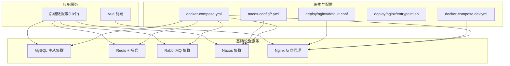
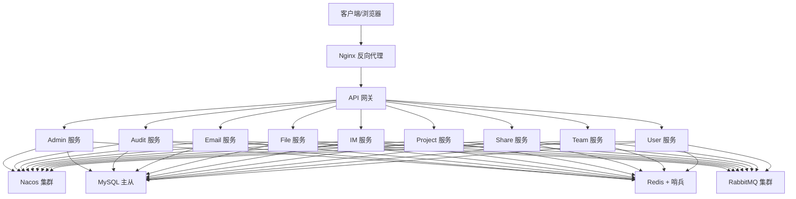
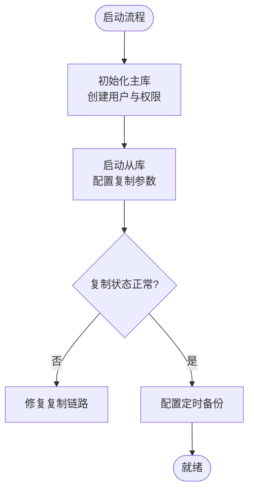
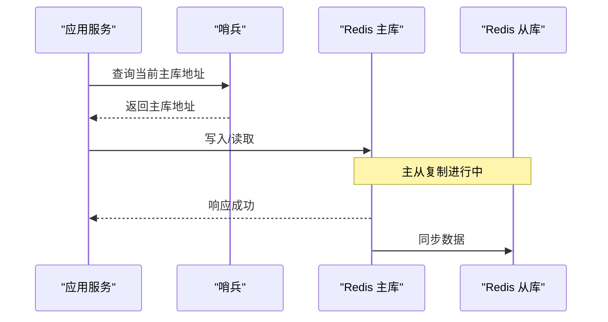
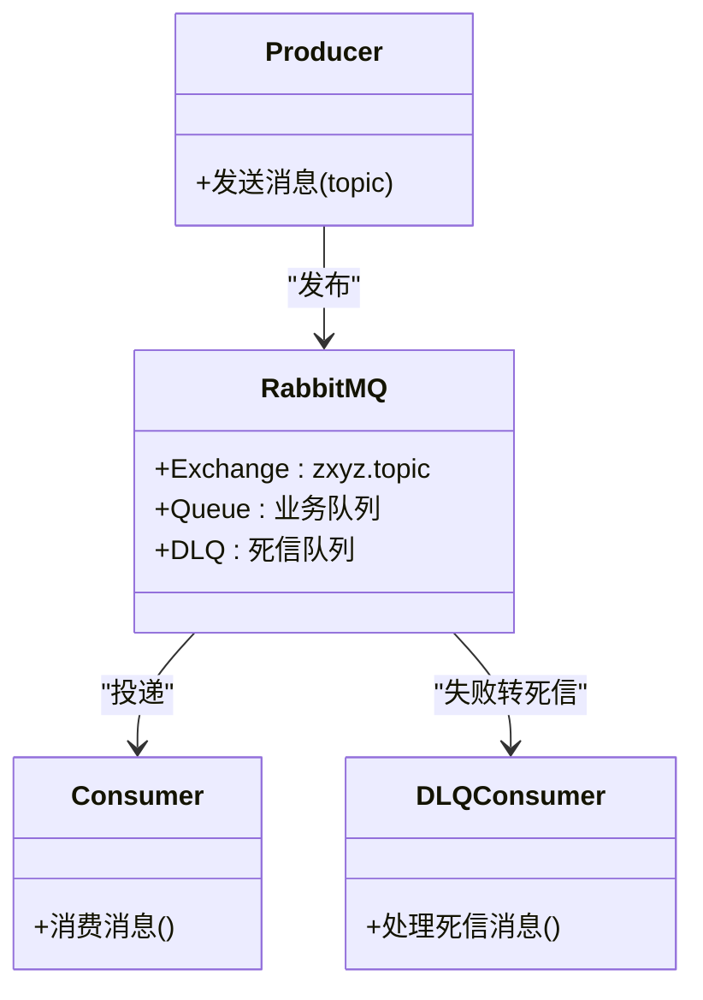
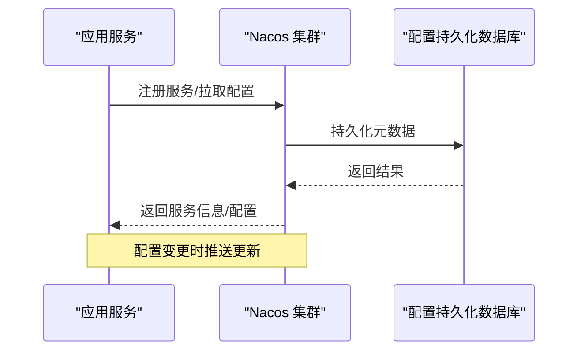
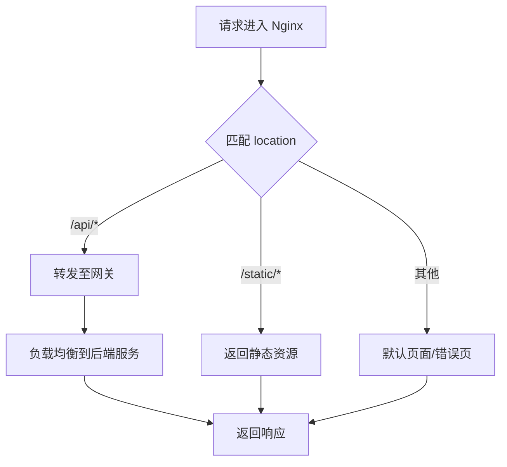

# 基础设施服务编排

<cite>
**本文引用的文件**   
- [docker-compose.yml](file://docker-compose.yml)
- [docker-compose.dev.yml](file://docker-compose.dev.yml)
- [Dockerfile](file://ZXYZdatabaseBack/Dockerfile)
- [Dockerfile.base](file://ZXYZdatabaseBack/Dockerfile.base)
- [.dockerignore](file://ZXYZdatabaseBack/.dockerignore)
- [default.conf](file://deploy/nginx/default.conf)
- [entrypoint.sh](file://deploy/nginx/entrypoint.sh)
- [zxyz-dynamic.yml](file://nacos-config/zxyz-dynamic.yml)
- [zxyz-static.yml](file://nacos-config/zxyz-static.yml)
- [backup.sh](file://scripts/backup.sh)
- [health-check.sh](file://scripts/health-check.sh)
- [validate-env.sh](file://scripts/validate-env.sh)
- [00-init-zxyz.sh](file://sql/00-init-zxyz.sh)
- [DEPLOYMENT.md](file://DEPLOYMENT.md)
- [infrastructure.md](file://docs/infrastructure.md)
</cite>

## 目录
1. [简介](#简介)
2. [项目结构](#项目结构)
3. [核心组件](#核心组件)
4. [架构总览](#架构总览)
5. [详细组件分析](#详细组件分析)
6. [依赖关系分析](#依赖关系分析)
7. [性能与容量规划](#性能与容量规划)
8. [故障排查指南](#故障排查指南)
9. [结论](#结论)
10. [附录](#附录)

## 简介
本文件面向 ZXYZ 项目的基础设施层，提供基于 Docker Compose 的完整编排说明。内容覆盖五大核心基础设施服务的容器化配置与运维要点：MySQL 主从复制集群（数据持久化、备份策略与性能优化）、Redis 哨兵模式（缓存、会话存储与分布式锁）、RabbitMQ 集群（消息队列、死信队列与监控）、Nacos 集群（配置中心与服务注册发现）、Nginx 反向代理（负载均衡、SSL 终止与静态资源服务）。文档同时给出网络与端口映射、环境变量、资源限制、健康检查、启动顺序、故障恢复策略，以及开发环境与生产环境的差异化配置建议。

## 项目结构
本项目采用多模块后端 + Vue 前端 + 统一编排的方式。基础设施相关的关键文件分布如下：
- 编排定义：根目录下的 docker-compose.yml 与 docker-compose.dev.yml
- Nginx 配置：deploy/nginx/default.conf 与 entrypoint.sh
- Nacos 配置：nacos-config 下的动态与静态配置
- 脚本工具：scripts 下的备份、健康检查与环境校验脚本
- SQL 初始化：sql/00-init-zxyz.sh
- 镜像构建：ZXYZdatabaseBack 下的 Dockerfile、Dockerfile.base 与 .dockerignore
- 部署与架构文档：DEPLOYMENT.md 与 docs/infrastructure.md

**图表来源** 
- [docker-compose.yml](file://docker-compose.yml)
- [docker-compose.dev.yml](file://docker-compose.dev.yml)
- [default.conf](file://deploy/nginx/default.conf)
- [entrypoint.sh](file://deploy/nginx/entrypoint.sh)
- [zxyz-dynamic.yml](file://nacos-config/zxyz-dynamic.yml)
- [zxyz-static.yml](file://nacos-config/zxyz-static.yml)

**章节来源**
- [docker-compose.yml](file://docker-compose.yml)
- [docker-compose.dev.yml](file://docker-compose.dev.yml)
- [DEPLOYMENT.md](file://DEPLOYMENT.md)
- [infrastructure.md](file://docs/infrastructure.md)

## 核心组件
本节概述五大基础设施组件在编排中的职责与关键配置项，便于快速定位与排障。

- MySQL 主从复制集群
  - 角色：主库负责写，从库负责读；数据卷持久化；定时备份脚本集成
  - 关键配置：主从复制参数、字符集、时区、连接数、缓冲池大小、慢查询日志
  - 健康检查：mysqld 进程状态与可连接性
  - 备份策略：逻辑备份与增量策略（结合脚本）

- Redis 哨兵模式
  - 角色：缓存与会话存储、分布式锁；哨兵实现高可用
  - 关键配置：主从拓扑、哨兵阈值、内存淘汰策略、持久化（AOF/RDB）
  - 健康检查：ping 命令与主从状态

- RabbitMQ 集群
  - 角色：异步消息总线，Topic Exchange；死信队列用于失败重试与审计
  - 关键配置：节点间通信端口、管理控制台、插件（如延迟队列）、队列与交换机声明
  - 健康检查：management API 与节点状态

- Nacos 集群
  - 角色：配置中心与服务注册发现；支持动态配置热更新
  - 关键配置：集群节点列表、数据库持久化、鉴权与加密（Jasypt）
  - 健康检查：HTTP 接口探测

- Nginx 反向代理
  - 角色：统一入口、负载均衡、SSL 终止、静态资源服务
  - 关键配置：upstream 指向网关/服务、location 路由、缓存与压缩、安全头
  - 健康检查：HTTP 探针

**章节来源**
- [docker-compose.yml](file://docker-compose.yml)
- [docker-compose.dev.yml](file://docker-compose.dev.yml)
- [default.conf](file://deploy/nginx/default.conf)
- [entrypoint.sh](file://deploy/nginx/entrypoint.sh)
- [zxyz-dynamic.yml](file://nacos-config/zxyz-dynamic.yml)
- [zxyz-static.yml](file://nacos-config/zxyz-static.yml)
- [backup.sh](file://scripts/backup.sh)
- [health-check.sh](file://scripts/health-check.sh)

## 架构总览
下图展示各组件之间的依赖关系与数据流向。应用服务通过 Nacos 进行服务发现与配置拉取，经 Nginx 统一入口访问网关与业务服务；数据库、缓存、消息中间件为应用提供基础能力。

**图表来源** 
- [docker-compose.yml](file://docker-compose.yml)
- [default.conf](file://deploy/nginx/default.conf)
- [zxyz-dynamic.yml](file://nacos-config/zxyz-dynamic.yml)

## 详细组件分析

### MySQL 主从复制集群
- 目标与范围
  - 提供高可用、可扩展的关系型数据存储；支持读写分离与备份恢复
- 容器化要点
  - 数据卷挂载到宿主机或命名卷，确保数据持久化
  - 主库开启 binlog，从库配置 replication 参数
  - 时区与字符集统一，避免跨服务时间不一致与乱码
- 性能优化
  - 调整 innodb_buffer_pool_size、innodb_log_file_size、max_connections
  - 启用慢查询日志并定期分析
  - 合理设置索引与查询计划，避免全表扫描
- 备份策略
  - 使用逻辑备份（如 mysqldump）与增量备份（binlog）结合
  - 定时任务执行备份脚本，保留策略与异地存储
- 健康检查
  - 通过 mysqladmin ping 或 TCP 端口探测
- 启动顺序
  - 先启动主库，再启动从库，最后初始化数据库与用户权限
- 故障恢复
  - 主库宕机：提升从库为主库，更新应用连接地址
  - 数据损坏：从最近备份恢复，重放 binlog

**图表来源** 
- [docker-compose.yml](file://docker-compose.yml)
- [backup.sh](file://scripts/backup.sh)
- [00-init-zxyz.sh](file://sql/00-init-zxyz.sh)

**章节来源**
- [docker-compose.yml](file://docker-compose.yml)
- [backup.sh](file://scripts/backup.sh)
- [00-init-zxyz.sh](file://sql/00-init-zxyz.sh)

### Redis 哨兵模式
- 目标与范围
  - 提供高性能缓存、会话存储与分布式锁；哨兵保障高可用
- 容器化要点
  - 主从拓扑与哨兵实例分离部署
  - 启用 AOF 与 RDB 持久化，平衡性能与数据安全
  - 内存淘汰策略（如 allkeys-lru）与最大内存限制
- 健康检查
  - redis-cli ping 返回 PONG；哨兵监控主从切换
- 启动顺序
  - 先启动主库，再启动从库，最后启动哨兵
- 故障恢复
  - 哨兵自动选举新主；应用侧需支持连接重试与主从切换

**图表来源** 
- [docker-compose.yml](file://docker-compose.yml)

**章节来源**
- [docker-compose.yml](file://docker-compose.yml)

### RabbitMQ 集群
- 目标与范围
  - 作为异步消息总线，支撑事件驱动与解耦；支持 Topic Exchange 与死信队列
- 容器化要点
  - 多节点集群，共享 Erlang Cookie 与镜像队列
  - 启用 management 插件以便监控与运维
  - 队列与交换机声明（可通过初始化脚本或外部配置）
- 健康检查
  - management API 返回节点状态；TCP 端口探测
- 启动顺序
  - 先启动各节点，再加入集群，最后声明队列与交换机
- 故障恢复
  - 节点故障：重新加入集群；队列镜像保证数据不丢失

**图表来源** 
- [docker-compose.yml](file://docker-compose.yml)

**章节来源**
- [docker-compose.yml](file://docker-compose.yml)

### Nacos 集群
- 目标与范围
  - 配置中心与服务注册发现；支持动态配置热更新与鉴权
- 容器化要点
  - 多节点集群，共享数据库持久化
  - 导入 nacos-config 下的 yml 配置（动态与静态）
  - 鉴权与 Jasypt 加密敏感配置
- 健康检查
  - HTTP 接口探测（如 /nacos/v1/ns/operator/cluster/state）
- 启动顺序
  - 先启动数据库（如有），再启动 Nacos 节点，最后导入配置
- 故障恢复
  - 节点故障：移除后重建并重新加入集群；配置中心恢复后自动同步

**图表来源** 
- [docker-compose.yml](file://docker-compose.yml)
- [zxyz-dynamic.yml](file://nacos-config/zxyz-dynamic.yml)
- [zxyz-static.yml](file://nacos-config/zxyz-static.yml)

**章节来源**
- [docker-compose.yml](file://docker-compose.yml)
- [zxyz-dynamic.yml](file://nacos-config/zxyz-dynamic.yml)
- [zxyz-static.yml](file://nacos-config/zxyz-static.yml)

### Nginx 反向代理
- 目标与范围
  - 统一入口、负载均衡、SSL 终止、静态资源服务与安全防护
- 容器化要点
  - upstream 指向网关与各服务；location 路由规则
  - SSL 证书挂载与强制 HTTPS
  - 静态资源缓存与压缩
- 健康检查
  - HTTP 探针检测网关与健康端点
- 启动顺序
  - 最后启动，确保上游服务已就绪
- 故障恢复
  - 上游服务不可用时降级或返回友好错误页

**图表来源** 
- [default.conf](file://deploy/nginx/default.conf)
- [entrypoint.sh](file://deploy/nginx/entrypoint.sh)

**章节来源**
- [default.conf](file://deploy/nginx/default.conf)
- [entrypoint.sh](file://deploy/nginx/entrypoint.sh)

## 依赖关系分析
- 启动顺序
  - 数据库与缓存优先启动，随后消息中间件与配置中心，最后 Nginx 与应用服务
- 健康检查
  - 每个服务均提供健康检查，Compose 根据依赖关系等待就绪
- 网络模型
  - 内部服务通过 Docker 网络互通，对外仅暴露 Nginx 端口
- 环境变量
  - 通过环境变量注入敏感信息与运行时配置，避免硬编码

**图表来源** 
- [docker-compose.yml](file://docker-compose.yml)

**章节来源**
- [docker-compose.yml](file://docker-compose.yml)

## 性能与容量规划
- MySQL
  - 根据 QPS 与数据量调整缓冲池、连接数与日志大小；读写分离缓解压力
- Redis
  - 内存上限与淘汰策略按热点数据规模设定；AOF 与 RDB 权衡持久化开销
- RabbitMQ
  - 队列长度与消费者并发按吞吐需求调优；死信队列容量预留
- Nacos
  - 集群节点数与数据库连接池按服务数量与配置变更频率评估
- Nginx
  - worker_processes 与 keepalive 连接数按 CPU 核数与并发量调整；缓存命中率监控

[本节为通用指导，无需特定文件引用]

## 故障排查指南
- 常见问题
  - 服务无法启动：检查端口冲突、环境变量与配置文件
  - 健康检查失败：查看容器日志与健康检查脚本输出
  - 主从复制异常：核对 binlog 与复制参数，检查网络连通性
  - 哨兵切换失败：确认主从状态与哨兵阈值
  - 消息堆积：检查消费者消费速度与死信队列积压
  - Nacos 配置未生效：确认配置导入与鉴权设置
  - Nginx 502/504：检查上游服务状态与超时配置
- 诊断工具
  - 使用 health-check.sh 进行健康检查
  - 使用 validate-env.sh 校验环境变量
  - 查看容器日志与系统资源占用

**章节来源**
- [health-check.sh](file://scripts/health-check.sh)
- [validate-env.sh](file://scripts/validate-env.sh)

## 结论
通过 Docker Compose 将 MySQL、Redis、RabbitMQ、Nacos 与 Nginx 五大基础设施服务统一编排，可实现高可用、易扩展与可观测的底层支撑。配合健康检查、备份策略与故障恢复机制，能够保障系统在开发与生产环境中的稳定运行。建议在生产环境强化资源限制、监控告警与安全加固，并持续优化性能参数。

[本节为总结性内容，无需特定文件引用]

## 附录
- 镜像构建
  - 使用 ZXYZdatabaseBack/Dockerfile 与 Dockerfile.base 构建后端镜像
  - .dockerignore 排除无关文件，减小镜像体积
- 部署参考
  - DEPLOYMENT.md 提供部署步骤与环境要求
  - infrastructure.md 描述基础设施架构与最佳实践

**章节来源**
- [Dockerfile](file://ZXYZdatabaseBack/Dockerfile)
- [Dockerfile.base](file://ZXYZdatabaseBack/Dockerfile.base)
- [.dockerignore](file://ZXYZdatabaseBack/.dockerignore)
- [DEPLOYMENT.md](file://DEPLOYMENT.md)
- [infrastructure.md](file://docs/infrastructure.md)