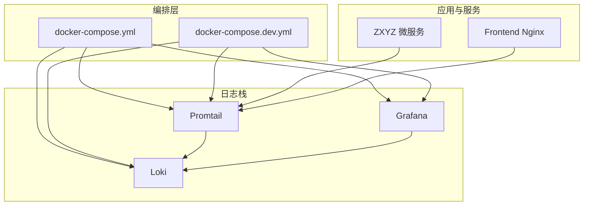
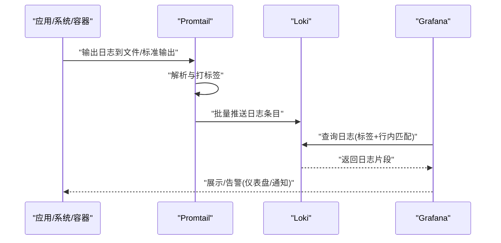
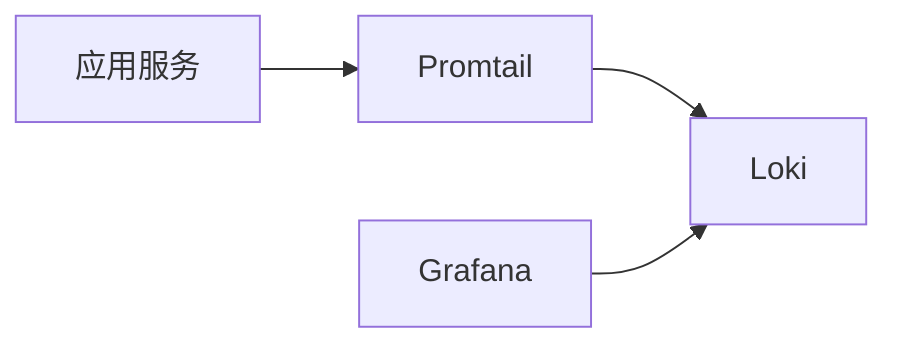

# 日志监控服务编排

<cite>
**本文引用的文件**   
- [docker-compose.yml](file://docker-compose.yml)
- [docker-compose.dev.yml](file://docker-compose.dev.yml)
- [deploy/promtail-config.yml](file://deploy/promtail-config.yml)
- [DEPLOYMENT.md](file://DEPLOYMENT.md)
- [docs/infrastructure.md](file://docs/infrastructure.md)
</cite>

## 目录
1. [简介](#简介)
2. [项目结构](#项目结构)
3. [核心组件](#核心组件)
4. [架构总览](#架构总览)
5. [详细组件分析](#详细组件分析)
6. [依赖关系分析](#依赖关系分析)
7. [性能与容量规划](#性能与容量规划)
8. [故障排查指南](#故障排查指南)
9. [结论](#结论)
10. [附录](#附录)

## 简介
本文件面向ZXYZ项目的日志监控体系，围绕Promtail日志采集器、Loki日志聚合系统与Grafana可视化平台，提供基于Docker Compose的容器化编排说明。内容涵盖：
- 日志采集策略（应用日志、系统日志、容器日志）
- Loki索引规则、查询语法与告警规则
- 指标采集配置（JVM、数据库连接池、中间件状态）
- 历史数据保留策略、存储空间管理与性能优化
- 常见故障排查与解决方案

## 项目结构
与日志监控相关的编排与配置主要位于仓库根目录与deploy子目录中：
- docker-compose.yml：生产环境编排定义（包含基础设施、后端服务、前端Nginx与日志栈）
- docker-compose.dev.yml：开发环境编排（便于本地调试日志链路）
- deploy/promtail-config.yml：Promtail采集配置（文件路径、标签、批处理等）
- DEPLOYMENT.md：部署说明（镜像、端口、环境变量、启动顺序等）
- docs/infrastructure.md：基础设施概览（组件职责、网络与存储）

图表来源
- [docker-compose.yml](file://docker-compose.yml)
- [docker-compose.dev.yml](file://docker-compose.dev.yml)
- [deploy/promtail-config.yml](file://deploy/promtail-config.yml)

章节来源
- [docker-compose.yml](file://docker-compose.yml)
- [docker-compose.dev.yml](file://docker-compose.dev.yml)
- [deploy/promtail-config.yml](file://deploy/promtail-config.yml)
- [DEPLOYMENT.md](file://DEPLOYMENT.md)
- [docs/infrastructure.md](file://docs/infrastructure.md)

## 核心组件
- Promtail：运行在各节点或宿主机上，按配置文件采集指定日志文件并推送到Loki。支持多源采集（应用日志、系统日志、容器日志），通过标签实现多维检索。
- Loki：轻量级日志聚合系统，无全文索引，采用标签+行内索引，适合海量日志的高吞吐写入与低成本存储。
- Grafana：统一可视化与告警平台，内置Loki数据源，提供日志浏览、仪表盘与告警规则管理。

章节来源
- [DEPLOYMENT.md](file://DEPLOYMENT.md)
- [docs/infrastructure.md](file://docs/infrastructure.md)

## 架构总览
下图展示了ZXYZ日志监控的整体数据流：应用与系统产生的日志由Promtail采集后推送至Loki；Grafana通过Loki数据源进行查询、展示与告警。

图表来源
- [docker-compose.yml](file://docker-compose.yml)
- [deploy/promtail-config.yml](file://deploy/promtail-config.yml)

## 详细组件分析

### Promtail 日志采集器
- 角色与职责
  - 负责在宿主机或容器内监听日志文件，按批次上报至Loki
  - 为每条日志附加标签（如service、instance、job等），支撑多维检索
  - 控制批大小、刷新间隔、重试与回退策略，保障高吞吐与稳定性
- 关键配置项（参考deploy/promtail-config.yml）
  - 采集目标：应用日志、系统日志、容器日志的文件路径
  - 标签映射：将文件路径、容器ID、进程名等映射为标准标签
  - 客户端参数：批大小、超时、并发、重试次数
- 采集策略建议
  - 应用日志：按服务划分目录，统一命名规范（时间戳+级别+消息）
  - 系统日志：采集/var/log/messages、journalctl转储等
  - 容器日志：挂载容器stdout/stderr或容器日志目录
- 常见问题
  - 权限不足导致无法读取日志文件
  - 路径不匹配导致未采集到日志
  - 批大小过大造成内存压力

章节来源
- [deploy/promtail-config.yml](file://deploy/promtail-config.yml)

### Loki 日志聚合系统
- 角色与职责
  - 接收Promtail推送的日志，按标签组织存储
  - 提供高效查询接口，支持标签过滤与行内正则匹配
  - 支持分片与复制，保证可用性与扩展性
- 索引与存储
  - 使用标签索引+行内索引，避免全量全文索引带来的成本
  - 可配置分片数、副本数、压缩策略
- 查询语法要点
  - 标签过滤：{service="xxx", instance="yyy"}
  - 行内匹配：|~ "ERROR|WARN"
  - 时间范围：[start:end]
  - 组合示例：{service="zxyz-admin-service"} |~ "异常"
- 告警规则
  - 基于查询结果阈值触发告警（如错误率、响应时间、特定关键字）
  - 支持分组、抑制、静默与通知渠道（邮件、Webhook等）

章节来源
- [DEPLOYMENT.md](file://DEPLOYMENT.md)
- [docs/infrastructure.md](file://docs/infrastructure.md)

### Grafana 可视化平台
- 角色与职责
  - 集成Loki数据源，提供日志浏览器、仪表盘与告警管理
  - 支持多数据源、权限控制与团队协作
- 仪表盘设计
  - 应用健康：错误率、请求量、延迟分布
  - 资源监控：CPU、内存、磁盘、网络
  - 业务指标：订单量、用户活跃度、队列积压
- 告警与通知
  - 基于Loki查询或指标数据源设置阈值告警
  - 多渠道通知与升级策略

章节来源
- [DEPLOYMENT.md](file://DEPLOYMENT.md)
- [docs/infrastructure.md](file://docs/infrastructure.md)

### Docker Compose 编排要点
- 服务定义
  - 日志栈：promtail、loki、grafana
  - 应用服务：各微服务、网关、前端Nginx
  - 基础设施：数据库、缓存、消息队列等（根据实际编排）
- 网络与存储
  - 自定义网络隔离日志栈与应用服务
  - 持久化卷用于Loki与Grafana数据目录
- 环境变量与配置挂载
  - Promtail配置文件挂载
  - Loki与Grafana通过环境变量或配置文件注入
- 启动顺序与健康检查
  - 确保基础设施先于应用启动
  - 健康检查避免依赖未就绪的服务

章节来源
- [docker-compose.yml](file://docker-compose.yml)
- [docker-compose.dev.yml](file://docker-compose.dev.yml)
- [DEPLOYMENT.md](file://DEPLOYMENT.md)

## 依赖关系分析
- Promtail依赖Loki的HTTP API进行日志推送
- Grafana依赖Loki作为数据源进行查询与展示
- 应用服务通过文件系统或容器运行时输出日志，供Promtail采集

图表来源
- [docker-compose.yml](file://docker-compose.yml)
- [deploy/promtail-config.yml](file://deploy/promtail-config.yml)

章节来源
- [docker-compose.yml](file://docker-compose.yml)
- [deploy/promtail-config.yml](file://deploy/promtail-config.yml)

## 性能与容量规划
- 采集端优化
  - 合理设置Promtail批大小与刷新间隔，平衡延迟与吞吐
  - 限制并发上传与重试次数，避免雪崩
- 聚合端优化
  - 调整Loki的分片与副本数，提升写入与查询性能
  - 启用压缩与去重，降低存储占用
- 存储与保留策略
  - 按时间维度归档与清理历史日志
  - 冷热分层：热数据SSD、冷数据对象存储
- 指标采集
  - JVM指标：堆内存、GC、线程数、类加载
  - 数据库连接池：活跃连接、等待队列、超时
  - 中间件状态：RabbitMQ队列长度、消费者滞后、Redis命中率

章节来源
- [DEPLOYMENT.md](file://DEPLOYMENT.md)
- [docs/infrastructure.md](file://docs/infrastructure.md)

## 故障排查指南
- 日志未采集
  - 检查Promtail配置文件中的文件路径与权限
  - 确认容器日志目录已正确挂载
  - 查看Promtail日志定位解析失败原因
- 查询无结果
  - 验证标签是否正确注入（service、instance等）
  - 检查Loki是否正常运行且端口可达
  - 使用简单查询逐步缩小范围
- 性能问题
  - 观察Promtail批大小与刷新间隔是否合理
  - 监控Loki的CPU、内存与磁盘IO
  - 调整分片与副本数，评估读写瓶颈
- 告警误报/漏报
  - 校验查询条件与阈值设置
  - 增加抑制与静默规则，减少噪声
  - 定期回顾告警规则有效性

章节来源
- [DEPLOYMENT.md](file://DEPLOYMENT.md)
- [docs/infrastructure.md](file://docs/infrastructure.md)

## 结论
通过Promtail、Loki与Grafana的组合，ZXYZ项目实现了统一的日志采集、聚合与可视化能力。合理的采集策略、索引规则与告警配置，结合完善的性能优化与容量规划，能够显著提升问题定位效率与系统稳定性。建议在开发与生产环境中分别使用不同的编排与配置，确保可观测性的持续演进。

## 附录
- 快速启动命令
  - 启动日志栈与应用服务（参考docker-compose.yml）
  - 开发环境使用docker-compose.dev.yml进行本地调试
- 常用查询示例
  - 按服务与级别筛选：{service="zxyz-admin-service"} |~ "ERROR"
  - 时间范围查询：[now-1h:now]
  - 关键词搜索：{job="app"} |~ "异常堆栈"
- 告警规则模板
  - 错误率超过阈值：rate({service="xxx"} |~ "ERROR")[5m] > 0.05
  - 特定关键字出现频率：count_over_time({service="xxx"} |~ "OOM"[10m]) > 10

章节来源
- [docker-compose.yml](file://docker-compose.yml)
- [docker-compose.dev.yml](file://docker-compose.dev.yml)
- [DEPLOYMENT.md](file://DEPLOYMENT.md)
- [docs/infrastructure.md](file://docs/infrastructure.md)