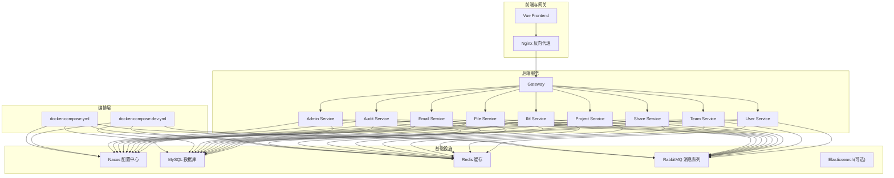
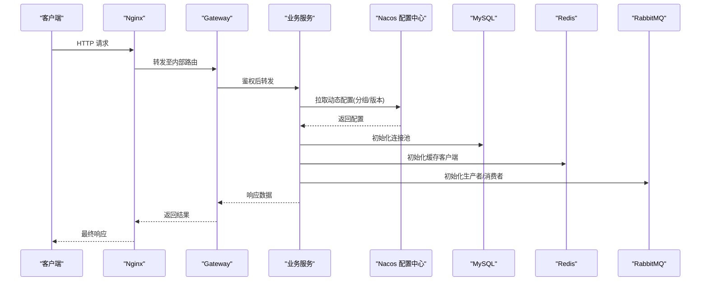
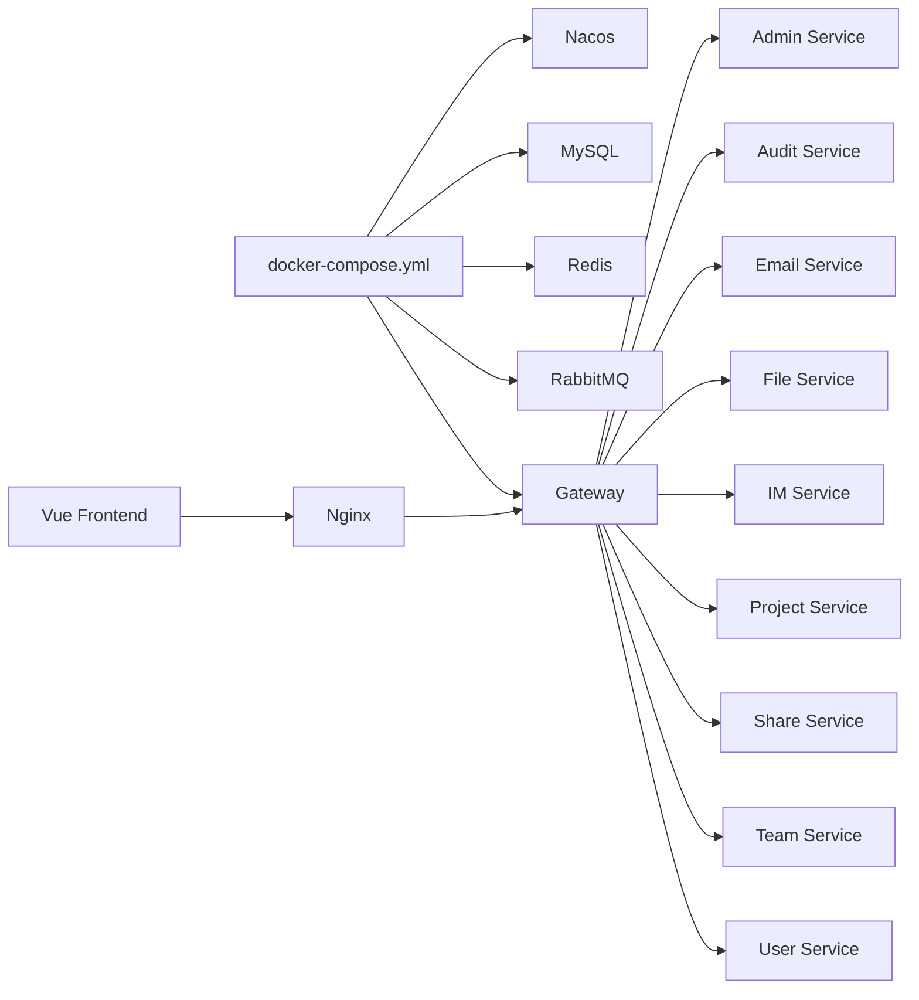

# 环境配置管理

<cite>
**本文引用的文件**
- [docker-compose.yml](file://docker-compose.yml)
- [docker-compose.dev.yml](file://docker-compose.dev.yml)
- [Dockerfile](file://ZXYZdatabaseBack/Dockerfile)
- [Dockerfile.base](file://ZXYZdatabaseBack/Dockerfile.base)
- [nacos-config/zxyz-dynamic.yml](file://nacos-config/zxyz-dynamic.yml)
- [nacos-config/zxyz-static.yml](file://nacos-config/zxyz-static.yml)
- [nacos-config/import.sh](file://nacos-config/import.sh)
- [scripts/validate-env.sh](file://scripts/validate-env.sh)
- [scripts/rollback.sh](file://scripts/rollback.sh)
- [scripts/health-check.sh](file://scripts/health-check.sh)
- [deploy/nginx/default.conf](file://deploy/nginx/default.conf)
- [deploy/nginx/entrypoint.sh](file://deploy/nginx/entrypoint.sh)
- [ZXYZdatabaseBack/zxyz-admin-service/src/main/resources/application.yml](file://ZXYZdatabaseBack/zxyz-admin-service/src/main/resources/application.yml)
- [ZXYZdatabaseBack/zxyz-admin-service/src/main/resources/application-dev.yml](file://ZXYZdatabaseBack/zxyz-admin-service/src/main/resources/application-dev.yml)
- [ZXYZdatabaseBack/zxyz-admin-service/src/main/resources/application-prod.yml](file://ZXYZdatabaseBack/zxyz-admin-service/src/main/resources/application-prod.yml)
- [ZXYZdatabaseBack/zxyz-audit-service/src/main/resources/application.yml](file://ZXYZdatabaseBack/zxyz-audit-service/src/main/resources/application.yml)
- [ZXYZdatabaseBack/zxyz-email-service/src/main/resources/application.yml](file://ZXYZdatabaseBack/zxyz-email-service/src/main/resources/application.yml)
- [ZXYZdatabaseBack/zxyz-file-service/src/main/resources/application.yml](file://ZXYZdatabaseBack/zxyz-file-service/src/main/resources/application.yml)
- [ZXYZdatabaseBack/zxyz-gateway/src/main/resources/application.yml](file://ZXYZdatabaseBack/zxyz-gateway/src/main/resources/application.yml)
- [ZXYZdatabaseBack/zxyz-im-service/src/main/resources/application.yml](file://ZXYZdatabaseBack/zxyz-im-service/src/main/resources/application.yml)
- [ZXYZdatabaseBack/zxyz-project-service/src/main/resources/application.yml](file://ZXYZdatabaseBack/zxyz-project-service/src/main/resources/application.yml)
- [ZXYZdatabaseBack/zxyz-share-service/src/main/resources/application.yml](file://ZXYZdatabaseBack/zxyz-share-service/src/main/resources/application.yml)
- [ZXYZdatabaseBack/zxyz-team-service/src/main/resources/application.yml](file://ZXYZdatabaseBack/zxyz-team-service/src/main/resources/application.yml)
- [ZXYZdatabaseBack/zxyz-user-service/src/main/resources/application.yml](file://ZXYZdatabaseBack/zxyz-user-service/src/main/resources/application.yml)
- [ZXYZdatabaseFront/Dockerfile](file://ZXYZdatabaseFront/Dockerfile)
- [ZXYZdatabaseFront/vite.config.js](file://ZXYZdatabaseFront/vite.config.js)
- [ZXYZdatabaseFront/src/utils/env.js](file://ZXYZdatabaseFront/src/utils/env.js)
- [docs/jasypt-key-management.md](file://docs/jasypt-key-management.md)
</cite>

## 目录
1. [简介](#简介)
2. [项目结构](#项目结构)
3. [核心组件](#核心组件)
4. [架构总览](#架构总览)
5. [详细组件分析](#详细组件分析)
6. [依赖关系分析](#依赖关系分析)
7. [性能考虑](#性能考虑)
8. [故障排查指南](#故障排查指南)
9. [结论](#结论)
10. [附录](#附录)

## 简介
本文件面向ZXYZ项目的运维与研发人员，系统化阐述基于Docker Compose的环境配置管理方案。内容覆盖开发环境与生产环境的差异化编排、数据库连接、缓存、消息队列、第三方服务集成、Nacos配置中心动态管理（分组、版本控制、灰度发布）、环境变量注入策略（密钥管理、优先级、热更新）、JVM参数调优与GC策略、配置验证与回滚、以及常见问题的定位与解决。文档同时提供可视化架构图与流程图，帮助读者快速理解并落地实施。

## 项目结构
ZXYZ采用微服务架构，后端包含多个独立Maven模块（如admin、audit、email、file、gateway、im、project、share、team、user等），前端为Vue应用。容器化编排通过docker-compose统一拉起基础设施与业务服务；Nacos作为配置中心与服务注册发现；Nginx作为反向代理与静态资源网关；日志栈用于集中采集。

图表来源
- [docker-compose.yml](file://docker-compose.yml)
- [docker-compose.dev.yml](file://docker-compose.dev.yml)

章节来源
- [docker-compose.yml](file://docker-compose.yml)
- [docker-compose.dev.yml](file://docker-compose.dev.yml)

## 核心组件
- 编排与镜像构建
  - docker-compose.yml：定义生产环境的服务、网络、卷、依赖、健康检查与环境变量。
  - docker-compose.dev.yml：开发环境覆盖配置，启用调试端口、本地数据库、Nacos本地实例等。
  - Dockerfile / Dockerfile.base：后端基础镜像与应用镜像构建流程，包含JDK、时区、JVM参数入口脚本。
  - ZXYZdatabaseFront/Dockerfile：前端构建与静态资源打包，由Nginx托管。

- 配置中心与动态配置
  - nacos-config/*：按服务划分的YAML配置文件，分为静态与动态两类，支持导入脚本一键初始化。
  - import.sh：批量将本地配置导入Nacos，支持命名空间、分组、Data ID与版本标记。

- 环境变量与密钥管理
  - validate-env.sh：启动前校验关键环境变量是否齐全与格式正确。
  - docs/jasypt-key-management.md：Jasypt加密敏感配置的使用规范与密钥分发策略。

- 网关与外部接入
  - deploy/nginx/default.conf：反向代理规则、静态资源路径、跨域与安全头。
  - deploy/nginx/entrypoint.sh：Nginx容器启动时的配置生成与热重载。

章节来源
- [docker-compose.yml](file://docker-compose.yml)
- [docker-compose.dev.yml](file://docker-compose.dev.yml)
- [ZXYZdatabaseBack/Dockerfile](file://ZXYZdatabaseBack/Dockerfile)
- [ZXYZdatabaseBack/Dockerfile.base](file://ZXYZdatabaseBack/Dockerfile.base)
- [ZXYZdatabaseFront/Dockerfile](file://ZXYZdatabaseFront/Dockerfile)
- [nacos-config/import.sh](file://nacos-config/import.sh)
- [scripts/validate-env.sh](file://scripts/validate-env.sh)
- [docs/jasypt-key-management.md](file://docs/jasypt-key-management.md)
- [deploy/nginx/default.conf](file://deploy/nginx/default.conf)
- [deploy/nginx/entrypoint.sh](file://deploy/nginx/entrypoint.sh)

## 架构总览
下图展示从客户端到各微服务的请求链路，以及配置加载顺序：Nacos动态配置优先于本地application.yml，环境变量可覆盖Nacos值，Jasypt解密在应用启动阶段完成。

图表来源
- [docker-compose.yml](file://docker-compose.yml)
- [ZXYZdatabaseBack/zxyz-gateway/src/main/resources/application.yml](file://ZXYZdatabaseBack/zxyz-gateway/src/main/resources/application.yml)
- [ZXYZdatabaseBack/zxyz-admin-service/src/main/resources/application.yml](file://ZXYZdatabaseBack/zxyz-admin-service/src/main/resources/application.yml)

## 详细组件分析

### 容器编排与环境差异
- 生产环境（docker-compose.yml）
  - 服务定义：基础设施（Nacos、MySQL、Redis、RabbitMQ）与所有后端服务、前端Nginx、日志组件。
  - 网络与卷：统一网络隔离，持久化卷挂载数据库与日志。
  - 环境变量：通过.env或Compose变量注入，区分不同环境的关键参数（如数据库地址、缓存密码、MQ凭据）。
  - 健康检查：对关键服务设置健康检查，确保依赖就绪后再启动上层服务。

- 开发环境（docker-compose.dev.yml）
  - 覆盖项：开启调试端口、使用本地或轻量级依赖、关闭部分非必需服务。
  - 热更新：挂载源码或配置目录，便于快速迭代。
  - 日志级别：提高日志输出级别，便于问题定位。

章节来源
- [docker-compose.yml](file://docker-compose.yml)
- [docker-compose.dev.yml](file://docker-compose.dev.yml)

### 镜像构建与JVM参数
- 基础镜像（Dockerfile.base）
  - 安装JDK、时区、常用工具，准备JVM参数入口脚本。
- 应用镜像（Dockerfile）
  - 多阶段构建：先编译打包，再复制产物到运行时镜像。
  - JVM参数：通过环境变量注入堆大小、GC策略、元空间、线程池等。
  - 健康探针：暴露健康检查端点，供编排器探测。

章节来源
- [ZXYZdatabaseBack/Dockerfile.base](file://ZXYZdatabaseBack/Dockerfile.base)
- [ZXYZdatabaseBack/Dockerfile](file://ZXYZdatabaseBack/Dockerfile)

### Nacos配置中心与动态配置
- 配置组织
  - zxyz-static.yml：全局静态配置（如通用开关、公共常量）。
  - zxyz-dynamic.yml：动态配置（如限流阈值、功能开关、灰度比例）。
  - 按服务划分：zxyz-*-service.yml，每个服务独立Data ID。
- 导入与版本控制
  - import.sh：批量导入配置，支持命名空间隔离、分组管理与版本号标注。
- 动态刷新
  - 服务启动时拉取Nacos配置，监听变更事件实现热更新。
  - 结合@RefreshScope或自定义监听器，避免重启生效。

章节来源
- [nacos-config/zxyz-static.yml](file://nacos-config/zxyz-static.yml)
- [nacos-config/zxyz-dynamic.yml](file://nacos-config/zxyz-dynamic.yml)
- [nacos-config/import.sh](file://nacos-config/import.sh)

### 环境变量注入与密钥管理
- 注入策略
  - 优先级：环境变量 > Nacos动态配置 > application.yml默认值。
  - 敏感信息：通过Jasypt加密存储，启动时解密注入。
- 密钥管理
  - Jasypt密钥分发：通过安全渠道下发，禁止硬编码。
  - 环境变量校验：validate-env.sh在容器启动前校验必填项。

章节来源
- [scripts/validate-env.sh](file://scripts/validate-env.sh)
- [docs/jasypt-key-management.md](file://docs/jasypt-key-management.md)

### 数据库连接与缓存配置
- 数据库
  - 连接池：HikariCP参数（最大连接数、超时、空闲回收）按环境调整。
  - 迁移：Flyway/Liquibase脚本随应用启动自动执行。
- 缓存
  - Redis连接、序列化方式、过期策略与集群模式按需配置。
  - 热点键保护与降级策略。

章节来源
- [ZXYZdatabaseBack/zxyz-admin-service/src/main/resources/application.yml](file://ZXYZdatabaseBack/zxyz-admin-service/src/main/resources/application.yml)
- [ZXYZdatabaseBack/zxyz-admin-service/src/main/resources/application-dev.yml](file://ZXYZdatabaseBack/zxyz-admin-service/src/main/resources/application-dev.yml)
- [ZXYZdatabaseBack/zxyz-admin-service/src/main/resources/application-prod.yml](file://ZXYZdatabaseBack/zxyz-admin-service/src/main/resources/application-prod.yml)

### 消息队列参数与异步处理
- RabbitMQ
  - 连接参数、虚拟主机、重试与死信队列配置。
  - Topic Exchange路由键与消费者并发度。
- 审计与日志
  - 审计服务消费操作日志，落库与清理策略。

章节来源
- [ZXYZdatabaseBack/zxyz-audit-service/src/main/resources/application.yml](file://ZXYZdatabaseBack/zxyz-audit-service/src/main/resources/application.yml)

### 第三方服务集成
- 邮件服务
  - SMTP服务器、发件人、模板渲染与发送可用性检测。
- 文件存储
  - 对象存储（OSS/S3）访问密钥、桶名、分片上传与CDN加速。
- 用户与团队
  - 内部服务调用令牌与鉴权策略。

章节来源
- [ZXYZdatabaseBack/zxyz-email-service/src/main/resources/application.yml](file://ZXYZdatabaseBack/zxyz-email-service/src/main/resources/application.yml)
- [ZXYZdatabaseBack/zxyz-file-service/src/main/resources/application.yml](file://ZXYZdatabaseBack/zxyz-file-service/src/main/resources/application.yml)
- [ZXYZdatabaseBack/zxyz-user-service/src/main/resources/application.yml](file://ZXYZdatabaseBack/zxyz-user-service/src/main/resources/application.yml)
- [ZXYZdatabaseBack/zxyz-team-service/src/main/resources/application.yml](file://ZXYZdatabaseBack/zxyz-team-service/src/main/resources/application.yml)

### 网关与前端配置
- 网关
  - 路由规则、鉴权过滤器、限流与熔断。
- 前端
  - Vite构建环境变量，Nginx代理API与静态资源。
  - 环境变量注入策略：构建期替换，运行期不可变。

章节来源
- [ZXYZdatabaseBack/zxyz-gateway/src/main/resources/application.yml](file://ZXYZdatabaseBack/zxyz-gateway/src/main/resources/application.yml)
- [ZXYZdatabaseFront/vite.config.js](file://ZXYZdatabaseFront/vite.config.js)
- [ZXYZdatabaseFront/src/utils/env.js](file://ZXYZdatabaseFront/src/utils/env.js)
- [deploy/nginx/default.conf](file://deploy/nginx/default.conf)
- [deploy/nginx/entrypoint.sh](file://deploy/nginx/entrypoint.sh)

### Nacos灰度发布与版本控制
- 分组策略
  - 按环境或租户划分分组，实现隔离与定向推送。
- 版本控制
  - 每次发布携带版本号，支持回滚与对比。
- 灰度发布
  - 通过权重或标签路由，逐步放量，观察指标后全量。

章节来源
- [nacos-config/import.sh](file://nacos-config/import.sh)

### 配置验证、回滚与审计
- 配置验证
  - validate-env.sh：启动前校验必填环境变量与格式。
  - 应用内校验：启动失败快速退出，避免脏状态。
- 配置回滚
  - rollback.sh：根据历史版本快速恢复Nacos配置或镜像。
- 配置审计
  - 记录配置变更操作人、时间、内容与影响范围。

章节来源
- [scripts/validate-env.sh](file://scripts/validate-env.sh)
- [scripts/rollback.sh](file://scripts/rollback.sh)

## 依赖关系分析

图表来源
- [docker-compose.yml](file://docker-compose.yml)

章节来源
- [docker-compose.yml](file://docker-compose.yml)

## 性能考虑
- JVM调优
  - 堆大小与GC策略：根据服务负载选择G1/ZGC，设置堆占比与元空间上限。
  - 线程池：IO密集型与CPU密集型分别配置，避免阻塞。
- 连接池与缓存
  - 数据库连接池大小与超时合理设置，避免连接耗尽。
  - Redis缓存命中率监控，热点键预热与防穿透。
- 消息队列
  - 消费者并发度与预取数量调优，避免积压与重复消费。
- 网关与代理
  - Nginx worker进程与缓冲区大小优化，压缩与缓存策略。

[本节为通用指导，不直接分析具体文件]

## 故障排查指南
- 启动失败
  - 检查环境变量是否齐全与格式正确（validate-env.sh）。
  - 查看容器日志与Nacos配置是否正确导入。
- 配置未生效
  - 确认Nacos分组与Data ID匹配，监听器是否注册成功。
  - 检查环境变量优先级是否覆盖预期。
- 数据库连接异常
  - 核对连接字符串、用户名密码、权限与防火墙。
  - 检查连接池参数与慢查询日志。
- 缓存与消息问题
  - 检查Redis/MQ连通性与认证，查看消费者堆积与错误日志。
- 网关与前端
  - 检查Nginx反向代理规则与跨域配置，浏览器控制台与网络面板。

章节来源
- [scripts/validate-env.sh](file://scripts/validate-env.sh)
- [scripts/health-check.sh](file://scripts/health-check.sh)

## 结论
通过统一的Docker Compose编排与Nacos配置中心，ZXYZ实现了开发/生产环境的标准化与动态化管理。环境变量与Jasypt保障敏感信息安全，JVM与中间件参数可按环境精细化调优。配合配置验证、回滚与审计机制，提升稳定性与可观测性。建议持续完善监控告警与自动化测试，进一步降低变更风险。

[本节为总结性内容，不直接分析具体文件]

## 附录
- 常用命令
  - 启动开发环境：docker-compose -f docker-compose.dev.yml up
  - 启动生产环境：docker-compose up -d
  - 导入Nacos配置：bash nacos-config/import.sh
  - 校验环境变量：bash scripts/validate-env.sh
  - 回滚配置：bash scripts/rollback.sh
- 参考文档
  - Jasypt密钥管理：docs/jasypt-key-management.md

[本节为补充信息，不直接分析具体文件]