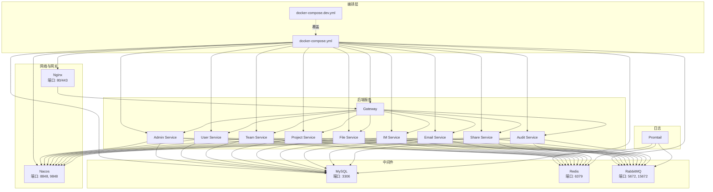
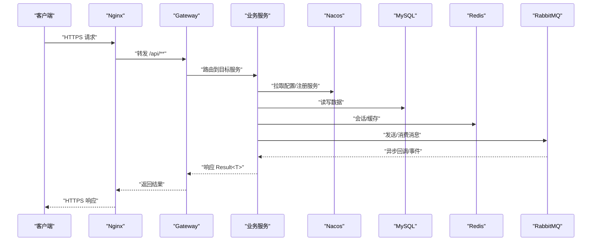
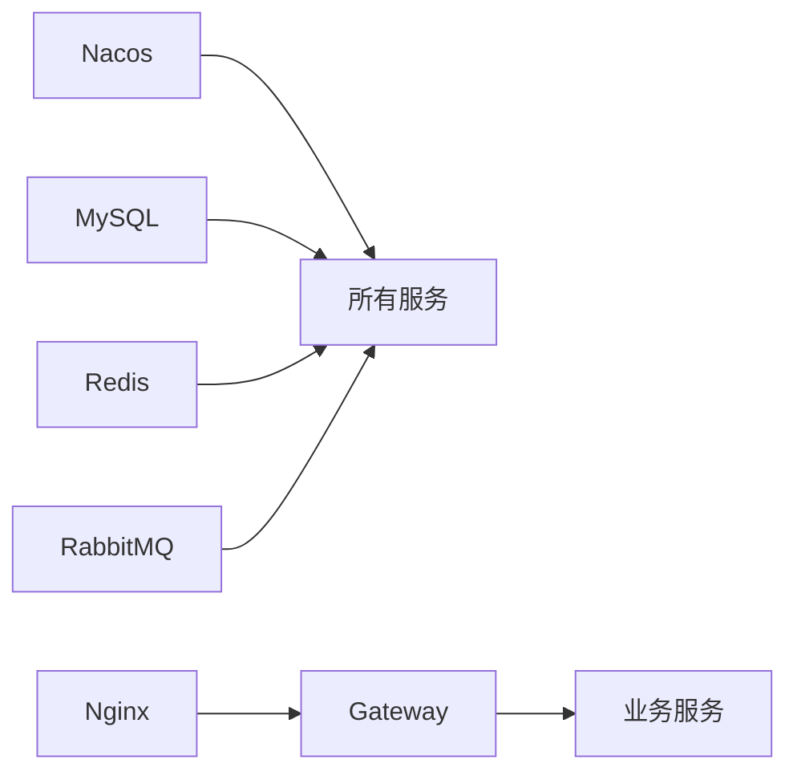

# 网络存储配置

<cite>
**本文引用的文件**
- [docker-compose.yml](file://docker-compose.yml)
- [docker-compose.dev.yml](file://docker-compose.dev.yml)
- [deploy/nginx/default.conf](file://deploy/nginx/default.conf)
- [deploy/nginx/entrypoint.sh](file://deploy/nginx/entrypoint.sh)
- [nacos-config/zxyz-static.yml](file://nacos-config/zxyz-static.yml)
- [nacos-config/zxyz-dynamic.yml](file://nacos-config/zxyz-dynamic.yml)
- [scripts/dev-up.sh](file://scripts/dev-up.sh)
- [scripts/health-check.sh](file://scripts/health-check.sh)
- [scripts/validate-env.sh](file://scripts/validate-env.sh)
- [DEPLOYMENT.md](file://DEPLOYMENT.md)
</cite>

## 目录
1. [简介](#简介)
2. [项目结构](#项目结构)
3. [核心组件](#核心组件)
4. [架构总览](#架构总览)
5. [详细组件分析](#详细组件分析)
6. [依赖关系分析](#依赖关系分析)
7. [性能考虑](#性能考虑)
8. [故障排查指南](#故障排查指南)
9. [结论](#结论)
10. [附录](#附录)

## 简介
本文件面向ZXYZ项目的Docker Compose编排，聚焦网络与存储配置。内容涵盖：
- 自定义网络拓扑设计（隔离网段、服务间通信规则、防火墙策略）
- 数据卷管理（MySQL持久化、Redis快照、RabbitMQ消息持久化、配置文件共享）
- 端口映射策略（内部端口暴露、外部访问控制、安全组建议）
- 环境变量管理（敏感信息加密、配置模板、优先级）
- 网络诊断工具与常见问题排查

## 项目结构
本项目使用Docker Compose编排多容器环境，包含基础设施（Nacos、MySQL、Redis、RabbitMQ等）、后端微服务、前端Nginx以及日志栈。关键编排与部署相关文件如下：
- docker-compose.yml：生产/通用编排定义
- docker-compose.dev.yml：开发环境扩展覆盖
- deploy/nginx/*：Nginx反向代理与入口脚本
- nacos-config/*：Nacos静态与动态配置
- scripts/*：启动、健康检查与环境校验脚本
- DEPLOYMENT.md：部署说明

图表来源
- [docker-compose.yml](file://docker-compose.yml)
- [docker-compose.dev.yml](file://docker-compose.dev.yml)
- [deploy/nginx/default.conf](file://deploy/nginx/default.conf)

章节来源
- [docker-compose.yml](file://docker-compose.yml)
- [docker-compose.dev.yml](file://docker-compose.dev.yml)
- [DEPLOYMENT.md](file://DEPLOYMENT.md)

## 核心组件
- 网络模型
  - 默认桥接网络用于宿主机到容器内服务的访问
  - 自定义隔离网络用于服务间通信（如zxyz-net），按功能域划分子网或VLAN（若宿主支持）
  - 通过Nacos进行服务发现与配置中心统一治理
- 存储模型
  - MySQL：数据目录挂载至宿主机路径，确保重启不丢失；启用binlog与慢查询日志
  - Redis：AOF与RDB双写，快照目录持久化；密码通过环境变量注入
  - RabbitMQ：镜像队列与持久化消息，管理界面端口按需暴露
  - Nacos：配置与注册中心，数据目录持久化
- 网关与外部访问
  - Nginx作为唯一对外入口，转发HTTP/HTTPS至Gateway
  - Gateway基于Sa-Token过滤器拦截/api/internal/**，拒绝公网直接访问

章节来源
- [docker-compose.yml](file://docker-compose.yml)
- [docker-compose.dev.yml](file://docker-compose.dev.yml)
- [deploy/nginx/default.conf](file://deploy/nginx/default.conf)

## 架构总览
下图展示从客户端到各微服务的数据流与依赖关系，强调网络边界与存储依赖。

图表来源
- [docker-compose.yml](file://docker-compose.yml)
- [deploy/nginx/default.conf](file://deploy/nginx/default.conf)

## 详细组件分析

### 自定义网络拓扑设计
- 网络分段
  - zxyz-net：服务间私有网络，仅允许受信任服务互通
  - 可选子网划分：数据库网段、消息网段、应用网段，便于ACL与监控
- 服务间通信规则
  - 所有服务通过Nacos进行服务发现，避免硬编码IP
  - 内部端点前缀/api/internal/**由Gateway的SaToken过滤器拒绝公网访问
  - 跨服务调用采用窄端点+投影模式，减少耦合
- 防火墙策略
  - 仅开放Nginx对外端口（80/443）
  - 中间件端口（MySQL/Redis/RabbitMQ/Nacos）仅在zxyz-net内暴露
  - 建议使用安全组限制源IP范围（如运维跳板机、CI节点）

章节来源
- [docker-compose.yml](file://docker-compose.yml)
- [docker-compose.dev.yml](file://docker-compose.dev.yml)
- [deploy/nginx/default.conf](file://deploy/nginx/default.conf)

### 数据卷管理
- MySQL
  - 数据目录持久化至宿主机路径，避免容器重建导致数据丢失
  - 备份脚本定期执行逻辑在scripts/backup.sh中
- Redis
  - AOF与RDB同时开启，快照目录持久化
  - 密码通过环境变量注入，禁止明文写入镜像
- RabbitMQ
  - 启用持久化队列与消息，管理端口按需暴露
  - 插件与配置通过环境变量与挂载卷管理
- 配置文件共享
  - Nacos集中管理配置，服务启动时拉取
  - 本地调试可通过nacos-config/*提供静态配置覆盖

章节来源
- [docker-compose.yml](file://docker-compose.yml)
- [docker-compose.dev.yml](file://docker-compose.dev.yml)
- [nacos-config/zxyz-static.yml](file://nacos-config/zxyz-static.yml)
- [nacos-config/zxyz-dynamic.yml](file://nacos-config/zxyz-dynamic.yml)
- [scripts/backup.sh](file://scripts/backup.sh)

### 端口映射策略
- 外部访问
  - Nginx：80/443暴露给公网，HTTPS证书挂载
  - RabbitMQ管理界面：15672仅在开发环境暴露
- 内部端口
  - MySQL：3306（仅zxyz-net）
  - Redis：6379（仅zxyz-net）
  - RabbitMQ：5672（仅zxyz-net）
  - Nacos：8848/9848（仅zxyz-net）
- 安全组配置
  - 仅放行Nginx端口
  - 运维访问中间件需通过跳板机或VPN

章节来源
- [docker-compose.yml](file://docker-compose.yml)
- [docker-compose.dev.yml](file://docker-compose.dev.yml)
- [deploy/nginx/default.conf](file://deploy/nginx/default.conf)

### 环境变量管理
- 敏感信息加密
  - Jasypt对敏感字段加密，密钥通过环境变量注入
  - 参考文档：docs/jasypt-key-management.md
- 配置模板
  - application-*.yml提供环境差异配置
  - Nacos动态配置覆盖本地配置
- 优先级
  - 环境变量 > Nacos动态配置 > 本地application-prod.yml > 默认值

章节来源
- [nacos-config/zxyz-static.yml](file://nacos-config/zxyz-static.yml)
- [nacos-config/zxyz-dynamic.yml](file://nacos-config/zxyz-dynamic.yml)
- [DEPLOYMENT.md](file://DEPLOYMENT.md)

### 网络诊断工具与常见问题排查
- 常用命令
  - 查看容器网络：docker network inspect zxyz-net
  - 测试连通性：docker exec <container> ping <service-name>
  - 查看端口占用：ss -tulnp | grep <port>
- 常见问题
  - 服务无法解析Nacos地址：检查DNS与网络隔离
  - MySQL连接超时：确认端口未暴露至公网，检查防火墙
  - Redis认证失败：核对密码环境变量与容器启动参数
  - RabbitMQ队列堆积：检查消费者状态与消息持久化设置

章节来源
- [scripts/health-check.sh](file://scripts/health-check.sh)
- [scripts/validate-env.sh](file://scripts/validate-env.sh)

## 依赖关系分析
- 服务依赖
  - 所有服务依赖Nacos进行配置与服务发现
  - 数据层依赖MySQL、Redis、RabbitMQ
  - 前端依赖Nginx反向代理
- 耦合度
  - 通过Nacos解耦服务发现与配置
  - 内部接口窄化，降低横向耦合

图表来源
- [docker-compose.yml](file://docker-compose.yml)

章节来源
- [docker-compose.yml](file://docker-compose.yml)

## 性能考虑
- 网络
  - 使用高性能网络驱动（如overlay在集群环境）
  - 合理设置TCP缓冲与连接池
- 存储
  - MySQL启用索引与慢查询日志
  - Redis热点键预热与内存淘汰策略
  - RabbitMQ镜像队列与分区优化
- 资源限制
  - 为每个容器设置CPU与内存上限，避免争用

[本节为通用指导，无需特定文件引用]

## 故障排查指南
- 启动失败
  - 检查环境变量是否完整，参考validate-env.sh
  - 查看容器日志：docker logs <container>
- 网络问题
  - 使用health-check.sh验证服务健康状态
  - 检查防火墙与安全组规则
- 存储问题
  - 确认数据卷挂载权限与路径正确
  - 检查备份脚本执行结果

章节来源
- [scripts/validate-env.sh](file://scripts/validate-env.sh)
- [scripts/health-check.sh](file://scripts/health-check.sh)

## 结论
通过合理的网络隔离、数据持久化与端口管理，ZXYZ项目在Docker Compose环境下实现了高可用与易维护的部署方案。结合Nacos与Jasypt，进一步提升了配置管理与安全性。建议在生产环境中严格遵循最小权限原则，并持续监控网络与存储性能。

[本节为总结，无需特定文件引用]

## 附录
- 相关文档
  - DEPLOYMENT.md：部署流程与环境准备
  - docs/jasypt-key-management.md：敏感信息加密指南
- 常用命令
  - 启动：./scripts/dev-up.sh
  - 停止：docker compose down
  - 查看日志：docker compose logs -f <service>

章节来源
- [DEPLOYMENT.md](file://DEPLOYMENT.md)
- [scripts/dev-up.sh](file://scripts/dev-up.sh)