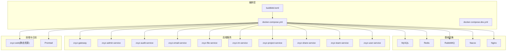
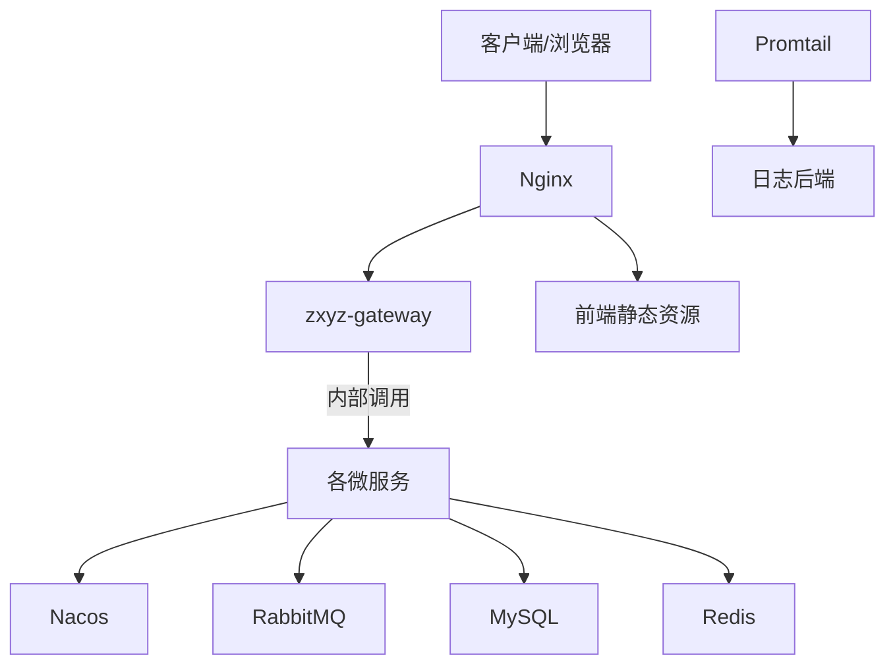
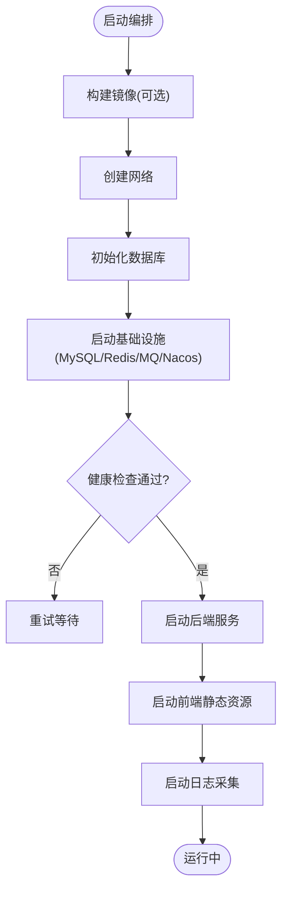
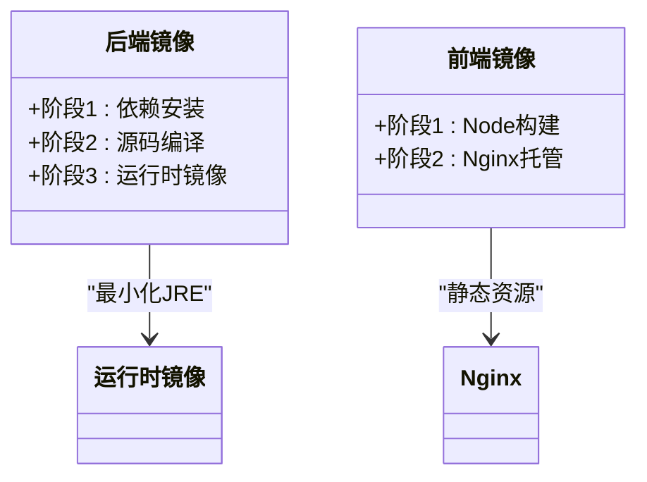
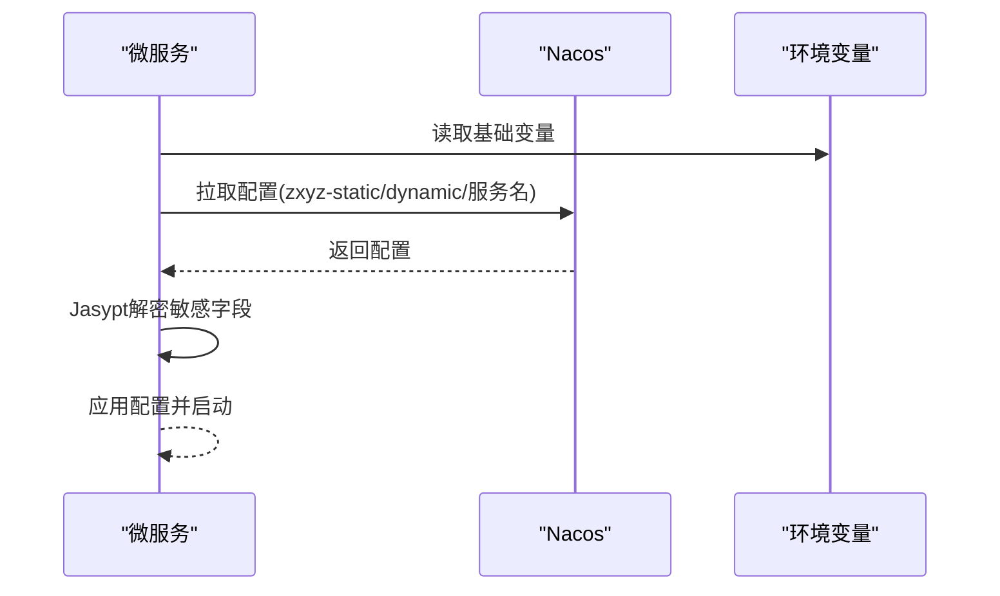
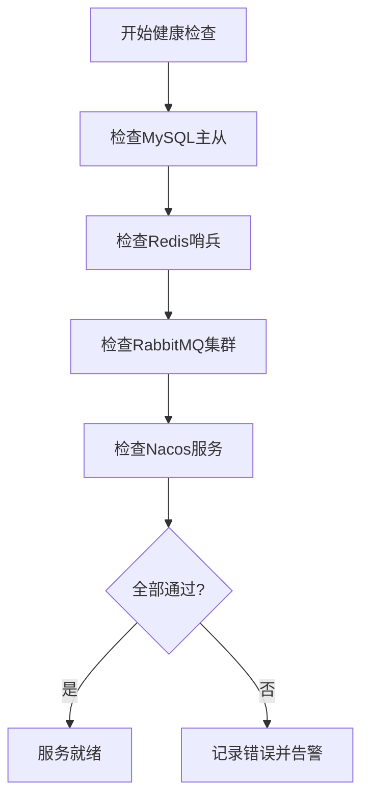
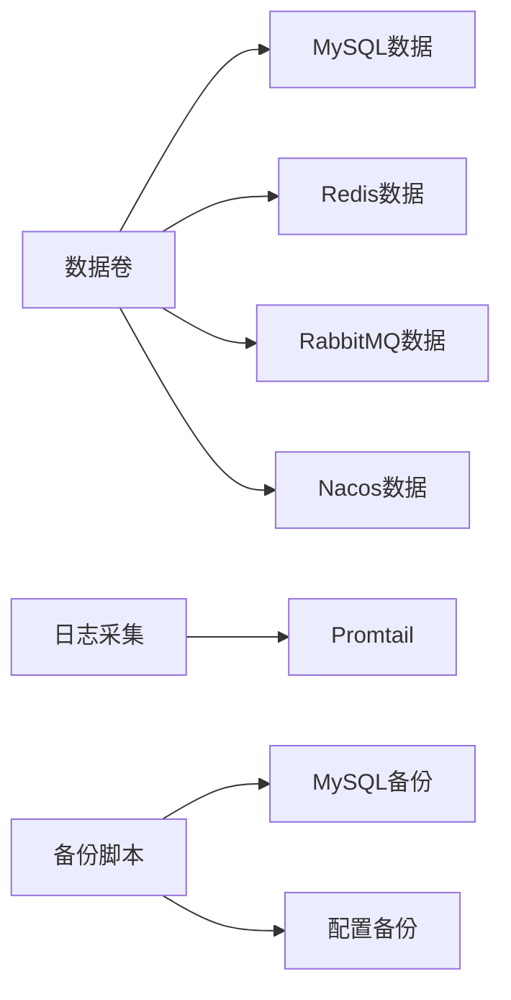
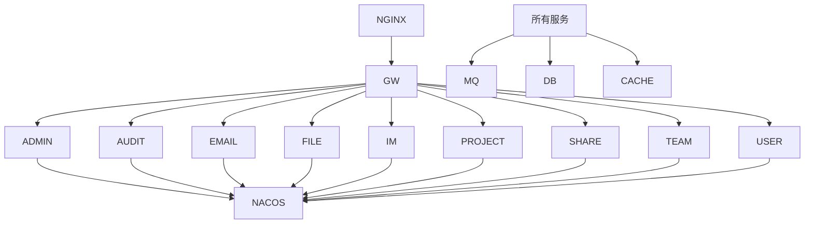

# Docker容器化部署

<cite>
**本文引用的文件**   
- [docker-compose.yml](file://docker-compose.yml)
- [docker-compose.dev.yml](file://docker-compose.dev.yml)
- [buildkitd.toml](file://buildkitd.toml)
- [ZXYZdatabaseBack/Dockerfile](file://ZXYZdatabaseBack/Dockerfile)
- [ZXYZdatabaseBack/Dockerfile.base](file://ZXYZdatabaseBack/Dockerfile.base)
- [ZXYZdatabaseFront/Dockerfile](file://ZXYZdatabaseFront/Dockerfile)
- [deploy/nginx/default.conf](file://deploy/nginx/default.conf)
- [deploy/nginx/entrypoint.sh](file://deploy/nginx/entrypoint.sh)
- [nacos-config/zxyz-static.yml](file://nacos-config/zxyz-static.yml)
- [nacos-config/zxyz-dynamic.yml](file://nacos-config/zxyz-dynamic.yml)
- [nacos-config/zxyz-admin-service.yml](file://nacos-config/zxyz-admin-service.yml)
- [nacos-config/zxyz-audit-service.yml](file://nacos-config/zxyz-audit-service.yml)
- [nacos-config/zxyz-email-service.yml](file://nacos-config/zxyz-email-service.yml)
- [nacos-config/zxyz-file-service.yml](file://nacos-config/zxyz-file-service.yml)
- [nacos-config/zxyz-gateway.yml](file://nacos-config/zxyz-gateway.yml)
- [nacos-config/zxyz-im-service.yml](file://nacos-config/zxyz-im-service.yml)
- [nacos-config/zxyz-project-service.yml](file://nacos-config/zxyz-project-service.yml)
- [nacos-config/zxyz-share-service.yml](file://nacos-config/zxyz-share-service.yml)
- [nacos-config/zxyz-team-service.yml](file://nacos-config/zxyz-team-service.yml)
- [nacos-config/zxyz-user-service.yml](file://nacos-config/zxyz-user-service.yml)
- [scripts/health-check.sh](file://scripts/health-check.sh)
- [scripts/backup.sh](file://scripts/backup.sh)
- [sql/00-init-zxyz.sh](file://sql/00-init-zxyz.sh)
- [DEPLOYMENT.md](file://DEPLOYMENT.md)
</cite>

## 目录
1. [简介](#简介)
2. [项目结构](#项目结构)
3. [核心组件](#核心组件)
4. [架构总览](#架构总览)
5. [详细组件分析](#详细组件分析)
6. [依赖关系分析](#依赖关系分析)
7. [性能与构建优化](#性能与构建优化)
8. [故障排查指南](#故障排查指南)
9. [结论](#结论)
10. [附录](#附录)

## 简介
本文件面向ZXYZ项目的Docker容器化部署，基于Docker Compose编排18个容器：5个基础设施服务（MySQL、Redis、RabbitMQ、Nacos、Nginx）和10个后端微服务，以及前端静态资源与日志采集。文档覆盖多阶段构建优化、网络拓扑、环境变量管理、健康检查、存储策略与备份方案，帮助读者从零到一完成生产级部署。

## 项目结构
- 根目录包含Compose编排文件、构建配置、Nacos配置集、脚本与SQL初始化脚本等。
- 后端位于ZXYZdatabaseBack，提供多个Maven模块的微服务；前端位于ZXYZdatabaseFront，使用Vue 3构建静态资源。
- Nginx作为统一入口，反向代理至Gateway与静态资源。
- 日志栈通过Promtail收集容器日志并输出到外部系统（如Elasticsearch/Loki）。

**图表来源** 
- [docker-compose.yml](file://docker-compose.yml)
- [docker-compose.dev.yml](file://docker-compose.dev.yml)
- [buildkitd.toml](file://buildkitd.toml)

**章节来源**
- [docker-compose.yml](file://docker-compose.yml)
- [docker-compose.dev.yml](file://docker-compose.dev.yml)
- [buildkitd.toml](file://buildkitd.toml)

## 核心组件
- 基础设施服务
  - MySQL：主从复制、数据持久化、初始化脚本执行。
  - Redis：哨兵模式、会话存储、缓存。
  - RabbitMQ：Topic Exchange zxyz.topic，消息持久化与重试。
  - Nacos：服务注册发现与动态配置中心。
  - Nginx：统一入口、静态资源托管、反向代理。
- 后端服务
  - Gateway：鉴权过滤、路由转发、限流。
  - Admin/Audit/Email/File/IM/Project/Share/Team/User：业务微服务，按分层或DDD组织。
- 前端与日志
  - 前端静态资源由Nginx托管。
  - Promtail采集容器日志并输出到外部系统。

**章节来源**
- [docker-compose.yml](file://docker-compose.yml)
- [DEPLOYMENT.md](file://DEPLOYMENT.md)

## 架构总览
整体采用“网关+微服务”的架构，Nacos负责服务注册与配置管理，RabbitMQ承担异步解耦，MySQL与Redis提供数据与缓存能力，Nginx统一对外暴露接口与静态资源。

**图表来源** 
- [docker-compose.yml](file://docker-compose.yml)
- [deploy/nginx/default.conf](file://deploy/nginx/default.conf)

**章节来源**
- [docker-compose.yml](file://docker-compose.yml)
- [deploy/nginx/default.conf](file://deploy/nginx/default.conf)

## 详细组件分析

### 容器编排与网络拓扑
- 使用单一Compose文件定义全部18个服务，开发环境可通过dev变体覆盖部分参数。
- 自定义网络隔离服务间通信，端口映射仅暴露必要入口（Nginx 80/443、Nacos控制台等）。
- 数据卷挂载用于MySQL、Redis、RabbitMQ、Nacos数据持久化与日志收集。

**图表来源** 
- [docker-compose.yml](file://docker-compose.yml)
- [docker-compose.dev.yml](file://docker-compose.dev.yml)
- [scripts/health-check.sh](file://scripts/health-check.sh)

**章节来源**
- [docker-compose.yml](file://docker-compose.yml)
- [docker-compose.dev.yml](file://docker-compose.dev.yml)
- [scripts/health-check.sh](file://scripts/health-check.sh)

### 多阶段构建优化
- 基础镜像选择：后端使用精简JRE镜像，前端使用轻量Node镜像进行构建，最终产物为静态资源。
- 依赖缓存：利用Docker层缓存机制，先安装依赖再拷贝源码，提升构建速度。
- 镜像体积优化：合并RUN指令、清理临时文件、使用.dockerignore排除无关文件。

**图表来源** 
- [ZXYZdatabaseBack/Dockerfile](file://ZXYZdatabaseBack/Dockerfile)
- [ZXYZdatabaseBack/Dockerfile.base](file://ZXYZdatabaseBack/Dockerfile.base)
- [ZXYZdatabaseFront/Dockerfile](file://ZXYZdatabaseFront/Dockerfile)

**章节来源**
- [ZXYZdatabaseBack/Dockerfile](file://ZXYZdatabaseBack/Dockerfile)
- [ZXYZdatabaseBack/Dockerfile.base](file://ZXYZdatabaseBack/Dockerfile.base)
- [ZXYZdatabaseFront/Dockerfile](file://ZXYZdatabaseFront/Dockerfile)

### 环境变量与配置管理
- Nacos集中管理配置，包括静态与动态配置集，服务启动时拉取。
- Jasypt加密敏感信息（数据库密码、密钥等），在应用启动时解密。
- 关键环境变量示例：数据库连接、Redis地址、RabbitMQ参数、Nacos地址等。

**图表来源** 
- [nacos-config/zxyz-static.yml](file://nacos-config/zxyz-static.yml)
- [nacos-config/zxyz-dynamic.yml](file://nacos-config/zxyz-dynamic.yml)
- [nacos-config/zxyz-*-service.yml](file://nacos-config/zxyz-admin-service.yml)

**章节来源**
- [nacos-config/zxyz-static.yml](file://nacos-config/zxyz-static.yml)
- [nacos-config/zxyz-dynamic.yml](file://nacos-config/zxyz-dynamic.yml)
- [nacos-config/zxyz-admin-service.yml](file://nacos-config/zxyz-admin-service.yml)
- [nacos-config/zxyz-audit-service.yml](file://nacos-config/zxyz-audit-service.yml)
- [nacos-config/zxyz-email-service.yml](file://nacos-config/zxyz-email-service.yml)
- [nacos-config/zxyz-file-service.yml](file://nacos-config/zxyz-file-service.yml)
- [nacos-config/zxyz-gateway.yml](file://nacos-config/zxyz-gateway.yml)
- [nacos-config/zxyz-im-service.yml](file://nacos-config/zxyz-im-service.yml)
- [nacos-config/zxyz-project-service.yml](file://nacos-config/zxyz-project-service.yml)
- [nacos-config/zxyz-share-service.yml](file://nacos-config/zxyz-share-service.yml)
- [nacos-config/zxyz-team-service.yml](file://nacos-config/zxyz-team-service.yml)
- [nacos-config/zxyz-user-service.yml](file://nacos-config/zxyz-user-service.yml)

### 健康检查与高可用
- MySQL：主从复制状态检查、读写分离验证。
- Redis：哨兵模式监控、主节点可用性检测。
- RabbitMQ：集群节点状态、队列与交换器存在性检查。
- Nacos：服务注册与健康状态查询。
- 自定义健康检查脚本集成到Compose healthcheck。

**图表来源** 
- [scripts/health-check.sh](file://scripts/health-check.sh)

**章节来源**
- [scripts/health-check.sh](file://scripts/health-check.sh)

### 存储策略与备份
- 数据持久化：MySQL、Redis、RabbitMQ、Nacos数据卷挂载至宿主机。
- 日志收集：Promtail采集容器stdout/stderr并输出到外部系统。
- 备份方案：定时任务执行数据库备份、配置文件导出与归档。

**图表来源** 
- [docker-compose.yml](file://docker-compose.yml)
- [scripts/backup.sh](file://scripts/backup.sh)

**章节来源**
- [docker-compose.yml](file://docker-compose.yml)
- [scripts/backup.sh](file://scripts/backup.sh)

## 依赖关系分析
- 服务间依赖：所有后端服务依赖Nacos、RabbitMQ、MySQL、Redis。
- 网关前置：Nginx将请求转发至Gateway，Gateway再分发至具体服务。
- 前端依赖：静态资源由Nginx托管，API调用经Gateway访问后端。

**图表来源** 
- [docker-compose.yml](file://docker-compose.yml)
- [deploy/nginx/default.conf](file://deploy/nginx/default.conf)

**章节来源**
- [docker-compose.yml](file://docker-compose.yml)
- [deploy/nginx/default.conf](file://deploy/nginx/default.conf)

## 性能与构建优化
- 构建优化：启用BuildKit加速构建，合理分层缓存依赖，减少镜像体积。
- 运行时优化：限制容器资源上限，启用GC调优参数，连接池大小按需调整。
- 网络优化：使用专用网络减少广播风暴，合理设置超时与重试策略。

**章节来源**
- [buildkitd.toml](file://buildkitd.toml)
- [ZXYZdatabaseBack/Dockerfile](file://ZXYZdatabaseBack/Dockerfile)
- [ZXYZdatabaseFront/Dockerfile](file://ZXYZdatabaseFront/Dockerfile)

## 故障排查指南
- 常见问题：服务启动失败、健康检查不通过、配置加载错误、数据库连接失败。
- 排查步骤：查看容器日志、检查环境变量、验证Nacos配置、测试网络连通性。
- 工具支持：健康检查脚本、备份脚本、初始化脚本辅助定位问题。

**章节来源**
- [scripts/health-check.sh](file://scripts/health-check.sh)
- [scripts/backup.sh](file://scripts/backup.sh)
- [sql/00-init-zxyz.sh](file://sql/00-init-zxyz.sh)

## 结论
通过Docker Compose编排18个容器，结合Nacos配置中心、RabbitMQ异步解耦、MySQL与Redis数据存储、Nginx统一入口，实现了ZXYZ项目的高可用、可扩展、易维护的容器化部署。多阶段构建优化与完善的健康检查、备份策略保障了生产环境的稳定性与可恢复性。

## 附录
- 参考文档：[DEPLOYMENT.md](file://DEPLOYMENT.md)
- 初始化脚本：[sql/00-init-zxyz.sh](file://sql/00-init-zxyz.sh)
- Nginx配置：[deploy/nginx/default.conf](file://deploy/nginx/default.conf), [deploy/nginx/entrypoint.sh](file://deploy/nginx/entrypoint.sh)