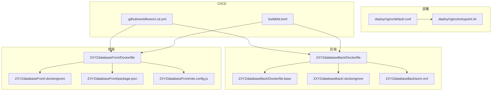
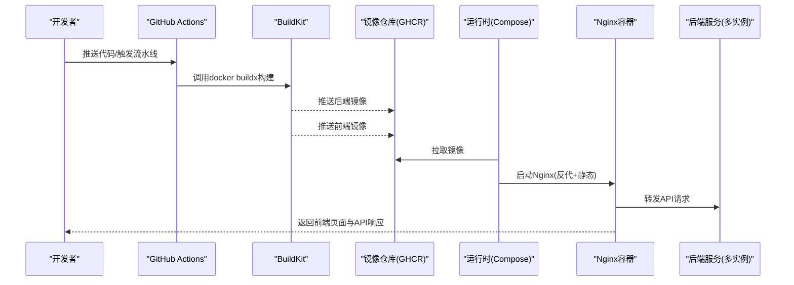
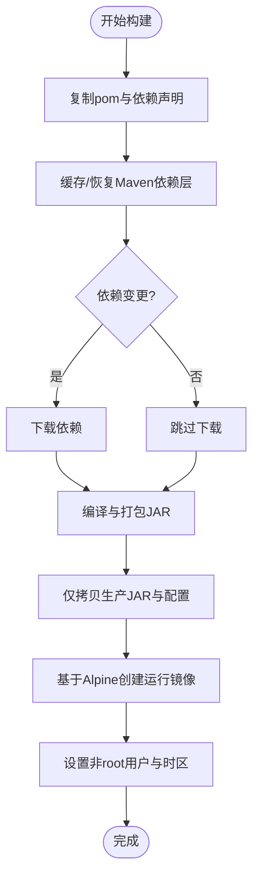
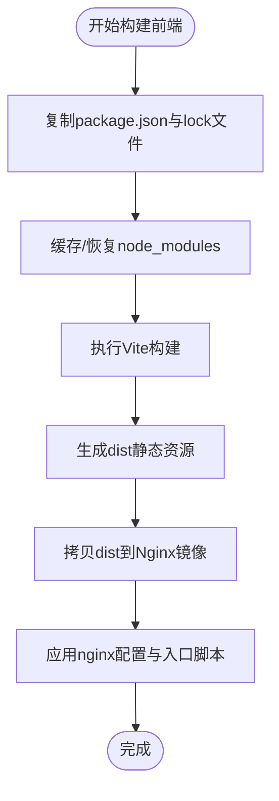
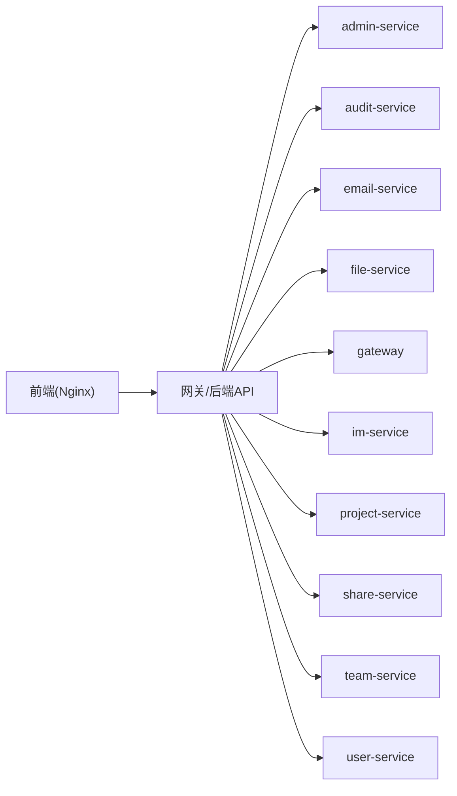

# Docker镜像构建优化

<cite>
**本文引用的文件**   
- [ZXYZdatabaseBack/Dockerfile](file://ZXYZdatabaseBack/Dockerfile)
- [ZXYZdatabaseBack/Dockerfile.base](file://ZXYZdatabaseBack/Dockerfile.base)
- [ZXYZdatabaseBack/.dockerignore](file://ZXYZdatabaseBack/.dockerignore)
- [ZXYZdatabaseBack/pom.xml](file://ZXYZdatabaseBack/pom.xml)
- [ZXYZdatabaseFront/Dockerfile](file://ZXYZdatabaseFront/Dockerfile)
- [ZXYZdatabaseFront/.dockerignore](file://ZXYZdatabaseFront/.dockerignore)
- [ZXYZdatabaseFront/package.json](file://ZXYZdatabaseFront/package.json)
- [ZXYZdatabaseFront/vite.config.js](file://ZXYZdatabaseFront/vite.config.js)
- [deploy/nginx/default.conf](file://deploy/nginx/default.conf)
- [deploy/nginx/entrypoint.sh](file://deploy/nginx/entrypoint.sh)
- [.github/workflows/ci-cd.yml](file://.github/workflows/ci-cd.yml)
- [buildkitd.toml](file://buildkitd.toml)
</cite>

## 目录
1. [简介](#简介)
2. [项目结构](#项目结构)
3. [核心组件](#核心组件)
4. [架构总览](#架构总览)
5. [详细组件分析](#详细组件分析)
6. [依赖关系分析](#依赖关系分析)
7. [性能考虑](#性能考虑)
8. [故障排查指南](#故障排查指南)
9. [结论](#结论)
10. [附录](#附录)

## 简介
本文件面向ZXYZ项目的Docker镜像构建与优化，覆盖多阶段构建策略、基础镜像选择（Alpine Linux）、依赖缓存优化、镜像体积最小化；详细说明Java后端（Maven编译、依赖下载缓存、JAR包优化）与Vue前端（Node.js环境、静态资源优化、CDN集成）的构建流程；给出.dockerignore配置建议、镜像分层技巧（依赖层与应用层分离），以及安全扫描与漏洞修复最佳实践。目标是帮助团队在CI/CD中稳定产出更小、更快、更安全的镜像。

## 项目结构
ZXYZ为微服务架构：后端包含多个Maven模块（如admin-service、audit-service、email-service、file-service、gateway、im-service、project-service、share-service、team-service、user-service等），前端为Vue应用。根目录提供Compose编排、Nacos配置、部署脚本与GitHub Actions工作流。镜像构建主要涉及两个Dockerfile：后端与前端各自的多阶段构建。

图表来源
- [ZXYZdatabaseBack/Dockerfile](file://ZXYZdatabaseBack/Dockerfile)
- [ZXYZdatabaseBack/Dockerfile.base](file://ZXYZdatabaseBack/Dockerfile.base)
- [ZXYZdatabaseBack/.dockerignore](file://ZXYZdatabaseBack/.dockerignore)
- [ZXYZdatabaseBack/pom.xml](file://ZXYZdatabaseBack/pom.xml)
- [ZXYZdatabaseFront/Dockerfile](file://ZXYZdatabaseFront/Dockerfile)
- [ZXYZdatabaseFront/.dockerignore](file://ZXYZdatabaseFront/.dockerignore)
- [ZXYZdatabaseFront/package.json](file://ZXYZdatabaseFront/package.json)
- [ZXYZdatabaseFront/vite.config.js](file://ZXYZdatabaseFront/vite.config.js)
- [deploy/nginx/default.conf](file://deploy/nginx/default.conf)
- [deploy/nginx/entrypoint.sh](file://deploy/nginx/entrypoint.sh)
- [.github/workflows/ci-cd.yml](file://.github/workflows/ci-cd.yml)
- [buildkitd.toml](file://buildkitd.toml)

章节来源
- [ZXYZdatabaseBack/Dockerfile](file://ZXYZdatabaseBack/Dockerfile)
- [ZXYZdatabaseFront/Dockerfile](file://ZXYZdatabaseFront/Dockerfile)
- [.github/workflows/ci-cd.yml](file://.github/workflows/ci-cd.yml)

## 核心组件
- 后端镜像构建
  - 多阶段构建：构建阶段使用完整JDK与Maven环境，运行阶段使用精简Alpine + JRE。
  - 依赖缓存：将Maven仓库或本地依赖目录作为独立层，减少重复下载。
  - 产物优化：仅拷贝最终可执行JAR，剔除源码与测试类。
- 前端镜像构建
  - 多阶段构建：构建阶段使用Node镜像安装依赖并打包静态资源，运行阶段使用轻量Nginx镜像托管静态文件。
  - 依赖缓存：锁定package-lock.json，优先缓存node_modules。
  - 静态资源优化：启用压缩、按需加载、CDN路径替换。
- CI/CD与构建加速
  - GitHub Actions选择性构建（按路径过滤）。
  - BuildKit缓存与并行构建。

章节来源
- [ZXYZdatabaseBack/Dockerfile](file://ZXYZdatabaseBack/Dockerfile)
- [ZXYZdatabaseFront/Dockerfile](file://ZXYZdatabaseFront/Dockerfile)
- [.github/workflows/ci-cd.yml](file://.github/workflows/ci-cd.yml)
- [buildkitd.toml](file://buildkitd.toml)

## 架构总览
下图展示前后端镜像构建与运行时的关键交互：CI触发构建，后端生成JAR并由Nginx反向代理到各服务，前端静态资源由Nginx直接提供服务。

图表来源
- [.github/workflows/ci-cd.yml](file://.github/workflows/ci-cd.yml)
- [ZXYZdatabaseBack/Dockerfile](file://ZXYZdatabaseBack/Dockerfile)
- [ZXYZdatabaseFront/Dockerfile](file://ZXYZdatabaseFront/Dockerfile)
- [deploy/nginx/default.conf](file://deploy/nginx/default.conf)

## 详细组件分析

### 后端镜像构建（Java/Maven）
- 多阶段构建策略
  - 构建阶段：基于完整JDK镜像，安装Maven，复制pom与源码，执行依赖解析与编译打包。
  - 运行阶段：基于Alpine Linux + JRE，仅拷贝最终JAR与必要配置文件，设置时区与非root用户。
- 依赖缓存优化
  - 将Maven本地仓库或依赖目录映射为独立层，仅在pom变化时重新下载依赖。
  - 使用离线模式或镜像源加速下载。
- JAR包优化
  - 排除测试类与多余资源，启用Spring Boot可执行Jar优化选项（如分层打包、启动类瘦身）。
  - 使用jlink或GraalVM Native Image（可选）进一步缩小体积。
- 安全加固
  - 非root运行、只读根文件系统、最小权限网络访问。
  - 定期扫描镜像漏洞并升级基础镜像。

图表来源
- [ZXYZdatabaseBack/Dockerfile](file://ZXYZdatabaseBack/Dockerfile)
- [ZXYZdatabaseBack/Dockerfile.base](file://ZXYZdatabaseBack/Dockerfile.base)
- [ZXYZdatabaseBack/pom.xml](file://ZXYZdatabaseBack/pom.xml)

章节来源
- [ZXYZdatabaseBack/Dockerfile](file://ZXYZdatabaseBack/Dockerfile)
- [ZXYZdatabaseBack/Dockerfile.base](file://ZXYZdatabaseBack/Dockerfile.base)
- [ZXYZdatabaseBack/pom.xml](file://ZXYZdatabaseBack/pom.xml)

### 前端镜像构建（Vue/Vite/Nginx）
- 多阶段构建策略
  - 构建阶段：基于Node镜像，安装依赖并执行Vite构建，输出静态资源。
  - 运行阶段：基于Nginx镜像，拷贝静态资源并配置反向代理与压缩。
- 依赖缓存优化
  - 先复制package.json与package-lock.json，缓存node_modules层。
  - 使用国内镜像源加速npm/yarn/pnpm安装。
- 静态资源优化
  - 启用Gzip/Brotli压缩、图片懒加载、路由懒加载。
  - 通过环境变量注入CDN地址，将静态资源指向外部CDN。
- Nginx配置要点
  - 静态资源缓存策略、HTTP/2、TLS终止、跨域与安全头。
  - 反向代理后端API至网关或服务集群。

图表来源
- [ZXYZdatabaseFront/Dockerfile](file://ZXYZdatabaseFront/Dockerfile)
- [ZXYZdatabaseFront/package.json](file://ZXYZdatabaseFront/package.json)
- [ZXYZdatabaseFront/vite.config.js](file://ZXYZdatabaseFront/vite.config.js)
- [deploy/nginx/default.conf](file://deploy/nginx/default.conf)
- [deploy/nginx/entrypoint.sh](file://deploy/nginx/entrypoint.sh)

章节来源
- [ZXYZdatabaseFront/Dockerfile](file://ZXYZdatabaseFront/Dockerfile)
- [ZXYZdatabaseFront/package.json](file://ZXYZdatabaseFront/package.json)
- [ZXYZdatabaseFront/vite.config.js](file://ZXYZdatabaseFront/vite.config.js)
- [deploy/nginx/default.conf](file://deploy/nginx/default.conf)
- [deploy/nginx/entrypoint.sh](file://deploy/nginx/entrypoint.sh)

### .dockerignore配置与敏感信息排除
- 后端建议排除
  - 构建中间产物（target、*.class）、IDE配置、测试数据、日志、密钥文件。
  - 版本控制元数据（.git）、文档与无关脚本。
- 前端建议排除
  - node_modules、dist、IDE配置、测试报告、本地环境变量。
- 目的
  - 减小上下文大小，提升构建速度，避免泄露敏感信息。

章节来源
- [ZXYZdatabaseBack/.dockerignore](file://ZXYZdatabaseBack/.dockerignore)
- [ZXYZdatabaseFront/.dockerignore](file://ZXYZdatabaseFront/.dockerignore)

### 镜像分层优化技巧
- 依赖层与应用层分离
  - 后端：将Maven依赖层与应用代码层分开，确保依赖不频繁失效。
  - 前端：将node_modules与源码构建结果分层，减少重复安装。
- 只拷贝必要文件
  - 后端：仅拷贝生产JAR与配置文件，剔除源码与测试类。
  - 前端：仅拷贝dist与Nginx配置，剔除构建工具链。
- 基础镜像选择
  - 后端：Alpine + JRE，必要时使用distroless或eclipse-temurin:jre-alpine。
  - 前端：Nginx官方镜像，开启gzip/brotli。

章节来源
- [ZXYZdatabaseBack/Dockerfile](file://ZXYZdatabaseBack/Dockerfile)
- [ZXYZdatabaseFront/Dockerfile](file://ZXYZdatabaseFront/Dockerfile)

### CI/CD与构建加速
- GitHub Actions
  - 使用路径过滤器选择性构建变更模块，缩短流水线时间。
  - 缓存Maven与Node依赖，复用构建上下文。
- BuildKit
  - 启用并行构建与缓存导出，支持远程缓存与增量构建。
  - 合理设置buildkitd.toml以优化并发与缓存行为。

章节来源
- [.github/workflows/ci-cd.yml](file://.github/workflows/ci-cd.yml)
- [buildkitd.toml](file://buildkitd.toml)

## 依赖关系分析
- 后端模块间依赖
  - 各服务通过zxyz-common共享通用能力，内部服务调用通过ServiceClient与X-Internal-Service-Token鉴权。
- 前端与后端交互
  - 前端通过Nginx反代后端API，静态资源由Nginx直接提供。
- 构建期依赖
  - Maven依赖与Node依赖分别缓存，减少重复下载。

图表来源
- [deploy/nginx/default.conf](file://deploy/nginx/default.conf)
- [ZXYZdatabaseBack/pom.xml](file://ZXYZdatabaseBack/pom.xml)

章节来源
- [deploy/nginx/default.conf](file://deploy/nginx/default.conf)
- [ZXYZdatabaseBack/pom.xml](file://ZXYZdatabaseBack/pom.xml)

## 性能考虑
- 构建性能
  - 使用BuildKit并行构建与缓存；CI中缓存Maven与Node依赖。
  - 分模块构建，避免全量重建。
- 运行性能
  - 后端：JVM参数调优（堆大小、GC策略）、连接池与线程池配置。
  - 前端：静态资源压缩、CDN缓存、HTTP/2与Keep-Alive。
- 镜像体积
  - 使用Alpine与JRE精简镜像；剔除无用依赖与调试符号。
  - 前端仅保留dist与Nginx配置。

[本节为通用指导，无需特定文件引用]

## 故障排查指南
- 构建失败常见原因
  - 依赖下载超时：检查网络与镜像源配置。
  - 权限问题：确保非root用户具备必要权限。
  - 环境变量缺失：检查构建与运行所需的环境变量。
- 运行异常
  - 端口冲突：检查Nginx与服务端口占用。
  - 配置错误：校验application配置与Nginx反向代理规则。
- 安全扫描
  - 使用Trivy或Clair扫描镜像漏洞，及时升级基础镜像与依赖。
  - 禁止在镜像中存放密钥，使用环境变量或密钥管理服务。

章节来源
- [ZXYZdatabaseBack/Dockerfile](file://ZXYZdatabaseBack/Dockerfile)
- [ZXYZdatabaseFront/Dockerfile](file://ZXYZdatabaseFront/Dockerfile)
- [deploy/nginx/default.conf](file://deploy/nginx/default.conf)

## 结论
通过多阶段构建、依赖缓存、镜像分层与基础镜像精简，ZXYZ项目的Docker镜像可实现更快的构建速度与更小的体积。结合CI/CD的选择性构建与BuildKit加速，进一步提升交付效率。配合安全扫描与漏洞修复，保障镜像在生产环境的安全性与稳定性。

[本节为总结性内容，无需特定文件引用]

## 附录
- 推荐命令与脚本
  - 构建后端镜像：参考后端Dockerfile中的构建步骤。
  - 构建前端镜像：参考前端Dockerfile中的构建步骤。
  - 运行Compose：使用docker-compose启动全部服务。
- 参考配置
  - Nginx反向代理与静态资源配置。
  - BuildKit缓存与并发优化配置。

[本节为补充信息，无需特定文件引用]