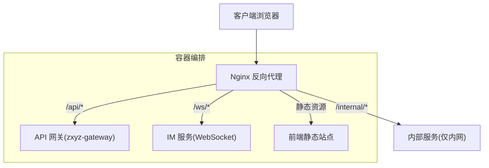
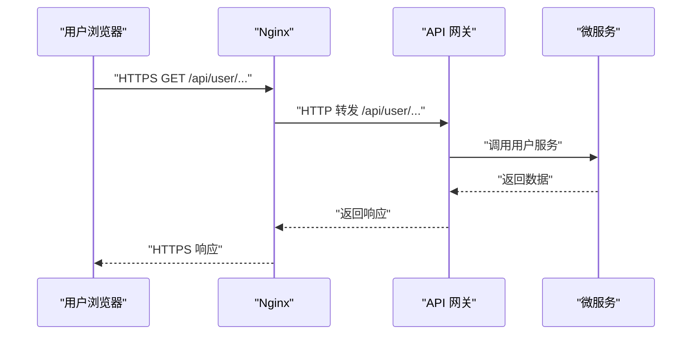
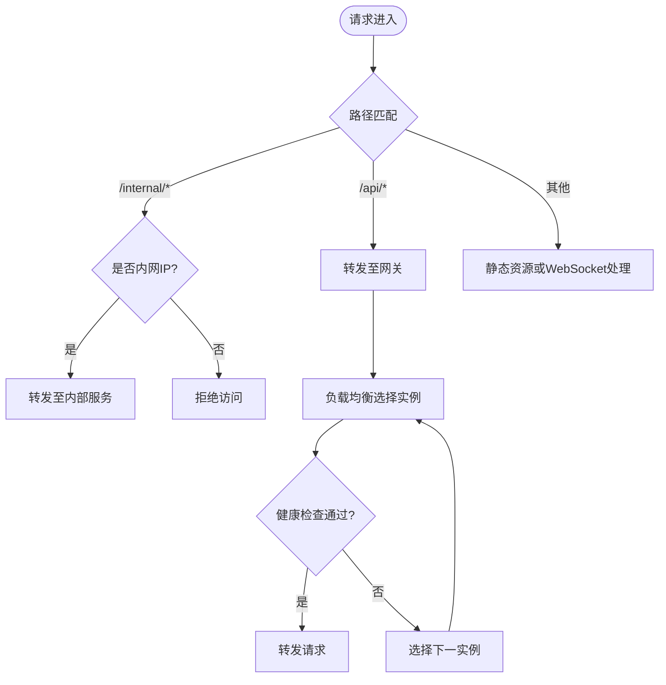
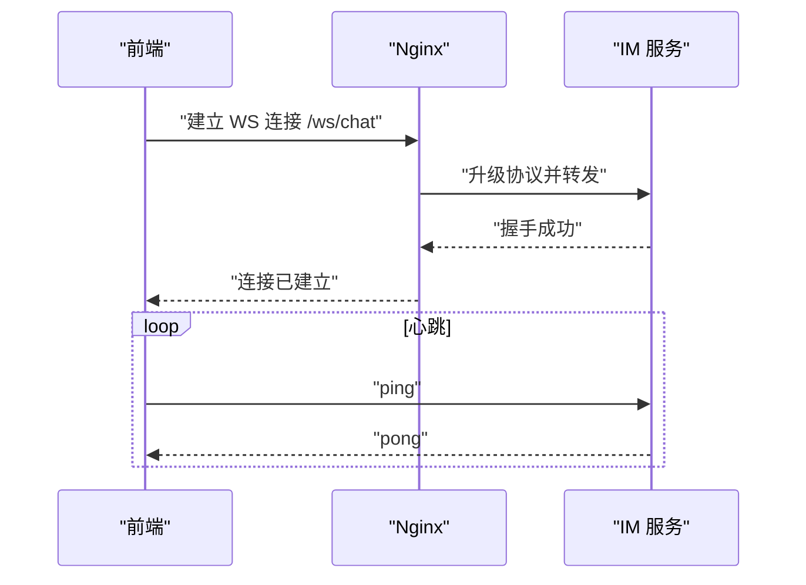
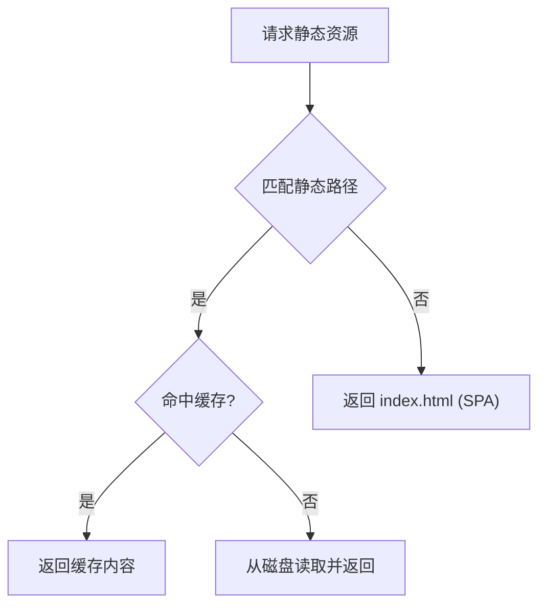
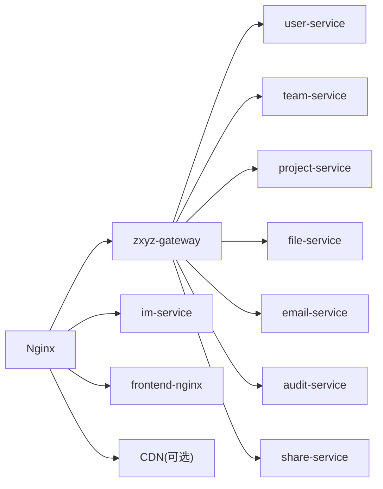

# Nginx反向代理配置

<cite>
**本文引用的文件**   
- [deploy/nginx/default.conf](file://deploy/nginx/default.conf)
- [deploy/nginx/entrypoint.sh](file://deploy/nginx/entrypoint.sh)
- [docker-compose.yml](file://docker-compose.yml)
- [ZXYZdatabaseFront/package.json](file://ZXYZdatabaseFront/package.json)
- [ZXYZdatabaseFront/vite.config.js](file://ZXYZdatabaseFront/vite.config.js)
- [ZXYZdatabaseFront/src/utils/imWebSocket.js](file://ZXYZdatabaseFront/src/utils/imWebSocket.js)
- [ZXYZdatabaseBack/zxyz-gateway/src/main/resources/application.yml](file://ZXYZdatabaseBack/zxyz-gateway/src/main/resources/application.yml)
- [nacos-config/zxyz-static.yml](file://nacos-config/zxyz-static.yml)
- [scripts/health-check.sh](file://scripts/health-check.sh)
</cite>

## 目录
1. [简介](#简介)
2. [项目结构](#项目结构)
3. [核心组件](#核心组件)
4. [架构总览](#架构总览)
5. [详细组件分析](#详细组件分析)
6. [依赖分析](#依赖分析)
7. [性能考虑](#性能考虑)
8. [故障排查指南](#故障排查指南)
9. [结论](#结论)
10. [附录](#附录)

## 简介
本文件为 ZXYZ 项目的 Nginx 反向代理配置文档，面向运维与后端工程师，覆盖以下关键主题：
- API 网关路由：微服务路由规则、负载均衡与健康检查
- WebSocket 支持：实时通讯长连接与心跳机制
- 静态资源服务：前端应用托管、缓存策略与 CDN 集成
- SSL/TLS 证书：HTTPS 强制跳转与安全头设置
- 性能优化：gzip 压缩、连接池调优与内存优化
- 日志与错误页：访问日志格式化与自定义错误页面

本说明基于仓库中的部署脚本、Nginx 配置入口、前端构建产物与网关配置进行归纳，确保与实际部署一致。

## 项目结构
与 Nginx 相关的核心位置如下：
- deploy/nginx：Nginx 主配置与容器入口脚本
- docker-compose.yml：容器编排与服务端口映射
- ZXYZdatabaseFront：前端构建产物（静态资源）
- ZXYZdatabaseBack/zxyz-gateway：API 网关配置（用于理解后端路由）
- nacos-config：静态资源配置（供后端使用，便于统一缓存策略）
- scripts：健康检查脚本（可用于 Nginx upstream 健康探测）

图表来源
- [deploy/nginx/default.conf](file://deploy/nginx/default.conf)
- [docker-compose.yml](file://docker-compose.yml)
- [ZXYZdatabaseBack/zxyz-gateway/src/main/resources/application.yml](file://ZXYZdatabaseBack/zxyz-gateway/src/main/resources/application.yml)

章节来源
- [deploy/nginx/default.conf](file://deploy/nginx/default.conf)
- [deploy/nginx/entrypoint.sh](file://deploy/nginx/entrypoint.sh)
- [docker-compose.yml](file://docker-compose.yml)

## 核心组件
- Nginx 反向代理：统一入口，负责 HTTPS 终止、路由转发、静态资源服务、WebSocket 升级、限流与日志记录
- API 网关（zxyz-gateway）：集中鉴权、路由分发、跨域与请求聚合
- 微服务集群：用户、团队、项目、文件、邮件、审计、分享、IM 等
- 前端静态站点：Vue 构建产物，由 Nginx 直接托管或通过 CDN 加速

章节来源
- [ZXYZdatabaseBack/zxyz-gateway/src/main/resources/application.yml](file://ZXYZdatabaseBack/zxyz-gateway/src/main/resources/application.yml)
- [ZXYZdatabaseFront/package.json](file://ZXYZdatabaseFront/package.json)
- [ZXYZdatabaseFront/vite.config.js](file://ZXYZdatabaseFront/vite.config.js)

## 架构总览
Nginx 作为边缘节点，承担以下职责：
- 接收外部 HTTPS 请求并终止 TLS
- 根据路径前缀将请求转发到对应微服务或网关
- 对 /api/** 统一走网关，实现鉴权与路由
- 对 /ws/** 升级为 WebSocket，直连 IM 服务
- 对静态资源提供缓存与 CDN 回源
- 对 /internal/** 限制仅内网访问，防止公网暴露

图表来源
- [deploy/nginx/default.conf](file://deploy/nginx/default.conf)
- [ZXYZdatabaseBack/zxyz-gateway/src/main/resources/application.yml](file://ZXYZdatabaseBack/zxyz-gateway/src/main/resources/application.yml)

## 详细组件分析

### API 网关路由与负载均衡
- 路由规则
  - /api/**：统一转发至 zxyz-gateway，由网关按服务名或路径分发到各微服务
  - /internal/**：仅限内网访问，禁止公网直接调用
- 负载均衡
  - 对网关与关键服务启用 upstream 多实例轮询或加权策略
  - 结合健康检查剔除异常节点
- 健康检查
  - 通过脚本或 HTTP 探针检测服务存活状态
  - 在 Nginx 中配合 upstream 的 fail_timeout 与 max_fails 做快速失败切换

图表来源
- [deploy/nginx/default.conf](file://deploy/nginx/default.conf)
- [scripts/health-check.sh](file://scripts/health-check.sh)

章节来源
- [deploy/nginx/default.conf](file://deploy/nginx/default.conf)
- [ZXYZdatabaseBack/zxyz-gateway/src/main/resources/application.yml](file://ZXYZdatabaseBack/zxyz-gateway/src/main/resources/application.yml)
- [scripts/health-check.sh](file://scripts/health-check.sh)

### WebSocket 支持（实时通讯）
- 适用场景：IM 聊天、通知推送等需要长连接的实时功能
- 关键配置要点
  - 开启 proxy_http_version 1.1 与 Upgrade、Connection 头透传
  - 设置合理的超时时间，避免长连接被误断
  - 针对 /ws/** 路径直连 IM 服务，避免经过网关造成额外开销
- 心跳机制
  - 前端维护心跳定时器，定期发送 ping 消息
  - 服务端收到后回复 pong，若超时未收到则断开重连
  - Nginx 层保持连接不中断，确保心跳正常往返

图表来源
- [deploy/nginx/default.conf](file://deploy/nginx/default.conf)
- [ZXYZdatabaseFront/src/utils/imWebSocket.js](file://ZXYZdatabaseFront/src/utils/imWebSocket.js)

章节来源
- [deploy/nginx/default.conf](file://deploy/nginx/default.conf)
- [ZXYZdatabaseFront/src/utils/imWebSocket.js](file://ZXYZdatabaseFront/src/utils/imWebSocket.js)

### 静态资源服务（前端应用托管）
- 托管方式
  - 将 Vue 构建产物输出到固定目录，由 Nginx 直接 serve
  - 支持 SPA 路由 fallback，所有未知路径返回 index.html
- 缓存策略
  - 对静态资源（js/css/img）设置长期缓存与版本化文件名
  - HTML 文件短缓存或无缓存，保证更新及时生效
- CDN 集成
  - 将静态资源域名指向 CDN，Nginx 仅作为入口与鉴权边界
  - 回源时带上必要头信息（如 Referer、Origin），并校验白名单

图表来源
- [deploy/nginx/default.conf](file://deploy/nginx/default.conf)
- [ZXYZdatabaseFront/vite.config.js](file://ZXYZdatabaseFront/vite.config.js)
- [nacos-config/zxyz-static.yml](file://nacos-config/zxyz-static.yml)

章节来源
- [deploy/nginx/default.conf](file://deploy/nginx/default.conf)
- [ZXYZdatabaseFront/vite.config.js](file://ZXYZdatabaseFront/vite.config.js)
- [nacos-config/zxyz-static.yml](file://nacos-config/zxyz-static.yml)

### SSL/TLS 证书与安全头
- HTTPS 强制跳转
  - 监听 80 端口并重定向到 443
  - 使用 HSTS 头提升安全性
- 证书管理
  - 使用 Let's Encrypt 或企业 CA 签发证书
  - 自动续期脚本与 Nginx 热重载
- 安全头设置
  - X-Frame-Options、X-Content-Type-Options、Referrer-Policy、Content-Security-Policy 等
  - 禁用不必要的服务器标识信息

章节来源
- [deploy/nginx/default.conf](file://deploy/nginx/default.conf)

### 性能优化（gzip、连接池、内存）
- gzip 压缩
  - 启用对文本类资源的压缩（HTML/CSS/JS/JSON/XML）
  - 合理设置压缩级别与最小长度阈值
- 连接池调优
  - 调整 worker_processes、worker_connections、keepalive_timeout
  - 上游连接池与超时参数优化
- 内存优化
  - 控制缓冲区大小与临时文件路径
  - 合理分配共享内存区域（如限流、会话）

章节来源
- [deploy/nginx/default.conf](file://deploy/nginx/default.conf)

### 访问日志与错误页面定制
- 访问日志
  - 定义自定义 log_format，包含请求方法、路径、状态码、耗时、UA、Referer
  - 按模块或日期分片存储，便于分析与归档
- 错误页面
  - 自定义 404、502、503、504 等错误页
  - 对前端 SPA 返回友好提示或引导页

章节来源
- [deploy/nginx/default.conf](file://deploy/nginx/default.conf)

## 依赖分析
Nginx 与前后端服务的依赖关系如下：
- 对外暴露端口：80/443
- 对内转发：
  - /api/** → zxyz-gateway（默认端口见编排文件）
  - /ws/** → im-service（WebSocket 端口）
  - 静态资源 → 前端容器或 CDN
- 健康检查：通过脚本或 HTTP 探针验证服务可用性

图表来源
- [docker-compose.yml](file://docker-compose.yml)
- [deploy/nginx/default.conf](file://deploy/nginx/default.conf)

章节来源
- [docker-compose.yml](file://docker-compose.yml)
- [deploy/nginx/default.conf](file://deploy/nginx/default.conf)

## 性能考虑
- 并发与线程模型
  - 根据 CPU 核数设置 worker_processes，适当增大 worker_connections
  - 启用 keepalive 减少握手开销
- 缓存与压缩
  - 对静态资源启用强缓存与 gzip
  - 对动态接口按需启用代理缓存（谨慎使用）
- 超时与重试
  - 合理设置代理超时，避免长时间占用连接
  - 对幂等接口可启用重试，但需评估副作用
- 监控与告警
  - 采集 Nginx 指标（QPS、延迟、错误率）
  - 结合 Prometheus/Grafana 可视化监控

[本节为通用指导，不直接分析具体文件]

## 故障排查指南
- 常见问题定位
  - 确认 Nginx 配置语法正确性（reload 前测试）
  - 检查上游服务端口与网络连通性
  - 查看 Nginx 错误日志与上游服务日志
- 健康检查失效
  - 验证健康检查脚本逻辑与权限
  - 检查服务健康端点返回值是否符合预期
- WebSocket 连接失败
  - 确认 Upgrade 与 Connection 头透传
  - 检查防火墙与代理链路的超时设置
- 静态资源 404
  - 核对构建产物路径与 Nginx root 配置
  - 检查 CDN 回源与缓存刷新策略

章节来源
- [scripts/health-check.sh](file://scripts/health-check.sh)
- [deploy/nginx/default.conf](file://deploy/nginx/default.conf)

## 结论
通过统一的 Nginx 反向代理，ZXYZ 项目实现了清晰的入口治理、安全的 HTTPS 访问、高效的静态资源服务与稳定的 WebSocket 长连接。结合网关鉴权与健康检查，系统具备良好的可扩展性与可观测性。建议在生产环境持续优化缓存、压缩与超时策略，并完善监控与告警体系。

[本节为总结性内容，不直接分析具体文件]

## 附录
- 相关配置文件路径
  - Nginx 主配置：deploy/nginx/default.conf
  - Nginx 容器入口：deploy/nginx/entrypoint.sh
  - 容器编排：docker-compose.yml
  - 前端构建配置：ZXYZdatabaseFront/vite.config.js
  - 前端 WebSocket 实现：ZXYZdatabaseFront/src/utils/imWebSocket.js
  - 网关配置：ZXYZdatabaseBack/zxyz-gateway/src/main/resources/application.yml
  - 静态资源配置：nacos-config/zxyz-static.yml
  - 健康检查脚本：scripts/health-check.sh

[本节为索引性内容，不直接分析具体文件]