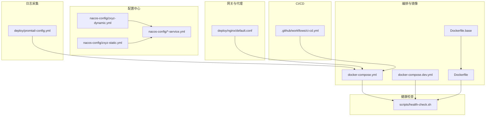
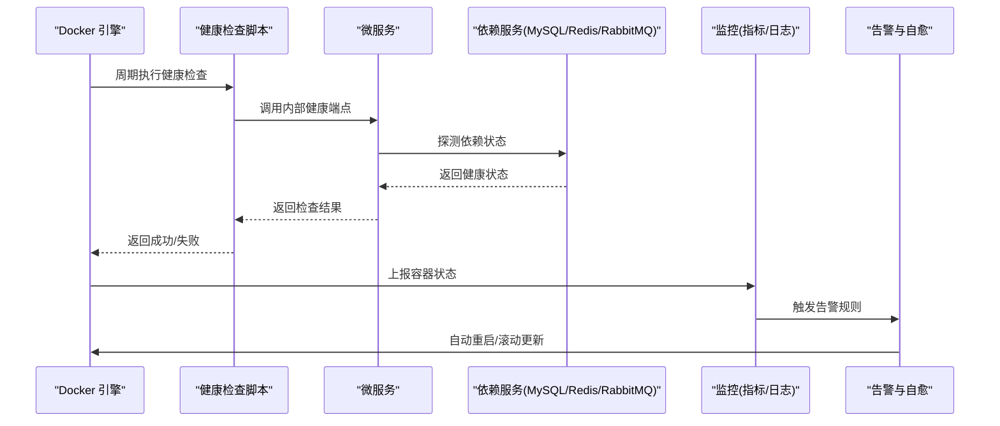
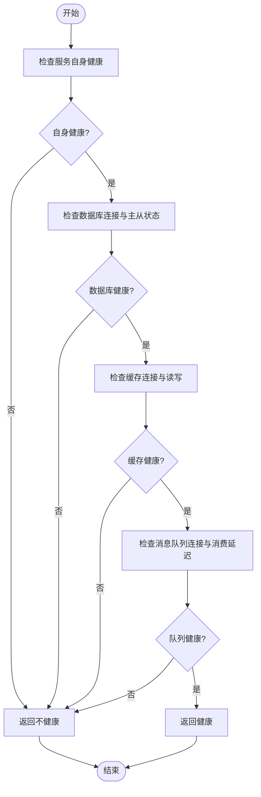
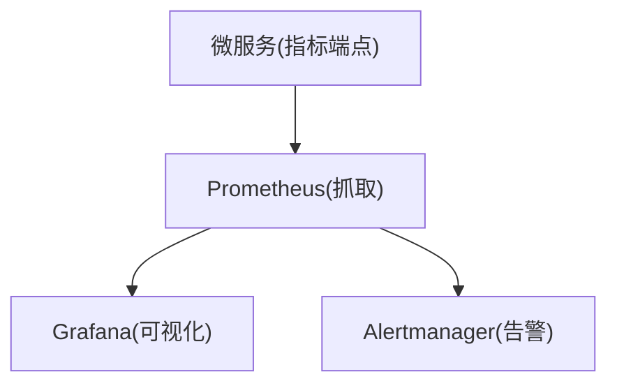
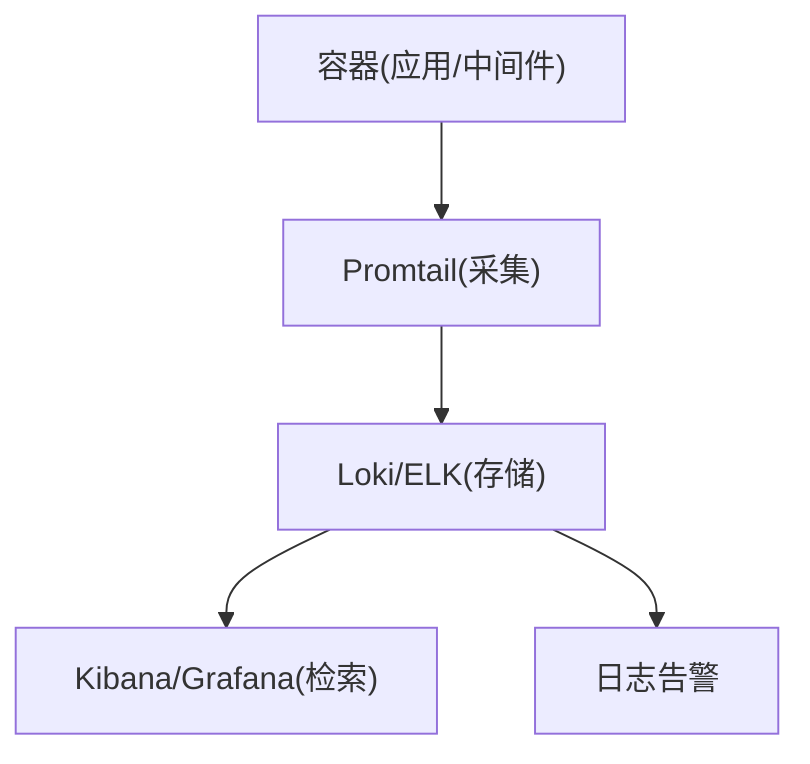
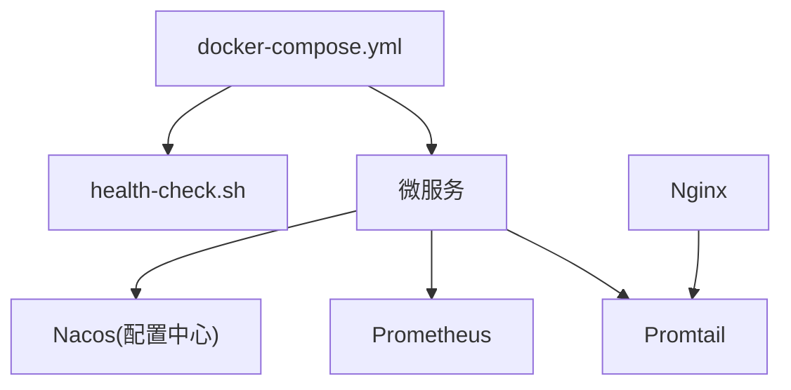

# 容器健康检查与监控

<cite>
**本文引用的文件**   
- [docker-compose.yml](file://docker-compose.yml)
- [docker-compose.dev.yml](file://docker-compose.dev.yml)
- [Dockerfile](file://ZXYZdatabaseBack/Dockerfile)
- [Dockerfile.base](file://ZXYZdatabaseBack/Dockerfile.base)
- [health-check.sh](file://scripts/health-check.sh)
- [deploy-fast.sh](file://scripts/deploy-fast.sh)
- [promtail-config.yml](file://deploy/promtail-config.yml)
- [nginx/default.conf](file://deploy/nginx/default.conf)
- [nacos-config/zxyz-dynamic.yml](file://nacos-config/zxyz-dynamic.yml)
- [nacos-config/zxyz-static.yml](file://nacos-config/zxyz-static.yml)
- [zxyz-admin-service.yml](file://nacos-config/zxyz-admin-service.yml)
- [zxyz-audit-service.yml](file://nacos-config/zxyz-audit-service.yml)
- [zxyz-email-service.yml](file://nacos-config/zxyz-email-service.yml)
- [zxyz-file-service.yml](file://nacos-config/zxyz-file-service.yml)
- [zxyz-gateway.yml](file://nacos-config/zxyz-gateway.yml)
- [zxyz-im-service.yml](file://nacos-config/zxyz-im-service.yml)
- [zxyz-project-service.yml](file://nacos-config/zxyz-project-service.yml)
- [zxyz-share-service.yml](file://nacos-config/zxyz-share-service.yml)
- [zxyz-team-service.yml](file://nacos-config/zxyz-team-service.yml)
- [zxyz-user-service.yml](file://nacos-config/zxyz-user-service.yml)
- [CI/CD 工作流](file://.github/workflows/ci-cd.yml)
</cite>

## 目录
1. [简介](#简介)
2. [项目结构](#项目结构)
3. [核心组件](#核心组件)
4. [架构总览](#架构总览)
5. [详细组件分析](#详细组件分析)
6. [依赖关系分析](#依赖关系分析)
7. [性能考量](#性能考量)
8. [故障排查指南](#故障排查指南)
9. [结论](#结论)
10. [附录](#附录)

## 简介
本文件面向 ZXYZ 项目的运维与研发人员，系统化阐述容器健康检查与监控方案。内容覆盖：
- Docker healthcheck 配置与自定义探针脚本
- MySQL 主从状态、Redis 可用性、RabbitMQ 连接验证等关键依赖的健康探测
- Prometheus 指标暴露、告警规则与性能监控
- 日志收集与分析（ELK/EFK 栈集成、日志聚合与错误追踪）
- 容器资源监控（CPU、内存、磁盘使用率）与告警
- 故障自愈机制（自动重启、服务降级、熔断策略）

## 项目结构
本项目采用微服务架构，后端为多 Maven 模块，前端为 Vue 应用，通过 Nacos 进行配置与服务治理，使用 Docker Compose 编排容器，结合 CI/CD 完成构建与发布。与健康检查和监控相关的核心位置包括：
- 编排与镜像定义：docker-compose.yml、docker-compose.dev.yml、Dockerfile、Dockerfile.base
- 健康检查脚本：scripts/health-check.sh
- 日志采集：deploy/promtail-config.yml
- 网关与反向代理：deploy/nginx/default.conf
- 动态与静态配置：nacos-config/*.yml
- 部署与发布：.github/workflows/ci-cd.yml

图表来源
- [docker-compose.yml](file://docker-compose.yml)
- [docker-compose.dev.yml](file://docker-compose.dev.yml)
- [Dockerfile](file://ZXYZdatabaseBack/Dockerfile)
- [Dockerfile.base](file://ZXYZdatabaseBack/Dockerfile.base)
- [health-check.sh](file://scripts/health-check.sh)
- [promtail-config.yml](file://deploy/promtail-config.yml)
- [nginx/default.conf](file://deploy/nginx/default.conf)
- [nacos-config/zxyz-dynamic.yml](file://nacos-config/zxyz-dynamic.yml)
- [nacos-config/zxyz-static.yml](file://nacos-config/zxyz-static.yml)
- [.github/workflows/ci-cd.yml](file://.github/workflows/ci-cd.yml)

章节来源
- [docker-compose.yml](file://docker-compose.yml)
- [docker-compose.dev.yml](file://docker-compose.dev.yml)
- [Dockerfile](file://ZXYZdatabaseBack/Dockerfile)
- [Dockerfile.base](file://ZXYZdatabaseBack/Dockerfile.base)
- [health-check.sh](file://scripts/health-check.sh)
- [promtail-config.yml](file://deploy/promtail-config.yml)
- [nginx/default.conf](file://deploy/nginx/default.conf)
- [nacos-config/zxyz-dynamic.yml](file://nacos-config/zxyz-dynamic.yml)
- [nacos-config/zxyz-static.yml](file://nacos-config/zxyz-static.yml)
- [.github/workflows/ci-cd.yml](file://.github/workflows/ci-cd.yml)

## 核心组件
- 容器健康检查
  - Docker healthcheck 用于周期性探测容器进程健康状态，失败时触发重启或标记不健康。
  - 自定义健康检查脚本 health-check.sh 可封装业务逻辑与依赖服务状态验证，统一返回成功或失败码。
- 依赖服务健康探针
  - MySQL：检查主从复制状态、读写分离可用性、连接池健康。
  - Redis：检查连接、键值读写、缓存命中率。
  - RabbitMQ：检查连接、队列消费延迟、死信队列堆积。
- 监控与指标
  - 各服务暴露 Prometheus 指标端点（如 /actuator/prometheus），由 Prometheus 抓取。
  - 基于指标定义告警规则（CPU、内存、磁盘、错误率、延迟）。
- 日志采集与分析
  - 使用 Promtail + Loki/ELK 进行日志聚合；Promtail 按容器标签采集标准输出与文件日志。
  - 统一日志格式与结构化字段，便于错误追踪与根因分析。
- 资源监控与告警
  - 监控 CPU、内存、磁盘 I/O、网络带宽等系统指标。
  - 设置阈值告警，联动通知渠道（邮件、企业微信、钉钉等）。
- 故障自愈
  - 自动重启：Docker restart policy 与 healthcheck 配合。
  - 服务降级：关键依赖不可用时切换降级路径（只读模式、本地缓存、默认响应）。
  - 熔断策略：对下游调用启用熔断器，避免雪崩。

章节来源
- [health-check.sh](file://scripts/health-check.sh)
- [docker-compose.yml](file://docker-compose.yml)
- [docker-compose.dev.yml](file://docker-compose.dev.yml)
- [Dockerfile](file://ZXYZdatabaseBack/Dockerfile)
- [Dockerfile.base](file://ZXYZdatabaseBack/Dockerfile.base)
- [promtail-config.yml](file://deploy/promtail-config.yml)
- [nginx/default.conf](file://deploy/nginx/default.conf)
- [nacos-config/zxyz-dynamic.yml](file://nacos-config/zxyz-dynamic.yml)
- [nacos-config/zxyz-static.yml](file://nacos-config/zxyz-static.yml)

## 架构总览
整体监控与自愈流程如下：
- 容器层：Docker healthcheck 定期执行健康检查脚本，结果影响容器状态。
- 服务层：各微服务暴露指标与内部健康端点，供外部监控系统抓取。
- 采集层：Prometheus 抓取指标，Promtail 采集日志，Nginx 记录访问日志。
- 存储与展示：Loki/ELK 存储日志，Grafana/Prometheus UI 可视化。
- 告警与自愈：告警规则触发通知，编排层根据健康状态自动重启或滚动更新。

图表来源
- [docker-compose.yml](file://docker-compose.yml)
- [health-check.sh](file://scripts/health-check.sh)
- [promtail-config.yml](file://deploy/promtail-config.yml)
- [nginx/default.conf](file://deploy/nginx/default.conf)

## 详细组件分析

### 容器健康检查与自定义探针
- Docker healthcheck 配置要点
  - 间隔时间、超时时间、重试次数需合理设置，避免误判与频繁重启。
  - 建议将健康检查命令指向健康检查脚本，以便集中管理业务逻辑。
- 自定义健康检查脚本
  - 校验服务自身健康（如 Spring Boot Actuator /actuator/health）。
  - 校验依赖服务（MySQL、Redis、RabbitMQ）连通性与关键状态。
  - 返回明确的退出码（0 表示健康，非 0 表示不健康）。
- 业务逻辑检查
  - 关键表查询、缓存写入、消息发送与消费延迟检测。
  - 对外部第三方接口的快速探测（超时短、失败快速返回）。

图表来源
- [health-check.sh](file://scripts/health-check.sh)

章节来源
- [health-check.sh](file://scripts/health-check.sh)
- [docker-compose.yml](file://docker-compose.yml)
- [docker-compose.dev.yml](file://docker-compose.dev.yml)

### MySQL 主从状态检查
- 健康探针关注点
  - 主库连接与写操作可用性。
  - 从库连接与读操作可用性。
  - 主从复制延迟（Seconds_Behind_Master）与线程状态。
- 检查策略
  - 定时执行 SHOW SLAVE STATUS 或相关视图，判断复制是否滞后。
  - 若从库延迟超过阈值，标记为不健康并触发告警。
- 恢复策略
  - 自动重连与重试，必要时切换只读路由至主库。

章节来源
- [health-check.sh](file://scripts/health-check.sh)
- [nacos-config/zxyz-dynamic.yml](file://nacos-config/zxyz-dynamic.yml)

### Redis 可用性检测
- 健康探针关注点
  - 连接建立、PING 响应、SET/GET 读写。
  - 内存使用率、慢查询、持久化状态。
- 检查策略
  - 周期性 PING 与简单读写，统计成功率与延迟。
  - 内存超阈值时标记不健康并告警。
- 恢复策略
  - 自动重连与限流，必要时切换到备用集群或降级到本地缓存。

章节来源
- [health-check.sh](file://scripts/health-check.sh)
- [nacos-config/zxyz-dynamic.yml](file://nacos-config/zxyz-dynamic.yml)

### RabbitMQ 连接验证
- 健康探针关注点
  - 连接建立、队列存在性、消费者活跃状态。
  - 消息堆积、死信队列长度、消费延迟。
- 检查策略
  - 尝试声明队列并发送测试消息，确认消费链路通畅。
  - 监控队列长度与消费速率，异常时告警。
- 恢复策略
  - 自动重连与重试，必要时暂停生产或走降级通道。

章节来源
- [health-check.sh](file://scripts/health-check.sh)
- [nacos-config/zxyz-dynamic.yml](file://nacos-config/zxyz-dynamic.yml)

### Prometheus 监控集成
- 指标暴露
  - 各服务暴露 /actuator/prometheus 或自定义指标端点。
  - 指标分类：系统指标、JVM 指标、业务指标（QPS、延迟、错误率）。
- 抓取与存储
  - Prometheus 定期抓取指标，存储于 TSDB。
  - 使用 Service Discovery 或静态配置发现目标。
- 告警规则
  - 基于指标定义规则（如 CPU > 80% 持续 5 分钟、错误率 > 5%）。
  - 告警级别与通知渠道配置。
- 可视化
  - Grafana 仪表盘展示关键指标与趋势。

图表来源
- [nacos-config/zxyz-dynamic.yml](file://nacos-config/zxyz-dynamic.yml)
- [nacos-config/zxyz-static.yml](file://nacos-config/zxyz-static.yml)

章节来源
- [nacos-config/zxyz-dynamic.yml](file://nacos-config/zxyz-dynamic.yml)
- [nacos-config/zxyz-static.yml](file://nacos-config/zxyz-static.yml)

### 日志收集与分析（ELK/EFK）
- 采集策略
  - Promtail 采集容器标准输出与文件日志，按标签（服务名、实例、环境）组织。
  - Nginx 访问日志与错误日志纳入采集范围。
- 存储与检索
  - Loki/ELK 存储结构化日志，支持高效检索与聚合。
- 错误追踪
  - 统一错误码与堆栈信息，关联请求 ID 实现端到端追踪。
- 分析与告警
  - 基于日志关键字与模式匹配触发告警（如大量 5xx、OOM 错误）。

图表来源
- [promtail-config.yml](file://deploy/promtail-config.yml)
- [nginx/default.conf](file://deploy/nginx/default.conf)

章节来源
- [promtail-config.yml](file://deploy/promtail-config.yml)
- [nginx/default.conf](file://deploy/nginx/default.conf)

### 容器资源监控与告警
- 监控指标
  - CPU 使用率、内存占用、磁盘 I/O、网络带宽、文件描述符。
- 采集方式
  - Node Exporter 或 cAdvisor 采集宿主机与容器指标。
  - Prometheus 统一抓取与存储。
- 告警策略
  - 设置阈值与持续时间，避免抖动误报。
  - 分级告警（警告、严重、致命），联动通知。

章节来源
- [docker-compose.yml](file://docker-compose.yml)
- [docker-compose.dev.yml](file://docker-compose.dev.yml)

### 故障自愈机制
- 自动重启
  - Docker restart policy 与 healthcheck 配合，失败后自动重启。
  - 滚动更新与回滚策略，保证服务连续性。
- 服务降级
  - 依赖不可用时切换到降级路径（只读、缓存、默认响应）。
  - 动态开关控制降级行为。
- 熔断策略
  - 对下游调用启用熔断器，失败率或延迟超阈值时熔断。
  - 半开状态探测恢复，逐步恢复流量。

章节来源
- [docker-compose.yml](file://docker-compose.yml)
- [docker-compose.dev.yml](file://docker-compose.dev.yml)
- [nacos-config/zxyz-dynamic.yml](file://nacos-config/zxyz-dynamic.yml)

## 依赖关系分析
健康检查与监控涉及的多组件依赖关系如下：
- 编排层依赖镜像与脚本，确保容器启动即具备健康检查能力。
- 服务层依赖配置中心（Nacos）获取运行时配置与动态开关。
- 监控层依赖指标端点与日志采集器，形成统一的观测体系。
- 告警与自愈依赖编排层与配置中心，实现自动化处置。

图表来源
- [docker-compose.yml](file://docker-compose.yml)
- [health-check.sh](file://scripts/health-check.sh)
- [nacos-config/zxyz-dynamic.yml](file://nacos-config/zxyz-dynamic.yml)
- [promtail-config.yml](file://deploy/promtail-config.yml)
- [nginx/default.conf](file://deploy/nginx/default.conf)

章节来源
- [docker-compose.yml](file://docker-compose.yml)
- [health-check.sh](file://scripts/health-check.sh)
- [nacos-config/zxyz-dynamic.yml](file://nacos-config/zxyz-dynamic.yml)
- [promtail-config.yml](file://deploy/promtail-config.yml)
- [nginx/default.conf](file://deploy/nginx/default.conf)

## 性能考量
- 健康检查频率与超时
  - 合理设置间隔与超时，避免对服务造成额外压力。
  - 对耗时操作使用异步或采样策略。
- 指标采集开销
  - 控制指标数量与粒度，避免过度采集导致存储与计算压力。
  - 使用直方图与摘要类型优化延迟统计。
- 日志采集与存储
  - 限制日志级别与采样率，避免海量日志影响性能。
  - 使用结构化日志与压缩传输降低带宽消耗。
- 资源隔离与配额
  - 为容器设置 CPU 与内存限制，防止资源争用。
  - 使用命名空间与资源组隔离关键服务。

[本节为通用指导，无需特定文件引用]

## 故障排查指南
- 常见问题定位
  - 容器频繁重启：检查 healthcheck 失败原因与依赖服务状态。
  - 指标缺失：确认指标端点可达与 Prometheus 抓取配置。
  - 日志缺失：检查 Promtail 配置与容器日志输出路径。
- 诊断步骤
  - 查看容器状态与事件日志。
  - 检查服务健康端点与依赖探测结果。
  - 分析指标趋势与日志关键字。
- 恢复措施
  - 重启容器或服务，必要时回滚版本。
  - 调整配置参数与阈值，缓解瞬时压力。

章节来源
- [health-check.sh](file://scripts/health-check.sh)
- [promtail-config.yml](file://deploy/promtail-config.yml)
- [docker-compose.yml](file://docker-compose.yml)

## 结论
通过系统化的健康检查与监控方案，ZXYZ 项目实现了容器级与微服务级的可观测性与自愈能力。结合 Prometheus、Promtail/Nginx 与 Nacos 配置中心，形成了完整的监控、告警与自动化处置闭环。建议在后续迭代中持续优化指标质量、日志结构与告警策略，提升系统的稳定性与可维护性。

[本节为总结，无需特定文件引用]

## 附录
- 部署与发布
  - CI/CD 工作流负责选择性构建与镜像推送，确保变更可控与可追溯。
- 配置管理
  - Nacos 提供动态配置与服务注册，支持热更新与灰度发布。
- 参考脚本
  - deploy-fast.sh 提供快速部署与回滚能力，便于紧急修复。

章节来源
- [.github/workflows/ci-cd.yml](file://.github/workflows/ci-cd.yml)
- [deploy-fast.sh](file://scripts/deploy-fast.sh)
- [nacos-config/zxyz-dynamic.yml](file://nacos-config/zxyz-dynamic.yml)
- [nacos-config/zxyz-static.yml](file://nacos-config/zxyz-static.yml)