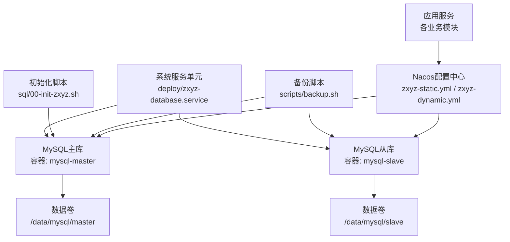
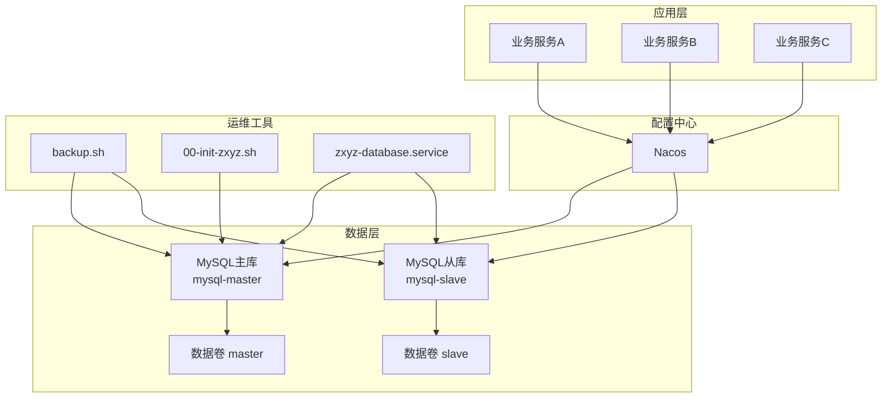
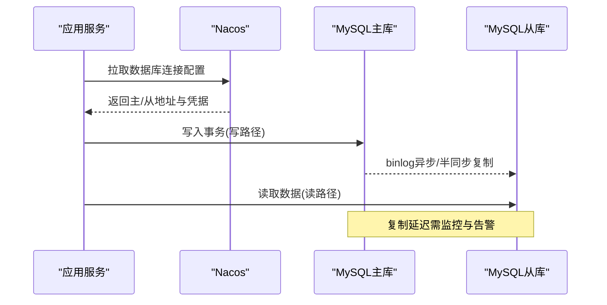
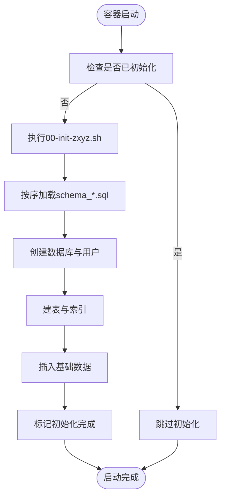
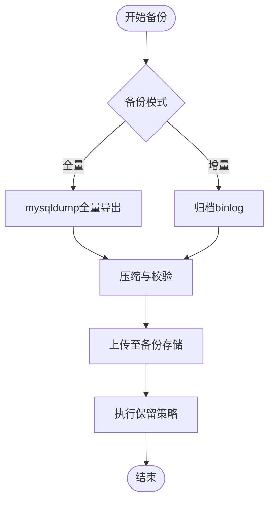
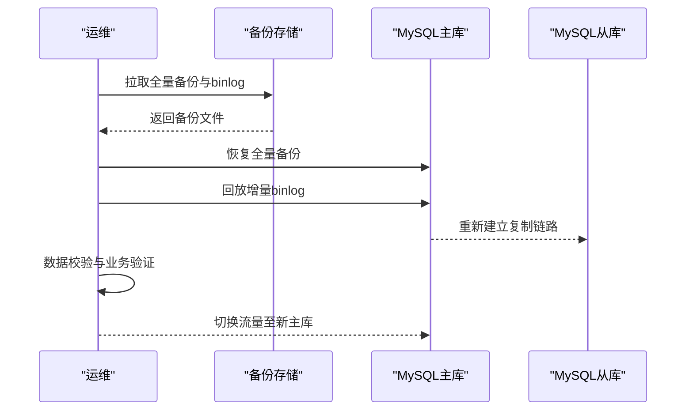
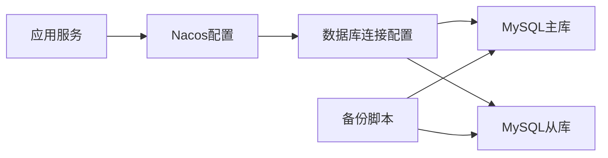

# MySQL数据持久化

<cite>
**本文档引用的文件**   
- [docker-compose.yml](file://docker-compose.yml)
- [docker-compose.dev.yml](file://docker-compose.dev.yml)
- [deploy/zxyz-database.service](file://deploy/zxyz-database.service)
- [scripts/backup.sh](file://scripts/backup.sh)
- [sql/00-init-zxyz.sh](file://sql/00-init-zxyz.sh)
- [ZXYZdatabaseBack/sql/schema_user.sql](file://ZXYZdatabaseBack/sql/schema_user.sql)
- [ZXYZdatabaseBack/sql/schema_project.sql](file://ZXYZdatabaseBack/sql/schema_project.sql)
- [ZXYZdatabaseBack/sql/schema_file.sql](file://ZXYZdatabaseBack/sql/schema_file.sql)
- [ZXYZdatabaseBack/sql/schema_im.sql](file://ZXYZdatabaseBack/sql/schema_im.sql)
- [ZXYZdatabaseBack/sql/schema_team.sql](file://ZXYZdatabaseBack/sql/schema_team.sql)
- [ZXYZdatabaseBack/sql/schema_email.sql](file://ZXYZdatabaseBack/sql/schema_email.sql)
- [ZXYZdatabaseBack/sql/schema_share.sql](file://ZXYZdatabaseBack/sql/schema_share.sql)
- [ZXYZdatabaseBack/sql/schema_audit.sql](file://ZXYZdatabaseBack/sql/schema_audit.sql)
- [nacos-config/zxyz-static.yml](file://nacos-config/zxyz-static.yml)
- [nacos-config/zxyz-dynamic.yml](file://nacos-config/zxyz-dynamic.yml)
- [nacos-config/import.sh](file://nacos-config/import.sh)
- [DEPLOYMENT.md](file://DEPLOYMENT.md)
</cite>

## 目录
1. [简介](#简介)
2. [项目结构](#项目结构)
3. [核心组件](#核心组件)
4. [架构总览](#架构总览)
5. [详细组件分析](#详细组件分析)
6. [依赖关系分析](#依赖关系分析)
7. [性能优化建议](#性能优化建议)
8. [故障排查指南](#故障排查指南)
9. [结论](#结论)
10. [附录](#附录)

## 简介
本文件面向ZXYZ项目的MySQL数据持久化，覆盖容器编排与数据卷挂载、主从复制与同步机制、备份策略与存储空间管理、数据库初始化脚本执行流程与版本管理、全量/增量备份与灾难恢复、性能优化（索引、查询、连接池）、监控告警与安全加固等主题。文档以仓库中的Docker Compose、Nacos配置、部署脚本与SQL脚本为依据，提供可操作的落地方案与最佳实践。

## 项目结构
与MySQL数据持久化直接相关的工程元素包括：
- 容器编排与启动脚本：docker-compose*.yml、zxyz-database.service、backup.sh、00-init-zxyz.sh
- 数据库Schema与迁移：ZXYZdatabaseBack/sql下的schema_*.sql与各服务db/migration下的Vx__*.sql
- 配置中心：nacos-config下的静态与动态配置导入脚本及YAML
- 部署说明：DEPLOYMENT.md

图表来源
- [docker-compose.yml](file://docker-compose.yml)
- [docker-compose.dev.yml](file://docker-compose.dev.yml)
- [deploy/zxyz-database.service](file://deploy/zxyz-database.service)
- [scripts/backup.sh](file://scripts/backup.sh)
- [sql/00-init-zxyz.sh](file://sql/00-init-zxyz.sh)
- [nacos-config/zxyz-static.yml](file://nacos-config/zxyz-static.yml)
- [nacos-config/zxyz-dynamic.yml](file://nacos-config/zxyz-dynamic.yml)

章节来源
- [docker-compose.yml](file://docker-compose.yml)
- [docker-compose.dev.yml](file://docker-compose.dev.yml)
- [deploy/zxyz-database.service](file://deploy/zxyz-database.service)
- [scripts/backup.sh](file://scripts/backup.sh)
- [sql/00-init-zxyz.sh](file://sql/00-init-zxyz.sh)
- [nacos-config/zxyz-static.yml](file://nacos-config/zxyz-static.yml)
- [nacos-config/zxyz-dynamic.yml](file://nacos-config/zxyz-dynamic.yml)

## 核心组件
- MySQL主从集群：通过Docker Compose定义主库与从库容器，使用独立数据卷持久化；主库负责写，从库负责读或备份。
- 数据卷挂载：为master与slave分别映射宿主机目录到容器内数据目录，确保重启不丢数据。
- 初始化脚本：容器启动时执行00-init-zxyz.sh，按顺序加载schema文件完成库表创建与基础数据初始化。
- 备份脚本：backup.sh封装mysqldump逻辑，支持全量备份与按库/按表导出，便于定时任务与灾备演练。
- 配置管理：Nacos集中管理数据库连接参数、连接池与读写分离相关配置，支持热更新。
- 服务编排：systemd单元文件用于在宿主机层面管理MySQL容器的生命周期。

章节来源
- [docker-compose.yml](file://docker-compose.yml)
- [docker-compose.dev.yml](file://docker-compose.dev.yml)
- [deploy/zxyz-database.service](file://deploy/zxyz-database.service)
- [sql/00-init-zxyz.sh](file://sql/00-init-zxyz.sh)
- [scripts/backup.sh](file://scripts/backup.sh)
- [nacos-config/zxyz-static.yml](file://nacos-config/zxyz-static.yml)
- [nacos-config/zxyz-dynamic.yml](file://nacos-config/zxyz-dynamic.yml)

## 架构总览
下图展示ZXYZ的MySQL数据层与周边组件的关系：应用服务通过Nacos获取数据库连接信息，读写分离由客户端或中间件实现；备份与初始化脚本作为运维工具与数据库交互；systemd单元保障容器稳定运行。

图表来源
- [docker-compose.yml](file://docker-compose.yml)
- [docker-compose.dev.yml](file://docker-compose.dev.yml)
- [deploy/zxyz-database.service](file://deploy/zxyz-database.service)
- [scripts/backup.sh](file://scripts/backup.sh)
- [sql/00-init-zxyz.sh](file://sql/00-init-zxyz.sh)
- [nacos-config/zxyz-static.yml](file://nacos-config/zxyz-static.yml)
- [nacos-config/zxyz-dynamic.yml](file://nacos-config/zxyz-dynamic.yml)

## 详细组件分析

### 容器数据卷挂载与主从复制
- 数据卷挂载
  - 主库容器将宿主机的/data/mysql/master映射至容器数据目录，确保数据持久化。
  - 从库容器将宿主机的/data/mysql/slave映射至容器数据目录。
  - 建议在宿主机对数据卷目录设置合理权限与磁盘配额，避免单点占满。
- 主从复制
  - 主库开启binlog并配置server-id，从库通过CHANGE MASTER指向主库，启用复制线程。
  - 推荐半同步复制提升一致性；生产环境建议多从库分担读流量。
  - 网络隔离与防火墙规则需允许主从间端口通信。

图表来源
- [docker-compose.yml](file://docker-compose.yml)
- [docker-compose.dev.yml](file://docker-compose.dev.yml)
- [nacos-config/zxyz-static.yml](file://nacos-config/zxyz-static.yml)
- [nacos-config/zxyz-dynamic.yml](file://nacos-config/zxyz-dynamic.yml)

章节来源
- [docker-compose.yml](file://docker-compose.yml)
- [docker-compose.dev.yml](file://docker-compose.dev.yml)

### 数据库初始化脚本执行流程与版本管理
- 初始化流程
  - 容器首次启动时执行00-init-zxyz.sh，该脚本依次加载ZXYZdatabaseBack/sql下的schema_*.sql文件，完成库、表、索引与基础数据的创建。
  - 建议按领域拆分schema文件，保证变更可追溯与回滚可控。
- 版本管理
  - 每个服务维护db/migration目录下的Vx__*.sql迁移脚本，遵循“版本号+描述”命名规范。
  - 建议使用Flyway/Liquibase等迁移工具统一执行，确保多实例一致性与幂等性。

图表来源
- [sql/00-init-zxyz.sh](file://sql/00-init-zxyz.sh)
- [ZXYZdatabaseBack/sql/schema_user.sql](file://ZXYZdatabaseBack/sql/schema_user.sql)
- [ZXYZdatabaseBack/sql/schema_project.sql](file://ZXYZdatabaseBack/sql/schema_project.sql)
- [ZXYZdatabaseBack/sql/schema_file.sql](file://ZXYZdatabaseBack/sql/schema_file.sql)
- [ZXYZdatabaseBack/sql/schema_im.sql](file://ZXYZdatabaseBack/sql/schema_im.sql)
- [ZXYZdatabaseBack/sql/schema_team.sql](file://ZXYZdatabaseBack/sql/schema_team.sql)
- [ZXYZdatabaseBack/sql/schema_email.sql](file://ZXYZdatabaseBack/sql/schema_email.sql)
- [ZXYZdatabaseBack/sql/schema_share.sql](file://ZXYZdatabaseBack/sql/schema_share.sql)
- [ZXYZdatabaseBack/sql/schema_audit.sql](file://ZXYZdatabaseBack/sql/schema_audit.sql)

章节来源
- [sql/00-init-zxyz.sh](file://sql/00-init-zxyz.sh)
- [ZXYZdatabaseBack/sql/schema_user.sql](file://ZXYZdatabaseBack/sql/schema_user.sql)
- [ZXYZdatabaseBack/sql/schema_project.sql](file://ZXYZdatabaseBack/sql/schema_project.sql)
- [ZXYZdatabaseBack/sql/schema_file.sql](file://ZXYZdatabaseBack/sql/schema_file.sql)
- [ZXYZdatabaseBack/sql/schema_im.sql](file://ZXYZdatabaseBack/sql/schema_im.sql)
- [ZXYZdatabaseBack/sql/schema_team.sql](file://ZXYZdatabaseBack/sql/schema_team.sql)
- [ZXYZdatabaseBack/sql/schema_email.sql](file://ZXYZdatabaseBack/sql/schema_email.sql)
- [ZXYZdatabaseBack/sql/schema_share.sql](file://ZXYZdatabaseBack/sql/schema_share.sql)
- [ZXYZdatabaseBack/sql/schema_audit.sql](file://ZXYZdatabaseBack/sql/schema_audit.sql)

### 备份策略与存储空间管理
- 全量备份
  - 使用mysqldump进行全量导出，建议压缩归档并上传至对象存储或异地备份盘。
  - 备份前记录GTID或binlog位置，便于后续增量恢复。
- 增量备份
  - 基于binlog的增量备份，定期归档binlog文件，结合全量备份可实现任意时间点恢复。
- 存储空间管理
  - 监控数据卷使用率，设置阈值告警；清理过期备份文件，保留策略按RPO/RTO制定。
  - 对大表与历史数据进行归档或冷热分层，控制主库体积增长。

图表来源
- [scripts/backup.sh](file://scripts/backup.sh)

章节来源
- [scripts/backup.sh](file://scripts/backup.sh)

### 灾难恢复流程
- 恢复目标
  - RPO：根据备份频率确定最大可接受数据丢失窗口。
  - RTO：根据恢复步骤复杂度与自动化程度确定恢复时长。
- 恢复步骤
  - 选择最近的全量备份与对应时间点的增量binlog。
  - 先恢复全量，再回放增量binlog至目标时间点。
  - 验证数据一致性与业务可用性后切换流量。

图表来源
- [scripts/backup.sh](file://scripts/backup.sh)

章节来源
- [scripts/backup.sh](file://scripts/backup.sh)

### 监控告警与安全保护
- 监控指标
  - 连接数、慢查询、锁等待、复制延迟、磁盘I/O、缓冲池命中率。
  - 通过Prometheus + Grafana采集MySQL Exporter指标，设置阈值告警。
- 安全加固
  - 最小权限原则：为每个服务分配独立账号与最小授权。
  - 传输加密：启用SSL/TLS连接；敏感配置通过Jasypt加密并在Nacos中管理。
  - 访问控制：限制数据库端口仅对内网开放，启用审计日志。

章节来源
- [nacos-config/zxyz-static.yml](file://nacos-config/zxyz-static.yml)
- [nacos-config/zxyz-dynamic.yml](file://nacos-config/zxyz-dynamic.yml)
- [nacos-config/import.sh](file://nacos-config/import.sh)

## 依赖关系分析
- 容器与服务依赖
  - 应用服务依赖Nacos提供的数据库连接配置。
  - MySQL主从依赖网络连通与端口开放。
  - 备份脚本依赖mysqldump与外部存储。
- 配置依赖
  - Nacos静态配置包含数据库URL、用户名、密码、连接池参数。
  - 动态配置支持运行时调整连接池大小、超时与重试策略。

图表来源
- [nacos-config/zxyz-static.yml](file://nacos-config/zxyz-static.yml)
- [nacos-config/zxyz-dynamic.yml](file://nacos-config/zxyz-dynamic.yml)
- [nacos-config/import.sh](file://nacos-config/import.sh)
- [docker-compose.yml](file://docker-compose.yml)
- [docker-compose.dev.yml](file://docker-compose.dev.yml)

章节来源
- [nacos-config/zxyz-static.yml](file://nacos-config/zxyz-static.yml)
- [nacos-config/zxyz-dynamic.yml](file://nacos-config/zxyz-dynamic.yml)
- [nacos-config/import.sh](file://nacos-config/import.sh)
- [docker-compose.yml](file://docker-compose.yml)
- [docker-compose.dev.yml](file://docker-compose.dev.yml)

## 性能优化建议
- 索引优化
  - 针对高频查询条件建立合适索引，避免过度索引导致写放大。
  - 使用EXPLAIN分析执行计划，消除全表扫描与临时表。
- 查询优化
  - 减少SELECT *，按需投影字段；分页查询使用游标或延迟关联。
  - 合并小事务，避免长事务占用锁资源。
- 连接池配置
  - 根据并发与响应时间调整最大连接数、空闲回收与超时时间。
  - 读写分离场景下，读连接池与写连接池分开配置，避免互相抢占。
- 存储与I/O
  - 合理划分表空间，热点表单独表空间；SSD优先用于热数据。
  - 调整innodb_buffer_pool_size与redo log大小，匹配内存与负载。

[本节为通用性能指导，不直接分析具体文件]

## 故障排查指南
- 常见故障
  - 主从复制中断：检查网络、认证、binlog位置与GTID一致性。
  - 备份失败：确认mysqldump权限、磁盘空间与网络连通性。
  - 初始化失败：核对schema文件顺序与字符集、排序规则。
- 排查步骤
  - 查看容器日志与系统日志，定位错误堆栈。
  - 使用SHOW PROCESSLIST与慢查询日志定位阻塞与慢SQL。
  - 校验备份文件完整性与可恢复性，进行演练恢复。

章节来源
- [deploy/zxyz-database.service](file://deploy/zxyz-database.service)
- [scripts/backup.sh](file://scripts/backup.sh)
- [sql/00-init-zxyz.sh](file://sql/00-init-zxyz.sh)

## 结论
ZXYZ项目的MySQL数据持久化通过容器化编排、数据卷挂载、主从复制与完善的备份恢复机制，构建了高可用与可恢复的数据层。配合Nacos集中配置与系统级服务管理，实现了灵活、安全的运维体系。在生产环境中，应持续优化索引与查询、完善监控告警与安全加固，并定期进行灾备演练以确保RPO/RTO目标达成。

[本节为总结性内容，不直接分析具体文件]

## 附录
- 部署参考
  - 参考DEPLOYMENT.md了解整体部署流程与环境准备。
- 配置导入
  - 使用nacos-config/import.sh将静态与动态配置导入Nacos，确保服务启动即生效。

章节来源
- [DEPLOYMENT.md](file://DEPLOYMENT.md)
- [nacos-config/import.sh](file://nacos-config/import.sh)