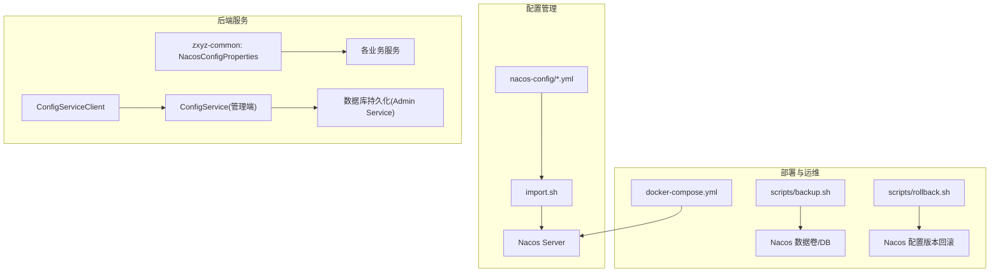
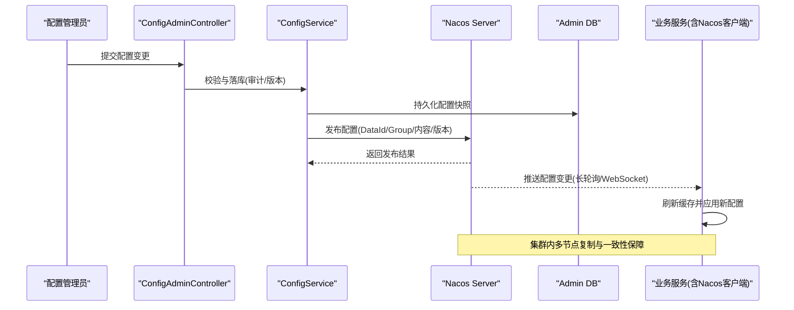
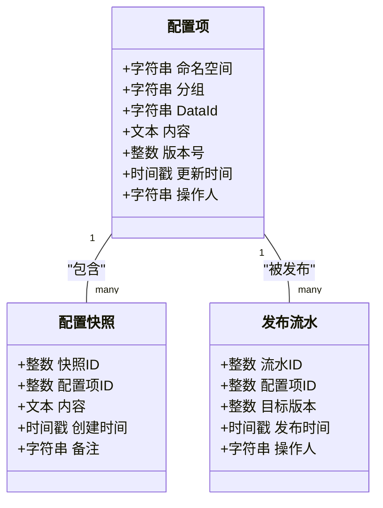
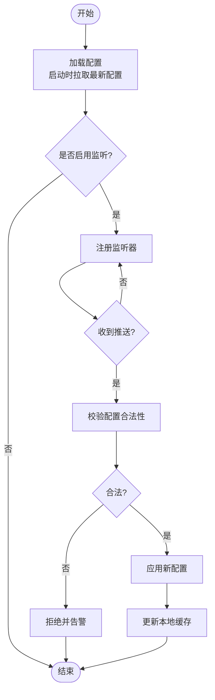
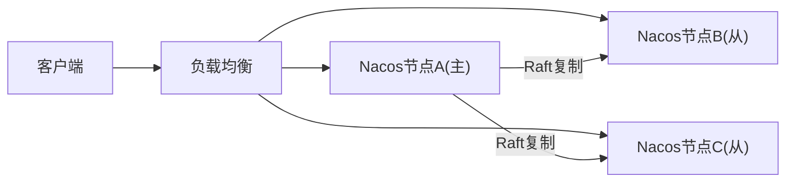
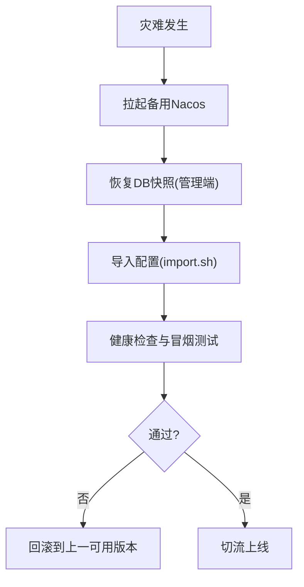
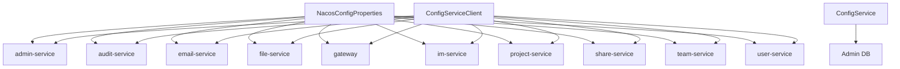

# Nacos数据持久化

<cite>
**本文引用的文件**   
- [nacos-config/zxyz-dynamic.yml](file://nacos-config/zxyz-dynamic.yml)
- [nacos-config/zxyz-static.yml](file://nacos-config/zxyz-static.yml)
- [nacos-config/zxyz-admin-service.yml](file://nacos-config/zxyz-admin-service.yml)
- [nacos-config/zxyz-audit-service.yml](file://nacos-config/zxyz-audit-service.yml)
- [nacos-config/zxyz-email-service.yml](file://nacos-config/zxyz-email-service.yml)
- [nacos-config/zxyz-file-service.yml](file://nacos-config/zxyz-file-service.yml)
- [nacos-config/zxyz-gateway.yml](file://nacos-config/zxyz-gateway.yml)
- [nacos-config/zxyz-im-service.yml](file://nacos-config/zxyz-im-service.yml)
- [nacos-config/zxyz-project-service.yml](file://nacos-config/zxyz-project-service.yml)
- [nacos-config/zxyz-share-service.yml](file://nacos-config/zxyz-share-service.yml)
- [nacos-config/zxyz-team-service.yml](file://nacos-config/zxyz-team-service.yml)
- [nacos-config/zxyz-user-service.yml](file://nacos-config/zxyz-user-service.yml)
- [nacos-config/import.sh](file://nacos-config/import.sh)
- [ZXYZdatabaseBack/zxyz-admin-service/src/main/java/uno/acloud/admin/config/ConfigDataSourceConfig.java](file://ZXYZdatabaseBack/zxyz-admin-service/src/main/java/uno/acloud/admin/config/ConfigDataSourceConfig.java)
- [ZXYZdatabaseBack/zxyz-admin-service/src/main/java/uno/acloud/admin/controller/ConfigAdminController.java](file://ZXYZdatabaseBack/zxyz-admin-service/src/main/java/uno/acloud/admin/controller/ConfigAdminController.java)
- [ZXYZdatabaseBack/zxyz-admin-service/src/main/java/uno/acloud/admin/service/ConfigService.java](file://ZXYZdatabaseBack/zxyz-admin-service/src/main/java/uno/acloud/admin/service/ConfigService.java)
- [ZXYZdatabaseBack/zxyz-admin-service/src/main/resources/db/migration/V1__init_config_schema.sql](file://ZXYZdatabaseBack/zxyz-admin-service/src/main/resources/db/migration/V1__init_config_schema.sql)
- [ZXYZdatabaseBack/zxyz-admin-service/src/main/resources/db/migration/V2__hot_config_keys.sql](file://ZXYZdatabaseBack/zxyz-admin-service/src/main/resources/db/migration/V2__hot_config_keys.sql)
- [ZXYZdatabaseBack/zxyz-admin-service/src/main/resources/db/migration/V3__fix_config_keys.sql](file://ZXYZdatabaseBack/zxyz-admin-service/src/main/resources/db/migration/V3__fix_config_keys.sql)
- [ZXYZdatabaseBack/zxyz-common/src/main/java/uno/acloud/common/config/NacosConfigProperties.java](file://ZXYZdatabaseBack/zxyz-common/src/main/java/uno/acloud/common/config/NacosConfigProperties.java)
- [ZXYZdatabaseBack/zxyz-common/src/main/java/uno/acloud/client/ConfigServiceClient.java](file://ZXYZdatabaseBack/zxyz-common/src/main/java/uno/acloud/client/ConfigServiceClient.java)
- [docker-compose.yml](file://docker-compose.yml)
- [scripts/backup.sh](file://scripts/backup.sh)
- [scripts/rollback.sh](file://scripts/rollback.sh)
- [deploy/nginx/default.conf](file://deploy/nginx/default.conf)
</cite>

## 目录
1. [简介](#简介)
2. [项目结构](#项目结构)
3. [核心组件](#核心组件)
4. [架构总览](#架构总览)
5. [详细组件分析](#详细组件分析)
6. [依赖关系分析](#依赖关系分析)
7. [性能考量](#性能考量)
8. [故障排查指南](#故障排查指南)
9. [结论](#结论)
10. [附录](#附录)

## 简介
本文件面向ZXYZ项目的Nacos配置中心，聚焦“数据持久化”主题，系统性说明：
- 配置数据的存储机制与版本管理策略
- 动态配置与静态配置的差异、热更新与历史回滚
- 集群模式下的数据同步与一致性保证
- 配置备份恢复方案（导出导入、批量操作、灾难恢复）
- 配置安全加密与权限控制

文档同时结合项目中的Nacos配置文件、管理端实现与运维脚本，给出可落地的实践建议。

## 项目结构
本项目通过nacos-config目录集中维护各服务的Nacos命名空间与DataId配置，并通过import.sh进行统一导入；后端服务通过zxyz-common中的Nacos相关属性类接入；管理端提供配置管理能力；部署编排由docker-compose.yml完成。

图表来源
- [nacos-config/zxyz-dynamic.yml](file://nacos-config/zxyz-dynamic.yml)
- [nacos-config/zxyz-static.yml](file://nacos-config/zxyz-static.yml)
- [nacos-config/import.sh](file://nacos-config/import.sh)
- [ZXYZdatabaseBack/zxyz-common/src/main/java/uno/acloud/common/config/NacosConfigProperties.java](file://ZXYZdatabaseBack/zxyz-common/src/main/java/uno/acloud/common/config/NacosConfigProperties.java)
- [ZXYZdatabaseBack/zxyz-common/src/main/java/uno/acloud/client/ConfigServiceClient.java](file://ZXYZdatabaseBack/zxyz-common/src/main/java/uno/acloud/client/ConfigServiceClient.java)
- [docker-compose.yml](file://docker-compose.yml)
- [scripts/backup.sh](file://scripts/backup.sh)
- [scripts/rollback.sh](file://scripts/rollback.sh)

章节来源
- [nacos-config/zxyz-dynamic.yml](file://nacos-config/zxyz-dynamic.yml)
- [nacos-config/zxyz-static.yml](file://nacos-config/zxyz-static.yml)
- [nacos-config/import.sh](file://nacos-config/import.sh)
- [docker-compose.yml](file://docker-compose.yml)

## 核心组件
- Nacos配置集
  - 动态配置：按服务维度拆分DataId（如 zxyz-xxx-service.yml），用于运行时可调参数、开关等。
  - 静态配置：公共或全局配置（如 zxyz-static.yml），变更频率低，适合基础环境信息。
- 配置接入层
  - NacosConfigProperties：统一封装Nacos连接、命名空间、分组、超时等属性。
  - ConfigServiceClient：对配置中心的客户端调用封装，屏蔽底层差异。
- 配置管理端
  - ConfigService / ConfigAdminController：提供配置的增删改查、版本查询、灰度发布能力。
  - 本地持久化：通过ConfigDataSourceConfig将关键配置写入自有数据库，便于审计与回滚。
- 运维脚本
  - import.sh：批量导入nacos-config到Nacos。
  - backup.sh：导出Nacos配置与数据快照。
  - rollback.sh：基于版本信息进行配置回滚。

章节来源
- [ZXYZdatabaseBack/zxyz-common/src/main/java/uno/acloud/common/config/NacosConfigProperties.java](file://ZXYZdatabaseBack/zxyz-common/src/main/java/uno/acloud/common/config/NacosConfigProperties.java)
- [ZXYZdatabaseBack/zxyz-common/src/main/java/uno/acloud/client/ConfigServiceClient.java](file://ZXYZdatabaseBack/zxyz-common/src/main/java/uno/acloud/client/ConfigServiceClient.java)
- [ZXYZdatabaseBack/zxyz-admin-service/src/main/java/uno/acloud/admin/service/ConfigService.java](file://ZXYZdatabaseBack/zxyz-admin-service/src/main/java/uno/acloud/admin/service/ConfigService.java)
- [ZXYZdatabaseBack/zxyz-admin-service/src/main/java/uno/acloud/admin/controller/ConfigAdminController.java](file://ZXYZdatabaseBack/zxyz-admin-service/src/main/java/uno/acloud/admin/controller/ConfigAdminController.java)
- [ZXYZdatabaseBack/zxyz-admin-service/src/main/java/uno/acloud/admin/config/ConfigDataSourceConfig.java](file://ZXYZdatabaseBack/zxyz-admin-service/src/main/java/uno/acloud/admin/config/ConfigDataSourceConfig.java)
- [nacos-config/import.sh](file://nacos-config/import.sh)
- [scripts/backup.sh](file://scripts/backup.sh)
- [scripts/rollback.sh](file://scripts/rollback.sh)

## 架构总览
下图展示从配置编辑到服务生效的端到端流程，以及Nacos在集群中的角色。

图表来源
- [ZXYZdatabaseBack/zxyz-admin-service/src/main/java/uno/acloud/admin/controller/ConfigAdminController.java](file://ZXYZdatabaseBack/zxyz-admin-service/src/main/java/uno/acloud/admin/controller/ConfigAdminController.java)
- [ZXYZdatabaseBack/zxyz-admin-service/src/main/java/uno/acloud/admin/service/ConfigService.java](file://ZXYZdatabaseBack/zxyz-admin-service/src/main/java/uno/acloud/admin/service/ConfigService.java)
- [ZXYZdatabaseBack/zxyz-admin-service/src/main/java/uno/acloud/admin/config/ConfigDataSourceConfig.java](file://ZXYZdatabaseBack/zxyz-admin-service/src/main/java/uno/acloud/admin/config/ConfigDataSourceConfig.java)
- [nacos-config/import.sh](file://nacos-config/import.sh)

## 详细组件分析

### 配置存储与版本管理
- 存储位置
  - Nacos Server：作为配置中心主存储，支持按命名空间、分组、DataId组织配置，并提供版本管理与历史回溯。
  - Admin DB：管理端对关键配置变更做本地持久化，便于审计、对比与跨系统回滚。
- 版本机制
  - Nacos内部维护每个配置项的版本号与历史快照，支持按版本查看与回滚。
  - 管理端在发布前生成快照记录，发布成功后关联版本号，形成“发布流水”。
- 数据结构要点
  - 配置项标识：命名空间、分组、DataId、内容、版本、时间戳、操作人。
  - 审计字段：操作类型、变更摘要、前后值差异（可选）。

图表来源
- [ZXYZdatabaseBack/zxyz-admin-service/src/main/resources/db/migration/V1__init_config_schema.sql](file://ZXYZdatabaseBack/zxyz-admin-service/src/main/resources/db/migration/V1__init_config_schema.sql)
- [ZXYZdatabaseBack/zxyz-admin-service/src/main/resources/db/migration/V2__hot_config_keys.sql](file://ZXYZdatabaseBack/zxyz-admin-service/src/main/resources/db/migration/V2__hot_config_keys.sql)
- [ZXYZdatabaseBack/zxyz-admin-service/src/main/resources/db/migration/V3__fix_config_keys.sql](file://ZXYZdatabaseBack/zxyz-admin-service/src/main/resources/db/migration/V3__fix_config_keys.sql)

章节来源
- [ZXYZdatabaseBack/zxyz-admin-service/src/main/resources/db/migration/V1__init_config_schema.sql](file://ZXYZdatabaseBack/zxyz-admin-service/src/main/resources/db/migration/V1__init_config_schema.sql)
- [ZXYZdatabaseBack/zxyz-admin-service/src/main/resources/db/migration/V2__hot_config_keys.sql](file://ZXYZdatabaseBack/zxyz-admin-service/src/main/resources/db/migration/V2__hot_config_keys.sql)
- [ZXYZdatabaseBack/zxyz-admin-service/src/main/resources/db/migration/V3__fix_config_keys.sql](file://ZXYZdatabaseBack/zxyz-admin-service/src/main/resources/db/migration/V3__fix_config_keys.sql)

### 动态配置与静态配置
- 动态配置
  - 典型DataId：按服务划分的 yml 文件（如 zxyz-xxx-service.yml）。
  - 特点：支持热更新，客户端监听变化后即时生效，无需重启。
- 静态配置
  - 典型DataId：zxyz-static.yml，存放不常变的基础配置。
  - 特点：变更频率低，通常配合灰度或分批发布策略。
- 热更新与回滚
  - 热更新：Nacos推送变更后，客户端刷新内存配置；必要时结合本地缓存失效策略。
  - 回滚：通过Nacos历史版本一键回滚，或由管理端触发指定版本发布。

图表来源
- [nacos-config/zxyz-dynamic.yml](file://nacos-config/zxyz-dynamic.yml)
- [nacos-config/zxyz-static.yml](file://nacos-config/zxyz-static.yml)

章节来源
- [nacos-config/zxyz-dynamic.yml](file://nacos-config/zxyz-dynamic.yml)
- [nacos-config/zxyz-static.yml](file://nacos-config/zxyz-static.yml)

### 集群模式的数据同步与一致性
- 集群角色
  - Nacos集群节点间通过Raft协议进行写一致性与选举，读路径支持多副本读取。
- 数据同步
  - 写路径：主节点接收写请求，经Raft复制后提交；其他节点异步同步。
  - 读路径：客户端可通过负载均衡访问任意节点，最终一致性保障。
- 一致性建议
  - 避免跨集群直连；使用统一的命名空间隔离环境。
  - 大配置分片或外部化存储（对象存储）+引用方式，降低网络开销。

图表来源
- [docker-compose.yml](file://docker-compose.yml)

章节来源
- [docker-compose.yml](file://docker-compose.yml)

### 配置备份与恢复
- 导出导入
  - 使用import.sh批量导入nacos-config目录下的yml至Nacos。
  - 通过Nacos控制台或SDK导出配置为JSON/YAML，归档到版本库。
- 批量操作
  - 按命名空间/分组批量导出、批量导入、批量替换占位符。
- 灾难恢复流程
  - 步骤1：准备干净的Nacos环境（容器或独立实例）。
  - 步骤2：恢复数据库快照（若管理端有本地持久化）。
  - 步骤3：执行import.sh导入配置。
  - 步骤4：验证关键服务配置与健康检查。
  - 步骤5：灰度发布与观察期监控。

图表来源
- [nacos-config/import.sh](file://nacos-config/import.sh)
- [scripts/backup.sh](file://scripts/backup.sh)
- [scripts/rollback.sh](file://scripts/rollback.sh)

章节来源
- [nacos-config/import.sh](file://nacos-config/import.sh)
- [scripts/backup.sh](file://scripts/backup.sh)
- [scripts/rollback.sh](file://scripts/rollback.sh)

### 配置安全加密与权限控制
- 敏感配置加密
  - 使用Jasypt对敏感字段加密，密文存入Nacos；运行时解密。
  - 密钥管理：通过环境变量或KMS注入，避免硬编码。
- 权限控制
  - Nacos开启鉴权，按命名空间/分组设置读写权限。
  - 管理端接口受网关SaToken保护，仅内网可达。
- 最佳实践
  - 最小权限原则：服务仅能访问自身DataId。
  - 审计留痕：所有变更需记录操作人与时间。

章节来源
- [ZXYZdatabaseBack/zxyz-admin-service/src/main/java/uno/acloud/admin/controller/ConfigAdminController.java](file://ZXYZdatabaseBack/zxyz-admin-service/src/main/java/uno/acloud/admin/controller/ConfigAdminController.java)
- [deploy/nginx/default.conf](file://deploy/nginx/default.conf)

## 依赖关系分析
- 配置定义依赖
  - 各服务通过zxyz-common的NacosConfigProperties获取连接信息。
  - 业务服务通过ConfigServiceClient访问配置中心。
- 管理端依赖
  - ConfigService负责发布与版本管理，依赖数据库持久化。
- 部署依赖
  - docker-compose编排Nacos与其他基础设施。

图表来源
- [ZXYZdatabaseBack/zxyz-common/src/main/java/uno/acloud/common/config/NacosConfigProperties.java](file://ZXYZdatabaseBack/zxyz-common/src/main/java/uno/acloud/common/config/NacosConfigProperties.java)
- [ZXYZdatabaseBack/zxyz-common/src/main/java/uno/acloud/client/ConfigServiceClient.java](file://ZXYZdatabaseBack/zxyz-common/src/main/java/uno/acloud/client/ConfigServiceClient.java)
- [ZXYZdatabaseBack/zxyz-admin-service/src/main/java/uno/acloud/admin/service/ConfigService.java](file://ZXYZdatabaseBack/zxyz-admin-service/src/main/java/uno/acloud/admin/service/ConfigService.java)

章节来源
- [ZXYZdatabaseBack/zxyz-common/src/main/java/uno/acloud/common/config/NacosConfigProperties.java](file://ZXYZdatabaseBack/zxyz-common/src/main/java/uno/acloud/common/config/NacosConfigProperties.java)
- [ZXYZdatabaseBack/zxyz-common/src/main/java/uno/acloud/client/ConfigServiceClient.java](file://ZXYZdatabaseBack/zxyz-common/src/main/java/uno/acloud/client/ConfigServiceClient.java)
- [ZXYZdatabaseBack/zxyz-admin-service/src/main/java/uno/acloud/admin/service/ConfigService.java](file://ZXYZdatabaseBack/zxyz-admin-service/src/main/java/uno/acloud/admin/service/ConfigService.java)

## 性能考量
- 配置大小与数量
  - 单个配置建议不超过数百KB；热点配置优先使用动态配置，非热点下沉到静态配置或对象存储。
- 客户端缓存
  - 合理设置本地缓存与过期策略，减少频繁拉取。
- 发布节奏
  - 高峰期避免大规模并发发布；采用灰度与分批发布。
- 网络与序列化
  - 压缩传输、选择轻量格式（YAML/JSON），避免大对象。

[本节为通用指导，不直接分析具体文件]

## 故障排查指南
- 常见问题
  - 配置未生效：检查客户端监听是否注册、命名空间/分组是否正确、缓存是否命中。
  - 发布失败：查看Nacos日志、网络连通性、权限与配额限制。
  - 回滚异常：确认目标版本存在且未被删除，核对管理端快照与Nacos版本一致性。
- 定位手段
  - 查看Nacos控制台“配置详情-历史版本”。
  - 检查管理端发布流水与审计日志。
  - 使用backup.sh导出当前配置快照进行比对。

章节来源
- [scripts/backup.sh](file://scripts/backup.sh)
- [scripts/rollback.sh](file://scripts/rollback.sh)
- [ZXYZdatabaseBack/zxyz-admin-service/src/main/java/uno/acloud/admin/controller/ConfigAdminController.java](file://ZXYZdatabaseBack/zxyz-admin-service/src/main/java/uno/acloud/admin/controller/ConfigAdminController.java)

## 结论
通过对Nacos配置中心的数据持久化、版本管理、动态/静态配置差异、集群一致性、备份恢复与安全权限的系统化梳理，ZXYZ项目在配置治理方面具备完善的落地方案。建议在后续演进中持续完善审计、灰度与自动化能力，确保配置变更的可控、可追溯与高可用。

[本节为总结性内容，不直接分析具体文件]

## 附录
- 常用命令与脚本
  - 导入配置：nacos-config/import.sh
  - 备份配置：scripts/backup.sh
  - 回滚配置：scripts/rollback.sh
- 参考配置
  - 动态配置示例：nacos-config/zxyz-dynamic.yml
  - 静态配置示例：nacos-config/zxyz-static.yml
  - 各服务配置：nacos-config/*-service.yml

章节来源
- [nacos-config/import.sh](file://nacos-config/import.sh)
- [scripts/backup.sh](file://scripts/backup.sh)
- [scripts/rollback.sh](file://scripts/rollback.sh)
- [nacos-config/zxyz-dynamic.yml](file://nacos-config/zxyz-dynamic.yml)
- [nacos-config/zxyz-static.yml](file://nacos-config/zxyz-static.yml)
- [nacos-config/zxyz-admin-service.yml](file://nacos-config/zxyz-admin-service.yml)
- [nacos-config/zxyz-audit-service.yml](file://nacos-config/zxyz-audit-service.yml)
- [nacos-config/zxyz-email-service.yml](file://nacos-config/zxyz-email-service.yml)
- [nacos-config/zxyz-file-service.yml](file://nacos-config/zxyz-file-service.yml)
- [nacos-config/zxyz-gateway.yml](file://nacos-config/zxyz-gateway.yml)
- [nacos-config/zxyz-im-service.yml](file://nacos-config/zxyz-im-service.yml)
- [nacos-config/zxyz-project-service.yml](file://nacos-config/zxyz-project-service.yml)
- [nacos-config/zxyz-share-service.yml](file://nacos-config/zxyz-share-service.yml)
- [nacos-config/zxyz-team-service.yml](file://nacos-config/zxyz-team-service.yml)
- [nacos-config/zxyz-user-service.yml](file://nacos-config/zxyz-user-service.yml)