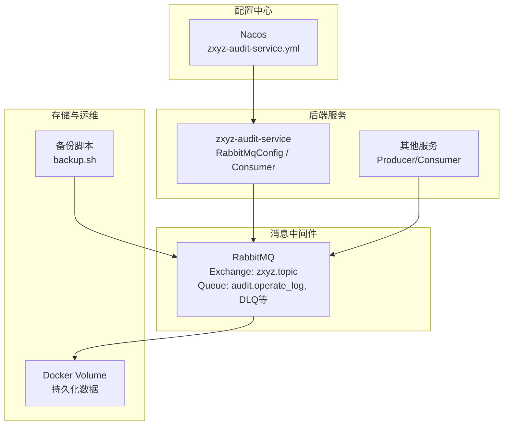
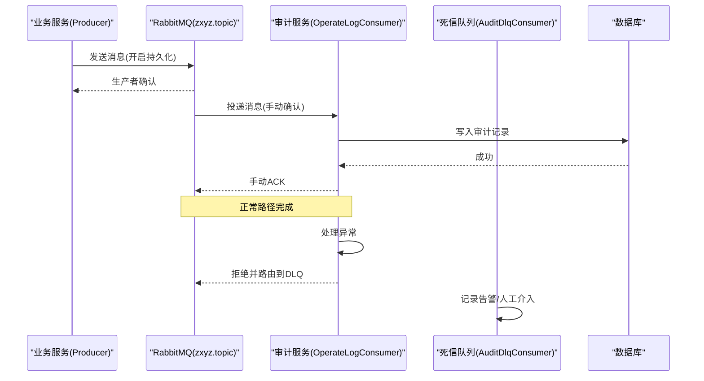
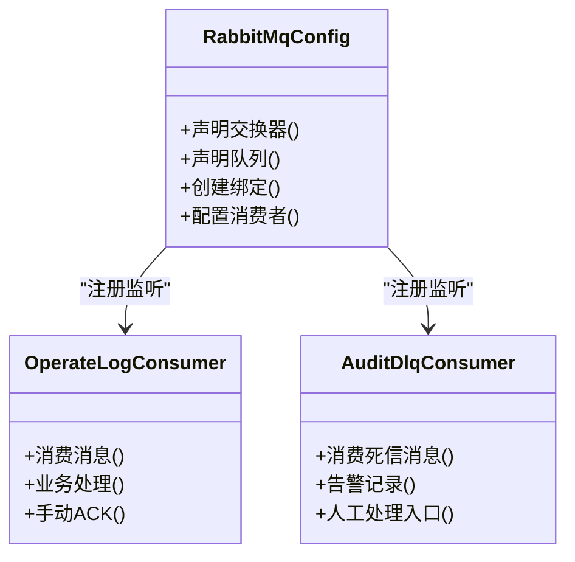
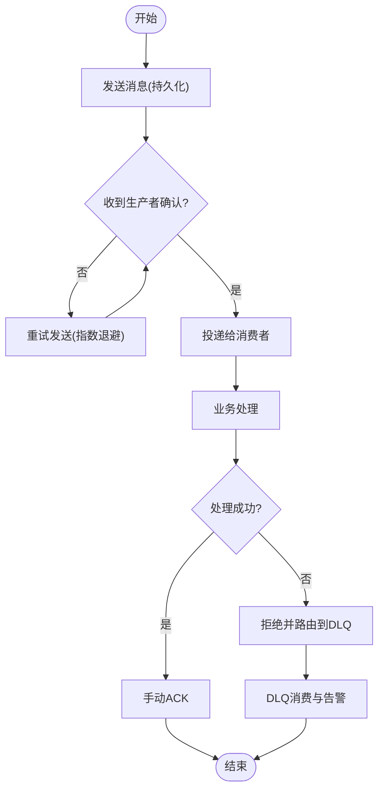
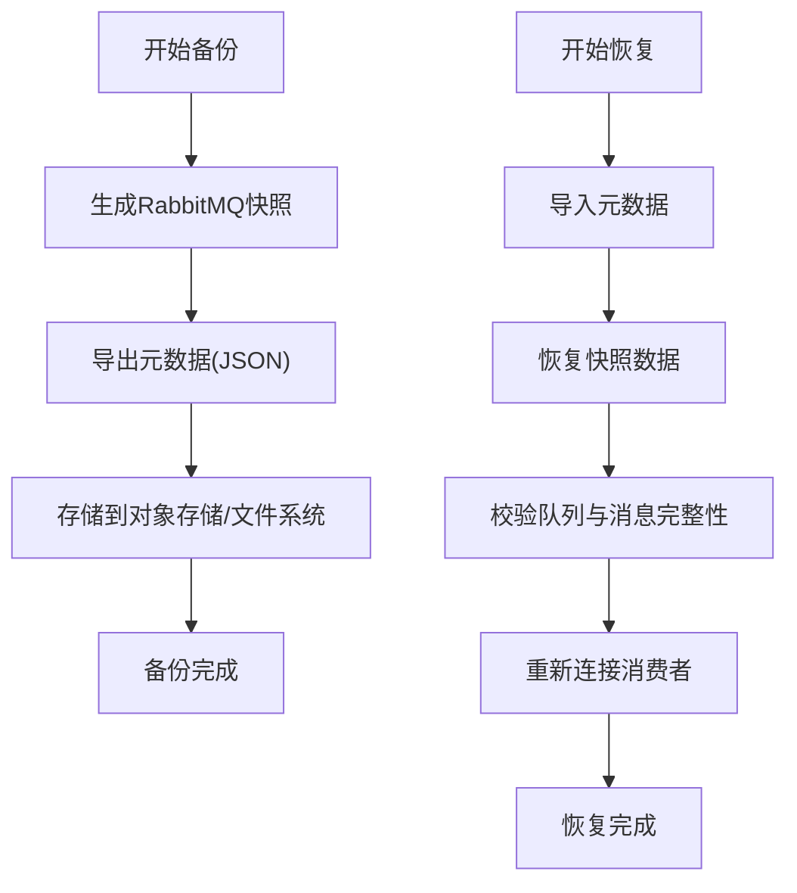
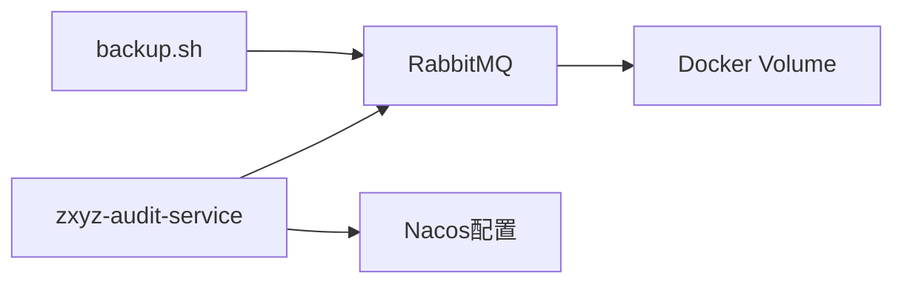

# RabbitMQ数据持久化

<cite>
**本文引用的文件**   
- [zxyz-audit-service/RabbitMqConfig.java](file://ZXYZdatabaseBack/zxyz-audit-service/src/main/java/uno/acloud/audit/config/RabbitMqConfig.java)
- [zxyz-audit-service/AuditDlqConsumer.java](file://ZXYZdatabaseBack/zxyz-audit-service/src/main/java/uno/acloud/audit/mq/AuditDlqConsumer.java)
- [zxyz-audit-service/OperateLogConsumer.java](file://ZXYZdatabaseBack/zxyz-audit-service/src/main/java/uno/acloud/audit/mq/OperateLogConsumer.java)
- [zxyz-common/application-common.yml](file://ZXYZdatabaseBack/zxyz-common/src/main/resources/application-common.yml)
- [nacos-config/zxyz-audit-service.yml](file://nacos-config/zxyz-audit-service.yml)
- [docker-compose.yml](file://docker-compose.yml)
- [scripts/backup.sh](file://scripts/backup.sh)
- [DEPLOYMENT.md](file://DEPLOYMENT.md)
</cite>

## 目录
1. [简介](#简介)
2. [项目结构](#项目结构)
3. [核心组件](#核心组件)
4. [架构总览](#架构总览)
5. [详细组件分析](#详细组件分析)
6. [依赖关系分析](#依赖关系分析)
7. [性能考量与容量规划](#性能考量与容量规划)
8. [故障排查指南](#故障排查指南)
9. [结论](#结论)
10. [附录](#附录)

## 简介
本文件面向ZXYZ项目的RabbitMQ数据持久化配置，聚焦以下目标：
- 队列、消息、交换器的持久化策略与最佳实践
- 生产者确认、消费者确认与死信队列（DLQ）处理机制
- 集群模式下的数据同步与故障转移要点
- 备份恢复方案：镜像队列、元数据备份与消息恢复流程
- 监控指标与容量规划建议

说明：本项目采用微服务架构，异步通信使用RabbitMQ Topic Exchange zxyz.topic。各服务通过Nacos管理配置，部署由Docker Compose编排。审计服务包含RabbitMQ相关配置与消费者实现，是本次文档的核心参考。

## 项目结构
与RabbitMQ相关的代码与配置主要分布在：
- 审计服务（zxyz-audit-service）：RabbitMQ配置类、消费者与死信消费者
- 公共配置（zxyz-common）：通用应用配置
- Nacos配置（nacos-config）：按服务划分的RabbitMQ连接与行为参数
- 基础设施编排（docker-compose.yml）：RabbitMQ容器与卷挂载
- 运维脚本（scripts/backup.sh）：备份与恢复辅助脚本
- 部署说明（DEPLOYMENT.md）：整体部署与运维指引

图表来源
- [zxyz-audit-service/RabbitMqConfig.java](file://ZXYZdatabaseBack/zxyz-audit-service/src/main/java/uno/acloud/audit/config/RabbitMqConfig.java)
- [nacos-config/zxyz-audit-service.yml](file://nacos-config/zxyz-audit-service.yml)
- [docker-compose.yml](file://docker-compose.yml)
- [scripts/backup.sh](file://scripts/backup.sh)

章节来源
- [zxyz-audit-service/RabbitMqConfig.java](file://ZXYZdatabaseBack/zxyz-audit-service/src/main/java/uno/acloud/audit/config/RabbitMqConfig.java)
- [nacos-config/zxyz-audit-service.yml](file://nacos-config/zxyz-audit-service.yml)
- [docker-compose.yml](file://docker-compose.yml)

## 核心组件
- 审计服务RabbitMQ配置：定义连接、交换器、队列、绑定与消费者监听
- 操作日志消费者：消费审计事件并落库
- 死信消费者：处理失败或不可重试的消息
- 公共配置：提供跨服务的通用RabbitMQ基础参数
- Nacos配置：集中化管理各服务的RabbitMQ连接与行为参数
- Docker编排：RabbitMQ容器与数据卷挂载，确保进程重启后数据不丢失

章节来源
- [zxyz-audit-service/RabbitMqConfig.java](file://ZXYZdatabaseBack/zxyz-audit-service/src/main/java/uno/acloud/audit/config/RabbitMqConfig.java)
- [zxyz-audit-service/OperateLogConsumer.java](file://ZXYZdatabaseBack/zxyz-audit-service/src/main/java/uno/acloud/audit/mq/OperateLogConsumer.java)
- [zxyz-audit-service/AuditDlqConsumer.java](file://ZXYZdatabaseBack/zxyz-audit-service/src/main/java/uno/acloud/audit/mq/AuditDlqConsumer.java)
- [zxyz-common/application-common.yml](file://ZXYZdatabaseBack/zxyz-common/src/main/resources/application-common.yml)
- [nacos-config/zxyz-audit-service.yml](file://nacos-config/zxyz-audit-service.yml)

## 架构总览
下图展示ZXYZ项目中RabbitMQ在异步通信中的角色与关键持久化点：

图表来源
- [zxyz-audit-service/RabbitMqConfig.java](file://ZXYZdatabaseBack/zxyz-audit-service/src/main/java/uno/acloud/audit/config/RabbitMqConfig.java)
- [zxyz-audit-service/OperateLogConsumer.java](file://ZXYZdatabaseBack/zxyz-audit-service/src/main/java/uno/acloud/audit/mq/OperateLogConsumer.java)
- [zxyz-audit-service/AuditDlqConsumer.java](file://ZXYZdatabaseBack/zxyz-audit-service/src/main/java/uno/acloud/audit/mq/AuditDlqConsumer.java)

## 详细组件分析

### 组件A：RabbitMQ配置与持久化设置
- 交换器持久化：将Topic交换器声明为持久化，确保节点重启后交换器元数据不丢失
- 队列持久化：所有业务队列与DLQ均声明为持久化，避免内存队列导致的数据丢失风险
- 消息持久化：生产者在发送时启用消息持久化属性，保证Broker侧磁盘落盘
- 消费者确认：采用手动确认模式，业务逻辑成功后再ACK；失败则拒绝并路由至DLQ
- 重试与退避：对可重试错误采用指数退避策略，超过阈值进入DLQ
- 绑定关系：将队列绑定到zxyz.topic交换器，使用合适的Routing Key隔离不同事件类型

图表来源
- [zxyz-audit-service/RabbitMqConfig.java](file://ZXYZdatabaseBack/zxyz-audit-service/src/main/java/uno/acloud/audit/config/RabbitMqConfig.java)
- [zxyz-audit-service/OperateLogConsumer.java](file://ZXYZdatabaseBack/zxyz-audit-service/src/main/java/uno/acloud/audit/mq/OperateLogConsumer.java)
- [zxyz-audit-service/AuditDlqConsumer.java](file://ZXYZdatabaseBack/zxyz-audit-service/src/main/java/uno/acloud/audit/mq/AuditDlqConsumer.java)

章节来源
- [zxyz-audit-service/RabbitMqConfig.java](file://ZXYZdatabaseBack/zxyz-audit-service/src/main/java/uno/acloud/audit/config/RabbitMqConfig.java)

### 组件B：消息确认与可靠性保障
- 生产者确认：开启publisher confirms，确保消息到达Broker；结合重试与幂等键避免重复
- 消费者确认：手动ACK，业务成功才确认；失败时根据错误类型决定重试或进入DLQ
- 死信队列：为每个业务队列配置对应的DLX与DLQ，用于收集不可重试消息
- 幂等性：在消费者端基于消息唯一标识去重，防止重复处理

图表来源
- [zxyz-audit-service/OperateLogConsumer.java](file://ZXYZdatabaseBack/zxyz-audit-service/src/main/java/uno/acloud/audit/mq/OperateLogConsumer.java)
- [zxyz-audit-service/AuditDlqConsumer.java](file://ZXYZdatabaseBack/zxyz-audit-service/src/main/java/uno/acloud/audit/mq/AuditDlqConsumer.java)

章节来源
- [zxyz-audit-service/OperateLogConsumer.java](file://ZXYZdatabaseBack/zxyz-audit-service/src/main/java/uno/acloud/audit/mq/OperateLogConsumer.java)
- [zxyz-audit-service/AuditDlqConsumer.java](file://ZXYZdatabaseBack/zxyz-audit-service/src/main/java/uno/acloud/audit/mq/AuditDlqConsumer.java)

### 组件C：集群模式与故障转移
- 集群元数据同步：交换器、队列、用户、权限等元数据在多节点间同步
- 队列主从复制：持久化队列在主节点落盘，副本节点保持同步；主节点故障时自动选举新主
- 网络分区：遵循RabbitMQ分区处理策略，优先保证一致性；必要时降级消费
- 滚动升级：支持节点逐个升级，期间消息不丢失，消费者无感知

章节来源
- [docker-compose.yml](file://docker-compose.yml)
- [DEPLOYMENT.md](file://DEPLOYMENT.md)

### 组件D：备份与恢复方案
- 镜像队列备份：启用镜像队列策略，确保多副本高可用；定期快照备份
- 元数据备份：导出交换机、队列、用户、权限等元数据
- 消息恢复：从备份中恢复队列与消息，校验完整性后重新接入消费
- 自动化脚本：通过backup.sh执行备份与恢复流程，集成到CI/CD

图表来源
- [scripts/backup.sh](file://scripts/backup.sh)
- [docker-compose.yml](file://docker-compose.yml)

章节来源
- [scripts/backup.sh](file://scripts/backup.sh)
- [docker-compose.yml](file://docker-compose.yml)

## 依赖关系分析
- 审计服务依赖RabbitMQ客户端进行消息收发
- Nacos集中管理RabbitMQ连接参数与行为配置
- Docker Compose编排RabbitMQ容器与数据卷，确保持久化
- 备份脚本依赖RabbitMQ CLI工具与API进行元数据与快照操作

图表来源
- [zxyz-audit-service/RabbitMqConfig.java](file://ZXYZdatabaseBack/zxyz-audit-service/src/main/java/uno/acloud/audit/config/RabbitMqConfig.java)
- [nacos-config/zxyz-audit-service.yml](file://nacos-config/zxyz-audit-service.yml)
- [docker-compose.yml](file://docker-compose.yml)
- [scripts/backup.sh](file://scripts/backup.sh)

章节来源
- [zxyz-audit-service/RabbitMqConfig.java](file://ZXYZdatabaseBack/zxyz-audit-service/src/main/java/uno/acloud/audit/config/RabbitMqConfig.java)
- [nacos-config/zxyz-audit-service.yml](file://nacos-config/zxyz-audit-service.yml)
- [docker-compose.yml](file://docker-compose.yml)
- [scripts/backup.sh](file://scripts/backup.sh)

## 性能考量与容量规划
- 吞吐与延迟：合理设置prefetch计数与并发消费者数量，避免背压
- 磁盘I/O：持久化消息会写盘，需评估磁盘带宽与IOPS；建议使用SSD
- 内存占用：队列长度与消息大小影响内存使用，需监控并设置上限
- 连接池：控制客户端连接数与心跳间隔，避免资源耗尽
- 监控指标：关注队列长度、发布速率、消费速率、确认延迟、磁盘使用率
- 容量规划：根据峰值QPS与消息大小估算队列容量与磁盘空间，预留30%冗余

[本节为通用指导，无需特定文件引用]

## 故障排查指南
- 生产者未确认：检查publisher confirms是否启用，网络超时与重试策略
- 消费者未ACK：确认手动ACK逻辑，避免异常分支遗漏确认
- DLQ堆积：分析死信原因，修复业务逻辑或调整重试阈值
- 队列积压：扩容消费者实例，优化处理逻辑，临时提升prefetch
- 磁盘不足：清理历史消息或扩展磁盘，监控水位线
- 集群分区：检查网络连通性与节点状态，必要时重启或重建集群

章节来源
- [zxyz-audit-service/OperateLogConsumer.java](file://ZXYZdatabaseBack/zxyz-audit-service/src/main/java/uno/acloud/audit/mq/OperateLogConsumer.java)
- [zxyz-audit-service/AuditDlqConsumer.java](file://ZXYZdatabaseBack/zxyz-audit-service/src/main/java/uno/acloud/audit/mq/AuditDlqConsumer.java)

## 结论
通过严格的队列、消息、交换器持久化配置，结合生产者确认、消费者手动确认与死信队列机制，ZXYZ项目在RabbitMQ上实现了高可靠的消息传递。配合集群模式与备份恢复方案，能够有效应对节点故障与数据丢失风险。持续监控与容量规划是保障系统稳定运行的关键。

[本节为总结性内容，无需特定文件引用]

## 附录
- 常用命令：查看队列状态、导出元数据、生成快照
- 配置项清单：连接地址、虚拟主机、用户名密码、TLS开关、确认开关、预取计数
- 监控面板：Grafana/Prometheus集成，关键指标看板

[本节为补充信息，无需特定文件引用]