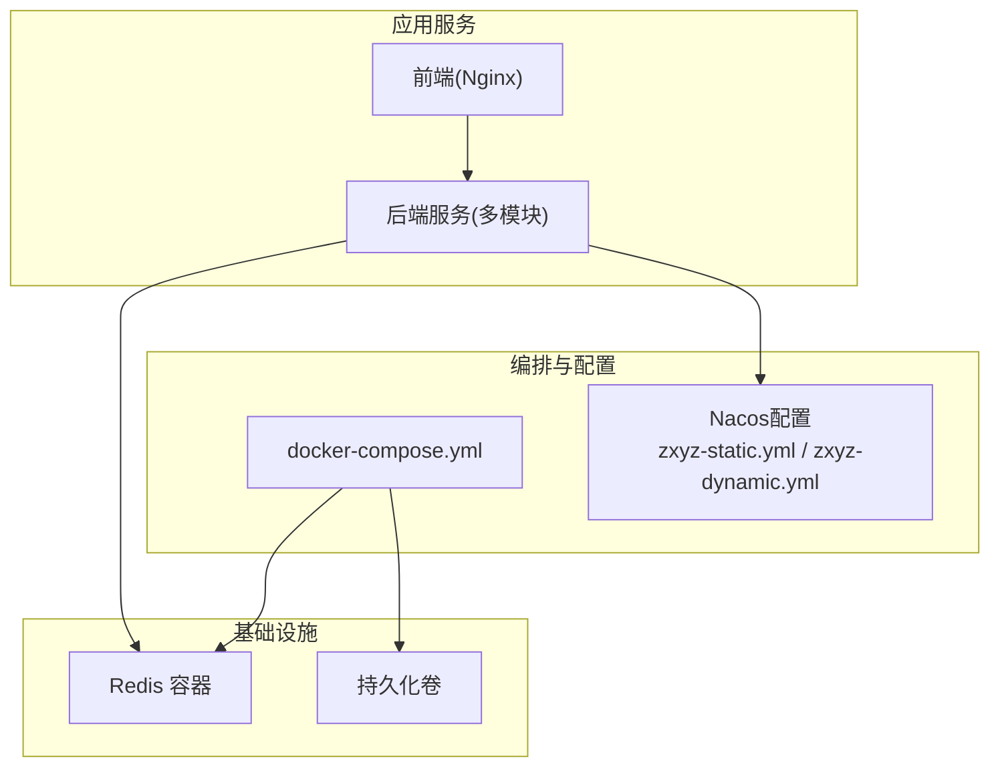
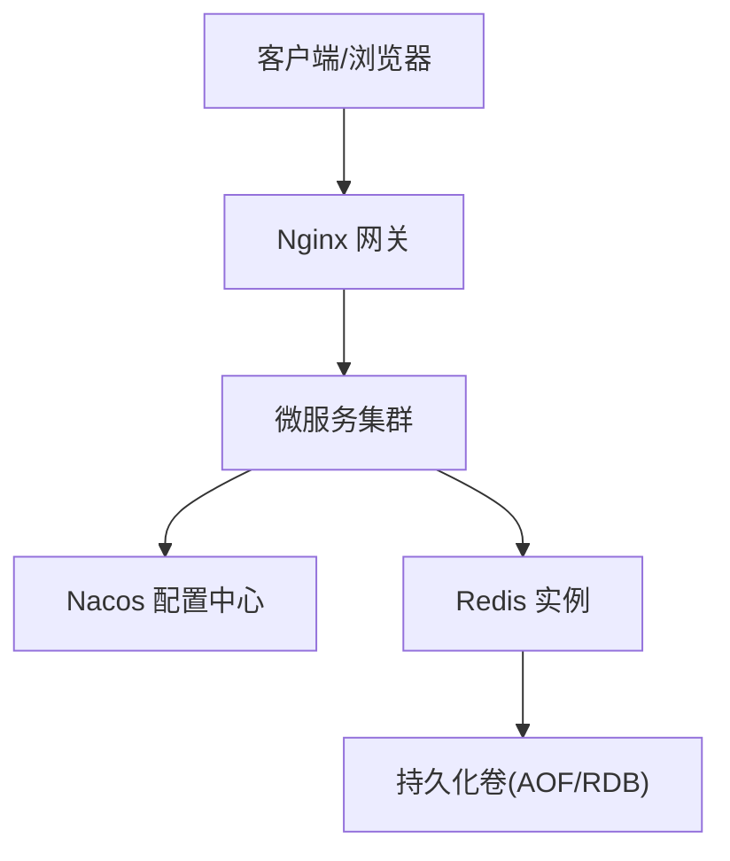
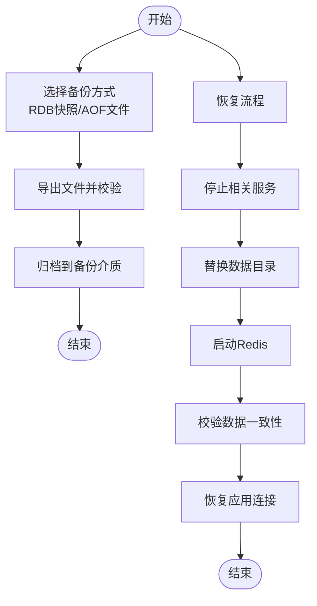
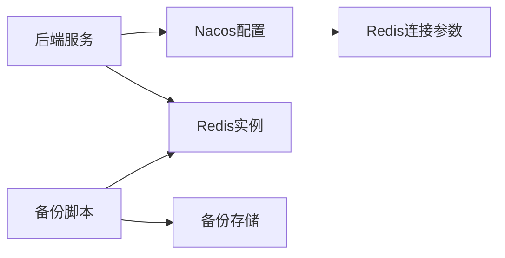

# Redis数据持久化

<cite>
**本文引用的文件**   
- [docker-compose.yml](file://docker-compose.yml)
- [docker-compose.dev.yml](file://docker-compose.dev.yml)
- [nacos-config/zxyz-static.yml](file://nacos-config/zxyz-static.yml)
- [nacos-config/zxyz-dynamic.yml](file://nacos-config/zxyz-dynamic.yml)
- [scripts/backup.sh](file://scripts/backup.sh)
- [deploy/nginx/default.conf](file://deploy/nginx/default.conf)
- [ZXYZdatabaseBack/pom.xml](file://ZXYZdatabaseBack/pom.xml)
- [ZXYZdatabaseBack/zxyz-common/src/main/resources/application-common.yml](file://ZXYZdatabaseBack/zxyz-common/src/main/resources/application-common.yml)
- [ZXYZdatabaseBack/zxyz-admin-service/src/main/resources/application-dev.yml](file://ZXYZdatabaseBack/zxyz-admin-service/src/main/resources/application-dev.yml)
- [ZXYZdatabaseBack/zxyz-email-service/src/main/resources/application-dev.yml](file://ZXYZdatabaseBack/zxyz-email-service/src/main/resources/application-dev.yml)
- [ZXYZdatabaseBack/zxyz-file-service/src/main/resources/application-dev.yml](file://ZXYZdatabaseBack/zxyz-file-service/src/main/resources/application-dev.yml)
- [ZXYZdatabaseBack/zxyz-im-service/src/main/resources/application-dev.yml](file://ZXYZdatabaseBack/zxyz-im-service/src/main/resources/application-dev.yml)
- [ZXYZdatabaseBack/zxyz-project-service/src/main/resources/application-dev.yml](file://ZXYZdatabaseBack/zxyz-project-service/src/main/resources/application-dev.yml)
- [ZXYZdatabaseBack/zxyz-share-service/src/main/resources/application-dev.yml](file://ZXYZdatabaseBack/zxyz-share-service/src/main/resources/application-dev.yml)
- [ZXYZdatabaseBack/zxyz-team-service/src/main/resources/application-dev.yml](file://ZXYZdatabaseBack/zxyz-team-service/src/main/resources/application-dev.yml)
- [ZXYZdatabaseBack/zxyz-user-service/src/main/resources/application-dev.yml](file://ZXYZdatabaseBack/zxyz-user-service/src/main/resources/application-dev.yml)
</cite>

## 目录
1. [简介](#简介)
2. [项目结构](#项目结构)
3. [核心组件](#核心组件)
4. [架构总览](#架构总览)
5. [详细组件分析](#详细组件分析)
6. [依赖关系分析](#依赖关系分析)
7. [性能考虑](#性能考虑)
8. [故障排查指南](#故障排查指南)
9. [结论](#结论)
10. [附录](#附录)

## 简介
本文件面向ZXYZ项目的Redis数据持久化，覆盖AOF与RDB两种模式的配置要点、写入策略、压缩与自动备份机制；区分会话存储、缓存数据与消息队列的持久化策略差异；给出手动备份、定时备份与灾难恢复流程；并提供内存管理、淘汰策略、大键检测与慢查询分析的调优建议；最后补充集群模式下的数据同步与高可用配置思路。

## 项目结构
- 基础设施编排：通过Docker Compose统一编排Redis等容器，便于本地与生产环境一致部署。
- 配置中心：Nacos集中管理各服务配置，包含Redis连接参数与动态开关。
- 脚本工具：提供备份脚本，用于触发或自动化备份流程。
- 前端网关：Nginx作为反向代理，不直接涉及Redis，但影响整体流量与稳定性。

图表来源
- [docker-compose.yml](file://docker-compose.yml)
- [nacos-config/zxyz-static.yml](file://nacos-config/zxyz-static.yml)
- [nacos-config/zxyz-dynamic.yml](file://nacos-config/zxyz-dynamic.yml)

章节来源
- [docker-compose.yml](file://docker-compose.yml)
- [docker-compose.dev.yml](file://docker-compose.dev.yml)
- [nacos-config/zxyz-static.yml](file://nacos-config/zxyz-static.yml)
- [nacos-config/zxyz-dynamic.yml](file://nacos-config/zxyz-dynamic.yml)

## 核心组件
- Redis容器：承载会话、缓存、限流、分布式锁、部分队列等数据。
- 持久化卷：挂载到宿主机目录，确保AOF/RDB文件持久化。
- Nacos配置：集中注入Redis连接信息、超时、线程池、序列化等参数。
- 备份脚本：封装redis-cli命令，实现快照导出与恢复。

章节来源
- [docker-compose.yml](file://docker-compose.yml)
- [nacos-config/zxyz-static.yml](file://nacos-config/zxyz-static.yml)
- [scripts/backup.sh](file://scripts/backup.sh)

## 架构总览
下图展示ZXYZ中Redis在整体架构中的位置与交互：后端服务通过Nacos获取Redis配置并连接Redis；Nginx为前端入口；持久化数据落盘于宿主卷。

图表来源
- [deploy/nginx/default.conf](file://deploy/nginx/default.conf)
- [nacos-config/zxyz-static.yml](file://nacos-config/zxyz-static.yml)
- [docker-compose.yml](file://docker-compose.yml)

## 详细组件分析

### Redis容器与持久化卷
- 容器启动：通过Compose定义Redis镜像、端口映射、环境变量与卷挂载。
- 持久化卷：将Redis工作目录映射到宿主机，保证重启后AOF/RDB文件可恢复。
- 网络隔离：与其他服务在同一Compose网络下，按服务名访问。

章节来源
- [docker-compose.yml](file://docker-compose.yml)
- [docker-compose.dev.yml](file://docker-compose.dev.yml)

### AOF与RDB持久化策略
- RDB（快照）：适合冷备与灾难恢复，定期生成dump文件；对写放大敏感，可能丢失最近一次快照后的数据。
- AOF（追加日志）：记录每条写命令，恢复粒度更细，数据更安全；体积增长快，需配合重写与压缩。
- 推荐组合：开启AOF为主（fsync策略按业务容忍度选择），同时保留周期性RDB快照用于快速恢复。

章节来源
- [docker-compose.yml](file://docker-compose.yml)

### 写入策略与压缩设置
- 写入策略：根据业务场景选择appendfsync策略（如每秒刷盘或每次写都刷盘），平衡性能与安全性。
- 压缩：AOF重写时启用压缩以减少磁盘占用；RDB默认压缩，可按需要调整压缩级别。
- 重写时机：合理设置最大文件大小与重写阈值，避免频繁重写导致抖动。

章节来源
- [docker-compose.yml](file://docker-compose.yml)

### 自动备份机制
- 基于快照：利用RDB dump文件进行定时备份，结合外部任务调度（如cron）上传至对象存储或异地备份。
- 基于AOF：以AOF文件为增量备份源，注意重写期间的完整性校验。
- 备份验证：定期执行恢复演练，确保备份可用。

章节来源
- [scripts/backup.sh](file://scripts/backup.sh)
- [docker-compose.yml](file://docker-compose.yml)

### 会话存储、缓存与消息队列的持久化差异
- 会话存储：通常短生命周期，建议使用AOF以保证登录态安全；必要时关闭RDB减少IO。
- 缓存数据：允许短暂丢失，优先RDB快照+弱一致性；热点数据可结合TTL与淘汰策略。
- 消息队列：若使用Redis作为队列，建议开启AOF且严格刷盘策略，避免消息丢失；重要队列建议迁移至专业MQ。

章节来源
- [nacos-config/zxyz-static.yml](file://nacos-config/zxyz-static.yml)
- [nacos-config/zxyz-dynamic.yml](file://nacos-config/zxyz-dynamic.yml)

### 数据备份与恢复流程
- 手动备份：通过redis-cli或脚本导出当前快照或AOF文件，命名带时间戳并校验大小。
- 定时备份：结合系统计划任务或CI/CD流水线，周期拉取备份并归档。
- 灾难恢复：停止服务→替换数据目录→启动Redis→校验数据→恢复应用连接。

章节来源
- [scripts/backup.sh](file://scripts/backup.sh)
- [docker-compose.yml](file://docker-compose.yml)

### 内存管理与性能调优
- 淘汰策略：根据数据类型选择合适maxmemory-policy（如allkeys-lru、volatile-ttl等）。
- 大键检测：定期扫描并拆分大键，避免阻塞主线程。
- 慢查询分析：开启slowlog，设定阈值，定位热点操作与长事务。
- 连接与线程：合理设置客户端连接数、IO线程与序列化开销。

章节来源
- [nacos-config/zxyz-static.yml](file://nacos-config/zxyz-static.yml)
- [nacos-config/zxyz-dynamic.yml](file://nacos-config/zxyz-dynamic.yml)

### 集群模式下的数据同步与高可用
- 主从复制：配置replicaof与认证，确保只读副本分担读压力。
- 哨兵模式：部署sentinel监控主节点健康，自动故障转移。
- 集群分片：使用Redis Cluster进行水平扩展，关注槽位迁移与扩容流程。
- 持久化与备份：集群模式下每个节点独立持久化，备份需覆盖所有节点。

章节来源
- [docker-compose.yml](file://docker-compose.yml)
- [nacos-config/zxyz-static.yml](file://nacos-config/zxyz-static.yml)

## 依赖关系分析
- 服务依赖：各后端服务通过Nacos读取Redis连接参数，统一由Compose编排网络。
- 配置分层：静态配置（连接、超时、序列化）与动态配置（开关、阈值）分离，便于热更新。
- 外部依赖：备份脚本依赖redis-cli与目标存储工具链。

图表来源
- [nacos-config/zxyz-static.yml](file://nacos-config/zxyz-static.yml)
- [nacos-config/zxyz-dynamic.yml](file://nacos-config/zxyz-dynamic.yml)
- [scripts/backup.sh](file://scripts/backup.sh)
- [docker-compose.yml](file://docker-compose.yml)

章节来源
- [ZXYZdatabaseBack/pom.xml](file://ZXYZdatabaseBack/pom.xml)
- [ZXYZdatabaseBack/zxyz-common/src/main/resources/application-common.yml](file://ZXYZdatabaseBack/zxyz-common/src/main/resources/application-common.yml)
- [nacos-config/zxyz-static.yml](file://nacos-config/zxyz-static.yml)
- [nacos-config/zxyz-dynamic.yml](file://nacos-config/zxyz-dynamic.yml)

## 性能考虑
- 持久化权衡：AOF fsync策略越严格，延迟越高；RDB频率越高，写放大越大。
- IO优化：使用SSD、独立磁盘分区、关闭不必要的内核刷新策略。
- 序列化：选择高效序列化方案，避免频繁GC。
- 监控：接入指标采集（内存、命中率、慢查询、持久化耗时）。

[本节为通用指导，无需代码来源]

## 故障排查指南
- 无法连接：检查Compose网络、Nacos配置、防火墙与安全组。
- 数据不一致：对比AOF与RDB，检查崩溃前最后一次写入；必要时回滚到更早快照。
- 性能抖动：观察慢查询日志与大键分布，调整淘汰策略与分片。
- 备份失败：确认权限、路径、磁盘空间与网络连通性。

章节来源
- [scripts/backup.sh](file://scripts/backup.sh)
- [docker-compose.yml](file://docker-compose.yml)

## 结论
ZXYZ项目中Redis的持久化应以AOF为主、RDB为辅的组合策略，结合合理的写入与压缩设置保障数据安全与性能。通过Nacos集中配置、Compose统一编排与脚本化备份，形成可运维、可恢复、可扩展的数据底座。针对会话、缓存与队列的不同特性差异化配置，并在集群模式下完善复制、哨兵与分片能力，满足高可用与弹性扩展需求。

## 附录
- 常用命令参考：查看持久化状态、触发快照、清理大键、慢查询分析等。
- 最佳实践清单：命名规范、TTL策略、容量规划、演练与审计。

[本节为通用指导，无需代码来源]