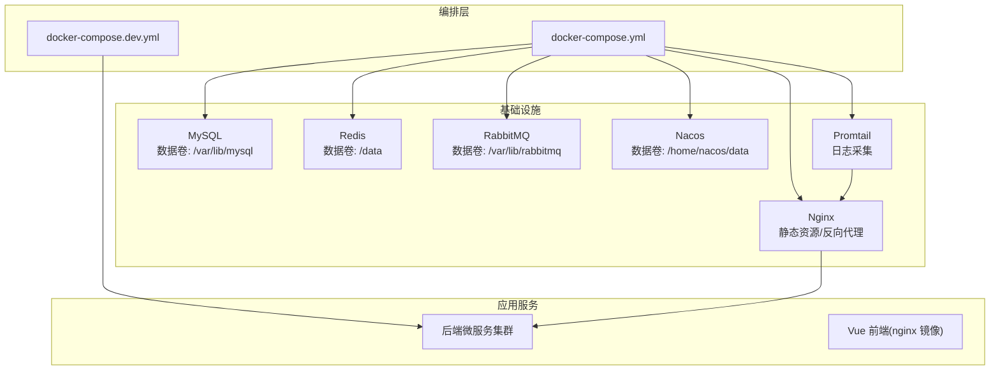
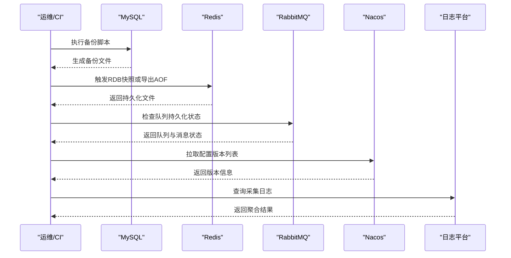
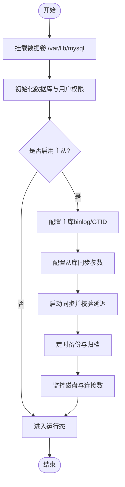
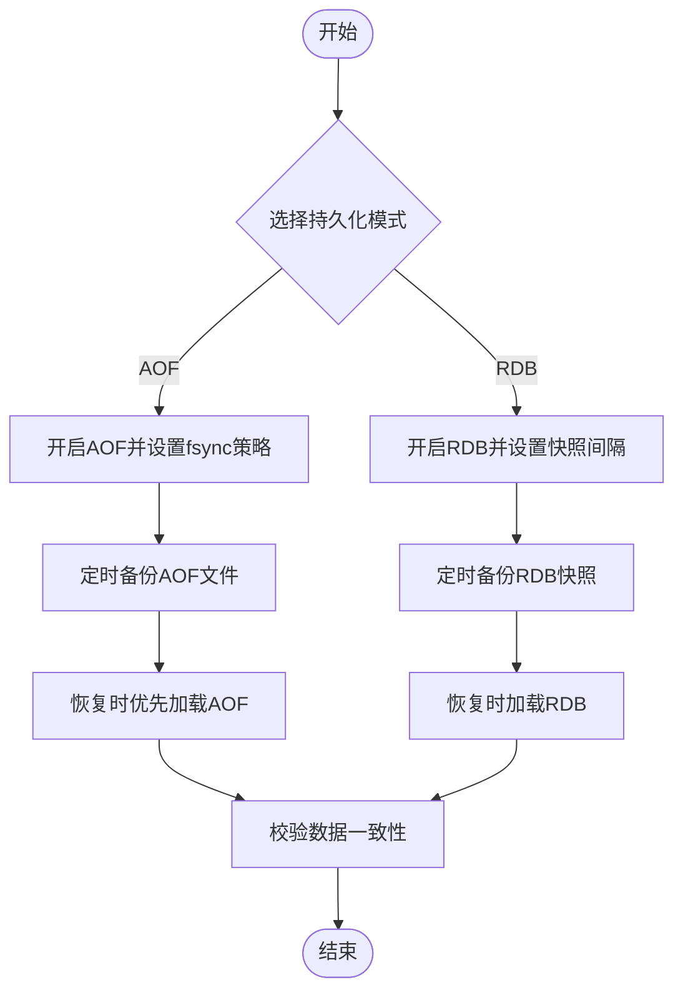
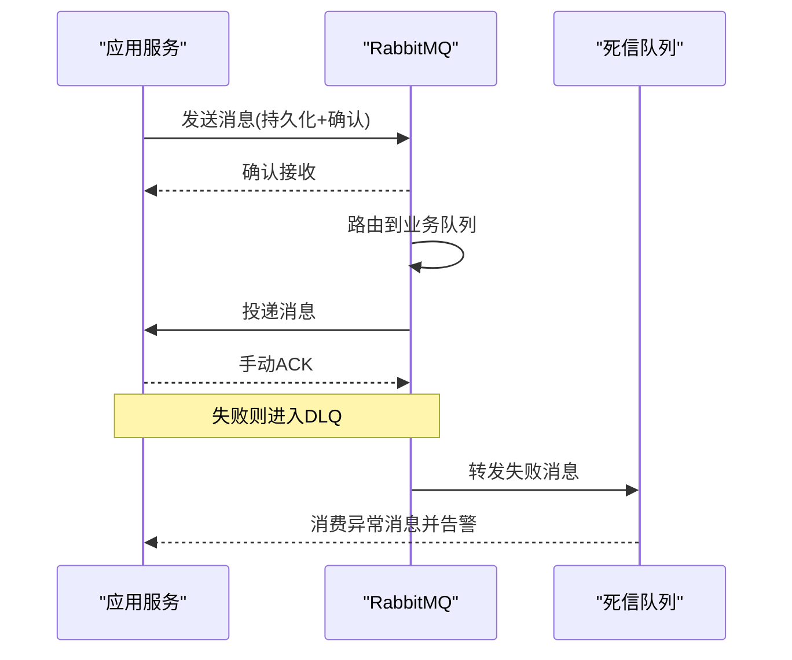
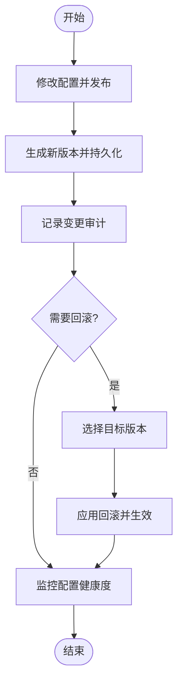
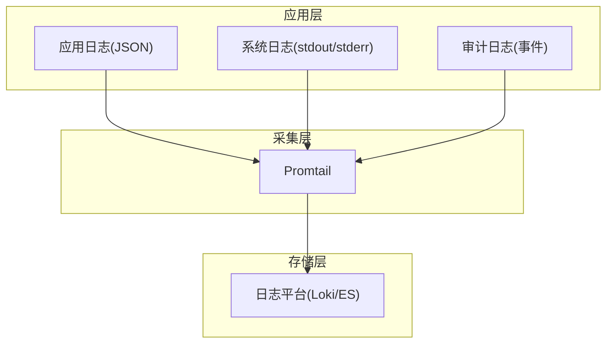
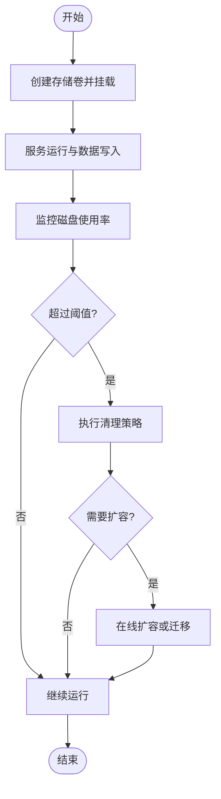

# 数据持久化与存储卷

<cite>
**本文引用的文件**
- [docker-compose.yml](file://docker-compose.yml)
- [docker-compose.dev.yml](file://docker-compose.dev.yml)
- [deploy/nginx/default.conf](file://deploy/nginx/default.conf)
- [deploy/promtail-config.yml](file://deploy/promtail-config.yml)
- [nacos-config/zxyz-dynamic.yml](file://nacos-config/zxyz-dynamic.yml)
- [nacos-config/zxyz-static.yml](file://nacos-config/zxyz-static.yml)
- [ZXYZdatabaseBack/README.md](file://ZXYZdatabaseBack/README.md)
- [DEPLOYMENT.md](file://DEPLOYMENT.md)
- [scripts/backup.sh](file://scripts/backup.sh)
- [sql/00-init-zxyz.sh](file://sql/00-init-zxyz.sh)
</cite>

## 目录
1. [引言](#引言)
2. [项目结构](#项目结构)
3. [核心组件](#核心组件)
4. [架构总览](#架构总览)
5. [详细组件分析](#详细组件分析)
6. [依赖关系分析](#依赖关系分析)
7. [性能考虑](#性能考虑)
8. [故障排查指南](#故障排查指南)
9. [结论](#结论)
10. [附录](#附录)

## 引言
本文件面向 ZXYZ 项目的运维与研发人员，系统性说明数据持久化与存储卷配置。内容覆盖：
- MySQL 数据目录挂载、主从复制数据同步、备份策略与存储空间管理
- Redis 数据持久化（AOF/RDB）、数据备份与恢复流程
- RabbitMQ 消息队列数据持久化、队列状态保存与消息可靠性保证
- Nacos 配置中心数据持久化、配置版本管理与历史版本回滚
- 日志收集配置（应用日志、系统日志、审计日志）的集中管理
- 存储卷生命周期管理与清理策略

## 项目结构
ZXYZ 采用 Docker Compose 编排基础设施与应用服务，关键持久化相关目录与配置文件分布如下：
- 容器编排：docker-compose.yml、docker-compose.dev.yml
- Nacos 配置：nacos-config/*.yml
- 部署与脚本：DEPLOYMENT.md、scripts/backup.sh、sql/00-init-zxyz.sh
- 前端与网关：deploy/nginx/default.conf
- 日志采集：deploy/promtail-config.yml



**图表来源**
- [docker-compose.yml](file://docker-compose.yml)
- [docker-compose.dev.yml](file://docker-compose.dev.yml)
- [deploy/nginx/default.conf](file://deploy/nginx/default.conf)
- [deploy/promtail-config.yml](file://deploy/promtail-config.yml)

**章节来源**
- [docker-compose.yml](file://docker-compose.yml)
- [docker-compose.dev.yml](file://docker-compose.dev.yml)

## 核心组件
- MySQL：数据库引擎，承载业务数据；通过数据卷持久化，支持主从复制与备份脚本
- Redis：缓存与会话存储；启用 AOF 与 RDB 持久化，提供备份与恢复能力
- RabbitMQ：消息中间件；持久化队列与消息，保障异步通信可靠性
- Nacos：配置中心与服务注册；配置持久化到本地磁盘，支持版本管理与回滚
- Nginx：反向代理与静态资源服务；不直接涉及数据持久化
- Promtail：日志采集器，将容器日志统一收集到日志平台

**章节来源**
- [docker-compose.yml](file://docker-compose.yml)
- [docker-compose.dev.yml](file://docker-compose.dev.yml)
- [DEPLOYMENT.md](file://DEPLOYMENT.md)

## 架构总览
下图展示各组件的数据持久化路径与交互关系，包括备份与日志采集链路。



**图表来源**
- [scripts/backup.sh](file://scripts/backup.sh)
- [docker-compose.yml](file://docker-compose.yml)
- [deploy/promtail-config.yml](file://deploy/promtail-config.yml)

## 详细组件分析

### MySQL 数据持久化与主从复制
- 数据目录挂载
  - 使用独立数据卷挂载至 /var/lib/mysql，确保容器重启后数据不丢失
  - 建议为生产环境配置高性能磁盘与监控告警
- 主从复制数据同步
  - 通过环境变量与初始化脚本配置主库与从库角色
  - 使用 GTID 或 binlog 位置进行一致性同步
  - 建议在只读副本上承担报表与读多写少场景
- 备份策略
  - 使用定时任务执行逻辑备份（mysqldump）或物理备份（Percona XtraBackup）
  - 备份文件按时间分片并异地存储，保留周期可配置
- 存储空间管理
  - 监控表空间与索引膨胀，定期优化与重建索引
  - 清理过期归档日志与临时文件，避免磁盘占满



**图表来源**
- [docker-compose.yml](file://docker-compose.yml)
- [sql/00-init-zxyz.sh](file://sql/00-init-zxyz.sh)

**章节来源**
- [docker-compose.yml](file://docker-compose.yml)
- [sql/00-init-zxyz.sh](file://sql/00-init-zxyz.sh)

### Redis 数据持久化（AOF 与 RDB）
- 持久化模式
  - AOF：记录写命令，支持 fsync 策略（everysec 推荐），提高数据安全性
  - RDB：周期性快照，适合灾难恢复与冷备
- 数据备份与恢复
  - 备份：定期拷贝 AOF 文件与 RDB 快照至对象存储或备份服务器
  - 恢复：优先恢复 AOF 再加载 RDB，或使用 redis-check-aof 修复损坏文件
- 容量与性能
  - 合理设置 maxmemory 与淘汰策略（volatile-lru/allkeys-lru）
  - 监控内存碎片率与持久化耗时，避免阻塞主线程



**图表来源**
- [docker-compose.yml](file://docker-compose.yml)

**章节来源**
- [docker-compose.yml](file://docker-compose.yml)

### RabbitMQ 消息队列数据持久化
- 队列与消息持久化
  - 队列声明 durable=true，消息 delivery-mode=2，确保重启不丢失
  - 使用 Topic Exchange 路由 zxyz.topic，按业务域划分队列
- 可靠性保证
  - 生产者确认（publisher confirm）与消费者手动 ACK
  - 死信队列（DLQ）处理失败消息，配合重试与告警
- 监控与治理
  - 监控队列长度、消费速率与消息堆积
  - 定期清理过期消息与未使用队列



**图表来源**
- [docker-compose.yml](file://docker-compose.yml)

**章节来源**
- [docker-compose.yml](file://docker-compose.yml)

### Nacos 配置中心数据持久化
- 配置持久化
  - Nacos 默认将配置存储于本地文件系统（/home/nacos/data）
  - 生产环境建议使用外部存储（如 MySQL）作为配置持久化后端
- 版本管理与回滚
  - 每次配置变更生成新版本号，支持查看历史版本
  - 通过 API 或控制台快速回滚到指定版本
- 安全与加密
  - 敏感配置使用 Jasypt 加密，密钥由环境变量注入
  - 访问控制基于命名空间与鉴权机制



**图表来源**
- [nacos-config/zxyz-dynamic.yml](file://nacos-config/zxyz-dynamic.yml)
- [nacos-config/zxyz-static.yml](file://nacos-config/zxyz-static.yml)

**章节来源**
- [nacos-config/zxyz-dynamic.yml](file://nacos-config/zxyz-dynamic.yml)
- [nacos-config/zxyz-static.yml](file://nacos-config/zxyz-static.yml)

### 日志收集配置（应用、系统、审计）
- 日志类型
  - 应用日志：各微服务输出结构化日志（JSON）
  - 系统日志：容器标准输出与错误日志
  - 审计日志：操作审计与访问审计，落库或写入消息队列
- 采集与集中管理
  - 使用 Promtail 采集容器日志，转发至 Loki 或 ES
  - 统一索引与查询，支持按服务、级别、时间范围检索
- 存储与清理
  - 日志轮转与压缩，保留周期可配置
  - 冷热分层存储，降低长期成本



**图表来源**
- [deploy/promtail-config.yml](file://deploy/promtail-config.yml)

**章节来源**
- [deploy/promtail-config.yml](file://deploy/promtail-config.yml)

### 存储卷生命周期管理与清理策略
- 生命周期
  - 创建：在 Compose 中定义 volumes，绑定宿主机或云盘
  - 扩展：按需扩容磁盘容量，调整 IOPS 与吞吐
  - 迁移：停机迁移数据卷，校验完整性后切换
- 清理策略
  - 定期清理临时文件、旧备份与过期日志
  - 使用 cron 或调度任务执行清理脚本
  - 监控磁盘使用率，阈值告警与自动扩缩容



**章节来源**
- [docker-compose.yml](file://docker-compose.yml)

## 依赖关系分析
- 应用服务依赖 Nacos 获取配置与发现服务
- 业务数据依赖 MySQL，会话与热点数据依赖 Redis
- 异步解耦依赖 RabbitMQ，审计与通知通过消息传递
- 日志采集依赖 Promtail，统一汇聚到日志平台

```mermaid
graph LR
Services["微服务集群"] --> Nacos["Nacos"]
Services --> MySQL["MySQL"]
Services --> Redis["Redis"]
Services --> MQ["RabbitMQ"]
Services --> Log["日志平台"]
Log <- --> Promtail["Promtail"]
```

**图表来源**
- [docker-compose.yml](file://docker-compose.yml)
- [deploy/promtail-config.yml](file://deploy/promtail-config.yml)

**章节来源**
- [docker-compose.yml](file://docker-compose.yml)
- [deploy/promtail-config.yml](file://deploy/promtail-config.yml)

## 性能考虑
- MySQL
  - 调整 innodb_buffer_pool_size、redo log 大小与 binlog 格式
  - 使用连接池与读写分离，减少锁竞争
- Redis
  - 合理设置 maxmemory 与淘汰策略，避免 OOM
  - 批量操作与管道提升吞吐
- RabbitMQ
  - 队列分区与消费者并行度调优
  - 监控消息堆积与消费延迟
- Nacos
  - 配置热更新减少重启，避免频繁发布
  - 使用命名空间隔离不同环境
- 日志
  - 采样与过滤减少无效日志
  - 异步写入与批处理提升性能

[本节为通用指导，无需特定文件引用]

## 故障排查指南
- MySQL
  - 检查数据卷挂载与权限，验证主从同步状态
  - 查看慢查询日志与锁等待，定位性能瓶颈
- Redis
  - 检查 AOF/RDB 文件完整性，必要时修复或重建
  - 监控内存与连接数，排查大 Key 与热点
- RabbitMQ
  - 检查队列持久化与消费者 ACK，处理死信消息
  - 监控网络与磁盘 IO，避免消息积压
- Nacos
  - 查看配置发布日志与版本差异，确认回滚成功
  - 检查鉴权与命名空间隔离
- 日志
  - 确认 Promtail 采集正常，索引与查询可用
  - 排查日志缺失与重复问题

**章节来源**
- [scripts/backup.sh](file://scripts/backup.sh)
- [docker-compose.yml](file://docker-compose.yml)

## 结论
ZXYZ 项目通过 Docker Compose 统一管理基础设施与应用服务，结合数据卷与备份脚本实现可靠的数据持久化。MySQL、Redis、RabbitMQ、Nacos 各自具备完善的持久化与恢复能力，配合 Promtail 实现日志集中化管理。建议在生产环境中强化监控与自动化运维，确保高可用与可观测性。

[本节为总结性内容，无需特定文件引用]

## 附录
- 参考文档
  - [DEPLOYMENT.md](file://DEPLOYMENT.md)
  - [ZXYZdatabaseBack/README.md](file://ZXYZdatabaseBack/README.md)
- 常用命令
  - 备份：scripts/backup.sh
  - 初始化：sql/00-init-zxyz.sh
  - 查看配置：nacos-config/*.yml

**章节来源**
- [DEPLOYMENT.md](file://DEPLOYMENT.md)
- [ZXYZdatabaseBack/README.md](file://ZXYZdatabaseBack/README.md)
- [scripts/backup.sh](file://scripts/backup.sh)
- [sql/00-init-zxyz.sh](file://sql/00-init-zxyz.sh)
- [nacos-config/zxyz-dynamic.yml](file://nacos-config/zxyz-dynamic.yml)
- [nacos-config/zxyz-static.yml](file://nacos-config/zxyz-static.yml)