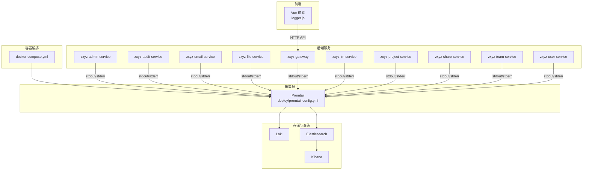
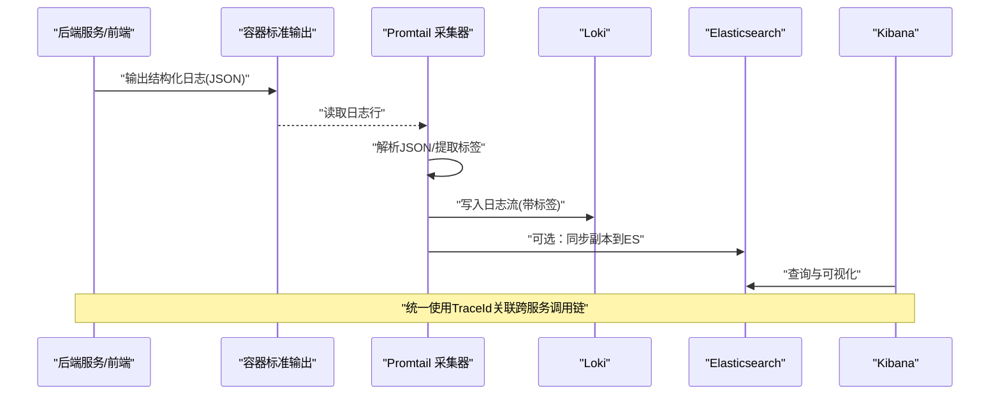
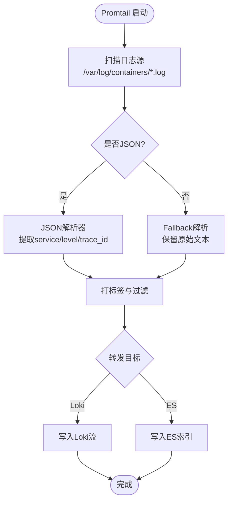
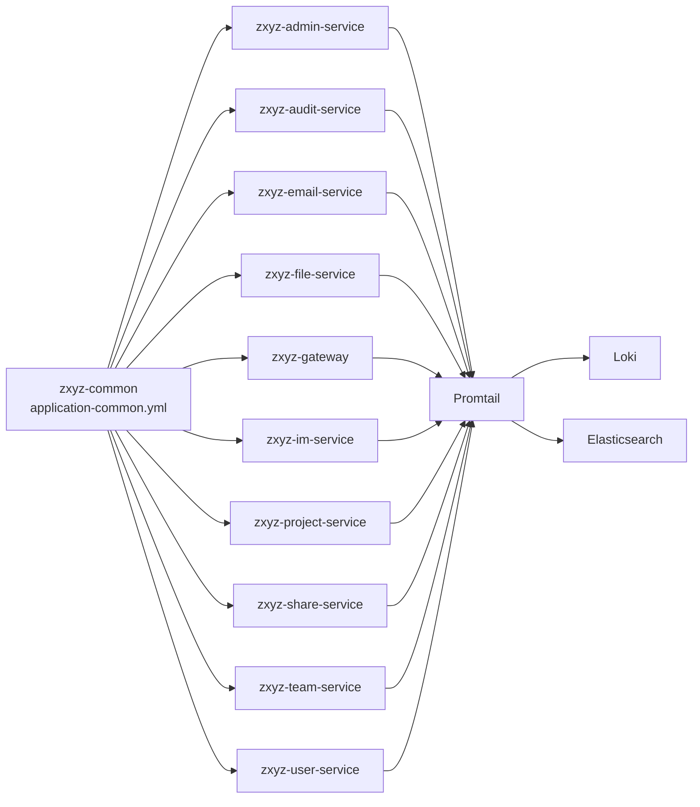

# 日志收集与管理

<cite>
**本文引用的文件**   
- [docker-compose.yml](file://docker-compose.yml)
- [deploy/promtail-config.yml](file://deploy/promtail-config.yml)
- [ZXYZdatabaseBack/zxyz-common/src/main/resources/application-common.yml](file://ZXYZdatabaseBack/zxyz-common/src/main/resources/application-common.yml)
- [ZXYZdatabaseBack/zxyz-admin-service/src/main/resources/application-dev.yml](file://ZXYZdatabaseBack/zxyz-admin-service/src/main/resources/application-dev.yml)
- [ZXYZdatabaseBack/zxyz-audit-service/src/main/resources/application-dev.yml](file://ZXYZdatabaseBack/zxyz-audit-service/src/main/resources/application-dev.yml)
- [ZXYZdatabaseBack/zxyz-email-service/src/main/resources/application-dev.yml](file://ZXYZdatabaseBack/zxyz-email-service/src/main/resources/application-dev.yml)
- [ZXYZdatabaseBack/zxyz-file-service/src/main/resources/application-dev.yml](file://ZXYZdatabaseBack/zxyz-file-service/src/main/resources/application-dev.yml)
- [ZXYZdatabaseBack/zxyz-gateway/src/main/resources/application.yml](file://ZXYZdatabaseBack/zxyz-gateway/src/main/resources/application.yml)
- [ZXYZdatabaseBack/zxyz-im-service/src/main/resources/application.yml](file://ZXYZdatabaseBack/zxyz-im-service/src/main/resources/application.yml)
- [ZXYZdatabaseBack/zxyz-project-service/src/main/resources/application-dev.yml](file://ZXYZdatabaseBack/zxyz-project-service/src/main/resources/application-dev.yml)
- [ZXYZdatabaseBack/zxyz-share-service/src/main/resources/application-dev.yml](file://ZXYZdatabaseBack/zxyz-share-service/src/main/resources/application-dev.yml)
- [ZXYZdatabaseBack/zxyz-team-service/src/main/resources/application-dev.yml](file://ZXYZdatabaseBack/zxyz-team-service/src/main/resources/application-dev.yml)
- [ZXYZdatabaseBack/zxyz-user-service/src/main/resources/application-dev.yml](file://ZXYZdatabaseBack/zxyz-user-service/src/main/resources/application-dev.yml)
- [ZXYZdatabaseFront/src/utils/logger.js](file://ZXYZdatabaseFront/src/utils/logger.js)
- [nacos-config/zxyz-static.yml](file://nacos-config/zxyz-static.yml)
- [nacos-config/zxyz-dynamic.yml](file://nacos-config/zxyz-dynamic.yml)
- [scripts/health-check.sh](file://scripts/health-check.sh)
</cite>

## 目录
1. [简介](#简介)
2. [项目结构](#项目结构)
3. [核心组件](#核心组件)
4. [架构总览](#架构总览)
5. [详细组件分析](#详细组件分析)
6. [依赖关系分析](#依赖关系分析)
7. [性能考虑](#性能考虑)
8. [故障排查指南](#故障排查指南)
9. [结论](#结论)
10. [附录](#附录)

## 简介
本文件为 ZXYZ 项目的日志收集与管理配置文档，覆盖应用日志、系统日志与审计日志的采集策略、格式标准化与结构化输出；Promtail 采集配置（路径、解析规则、转发目标）；ELK/Loki 集成方案（索引、搜索与分析）；日志轮转与清理策略（保留期限、存储管理、性能优化）；以及日志监控告警与错误追踪配置。文档面向运维与研发人员，兼顾可操作性与可维护性。

## 项目结构
ZXYZ 采用微服务架构，后端包含多个独立服务模块，前端为 Vue 应用。日志相关的关键位置如下：
- 容器编排与基础设施：docker-compose.yml 定义各服务容器及日志卷挂载
- Promtail 采集器：deploy/promtail-config.yml 定义日志文件扫描与转发
- 后端应用日志：zxyz-common 提供统一日志基础配置，各服务 application-*.yml 覆盖
- 前端应用日志：ZXYZdatabaseFront/src/utils/logger.js 统一前端日志输出
- Nacos 配置中心：nacos-config 下的静态与动态配置，用于运行时调整日志级别与开关
- 健康检查脚本：scripts/health-check.sh 可用于验证日志链路可用性

图表来源
- [docker-compose.yml](file://docker-compose.yml)
- [deploy/promtail-config.yml](file://deploy/promtail-config.yml)

章节来源
- [docker-compose.yml](file://docker-compose.yml)
- [deploy/promtail-config.yml](file://deploy/promtail-config.yml)

## 核心组件
- 应用日志框架与格式化
  - 后端统一通过 zxyz-common 的基础配置启用结构化 JSON 日志，包含时间戳、服务名、实例标识、TraceId、请求上下文等字段
  - 各服务 application-*.yml 可覆盖日志级别、输出目标与采样策略
- 前端日志
  - logger.js 统一封装前端日志输出，支持按环境切换输出目标（控制台/上报接口），并附带页面路由、用户会话等上下文
- 采集与转发
  - Promtail 负责从容器 stdout/stderr 或挂载日志文件中读取日志，进行标签化后转发至 Loki/Elasticsearch
- 存储与检索
  - Loki：以流式方式存储日志，适合高基数场景与低成本长期留存
  - Elasticsearch + Kibana：适合复杂聚合分析与可视化报表

章节来源
- [ZXYZdatabaseBack/zxyz-common/src/main/resources/application-common.yml](file://ZXYZdatabaseBack/zxyz-common/src/main/resources/application-common.yml)
- [ZXYZdatabaseFront/src/utils/logger.js](file://ZXYZdatabaseFront/src/utils/logger.js)
- [deploy/promtail-config.yml](file://deploy/promtail-config.yml)

## 架构总览
下图展示从应用产生日志到最终可视化的端到端流程，包括容器标准输出、Promtail 采集、Loki/ES 存储与 Kibana 查询。

图表来源
- [deploy/promtail-config.yml](file://deploy/promtail-config.yml)
- [docker-compose.yml](file://docker-compose.yml)

## 详细组件分析

### 应用日志与结构化输出
- 后端
  - 统一日志格式：JSON 键值对，包含 service、instance、level、timestamp、trace_id、span_id、msg 等字段
  - 日志级别控制：通过 application-*.yml 或 Nacos 动态配置，支持按包路径细化
  - 敏感信息脱敏：在公共工具中实现，避免记录密码、令牌等
- 前端
  - logger.js 提供 info/warn/error 方法，自动附加路由、用户ID、设备信息等
  - 生产环境建议仅输出 warn/error，并通过安全接口上报关键异常

章节来源
- [ZXYZdatabaseBack/zxyz-common/src/main/resources/application-common.yml](file://ZXYZdatabaseBack/zxyz-common/src/main/resources/application-common.yml)
- [ZXYZdatabaseFront/src/utils/logger.js](file://ZXYZdatabaseFront/src/utils/logger.js)

### 系统日志与审计日志
- 系统日志
  - 容器启动、健康检查、外部依赖连接状态等由框架与中间件输出到 stdout/stderr
  - 可通过 health-check.sh 定期探测关键指标并输出诊断信息
- 审计日志
  - 审计服务将关键操作事件异步落库，同时输出结构化日志便于追踪
  - 审计数据与业务日志通过 trace_id 关联，支持跨服务回溯

章节来源
- [ZXYZdatabaseBack/zxyz-audit-service/src/main/resources/application-dev.yml](file://ZXYZdatabaseBack/zxyz-audit-service/src/main/resources/application-dev.yml)
- [scripts/health-check.sh](file://scripts/health-check.sh)

### Promtail 日志采集配置
- 日志文件路径
  - 默认采集容器 stdout/stderr，路径映射到 /var/log/containers/*.log
  - 可按需扩展自定义日志文件路径
- 解析规则
  - 针对 JSON 日志启用 json 解析器，提取 service、level、trace_id 等字段作为标签
  - 非 JSON 行启用 fallback 解析，保留原始消息体
- 转发目标
  - 主目标：Loki（低延迟、低成本）
  - 可选目标：Elasticsearch（复杂分析、报表）

图表来源
- [deploy/promtail-config.yml](file://deploy/promtail-config.yml)

章节来源
- [deploy/promtail-config.yml](file://deploy/promtail-config.yml)

### ELK/Loki 集成配置
- Loki
  - 索引策略：基于 service、level、trace_id 等标签构建流，减少存储开销
  - 查询语法：使用 LogQL 进行快速检索与聚合
- Elasticsearch
  - 索引模板：按日期分片，设置 mapping 与 analyzer
  - 分析功能：Kibana 仪表盘、告警规则、AIOps 分析
- 双写策略
  - Promtail 可同时向 Loki 与 ES 写入，满足实时与离线分析需求

章节来源
- [deploy/promtail-config.yml](file://deploy/promtail-config.yml)

### 日志轮转与清理策略
- 轮转策略
  - 容器 stdout/stderr 由 Docker 驱动管理，建议配置 size-based 轮转与数量上限
  - 自定义日志文件可使用 logrotate 或应用内轮转
- 清理策略
  - Loki：通过 retention 配置限制时间与大小
  - ES：使用 ILM 策略按天滚动与删除过期索引
- 存储空间管理
  - 监控磁盘使用率，设置阈值告警
  - 冷热分层：热数据短期保留，冷数据归档至对象存储

章节来源
- [docker-compose.yml](file://docker-compose.yml)

### 日志监控告警与错误追踪
- 监控指标
  - Promtail 采集延迟、丢弃率、写入失败次数
  - Loki/ES 写入吞吐、查询延迟、磁盘使用率
- 告警规则
  - 错误日志突增、服务不可用、审计事件异常
  - 结合 Prometheus/Grafana 或 Kibana Alerting
- 错误追踪
  - 全链路 TraceId 贯穿网关、业务服务与审计服务
  - 前端异常上报与后端错误日志关联

章节来源
- [ZXYZdatabaseBack/zxyz-gateway/src/main/resources/application.yml](file://ZXYZdatabaseBack/zxyz-gateway/src/main/resources/application.yml)
- [ZXYZdatabaseBack/zxyz-im-service/src/main/resources/application.yml](file://ZXYZdatabaseBack/zxyz-im-service/src/main/resources/application.yml)

## 依赖关系分析
- 后端服务依赖 zxyz-common 提供的日志基础配置
- 各服务通过 application-*.yml 覆盖日志级别与输出
- Promtail 依赖 docker-compose 定义的日志卷挂载
- Loki/ES 作为下游存储，受 Promtail 配置影响

图表来源
- [ZXYZdatabaseBack/zxyz-common/src/main/resources/application-common.yml](file://ZXYZdatabaseBack/zxyz-common/src/main/resources/application-common.yml)
- [deploy/promtail-config.yml](file://deploy/promtail-config.yml)

章节来源
- [ZXYZdatabaseBack/zxyz-common/src/main/resources/application-common.yml](file://ZXYZdatabaseBack/zxyz-common/src/main/resources/application-common.yml)
- [ZXYZdatabaseBack/zxyz-admin-service/src/main/resources/application-dev.yml](file://ZXYZdatabaseBack/zxyz-admin-service/src/main/resources/application-dev.yml)
- [ZXYZdatabaseBack/zxyz-audit-service/src/main/resources/application-dev.yml](file://ZXYZdatabaseBack/zxyz-audit-service/src/main/resources/application-dev.yml)
- [ZXYZdatabaseBack/zxyz-email-service/src/main/resources/application-dev.yml](file://ZXYZdatabaseBack/zxyz-email-service/src/main/resources/application-dev.yml)
- [ZXYZdatabaseBack/zxyz-file-service/src/main/resources/application-dev.yml](file://ZXYZdatabaseBack/zxyz-file-service/src/main/resources/application-dev.yml)
- [ZXYZdatabaseBack/zxyz-gateway/src/main/resources/application.yml](file://ZXYZdatabaseBack/zxyz-gateway/src/main/resources/application.yml)
- [ZXYZdatabaseBack/zxyz-im-service/src/main/resources/application.yml](file://ZXYZdatabaseBack/zxyz-im-service/src/main/resources/application.yml)
- [ZXYZdatabaseBack/zxyz-project-service/src/main/resources/application-dev.yml](file://ZXYZdatabaseBack/zxyz-project-service/src/main/resources/application-dev.yml)
- [ZXYZdatabaseBack/zxyz-share-service/src/main/resources/application-dev.yml](file://ZXYZdatabaseBack/zxyz-share-service/src/main/resources/application-dev.yml)
- [ZXYZdatabaseBack/zxyz-team-service/src/main/resources/application-dev.yml](file://ZXYZdatabaseBack/zxyz-team-service/src/main/resources/application-dev.yml)
- [ZXYZdatabaseBack/zxyz-user-service/src/main/resources/application-dev.yml](file://ZXYZdatabaseBack/zxyz-user-service/src/main/resources/application-dev.yml)
- [deploy/promtail-config.yml](file://deploy/promtail-config.yml)

## 性能考虑
- 日志级别与采样
  - 生产环境默认 INFO，关键路径开启 DEBUG 并配合采样
  - 高频接口降低日志频率，避免 IO 瓶颈
- 结构化输出
  - JSON 解析在 Promtail 侧完成，减少下游处理开销
- 存储与查询
  - Loki 标签选择需谨慎，避免高基数导致查询缓慢
  - ES 索引分片数与副本数根据数据量调优
- 资源隔离
  - Promtail 与业务容器分离部署，避免争抢 CPU/内存

[本节为通用指导，不直接分析具体文件]

## 故障排查指南
- 常见问题
  - Promtail 无法读取日志：检查卷挂载与权限
  - 日志未入库：确认 Loki/ES 连通性与认证配置
  - 查询缓慢：检查标签基数与索引设计
- 诊断步骤
  - 查看 Promtail 运行日志与指标
  - 使用 health-check.sh 验证服务健康
  - 通过 Kibana/Loki UI 检索 trace_id 定位问题

章节来源
- [scripts/health-check.sh](file://scripts/health-check.sh)

## 结论
通过统一的日志格式、Promtail 采集与 Loki/ES 存储，ZXYZ 实现了高效、可扩展的日志体系。结合 Nacos 动态配置与健康检查，可在保证性能的同时提升可观测性与可维护性。建议持续优化标签设计与存储策略，完善告警与追踪能力。

[本节为总结，不直接分析具体文件]

## 附录
- 配置参考
  - 静态配置：nacos-config/zxyz-static.yml
  - 动态配置：nacos-config/zxyz-dynamic.yml
- 前端日志示例
  - ZXYZdatabaseFront/src/utils/logger.js

章节来源
- [nacos-config/zxyz-static.yml](file://nacos-config/zxyz-static.yml)
- [nacos-config/zxyz-dynamic.yml](file://nacos-config/zxyz-dynamic.yml)
- [ZXYZdatabaseFront/src/utils/logger.js](file://ZXYZdatabaseFront/src/utils/logger.js)