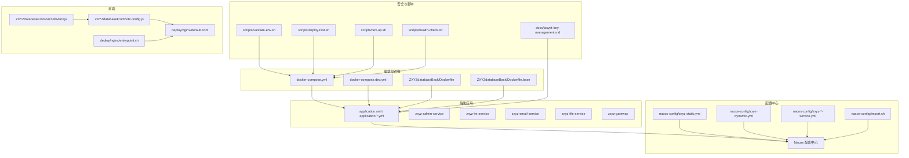
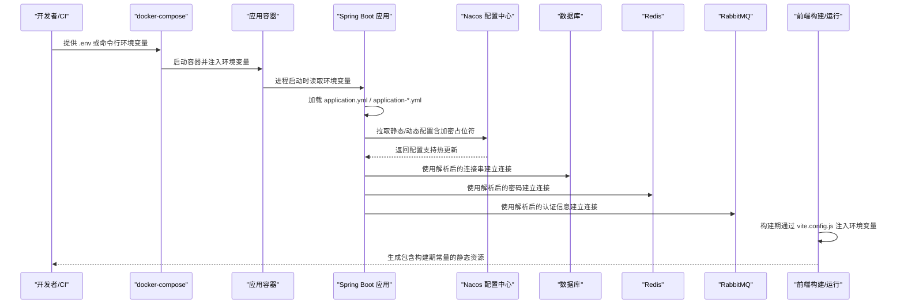
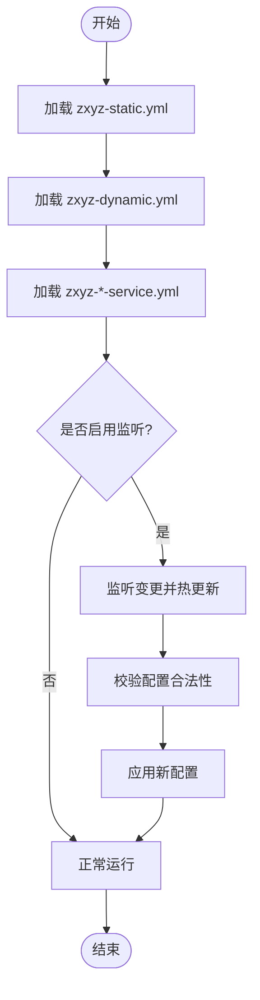
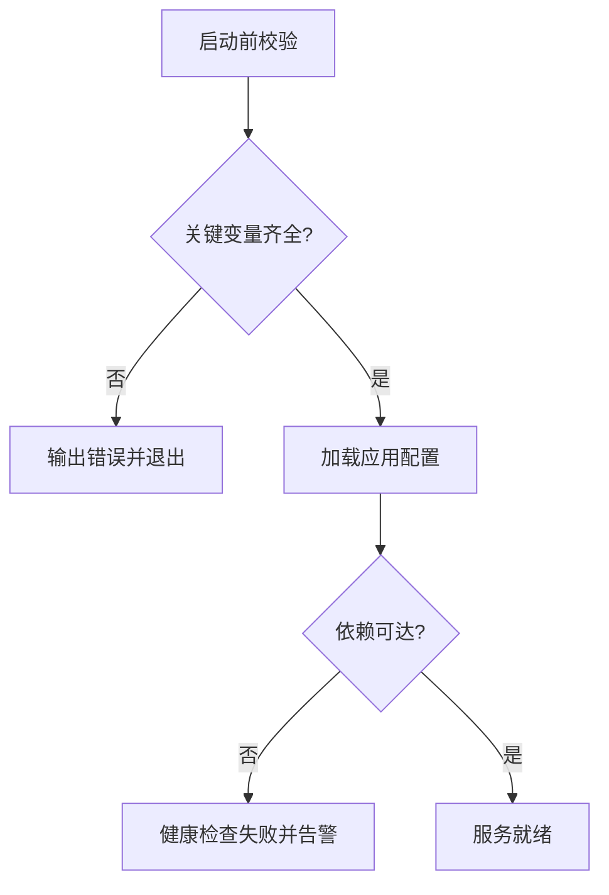
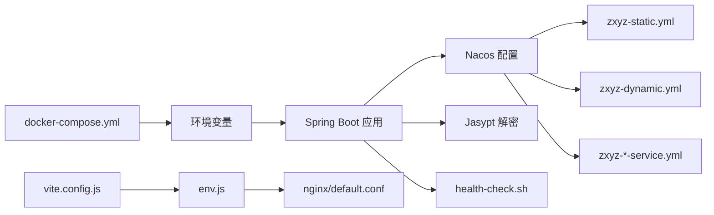

# 环境变量配置管理

<cite>
**本文引用的文件**   
- [docker-compose.yml](file://docker-compose.yml)
- [docker-compose.dev.yml](file://docker-compose.dev.yml)
- [Dockerfile](file://ZXYZdatabaseBack/Dockerfile)
- [Dockerfile.base](file://ZXYZdatabaseBack/Dockerfile.base)
- [application.yml](file://ZXYZdatabaseBack/zxyz-admin-service/src/main/resources/application.yml)
- [application-dev.yml](file://ZXYZdatabaseBack/zxyz-admin-service/src/main/resources/application-dev.yml)
- [application-prod.yml](file://ZXYZdatabaseBack/zxyz-admin-service/src/main/resources/application-prod.yml)
- [zxyz-admin-service.yml](file://nacos-config/zxyz-admin-service.yml)
- [zxyz-dynamic.yml](file://nacos-config/zxyz-dynamic.yml)
- [zxyz-static.yml](file://nacos-config/zxyz-static.yml)
- [import.sh](file://nacos-config/import.sh)
- [jasypt-key-management.md](file://docs/jasypt-key-management.md)
- [validate-env.sh](file://scripts/validate-env.sh)
- [deploy-fast.sh](file://scripts/deploy-fast.sh)
- [dev-up.sh](file://scripts/dev-up.sh)
- [health-check.sh](file://scripts/health-check.sh)
- [default.conf](file://deploy/nginx/default.conf)
- [entrypoint.sh](file://deploy/nginx/entrypoint.sh)
- [env.js](file://ZXYZdatabaseFront/src/utils/env.js)
- [vite.config.js](file://ZXYZdatabaseFront/vite.config.js)
</cite>

## 目录
1. [简介](#简介)
2. [项目结构](#项目结构)
3. [核心组件](#核心组件)
4. [架构总览](#架构总览)
5. [详细组件分析](#详细组件分析)
6. [依赖关系分析](#依赖关系分析)
7. [性能考虑](#性能考虑)
8. [故障排查指南](#故障排查指南)
9. [结论](#结论)
10. [附录](#附录)

## 简介
本文件面向 ZXYZ 项目的运维与研发人员，系统化说明环境变量与配置管理策略。内容覆盖：
- Docker 环境变量注入策略（数据库连接、Redis、RabbitMQ 等敏感信息）
- Nacos 配置中心的动态配置管理（热更新、版本控制、灰度发布）
- Jasypt 加密配置的使用（敏感信息加密存储与解密读取）
- 多环境差异管理（开发、测试、生产隔离）
- 配置验证与默认值处理机制
- 配置文件模板化与批量替换策略

## 项目结构
ZXYZ 采用微服务架构，后端基于 Spring Boot + Maven 多模块，前端为 Vue 3 + Vite。配置相关的关键位置包括：
- 容器编排与环境变量：docker-compose*.yml、各服务的 application-*.yml
- 配置中心：nacos-config/*.yml 与导入脚本 import.sh
- 安全加密：docs/jasypt-key-management.md
- 部署与校验脚本：scripts/*.sh、deploy/nginx/*
- 前端构建期环境变量：ZXYZdatabaseFront/src/utils/env.js、vite.config.js

图表来源
- [docker-compose.yml](file://docker-compose.yml)
- [docker-compose.dev.yml](file://docker-compose.dev.yml)
- [Dockerfile](file://ZXYZdatabaseBack/Dockerfile)
- [Dockerfile.base](file://ZXYZdatabaseBack/Dockerfile.base)
- [application.yml](file://ZXYZdatabaseBack/zxyz-admin-service/src/main/resources/application.yml)
- [zxyz-admin-service.yml](file://nacos-config/zxyz-admin-service.yml)
- [zxyz-dynamic.yml](file://nacos-config/zxyz-dynamic.yml)
- [zxyz-static.yml](file://nacos-config/zxyz-static.yml)
- [import.sh](file://nacos-config/import.sh)
- [jasypt-key-management.md](file://docs/jasypt-key-management.md)
- [validate-env.sh](file://scripts/validate-env.sh)
- [deploy-fast.sh](file://scripts/deploy-fast.sh)
- [dev-up.sh](file://scripts/dev-up.sh)
- [health-check.sh](file://scripts/health-check.sh)
- [env.js](file://ZXYZdatabaseFront/src/utils/env.js)
- [vite.config.js](file://ZXYZdatabaseFront/vite.config.js)
- [default.conf](file://deploy/nginx/default.conf)
- [entrypoint.sh](file://deploy/nginx/entrypoint.sh)

章节来源
- [docker-compose.yml](file://docker-compose.yml)
- [docker-compose.dev.yml](file://docker-compose.dev.yml)
- [Dockerfile](file://ZXYZdatabaseBack/Dockerfile)
- [Dockerfile.base](file://ZXYZdatabaseBack/Dockerfile.base)
- [application.yml](file://ZXYZdatabaseBack/zxyz-admin-service/src/main/resources/application.yml)
- [zxyz-admin-service.yml](file://nacos-config/zxyz-admin-service.yml)
- [zxyz-dynamic.yml](file://nacos-config/zxyz-dynamic.yml)
- [zxyz-static.yml](file://nacos-config/zxyz-static.yml)
- [import.sh](file://nacos-config/import.sh)
- [jasypt-key-management.md](file://docs/jasypt-key-management.md)
- [validate-env.sh](file://scripts/validate-env.sh)
- [deploy-fast.sh](file://scripts/deploy-fast.sh)
- [dev-up.sh](file://scripts/dev-up.sh)
- [health-check.sh](file://scripts/health-check.sh)
- [env.js](file://ZXYZdatabaseFront/src/utils/env.js)
- [vite.config.js](file://ZXYZdatabaseFront/vite.config.js)
- [default.conf](file://deploy/nginx/default.conf)
- [entrypoint.sh](file://deploy/nginx/entrypoint.sh)

## 核心组件
- 容器编排与环境变量注入
  - docker-compose.yml/docker-compose.dev.yml：集中定义服务、端口、网络、卷挂载与环境变量；通过 ${VAR} 或 env_file 注入敏感项。
  - Dockerfile/Dockerfile.base：镜像构建阶段不硬编码敏感配置，运行时通过环境变量装配。
- 应用配置加载
  - application.yml：基础配置与 Profile 选择。
  - application-dev.yml/application-prod.yml：环境差异化配置（如日志级别、调试开关）。
  - Nacos 配置：zxyz-static.yml（静态）、zxyz-dynamic.yml（动态）、各服务独立配置 zxyz-*-service.yml。
- 安全加密
  - docs/jasypt-key-management.md：Jasypt 密钥管理与加解密流程规范。
- 校验与部署脚本
  - scripts/validate-env.sh：启动前校验关键环境变量是否齐全且格式正确。
  - scripts/deploy-fast.sh、scripts/dev-up.sh、scripts/health-check.sh：快速部署、本地开发启动与健康检查。
- 前端构建期配置
  - ZXYZdatabaseFront/src/utils/env.js：暴露构建期常量（如 API 基地址、功能开关）。
  - ZXYZdatabaseFront/vite.config.js：根据构建参数注入环境变量到前端。
  - deploy/nginx/default.conf、deploy/nginx/entrypoint.sh：Nginx 反向代理与入口脚本，可注入前端所需的环境变量。

章节来源
- [docker-compose.yml](file://docker-compose.yml)
- [docker-compose.dev.yml](file://docker-compose.dev.yml)
- [Dockerfile](file://ZXYZdatabaseBack/Dockerfile)
- [Dockerfile.base](file://ZXYZdatabaseBack/Dockerfile.base)
- [application.yml](file://ZXYZdatabaseBack/zxyz-admin-service/src/main/resources/application.yml)
- [application-dev.yml](file://ZXYZdatabaseBack/zxyz-admin-service/src/main/resources/application-dev.yml)
- [application-prod.yml](file://ZXYZdatabaseBack/zxyz-admin-service/src/main/resources/application-prod.yml)
- [zxyz-admin-service.yml](file://nacos-config/zxyz-admin-service.yml)
- [zxyz-dynamic.yml](file://nacos-config/zxyz-dynamic.yml)
- [zxyz-static.yml](file://nacos-config/zxyz-static.yml)
- [import.sh](file://nacos-config/import.sh)
- [jasypt-key-management.md](file://docs/jasypt-key-management.md)
- [validate-env.sh](file://scripts/validate-env.sh)
- [deploy-fast.sh](file://scripts/deploy-fast.sh)
- [dev-up.sh](file://scripts/dev-up.sh)
- [health-check.sh](file://scripts/health-check.sh)
- [env.js](file://ZXYZdatabaseFront/src/utils/env.js)
- [vite.config.js](file://ZXYZdatabaseFront/vite.config.js)
- [default.conf](file://deploy/nginx/default.conf)
- [entrypoint.sh](file://deploy/nginx/entrypoint.sh)

## 架构总览
下图展示从“环境变量 → 容器 → 应用 → 配置中心 → 运行时”的完整链路，以及前端构建期变量的注入路径。

图表来源
- [docker-compose.yml](file://docker-compose.yml)
- [Dockerfile](file://ZXYZdatabaseBack/Dockerfile)
- [application.yml](file://ZXYZdatabaseBack/zxyz-admin-service/src/main/resources/application.yml)
- [zxyz-static.yml](file://nacos-config/zxyz-static.yml)
- [zxyz-dynamic.yml](file://nacos-config/zxyz-dynamic.yml)
- [zxyz-admin-service.yml](file://nacos-config/zxyz-admin-service.yml)
- [vite.config.js](file://ZXYZdatabaseFront/vite.config.js)
- [env.js](file://ZXYZdatabaseFront/src/utils/env.js)

## 详细组件分析

### Docker 环境变量注入策略
- 注入点与优先级
  - 容器层：docker-compose.yml 中通过 environment 或 env_file 注入，支持 ${VAR} 语法与默认值。
  - 镜像层：Dockerfile/Dockerfile.base 仅声明必要的环境变量名与默认值，避免泄露敏感信息。
  - 应用层：application.yml 使用 ${VAR:defaultValue} 形式，确保缺失时回退到安全默认值。
- 敏感配置建议
  - 数据库连接字符串、Redis 密码、RabbitMQ 用户名/密码等统一通过环境变量注入，禁止写入代码或镜像。
  - 在 docker-compose.dev.yml 中使用本地 .env 文件；在生产环境通过 CI/CD 或平台密钥管理服务注入。
- 最佳实践
  - 所有敏感键以 SECRET_ 或 _PASSWORD/_SECRET 后缀命名，便于识别与审计。
  - 对必填项进行启动前校验（见 validate-env.sh），失败则中止启动。

章节来源
- [docker-compose.yml](file://docker-compose.yml)
- [docker-compose.dev.yml](file://docker-compose.dev.yml)
- [Dockerfile](file://ZXYZdatabaseBack/Dockerfile)
- [Dockerfile.base](file://ZXYZdatabaseBack/Dockerfile.base)
- [application.yml](file://ZXYZdatabaseBack/zxyz-admin-service/src/main/resources/application.yml)
- [validate-env.sh](file://scripts/validate-env.sh)

### Nacos 配置中心动态配置管理
- 配置分层
  - zxyz-static.yml：全局静态配置（如公共开关、通用限流阈值）。
  - zxyz-dynamic.yml：动态可调配置（如线程池大小、超时时间、特性开关）。
  - zxyz-*-service.yml：按服务维度的专属配置（如数据源、缓存、消息队列）。
- 热更新机制
  - 应用启动时从 Nacos 拉取配置；运行时监听变更事件，自动刷新对应 Bean 或属性。
  - 建议在配置变更时附带版本号与变更说明，便于追踪与回滚。
- 版本控制与灰度发布
  - 使用 Nacos 的 Group/Cluster/命名空间实现环境隔离与灰度。
  - 灰度策略：先对小部分实例推送新配置，观察指标后再全量发布。
- 导入与一致性
  - nacos-config/import.sh 用于将本地 YAML 批量导入 Nacos，保证本地与远端一致。

图表来源
- [zxyz-static.yml](file://nacos-config/zxyz-static.yml)
- [zxyz-dynamic.yml](file://nacos-config/zxyz-dynamic.yml)
- [zxyz-admin-service.yml](file://nacos-config/zxyz-admin-service.yml)
- [import.sh](file://nacos-config/import.sh)

章节来源
- [zxyz-static.yml](file://nacos-config/zxyz-static.yml)
- [zxyz-dynamic.yml](file://nacos-config/zxyz-dynamic.yml)
- [zxyz-admin-service.yml](file://nacos-config/zxyz-admin-service.yml)
- [import.sh](file://nacos-config/import.sh)

### Jasypt 加密配置使用
- 设计目标
  - 敏感信息（数据库密码、Redis 密码、第三方密钥等）在配置文件中以密文形式存在，运行时由 Jasypt 解密。
- 密钥管理
  - 参考 docs/jasypt-key-management.md：密钥应通过环境变量或外部密钥管理服务注入，严禁入库或入镜像。
- 使用方式
  - 配置项使用 ENC(...) 包裹密文；应用启动时通过环境变量传入解密密钥。
  - 对于批量配置，可在 Nacos 中维护密文，并在应用侧统一解密。
- 注意事项
  - 密钥轮换需配合灰度发布与回滚策略，确保平滑过渡。
  - 日志中不得输出明文敏感信息。

章节来源
- [jasypt-key-management.md](file://docs/jasypt-key-management.md)

### 多环境差异管理（开发/测试/生产）
- 后端
  - application-dev.yml：开发环境（调试开关、慢 SQL 打印、内网地址）。
  - application-prod.yml：生产环境（关闭调试、收紧日志、外网地址）。
  - docker-compose.dev.yml：本地开发编排，便于一键拉起基础设施。
- 前端
  - vite.config.js：构建期根据模式（development/production）注入不同常量。
  - src/utils/env.js：对外暴露构建期常量，供业务逻辑使用。
- 隔离原则
  - 通过 Nacos 命名空间/Group 隔离不同环境配置。
  - 通过环境变量区分运行环境（如 SPRING_PROFILES_ACTIVE、NODE_ENV）。

章节来源
- [application-dev.yml](file://ZXYZdatabaseBack/zxyz-admin-service/src/main/resources/application-dev.yml)
- [application-prod.yml](file://ZXYZdatabaseBack/zxyz-admin-service/src/main/resources/application-prod.yml)
- [docker-compose.dev.yml](file://docker-compose.dev.yml)
- [vite.config.js](file://ZXYZdatabaseFront/vite.config.js)
- [env.js](file://ZXYZdatabaseFront/src/utils/env.js)

### 配置验证与默认值处理
- 启动前校验
  - scripts/validate-env.sh：检查关键环境变量是否存在、非空、符合格式（如 URL、端口、密码长度）。
  - 校验失败时输出明确错误提示并退出，避免进入不可用状态。
- 默认值策略
  - application.yml 中使用 ${VAR:defaultValue} 提供安全默认值。
  - 对可选配置设置合理默认值，对必填配置不提供默认值并强制校验。
- 健康检查
  - scripts/health-check.sh：启动后探测关键依赖（DB/Redis/MQ）连通性，失败则告警。

图表来源
- [validate-env.sh](file://scripts/validate-env.sh)
- [application.yml](file://ZXYZdatabaseBack/zxyz-admin-service/src/main/resources/application.yml)
- [health-check.sh](file://scripts/health-check.sh)

章节来源
- [validate-env.sh](file://scripts/validate-env.sh)
- [application.yml](file://ZXYZdatabaseBack/zxyz-admin-service/src/main/resources/application.yml)
- [health-check.sh](file://scripts/health-check.sh)

### 配置文件模板化与批量替换策略
- 后端
  - 使用 docker-compose 的 ${VAR} 语法与 .env 文件进行模板化。
  - 通过 import.sh 将 nacos-config/*.yml 批量导入 Nacos，保持配置一致性。
- 前端
  - vite.config.js 中根据构建参数注入环境变量，生成不同的构建产物。
  - deploy/nginx/entrypoint.sh 可在容器启动时将环境变量注入到前端静态资源或 Nginx 配置中。
- 推荐做法
  - 所有可变项集中在 .env 或平台密钥管理中，避免散落在多处。
  - 对批量替换操作增加幂等性与回滚能力。

章节来源
- [docker-compose.yml](file://docker-compose.yml)
- [docker-compose.dev.yml](file://docker-compose.dev.yml)
- [import.sh](file://nacos-config/import.sh)
- [vite.config.js](file://ZXYZdatabaseFront/vite.config.js)
- [entrypoint.sh](file://deploy/nginx/entrypoint.sh)

## 依赖关系分析
- 容器与配置
  - docker-compose.yml 驱动容器生命周期，注入环境变量至应用进程。
  - Dockerfile/Dockerfile.base 定义镜像基础环境与必要环境变量。
- 应用与配置中心
  - application.yml 作为入口，结合 Nacos 配置（static/dynamic/service）完成最终装配。
- 安全与脚本
  - Jasypt 密钥通过环境变量注入，应用启动时解密配置。
  - validate-env.sh 与 health-check.sh 分别在启动前后保障配置与依赖可用性。
- 前端构建链
  - vite.config.js 注入构建期常量，env.js 暴露给业务代码，Nginx 入口脚本负责运行时注入。

图表来源
- [docker-compose.yml](file://docker-compose.yml)
- [application.yml](file://ZXYZdatabaseBack/zxyz-admin-service/src/main/resources/application.yml)
- [zxyz-static.yml](file://nacos-config/zxyz-static.yml)
- [zxyz-dynamic.yml](file://nacos-config/zxyz-dynamic.yml)
- [zxyz-admin-service.yml](file://nacos-config/zxyz-admin-service.yml)
- [jasypt-key-management.md](file://docs/jasypt-key-management.md)
- [health-check.sh](file://scripts/health-check.sh)
- [vite.config.js](file://ZXYZdatabaseFront/vite.config.js)
- [env.js](file://ZXYZdatabaseFront/src/utils/env.js)
- [default.conf](file://deploy/nginx/default.conf)

章节来源
- [docker-compose.yml](file://docker-compose.yml)
- [application.yml](file://ZXYZdatabaseBack/zxyz-admin-service/src/main/resources/application.yml)
- [zxyz-static.yml](file://nacos-config/zxyz-static.yml)
- [zxyz-dynamic.yml](file://nacos-config/zxyz-dynamic.yml)
- [zxyz-admin-service.yml](file://nacos-config/zxyz-admin-service.yml)
- [jasypt-key-management.md](file://docs/jasypt-key-management.md)
- [health-check.sh](file://scripts/health-check.sh)
- [vite.config.js](file://ZXYZdatabaseFront/vite.config.js)
- [env.js](file://ZXYZdatabaseFront/src/utils/env.js)
- [default.conf](file://deploy/nginx/default.conf)

## 性能考虑
- 减少配置拉取开销
  - 合理划分 static/dynamic 配置，降低频繁变更的配置项数量。
  - 对热点配置启用本地缓存（由框架或中间件提供）。
- 启动优化
  - 将耗时初始化延迟到首次使用时再触发。
  - 使用并行初始化非关键依赖。
- 前端构建
  - 按需注入环境变量，避免不必要的重新构建。
  - 使用 CDN 缓存静态资源，提升加载速度。

[本节为通用指导，无需引用具体文件]

## 故障排查指南
- 常见症状与定位
  - 启动失败：优先检查 validate-env.sh 输出与 docker-compose 日志。
  - 连接失败：确认环境变量是否正确注入，Nacos 配置是否生效。
  - 热更新无效：检查 Nacos 监听是否开启，配置变更是否触发刷新。
- 常用命令与脚本
  - 校验环境变量：scripts/validate-env.sh
  - 健康检查：scripts/health-check.sh
  - 快速部署：scripts/deploy-fast.sh
  - 本地开发：scripts/dev-up.sh
- 日志与监控
  - 后端：关注应用启动日志与健康检查结果。
  - 前端：检查构建日志与 Nginx 访问/错误日志。

章节来源
- [validate-env.sh](file://scripts/validate-env.sh)
- [health-check.sh](file://scripts/health-check.sh)
- [deploy-fast.sh](file://scripts/deploy-fast.sh)
- [dev-up.sh](file://scripts/dev-up.sh)

## 结论
通过“容器环境变量 + Nacos 配置中心 + Jasypt 加密 + 脚本校验”的组合策略，ZXYZ 实现了安全、灵活、可观测的配置管理。建议持续完善：
- 完善敏感项清单与最小权限原则
- 强化配置变更审计与回滚机制
- 扩展自动化校验与回归测试覆盖率

[本节为总结性内容，无需引用具体文件]

## 附录
- 环境变量命名规范
  - 数据库：DB_URL、DB_USERNAME、DB_PASSWORD
  - Redis：REDIS_HOST、REDIS_PORT、REDIS_PASSWORD
  - RabbitMQ：RABBITMQ_HOST、RABBITMQ_PORT、RABBITMQ_USERNAME、RABBITMQ_PASSWORD
- 环境变量注入示例（概念性）
  - docker-compose.yml 中通过 environment 或 env_file 注入
  - application.yml 中使用 ${VAR:defaultValue} 提供默认值
- 前端构建期变量
  - vite.config.js 中根据模式注入
  - env.js 暴露给业务代码使用

[本节为补充说明，无需引用具体文件]