# 生产环境部署

<cite>
**本文引用的文件**   
- [docker-compose.yml](file://docker-compose.yml)
- [docker-compose.dev.yml](file://docker-compose.dev.yml)
- [Dockerfile](file://Dockerfile)
- [Dockerfile.base](file://Dockerfile.base)
- [.github/workflows/ci-cd.yml](file://.github/workflows/ci-cd.yml)
- [deploy/nginx/default.conf](file://deploy/nginx/default.conf)
- [deploy/nginx/entrypoint.sh](file://deploy/nginx/entrypoint.sh)
- [nacos-config/zxyz-dynamic.yml](file://nacos-config/zxyz-dynamic.yml)
- [nacos-config/zxyz-static.yml](file://nacos-config/zxyz-static.yml)
- [nacos-config/import.sh](file://nacos-config/import.sh)
- [scripts/backup.sh](file://scripts/backup.sh)
- [scripts/deploy-fast.sh](file://scripts/deploy-fast.sh)
- [scripts/health-check.sh](file://scripts/health-check.sh)
- [scripts/rollback.sh](file://scripts/rollback.sh)
- [scripts/setup-acr.sh](file://scripts/setup-acr.sh)
- [scripts/validate-env.sh](file://scripts/validate-env.sh)
- [sql/00-init-zxyz.sh](file://sql/00-init-zxyz.sh)
- [ZXYZdatabaseBack/pom.xml](file://ZXYZdatabaseBack/pom.xml)
- [ZXYZdatabaseFront/package.json](file://ZXYZdatabaseFront/package.json)
- [ZXYZdatabaseFront/Dockerfile](file://ZXYZdatabaseFront/Dockerfile)
- [ZXYZdatabaseBack/ZxyzAdminApplication.java](file://ZXYZdatabaseBack/zxyz-admin-service/src/main/java/uno/acloud/admin/ZxyzAdminApplication.java)
- [ZXYZdatabaseBack/ZxyzAuditServiceApplication.java](file://ZXYZdatabaseBack/zxyz-audit-service/src/main/java/uno/acloud/audit/ZxyzAuditServiceApplication.java)
- [ZXYZdatabaseBack/ZxyzEmailApplication.java](file://ZXYZdatabaseBack/zxyz-email-service/src/main/java/uno/acloud/email/ZxyzEmailApplication.java)
- [ZXYZdatabaseBack/ZxyzFileApplication.java](file://ZXYZdatabaseBack/zxyz-file-service/src/main/java/uno/acloud/file/ZxyzFileApplication.java)
- [ZXYZdatabaseBack/ZxyzGatewayApplication.java](file://ZXYZdatabaseBack/zxyz-gateway/src/main/java/uno/acloud/gateway/ZxyzGatewayApplication.java)
- [ZXYZdatabaseBack/ZxyzImApplication.java](file://ZXYZdatabaseBack/zxyz-im-service/src/main/java/uno/acloud/im/ZxyzImApplication.java)
- [ZXYZdatabaseBack/ZxyzProjectServiceApplication.java](file://ZXYZdatabaseBack/zxyz-project-service/src/main/java/uno/acloud/project/ZxyzProjectServiceApplication.java)
- [ZXYZdatabaseBack/ZxyzShareApplication.java](file://ZXYZdatabaseBack/zxyz-share-service/src/main/java/uno/acloud/share/ZxyzShareApplication.java)
- [ZXYZdatabaseBack/ZxyzTeamServiceApplication.java](file://ZXYZdatabaseBack/zxyz-team-service/src/main/java/uno/acloud/team/ZxyzTeamServiceApplication.java)
- [ZXYZdatabaseBack/ZxyzUserApplication.java](file://ZXYZdatabaseBack/zxyz-user-service/src/main/java/uno/acloud/user/ZxyzUserApplication.java)
</cite>

## 目录
1. [简介](#简介)
2. [项目结构](#项目结构)
3. [核心组件](#核心组件)
4. [架构总览](#架构总览)
5. [详细组件分析](#详细组件分析)
6. [依赖关系分析](#依赖关系分析)
7. [性能与容量规划](#性能与容量规划)
8. [安全加固](#安全加固)
9. [备份与灾难恢复](#备份与灾难恢复)
10. [扩容缩容策略](#扩容缩容策略)
11. [故障排查指南](#故障排查指南)
12. [结论](#结论)

## 简介
本指南面向ZXYZ项目的生产环境部署，覆盖负载均衡、高可用与灾备、Nginx反向代理（含SSL、路由、缓存与优化）、服务发现与健康检查（Nacos）、容量规划、安全加固、备份恢复以及扩缩容策略。文档基于仓库中的编排脚本、Nginx配置、Nacos配置与CI/CD流水线进行说明，确保落地可执行。

## 项目结构
ZXYZ采用微服务架构：后端为多个Spring Boot模块（网关、用户、团队、项目、IM、邮件、审计、文件、分享、管理），前端为Vue应用并通过Nginx静态托管。基础设施包括Nacos、RabbitMQ、Redis、MySQL等，由Docker Compose统一编排。

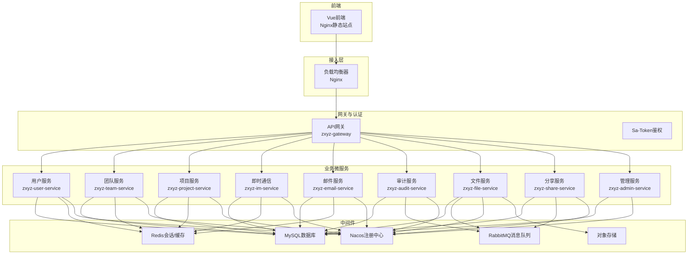

图表来源
- [docker-compose.yml](file://docker-compose.yml)
- [deploy/nginx/default.conf](file://deploy/nginx/default.conf)
- [nacos-config/zxyz-dynamic.yml](file://nacos-config/zxyz-dynamic.yml)

章节来源
- [docker-compose.yml](file://docker-compose.yml)
- [ZXYZdatabaseFront/package.json](file://ZXYZdatabaseFront/package.json)
- [ZXYZdatabaseBack/pom.xml](file://ZXYZdatabaseBack/pom.xml)

## 核心组件
- 网关与鉴权：zxyz-gateway作为统一入口，集成SaToken过滤器，拒绝公网访问内部端点前缀/api/internal/**，并转发至各业务服务。
- 服务注册与配置：Nacos提供注册中心与动态配置；Jasypt用于敏感配置加密。
- 消息与异步：RabbitMQ Topic Exchange zxyz.topic承载异步事件（如审计日志、文件处理）。
- 数据与缓存：MySQL持久化业务数据；Redis用于会话与热点缓存。
- 文件与对象存储：文件服务对接对象存储（OSS）实现大文件分片上传与下载。
- 前端与静态资源：Vue构建产物由Nginx托管，配合反向代理将API请求转发到网关。

章节来源
- [ZXYZdatabaseBack/zxyz-gateway/src/main/java/uno/acloud/gateway/ZxyzGatewayApplication.java](file://ZXYZdatabaseBack/zxyz-gateway/src/main/java/uno/acloud/gateway/ZxyzGatewayApplication.java)
- [nacos-config/zxyz-dynamic.yml](file://nacos-config/zxyz-dynamic.yml)
- [nacos-config/zxyz-static.yml](file://nacos-config/zxyz-static.yml)
- [nacos-config/import.sh](file://nacos-config/import.sh)
- [ZXYZdatabaseBack/zxyz-audit-service/src/main/java/uno/acloud/audit/ZxyzAuditServiceApplication.java](file://ZXYZdatabaseBack/zxyz-audit-service/src/main/java/uno/acloud/audit/ZxyzAuditServiceApplication.java)
- [ZXYZdatabaseBack/zxyz-file-service/src/main/java/uno/acloud/file/ZxyzFileApplication.java](file://ZXYZdatabaseBack/zxyz-file-service/src/main/java/uno/acloud/file/ZxyzFileApplication.java)

## 架构总览
生产环境建议采用多节点部署：
- 接入层：至少两个Nginx实例，配合云厂商LB或Keepalived实现高可用。
- 网关层：zxyz-gateway多副本，无状态设计便于水平扩展。
- 业务服务：每个微服务多副本部署，按负载独立扩缩容。
- 中间件：Nacos集群、RabbitMQ集群、Redis主从+哨兵或集群模式、MySQL主从或MGR。
- 监控与日志：Prometheus+Grafana采集指标，Loki/Promtail收集日志。

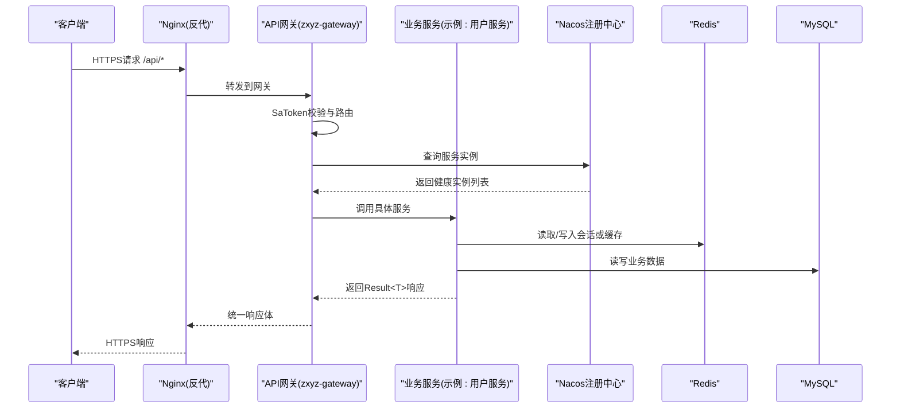

图表来源
- [deploy/nginx/default.conf](file://deploy/nginx/default.conf)
- [ZXYZdatabaseBack/zxyz-gateway/src/main/java/uno/acloud/gateway/ZxyzGatewayApplication.java](file://ZXYZdatabaseBack/zxyz-gateway/src/main/java/uno/acloud/gateway/ZxyzGatewayApplication.java)
- [nacos-config/zxyz-dynamic.yml](file://nacos-config/zxyz-dynamic.yml)

## 详细组件分析

### Nginx反向代理与SSL
- SSL证书：在Nginx中配置HTTPS监听与证书路径，强制HTTP重定向到HTTPS。
- 请求路由：/api/*转发到zxyz-gateway；静态资源直接命中本地缓存。
- 缓存策略：对静态资源启用浏览器缓存与Nginx代理缓存，减少后端压力。
- 性能优化：开启gzip压缩、连接复用、缓冲参数调优、限流与白名单。

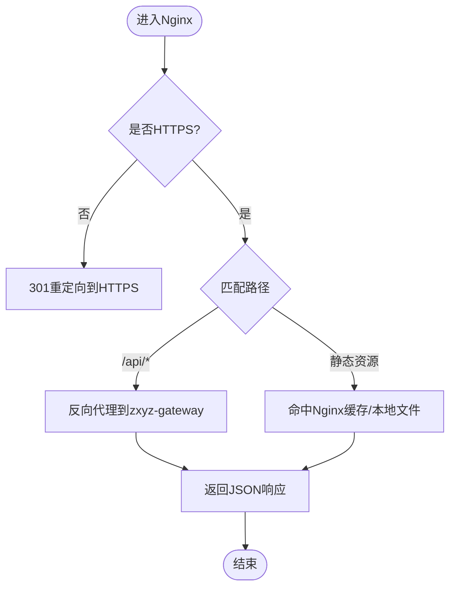

图表来源
- [deploy/nginx/default.conf](file://deploy/nginx/default.conf)
- [deploy/nginx/entrypoint.sh](file://deploy/nginx/entrypoint.sh)

章节来源
- [deploy/nginx/default.conf](file://deploy/nginx/default.conf)
- [deploy/nginx/entrypoint.sh](file://deploy/nginx/entrypoint.sh)

### 服务发现与健康检查（Nacos）
- 服务注册：各微服务启动时向Nacos注册自身实例，包含元数据与端口。
- 动态配置：通过Nacos动态下发配置，支持热更新。
- 健康检查：Nacos定期探测实例健康状态，剔除不健康节点。
- 监控告警：结合Prometheus抓取JVM与应用指标，设置阈值告警。

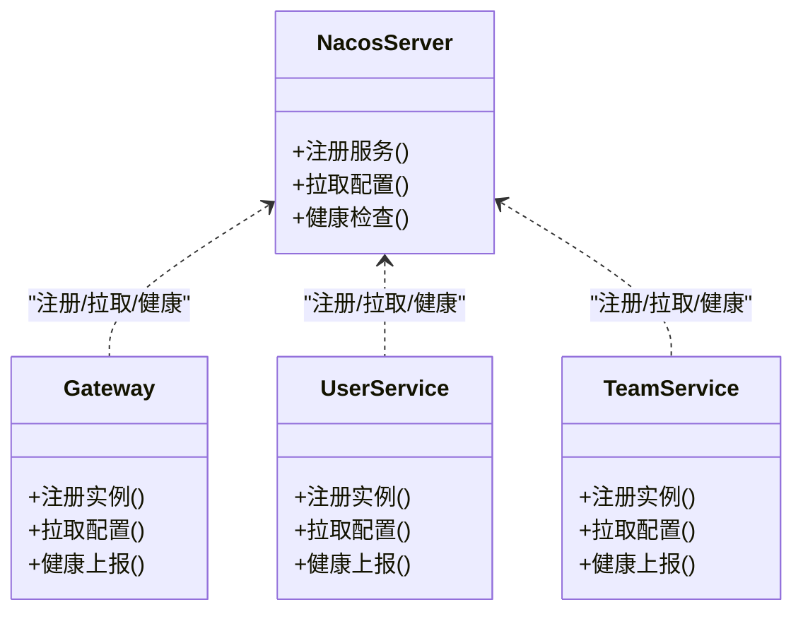

图表来源
- [nacos-config/zxyz-dynamic.yml](file://nacos-config/zxyz-dynamic.yml)
- [nacos-config/zxyz-static.yml](file://nacos-config/zxyz-static.yml)
- [nacos-config/import.sh](file://nacos-config/import.sh)

章节来源
- [nacos-config/zxyz-dynamic.yml](file://nacos-config/zxyz-dynamic.yml)
- [nacos-config/zxyz-static.yml](file://nacos-config/zxyz-static.yml)
- [nacos-config/import.sh](file://nacos-config/import.sh)

### 网关与鉴权（SaToken）
- 统一鉴权：SaToken过滤器校验Cookie中的UUID token与Redis session。
- 内部端点保护：/api/internal/**仅允许内网调用，被网关拒绝公网访问。
- 路由分发：根据路径与规则转发到对应微服务。

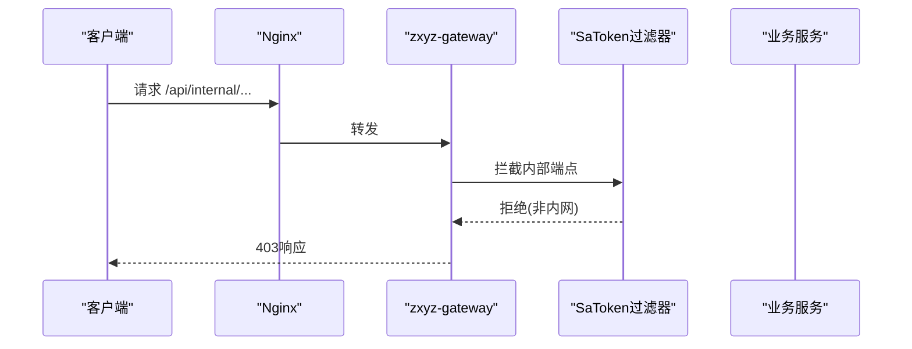

图表来源
- [ZXYZdatabaseBack/zxyz-gateway/src/main/java/uno/acloud/gateway/ZxyzGatewayApplication.java](file://ZXYZdatabaseBack/zxyz-gateway/src/main/java/uno/acloud/gateway/ZxyzGatewayApplication.java)

章节来源
- [ZXYZdatabaseBack/zxyz-gateway/src/main/java/uno/acloud/gateway/ZxyzGatewayApplication.java](file://ZXYZdatabaseBack/zxyz-gateway/src/main/java/uno/acloud/gateway/ZxyzGatewayApplication.java)

### 消息队列（RabbitMQ）
- Topic交换：使用zxyz.topic作为主题，解耦服务间异步通信。
- 消费与重试：消费者处理消息失败进入死信队列，定时清理与重试。
- 审计与文件：审计服务与文件服务通过MQ实现削峰填谷。

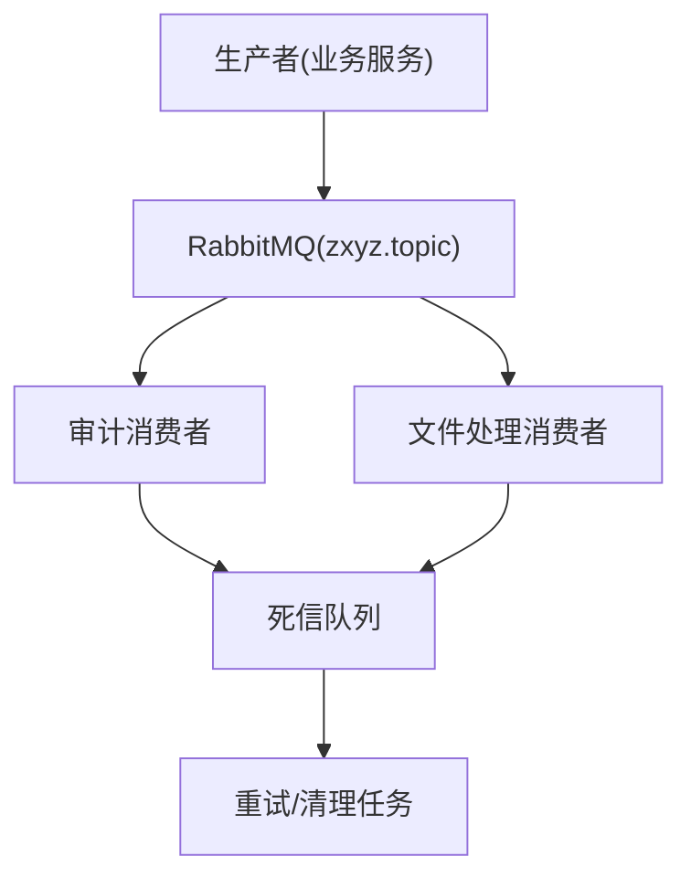

图表来源
- [ZXYZdatabaseBack/zxyz-audit-service/src/main/java/uno/acloud/audit/ZxyzAuditServiceApplication.java](file://ZXYZdatabaseBack/zxyz-audit-service/src/main/java/uno/acloud/audit/ZxyzAuditServiceApplication.java)
- [ZXYZdatabaseBack/zxyz-file-service/src/main/java/uno/acloud/file/ZxyzFileApplication.java](file://ZXYZdatabaseBack/zxyz-file-service/src/main/java/uno/acloud/file/ZxyzFileApplication.java)

章节来源
- [ZXYZdatabaseBack/zxyz-audit-service/src/main/java/uno/acloud/audit/ZxyzAuditServiceApplication.java](file://ZXYZdatabaseBack/zxyz-audit-service/src/main/java/uno/acloud/audit/ZxyzAuditServiceApplication.java)
- [ZXYZdatabaseBack/zxyz-file-service/src/main/java/uno/acloud/file/ZxyzFileApplication.java](file://ZXYZdatabaseBack/zxyz-file-service/src/main/java/uno/acloud/file/ZxyzFileApplication.java)

### 数据库与初始化
- 初始化脚本：sql/00-init-zxyz.sh用于创建库与基础表。
- 迁移管理：各服务db/migration下维护版本化SQL变更。
- 连接池与索引：合理配置连接池大小，针对高频查询建立索引。

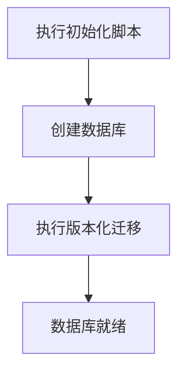

图表来源
- [sql/00-init-zxyz.sh](file://sql/00-init-zxyz.sh)

章节来源
- [sql/00-init-zxyz.sh](file://sql/00-init-zxyz.sh)

### 前端构建与部署
- 构建流程：使用Vite构建Vue应用，输出静态资源。
- 镜像构建：Dockerfile将构建产物与Nginx合并，生成轻量镜像。
- 部署方式：通过Compose或Kubernetes部署Nginx容器。

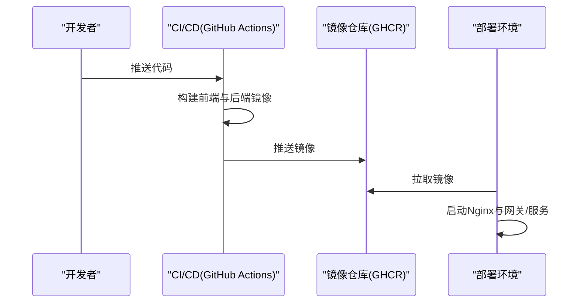

图表来源
- [.github/workflows/ci-cd.yml](file://.github/workflows/ci-cd.yml)
- [ZXYZdatabaseFront/Dockerfile](file://ZXYZdatabaseFront/Dockerfile)
- [Dockerfile](file://Dockerfile)
- [Dockerfile.base](file://Dockerfile.base)

章节来源
- [ZXYZdatabaseFront/package.json](file://ZXYZdatabaseFront/package.json)
- [ZXYZdatabaseFront/Dockerfile](file://ZXYZdatabaseFront/Dockerfile)
- [Dockerfile](file://Dockerfile)
- [Dockerfile.base](file://Dockerfile.base)
- [.github/workflows/ci-cd.yml](file://.github/workflows/ci-cd.yml)

## 依赖关系分析
- 服务间依赖：网关依赖Nacos与服务发现；业务服务依赖数据库、Redis、RabbitMQ与对象存储。
- 外部依赖：Nacos、RabbitMQ、Redis、MySQL、对象存储均为关键外部依赖。
- 耦合度：服务间通过窄端点与投影VO解耦，避免胖DTO传播。

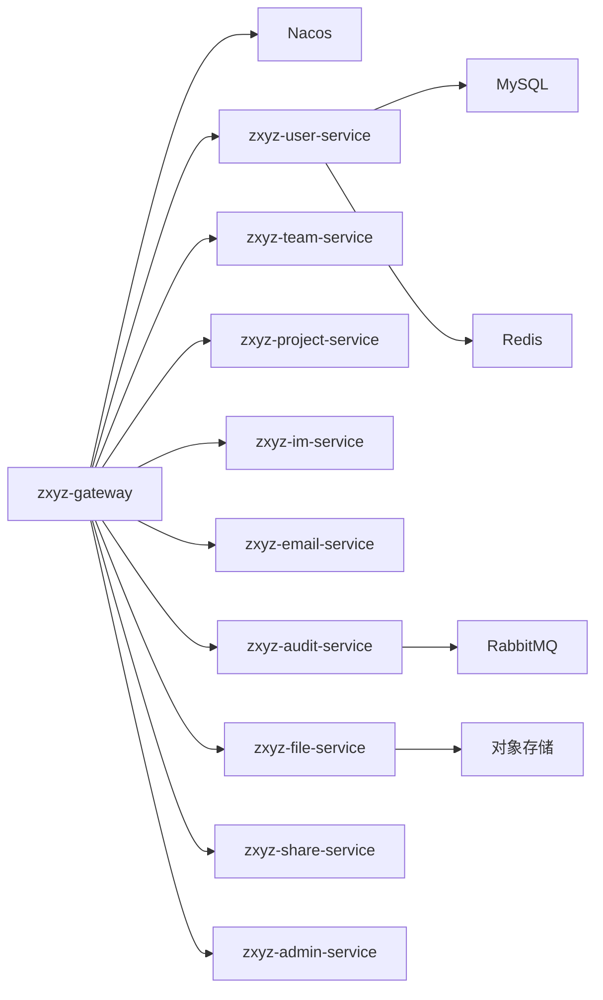

图表来源
- [docker-compose.yml](file://docker-compose.yml)
- [ZXYZdatabaseBack/pom.xml](file://ZXYZdatabaseBack/pom.xml)

章节来源
- [docker-compose.yml](file://docker-compose.yml)
- [ZXYZdatabaseBack/pom.xml](file://ZXYZdatabaseBack/pom.xml)

## 性能与容量规划
- CPU与内存：
  - 网关与无状态服务：2C4G起步，按QPS线性扩展。
  - 数据库：8C16G以上，SSD盘，IOPS与带宽评估。
  - Redis：4C8G，内存命中率>95%。
  - RabbitMQ：4C8G，磁盘与内存按消息吞吐调整。
- 连接池与线程池：
  - 数据库连接池：根据并发与慢查询调优。
  - Tomcat线程数：根据CPU核数与请求耗时设定。
- 缓存策略：
  - 热点数据入Redis，设置过期与防穿透。
  - Nginx静态资源缓存与CDN加速。
- 监控指标：
  - JVM堆、GC、线程、连接池、慢查询、错误率、延迟P95/P99。

[本节为通用指导，无需特定文件引用]

## 安全加固
- 防火墙与网络安全组：
  - 仅开放80/443对外，内网端口限制IP白名单。
  - 数据库与中间件仅内网可达。
- 访问控制：
  - SaToken鉴权与HttpOnly Cookie。
  - 内部端点/api/internal/**禁止公网访问。
- TLS与证书：
  - Nginx强制HTTPS，启用HSTS与强加密套件。
- 密钥管理：
  - Jasypt加密敏感配置，密钥集中管理。
- 审计与日志：
  - 操作审计落库与异步发送，保留周期与脱敏。

章节来源
- [ZXYZdatabaseBack/zxyz-gateway/src/main/java/uno/acloud/gateway/ZxyzGatewayApplication.java](file://ZXYZdatabaseBack/zxyz-gateway/src/main/java/uno/acloud/gateway/ZxyzGatewayApplication.java)
- [nacos-config/zxyz-dynamic.yml](file://nacos-config/zxyz-dynamic.yml)
- [nacos-config/zxyz-static.yml](file://nacos-config/zxyz-static.yml)

## 备份与灾难恢复
- 数据库备份：
  - 全量+增量备份，异地存储，定期验证恢复。
- 文件备份：
  - 对象存储开启版本化与跨区域复制。
- 配置备份：
  - Nacos配置导出与Git版本化管理。
- 恢复演练：
  - 定期演练RTO/RPO目标，记录恢复步骤。

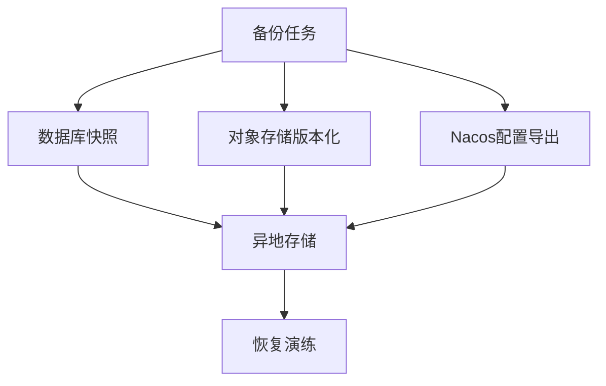

图表来源
- [scripts/backup.sh](file://scripts/backup.sh)
- [nacos-config/import.sh](file://nacos-config/import.sh)

章节来源
- [scripts/backup.sh](file://scripts/backup.sh)
- [nacos-config/import.sh](file://nacos-config/import.sh)

## 扩容缩容策略
- 水平扩展：
  - 无状态服务（网关与各业务服务）增加副本数量，Nacos自动发现。
  - Nginx多实例+LB，提升接入能力。
- 垂直扩缩容：
  - 数据库与中间件升级CPU/内存，注意停机窗口与主从切换。
- 滚动发布：
  - 分批替换实例，保证零停机。
- 回滚策略：
  - 镜像版本管理与快速回滚脚本。

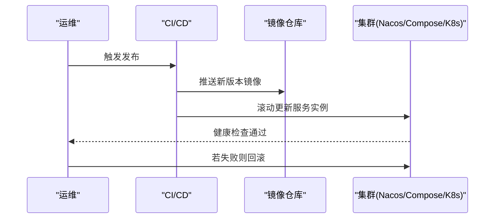

图表来源
- [.github/workflows/ci-cd.yml](file://.github/workflows/ci-cd.yml)
- [scripts/deploy-fast.sh](file://scripts/deploy-fast.sh)
- [scripts/rollback.sh](file://scripts/rollback.sh)

章节来源
- [.github/workflows/ci-cd.yml](file://.github/workflows/ci-cd.yml)
- [scripts/deploy-fast.sh](file://scripts/deploy-fast.sh)
- [scripts/rollback.sh](file://scripts/rollback.sh)

## 故障排查指南
- 健康检查：
  - 使用health-check.sh检测服务存活与依赖连通性。
- 日志定位：
  - 查看Nginx访问与错误日志；服务日志聚合到Promtail/Loki。
- 常见问题：
  - Nacos注册失败：检查网络与配置导入。
  - 数据库连接超时：检查连接池与慢查询。
  - 消息堆积：检查消费者与死信队列。
- 回滚与应急：
  - 使用rollback.sh快速回滚到上一稳定版本。

章节来源
- [scripts/health-check.sh](file://scripts/health-check.sh)
- [scripts/rollback.sh](file://scripts/rollback.sh)
- [deploy/nginx/default.conf](file://deploy/nginx/default.conf)

## 结论
通过Nginx高可用接入、网关统一鉴权与路由、Nacos服务注册与动态配置、RabbitMQ异步解耦、Redis与MySQL的可靠存储，以及完善的CI/CD与备份恢复机制，ZXYZ在生产环境可实现高可用、可扩展与安全可控的部署。建议持续完善监控告警与容量规划，定期进行演练与优化。