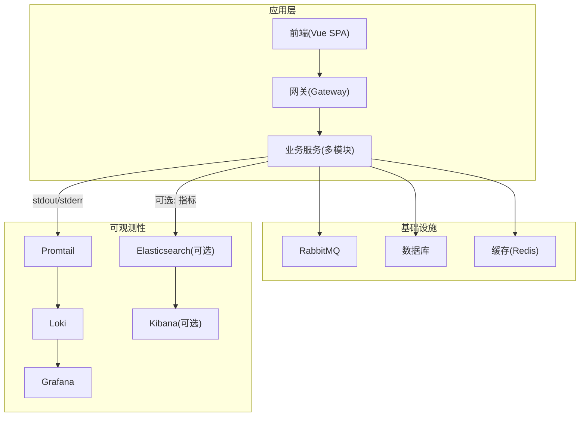
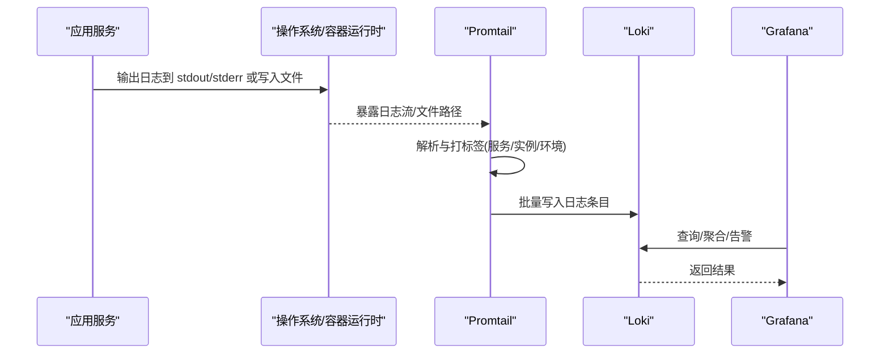
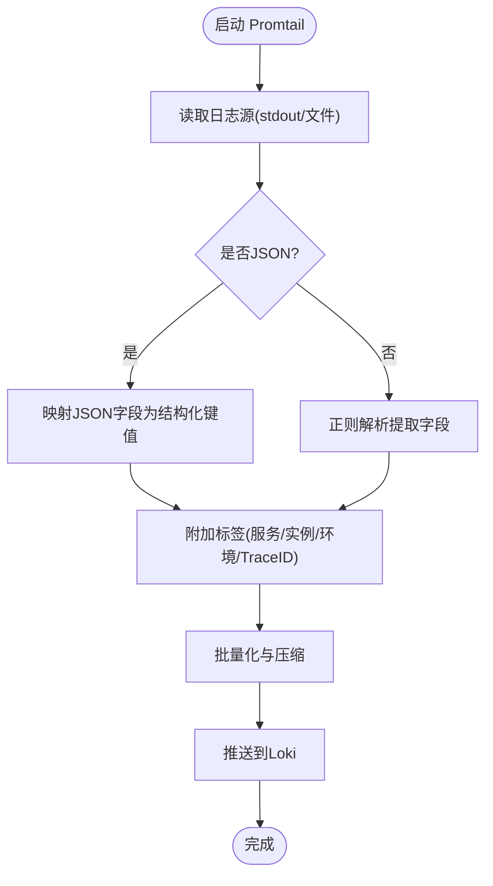
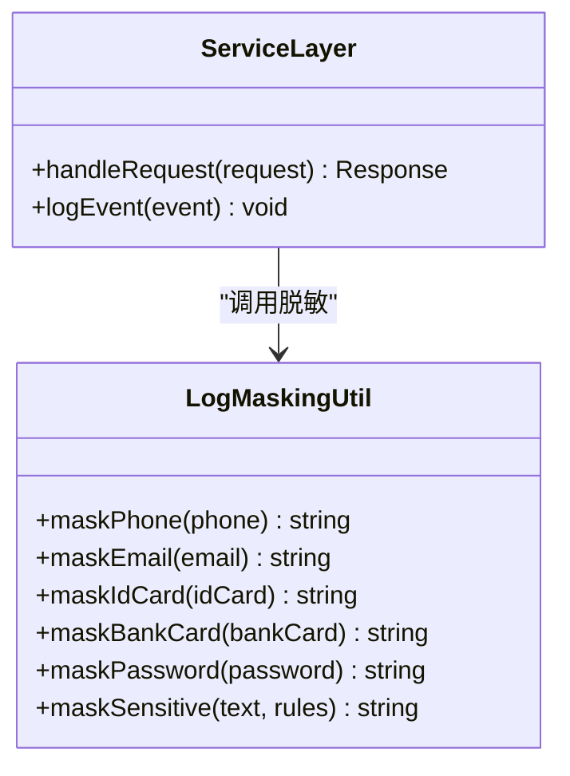
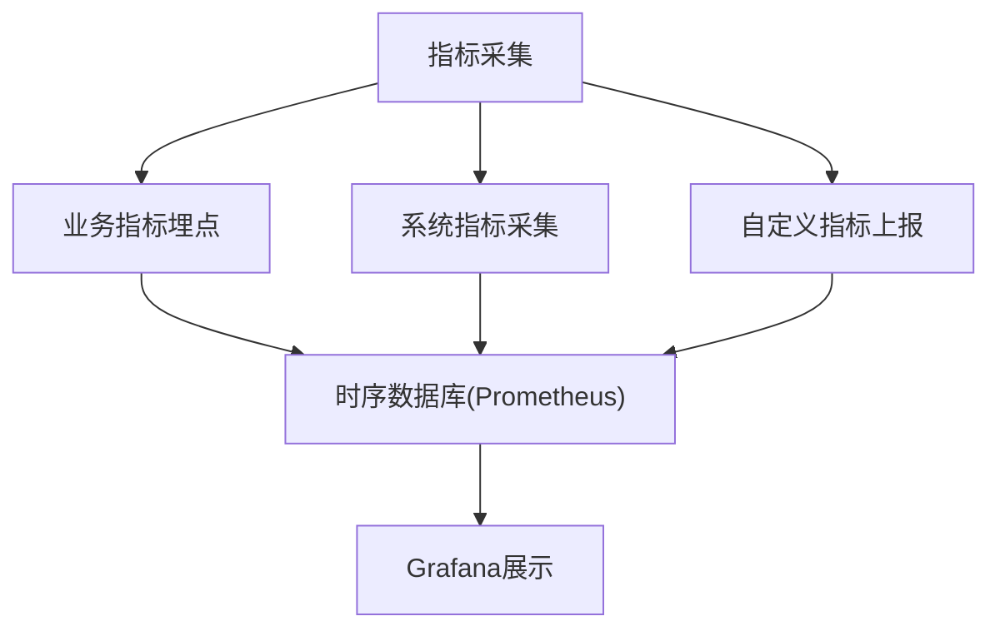
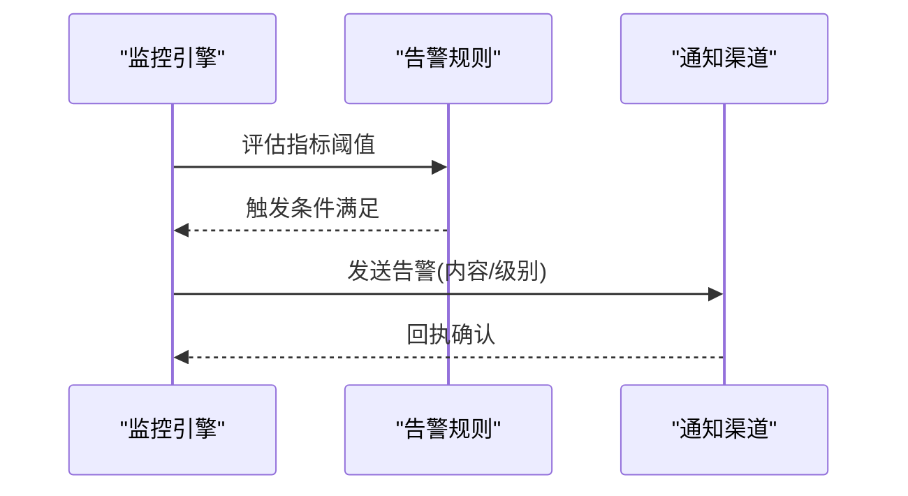
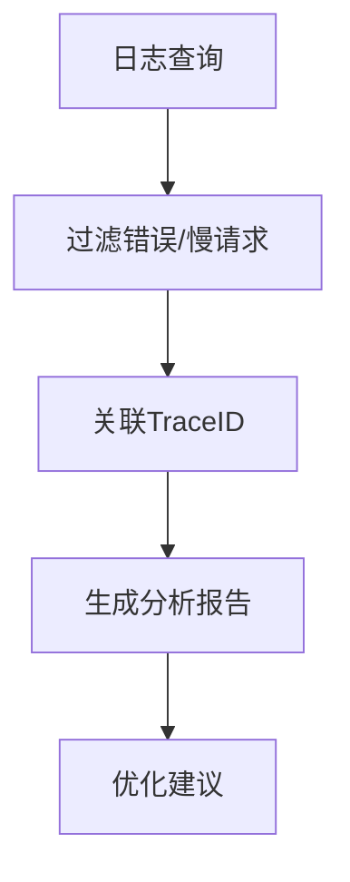
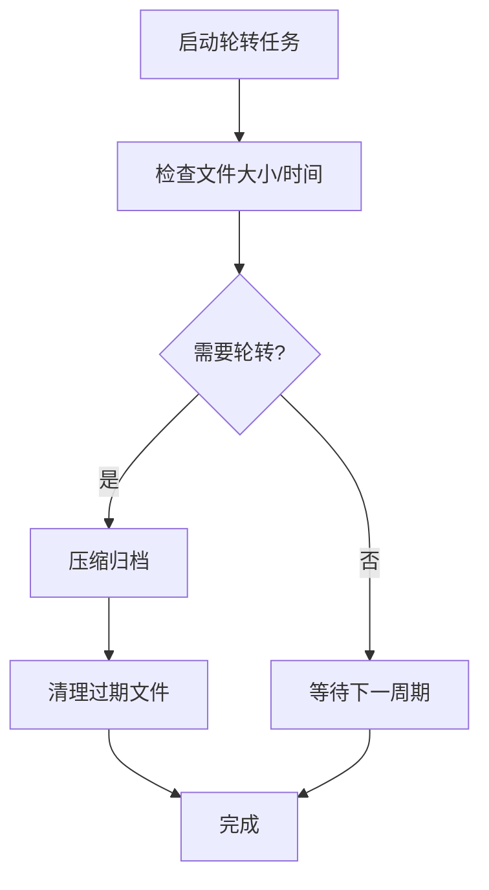
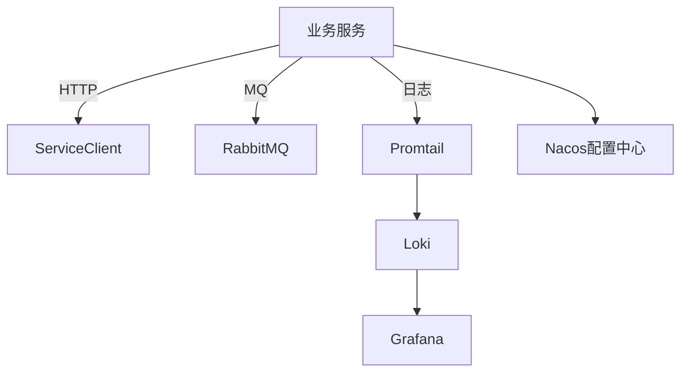

# 监控日志收集

<cite>
**本文引用的文件**   
- [deploy/promtail-config.yml](file://deploy/promtail-config.yml)
- [docker-compose.yml](file://docker-compose.yml)
- [ZXYZdatabaseBack/zxyz-common/src/main/java/uno/acloud/common/util/LogMaskingUtil.java](file://ZXYZdatabaseBack/zxyz-common/src/main/java/uno/acloud/common/util/LogMaskingUtil.java)
- [ZXYZdatabaseFront/src/utils/logger.js](file://ZXYZdatabaseFront/src/utils/logger.js)
- [ZXYZdatabaseBack/zxyz-audit-service/src/main/java/uno/acloud/audit/service/AuditLogCleanupService.java](file://ZXYZdatabaseBack/zxyz-audit-service/src/main/java/uno/acloud/audit/service/AuditLogCleanupService.java)
- [ZXYZdatabaseBack/zxyz-audit-service/src/main/resources/application-dev.yml](file://ZXYZdatabaseBack/zxyz-audit-service/src/main/resources/application-dev.yml)
- [ZXYZdatabaseBack/zxyz-audit-service/src/main/resources/application-prod.yml](file://ZXYZdatabaseBack/zxyz-audit-service/src/main/resources/application-prod.yml)
- [ZXYZdatabaseBack/zxyz-admin-service/src/main/resources/application-dev.yml](file://ZXYZdatabaseBack/zxyz-admin-service/src/main/resources/application-dev.yml)
- [ZXYZdatabaseBack/zxyz-admin-service/src/main/resources/application-prod.yml](file://ZXYZdatabaseBack/zxyz-admin-service/src/main/resources/application-prod.yml)
- [ZXYZdatabaseBack/zxyz-email-service/src/main/resources/application-dev.yml](file://ZXYZdatabaseBack/zxyz-email-service/src/main/resources/application-dev.yml)
- [ZXYZdatabaseBack/zxyz-email-service/src/main/resources/application-prod.yml](file://ZXYZdatabaseBack/zxyz-email-service/src/main/resources/application-prod.yml)
- [ZXYZdatabaseBack/zxyz-file-service/src/main/resources/application-dev.yml](file://ZXYZdatabaseBack/zxyz-file-service/src/main/resources/application-dev.yml)
- [ZXYZdatabaseBack/zxyz-file-service/src/main/resources/application-prod.yml](file://ZXYZdatabaseBack/zxyz-file-service/src/main/resources/application-prod.yml)
- [ZXYZdatabaseBack/zxyz-gateway/src/main/resources/application.yml](file://ZXYZdatabaseBack/zxyz-gateway/src/main/resources/application.yml)
- [ZXYZdatabaseBack/zxyz-im-service/src/main/resources/application-dev.yml](file://ZXYZdatabaseBack/zxyz-im-service/src/main/resources/application-dev.yml)
- [ZXYZdatabaseBack/zxyz-im-service/src/main/resources/application-prod.yml](file://ZXYZdatabaseBack/zxyz-im-service/src/main/resources/application-prod.yml)
- [ZXYZdatabaseBack/zxyz-project-service/src/main/resources/application-dev.yml](file://ZXYZdatabaseBack/zxyz-project-service/src/main/resources/application-dev.yml)
- [ZXYZdatabaseBack/zxyz-project-service/src/main/resources/application-prod.yml](file://ZXYZdatabaseBack/zxyz-project-service/src/main/resources/application-prod.yml)
- [ZXYZdatabaseBack/zxyz-share-service/src/main/resources/application-dev.yml](file://ZXYZdatabaseBack/zxyz-share-service/src/main/resources/application-dev.yml)
- [ZXYZdatabaseBack/zxyz-share-service/src/main/resources/application-prod.yml](file://ZXYZdatabaseBack/zxyz-share-service/src/main/resources/application-prod.yml)
- [ZXYZdatabaseBack/zxyz-team-service/src/main/resources/application-dev.yml](file://ZXYZdatabaseBack/zxyz-team-service/src/main/resources/application-dev.yml)
- [ZXYZdatabaseBack/zxyz-team-service/src/main/resources/application-prod.yml](file://ZXYZdatabaseBack/zxyz-team-service/src/main/resources/application-prod.yml)
- [ZXYZdatabaseBack/zxyz-user-service/src/main/resources/application-dev.yml](file://ZXYZdatabaseBack/zxyz-user-service/src/main/resources/application-dev.yml)
- [ZXYZdatabaseBack/zxyz-user-service/src/main/resources/application-prod.yml](file://ZXYZdatabaseBack/zxyz-user-service/src/main/resources/application-prod.yml)
- [nacos-config/zxyz-static.yml](file://nacos-config/zxyz-static.yml)
- [nacos-config/zxyz-dynamic.yml](file://nacos-config/zxyz-dynamic.yml)
- [scripts/health-check.sh](file://scripts/health-check.sh)
- [DEPLOYMENT.md](file://DEPLOYMENT.md)
</cite>

## 目录
1. [简介](#简介)
2. [项目结构](#项目结构)
3. [核心组件](#核心组件)
4. [架构总览](#架构总览)
5. [详细组件分析](#详细组件分析)
6. [依赖关系分析](#依赖关系分析)
7. [性能考虑](#性能考虑)
8. [故障排查指南](#故障排查指南)
9. [结论](#结论)
10. [附录](#附录)

## 简介
本文件为 ZXYZ 项目的“监控日志收集系统”文档，覆盖以下关键主题：
- Promtail 日志采集配置与日志格式解析、字段提取、结构化输出
- 日志聚合方案（ELK Stack 或 Loki+Grafana）部署与集成要点
- 应用日志规范（级别、格式标准、敏感信息脱敏 LogMaskingUtil）
- 监控指标定义（业务指标、系统指标、自定义指标）
- 告警规则配置（阈值、级别、通知渠道）
- 日志分析技巧（错误追踪、性能分析、用户行为分析）
- 日志轮转与清理策略（存储空间管理与合规性要求）

## 项目结构
ZXYZ 采用微服务架构，后端包含多个独立 Maven 模块，前端为 Vue 3 SPA。日志相关的关键位置包括：
- 部署编排与容器化：docker-compose.yml
- Promtail 采集配置：deploy/promtail-config.yml
- 各服务日志框架与输出配置：各服务的 application-*.yml
- 审计与清理：zxyz-audit-service 中的清理服务
- 前端日志工具：src/utils/logger.js
- Nacos 静态与动态配置：nacos-config/*.yml

图表来源
- [docker-compose.yml](file://docker-compose.yml)
- [deploy/promtail-config.yml](file://deploy/promtail-config.yml)

章节来源
- [docker-compose.yml](file://docker-compose.yml)
- [DEPLOYMENT.md](file://DEPLOYMENT.md)

## 核心组件
- Promtail：负责在各服务节点采集 stdout/stderr 与应用日志文件，进行解析与标签化后推送至 Loki。
- Loki/Grafana：存储与可视化日志；Grafana 提供查询、仪表盘与告警。
- 应用日志框架：Spring Boot 默认日志（如 Logback），通过 application-*.yml 控制级别与输出格式。
- 审计与清理：AuditLogCleanupService 负责审计日志的定期清理与归档。
- 前端日志：logger.js 统一前端日志输出，便于浏览器控制台与后续上报。

章节来源
- [deploy/promtail-config.yml](file://deploy/promtail-config.yml)
- [ZXYZdatabaseBack/zxyz-audit-service/src/main/java/uno/acloud/audit/service/AuditLogCleanupService.java](file://ZXYZdatabaseBack/zxyz-audit-service/src/main/java/uno/acloud/audit/service/AuditLogCleanupService.java)
- [ZXYZdatabaseFront/src/utils/logger.js](file://ZXYZdatabaseFront/src/utils/logger.js)

## 架构总览
Promtail 作为 Agent 部署在每个运行服务的 Pod/容器中，读取标准输出与本地日志文件，按服务名、实例、环境等标签进行结构化处理，并批量写入 Loki。Grafana 通过数据源连接 Loki，实现日志检索、聚合与告警。

图表来源
- [deploy/promtail-config.yml](file://deploy/promtail-config.yml)
- [docker-compose.yml](file://docker-compose.yml)

## 详细组件分析

### Promtail 日志采集与解析
- 采集目标：
  - 容器标准输出（stdout/stderr）
  - 应用日志文件（按服务目录组织）
- 解析与字段提取：
  - 使用正则表达式匹配日志行，提取时间戳、级别、线程、类名、消息体等
  - 将上下文信息（traceId、spanId、userId、service、env、instance）注入为标签，便于查询与聚合
- 结构化输出：
  - 将 JSON 日志直接映射为键值对，非 JSON 日志通过正则抽取关键字段
  - 统一字段命名规范，确保跨服务一致性

图表来源
- [deploy/promtail-config.yml](file://deploy/promtail-config.yml)

章节来源
- [deploy/promtail-config.yml](file://deploy/promtail-config.yml)

### 应用日志规范与脱敏
- 日志级别：
  - 建议统一使用 DEBUG/INFO/WARN/ERROR/FATAL，避免自定义级别
  - 生产环境默认 INFO，调试时按需开启 DEBUG
- 格式标准：
  - 推荐 JSON 格式，包含必要字段：timestamp、level、service、instance、traceId、spanId、message
  - 非 JSON 需遵循固定模板，保证正则解析稳定
- 敏感信息脱敏：
  - 使用 LogMaskingUtil 对手机号、邮箱、身份证、银行卡号、密码等敏感字段进行掩码处理
  - 在业务方法入口与异常捕获处调用脱敏工具，确保不泄露敏感数据

图表来源
- [ZXYZdatabaseBack/zxyz-common/src/main/java/uno/acloud/common/util/LogMaskingUtil.java](file://ZXYZdatabaseBack/zxyz-common/src/main/java/uno/acloud/common/util/LogMaskingUtil.java)

章节来源
- [ZXYZdatabaseBack/zxyz-common/src/main/java/uno/acloud/common/util/LogMaskingUtil.java](file://ZXYZdatabaseBack/zxyz-common/src/main/java/uno/acloud/common/util/LogMaskingUtil.java)

### 日志聚合方案（Loki+Grafana / ELK）
- Loki+Grafana（推荐）：
  - Promtail 采集 → Loki 存储 → Grafana 查询/告警
  - 优势：资源占用低、查询灵活、与 Prometheus 生态兼容
- ELK Stack（可选）：
  - Filebeat/Fluentd 采集 → Elasticsearch 存储 → Kibana 可视化
  - 优势：全文检索能力强、生态丰富
- 部署要点：
  - docker-compose 中编排 Loki、Grafana、Promtail
  - Nacos 管理应用日志级别与输出格式
  - 环境变量与密钥通过 Jasypt 加密

图表来源
- [docker-compose.yml](file://docker-compose.yml)
- [DEPLOYMENT.md](file://DEPLOYMENT.md)

章节来源
- [docker-compose.yml](file://docker-compose.yml)
- [DEPLOYMENT.md](file://DEPLOYMENT.md)

### 监控指标定义
- 业务指标：
  - 请求量、成功率、延迟分位（P50/P95/P99）、错误率
  - 用户行为：登录次数、操作频次、分享访问数
- 系统指标：
  - CPU、内存、磁盘、网络、JVM GC、线程池
- 自定义指标：
  - 队列积压、重试次数、外部依赖超时、缓存命中率

[本节为概念性说明，无需代码来源]

### 告警规则配置
- 阈值设置：
  - 错误率 > 5%（5分钟窗口）
  - P99 延迟 > 2s
  - JVM 堆使用率 > 85%
- 告警级别：
  - 提示（Info）、警告（Warn）、严重（Critical）
- 通知渠道：
  - 企业微信、钉钉、邮件、短信、PagerDuty

[本节为概念性说明，无需代码来源]

### 日志分析技巧
- 错误追踪：
  - 基于 traceId 串联跨服务调用链
  - 过滤 ERROR 级别并按堆栈排序
- 性能分析：
  - 统计慢请求（>1s）与热点接口
  - 结合 JVM 指标定位瓶颈
- 用户行为分析：
  - 统计用户操作序列与转化漏斗
  - 识别异常行为（高频失败、重复提交）

[本节为概念性说明，无需代码来源]

### 日志轮转与清理策略
- 轮转策略：
  - 按大小（如 100MB）或时间（每日）轮转
  - 保留最近 N 天日志，过期自动删除
- 清理策略：
  - AuditLogCleanupService 定时清理审计日志
  - 结合文件系统配额与磁盘监控
- 合规性：
  - 敏感日志脱敏
  - 保留周期符合法规要求（如 GDPR、网络安全法）

图表来源
- [ZXYZdatabaseBack/zxyz-audit-service/src/main/java/uno/acloud/audit/service/AuditLogCleanupService.java](file://ZXYZdatabaseBack/zxyz-audit-service/src/main/java/uno/acloud/audit/service/AuditLogCleanupService.java)

章节来源
- [ZXYZdatabaseBack/zxyz-audit-service/src/main/java/uno/acloud/audit/service/AuditLogCleanupService.java](file://ZXYZdatabaseBack/zxyz-audit-service/src/main/java/uno/acloud/audit/service/AuditLogCleanupService.java)

## 依赖关系分析
- 服务间通信：
  - 同步：ServiceClient + X-Internal-Service-Token
  - 异步：RabbitMQ Topic Exchange zxyz.topic
- 配置管理：
  - Nacos 集中管理 application-*.yml 与动态配置
- 可观测性：
  - Promtail → Loki → Grafana
  - 可选 ELK 替代方案

图表来源
- [docker-compose.yml](file://docker-compose.yml)
- [nacos-config/zxyz-static.yml](file://nacos-config/zxyz-static.yml)
- [nacos-config/zxyz-dynamic.yml](file://nacos-config/zxyz-dynamic.yml)

章节来源
- [docker-compose.yml](file://docker-compose.yml)
- [nacos-config/zxyz-static.yml](file://nacos-config/zxyz-static.yml)
- [nacos-config/zxyz-dynamic.yml](file://nacos-config/zxyz-dynamic.yml)

## 性能考虑
- 日志输出：
  - 避免在热路径打印大量 DEBUG 日志
  - 使用异步日志框架（如 Logback AsyncAppender）
- 采集与存储：
  - Promtail 批量写入，合理设置 batch_size 与 flush_interval
  - Loki 分片与索引优化，避免高基数标签
- 查询性能：
  - 使用精确标签过滤，减少全表扫描
  - 预聚合常用指标，降低实时计算压力

[本节为通用指导，无需代码来源]

## 故障排查指南
- 常见问题：
  - Promtail 无法连接 Loki：检查网络与认证配置
  - 日志未解析：验证正则表达式与 JSON 格式
  - 磁盘空间不足：调整轮转策略与清理任务
- 诊断步骤：
  - 查看 Promtail 日志与状态端点
  - 使用 Grafana 查询 Loki 验证数据流入
  - 检查应用日志级别与输出格式

章节来源
- [scripts/health-check.sh](file://scripts/health-check.sh)

## 结论
通过 Promtail + Loki + Grafana 构建的日志体系，ZXYZ 实现了统一的日志采集、结构化解析与可视化分析。结合严格的日志规范与脱敏机制，保障了数据安全与可观测性。未来可进一步引入 ELK 增强全文检索能力，并完善告警与指标联动，提升运维效率与系统稳定性。

[本节为总结性内容，无需代码来源]

## 附录
- 参考配置：
  - Promtail 配置：deploy/promtail-config.yml
  - 各服务日志配置：application-*.yml
  - 审计清理服务：AuditLogCleanupService
  - 前端日志工具：logger.js
- 部署文档：DEPLOYMENT.md

章节来源
- [deploy/promtail-config.yml](file://deploy/promtail-config.yml)
- [ZXYZdatabaseBack/zxyz-audit-service/src/main/resources/application-dev.yml](file://ZXYZdatabaseBack/zxyz-audit-service/src/main/resources/application-dev.yml)
- [ZXYZdatabaseBack/zxyz-audit-service/src/main/resources/application-prod.yml](file://ZXYZdatabaseBack/zxyz-audit-service/src/main/resources/application-prod.yml)
- [ZXYZdatabaseBack/zxyz-admin-service/src/main/resources/application-dev.yml](file://ZXYZdatabaseBack/zxyz-admin-service/src/main/resources/application-dev.yml)
- [ZXYZdatabaseBack/zxyz-admin-service/src/main/resources/application-prod.yml](file://ZXYZdatabaseBack/zxyz-admin-service/src/main/resources/application-prod.yml)
- [ZXYZdatabaseBack/zxyz-email-service/src/main/resources/application-dev.yml](file://ZXYZdatabaseBack/zxyz-email-service/src/main/resources/application-dev.yml)
- [ZXYZdatabaseBack/zxyz-email-service/src/main/resources/application-prod.yml](file://ZXYZdatabaseBack/zxyz-email-service/src/main/resources/application-prod.yml)
- [ZXYZdatabaseBack/zxyz-file-service/src/main/resources/application-dev.yml](file://ZXYZdatabaseBack/zxyz-file-service/src/main/resources/application-dev.yml)
- [ZXYZdatabaseBack/zxyz-file-service/src/main/resources/application-prod.yml](file://ZXYZdatabaseBack/zxyz-file-service/src/main/resources/application-prod.yml)
- [ZXYZdatabaseBack/zxyz-gateway/src/main/resources/application.yml](file://ZXYZdatabaseBack/zxyz-gateway/src/main/resources/application.yml)
- [ZXYZdatabaseBack/zxyz-im-service/src/main/resources/application-dev.yml](file://ZXYZdatabaseBack/zxyz-im-service/src/main/resources/application-dev.yml)
- [ZXYZdatabaseBack/zxyz-im-service/src/main/resources/application-prod.yml](file://ZXYZdatabaseBack/zxyz-im-service/src/main/resources/application-prod.yml)
- [ZXYZdatabaseBack/zxyz-project-service/src/main/resources/application-dev.yml](file://ZXYZdatabaseBack/zxyz-project-service/src/main/resources/application-dev.yml)
- [ZXYZdatabaseBack/zxyz-project-service/src/main/resources/application-prod.yml](file://ZXYZdatabaseBack/zxyz-project-service/src/main/resources/application-prod.yml)
- [ZXYZdatabaseBack/zxyz-share-service/src/main/resources/application-dev.yml](file://ZXYZdatabaseBack/zxyz-share-service/src/main/resources/application-dev.yml)
- [ZXYZdatabaseBack/zxyz-share-service/src/main/resources/application-prod.yml](file://ZXYZdatabaseBack/zxyz-share-service/src/main/resources/application-prod.yml)
- [ZXYZdatabaseBack/zxyz-team-service/src/main/resources/application-dev.yml](file://ZXYZdatabaseBack/zxyz-team-service/src/main/resources/application-dev.yml)
- [ZXYZdatabaseBack/zxyz-team-service/src/main/resources/application-prod.yml](file://ZXYZdatabaseBack/zxyz-team-service/src/main/resources/application-prod.yml)
- [ZXYZdatabaseBack/zxyz-user-service/src/main/resources/application-dev.yml](file://ZXYZdatabaseBack/zxyz-user-service/src/main/resources/application-dev.yml)
- [ZXYZdatabaseBack/zxyz-user-service/src/main/resources/application-prod.yml](file://ZXYZdatabaseBack/zxyz-user-service/src/main/resources/application-prod.yml)
- [DEPLOYMENT.md](file://DEPLOYMENT.md)