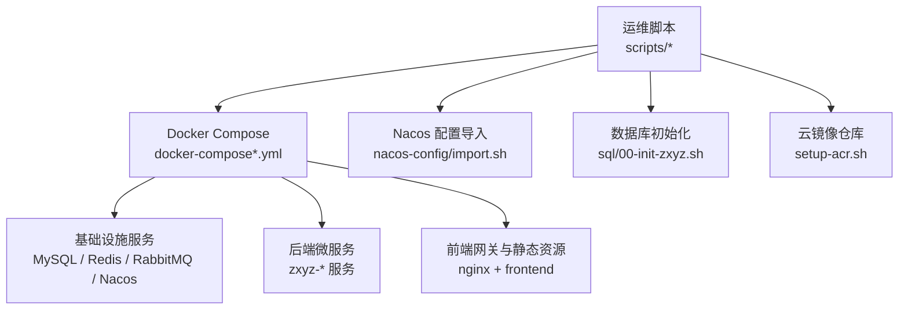
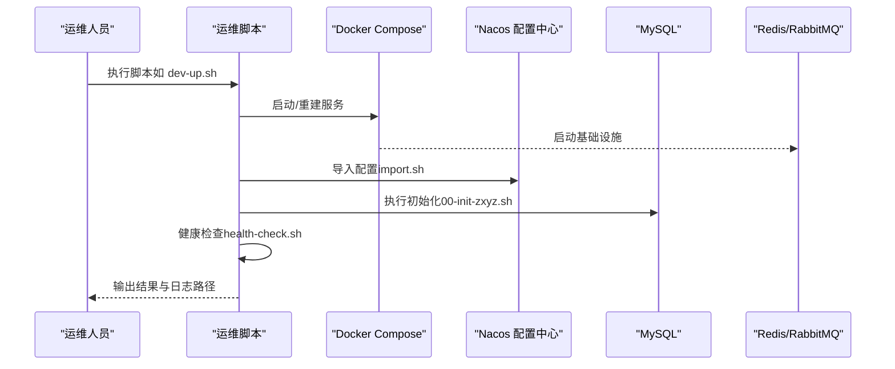
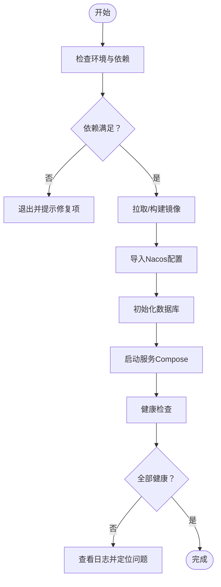
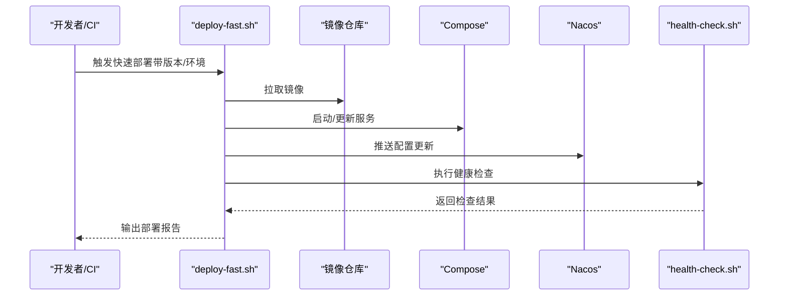
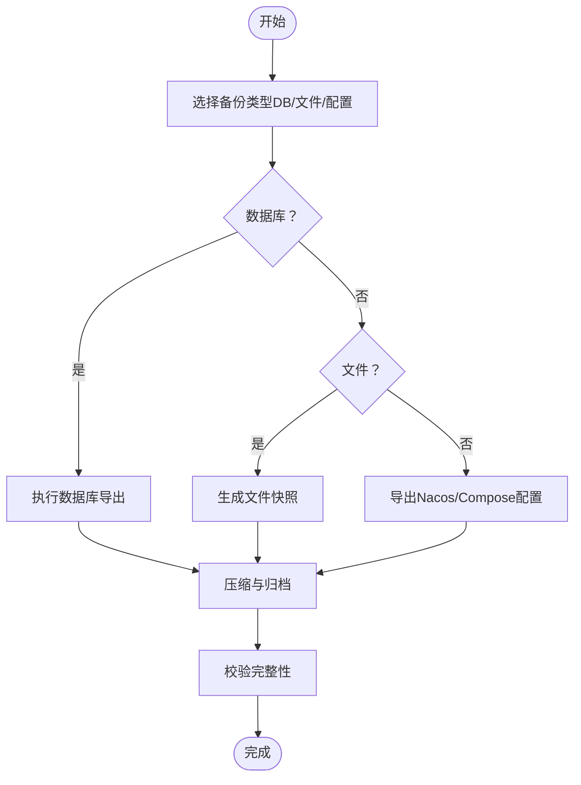
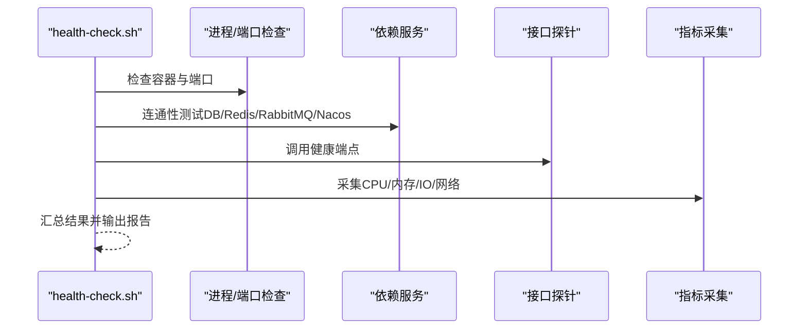
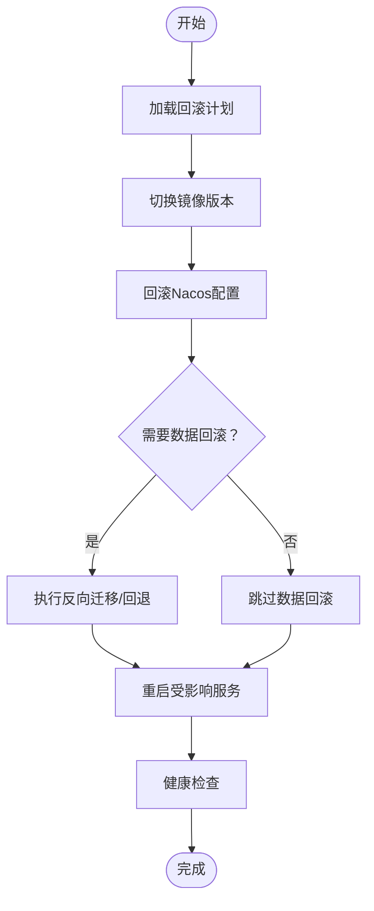
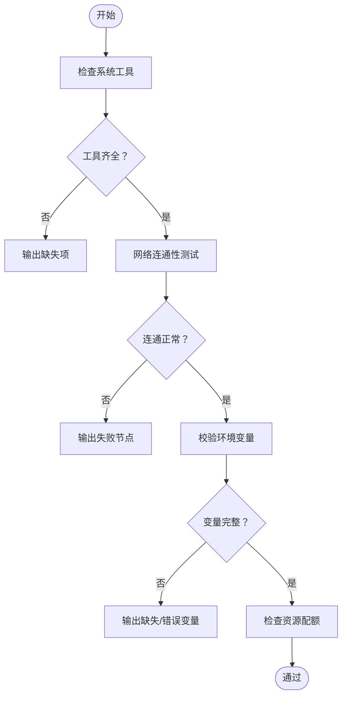
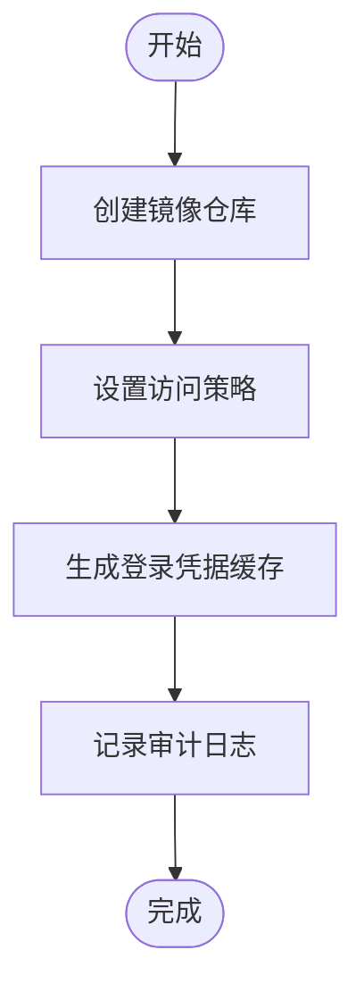
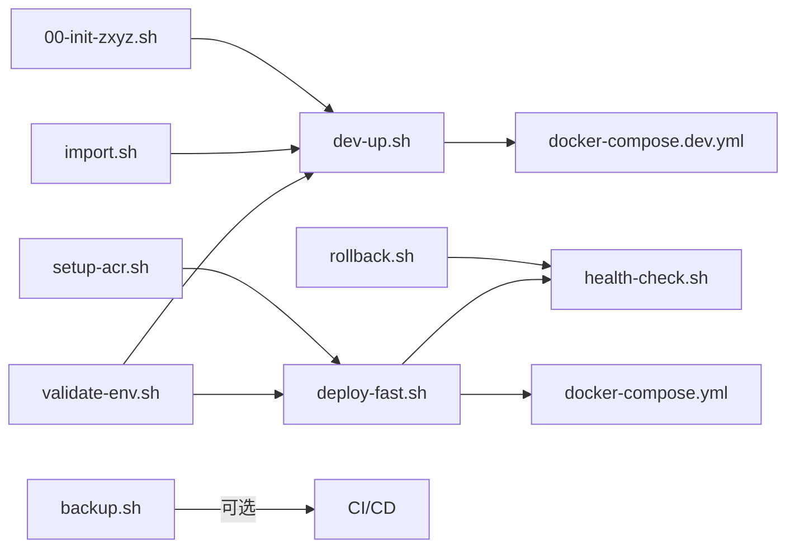

# 运维脚本工具

<cite>
**本文引用的文件**   
- [scripts/dev-up.sh](file://scripts/dev-up.sh)
- [scripts/deploy-fast.sh](file://scripts/deploy-fast.sh)
- [scripts/backup.sh](file://scripts/backup.sh)
- [scripts/health-check.sh](file://scripts/health-check.sh)
- [scripts/rollback.sh](file://scripts/rollback.sh)
- [scripts/validate-env.sh](file://scripts/validate-env.sh)
- [scripts/setup-acr.sh](file://scripts/setup-acr.sh)
- [docker-compose.yml](file://docker-compose.yml)
- [docker-compose.dev.yml](file://docker-compose.dev.yml)
- [nacos-config/import.sh](file://nacos-config/import.sh)
- [sql/00-init-zxyz.sh](file://sql/00-init-zxyz.sh)
- [DEPLOYMENT.md](file://DEPLOYMENT.md)
</cite>

## 目录
1. [简介](#简介)
2. [项目结构](#项目结构)
3. [核心组件](#核心组件)
4. [架构总览](#架构总览)
5. [详细组件分析](#详细组件分析)
6. [依赖关系分析](#依赖关系分析)
7. [性能与可靠性考虑](#性能与可靠性考虑)
8. [故障排查指南](#故障排查指南)
9. [结论](#结论)
10. [附录](#附录)

## 简介
本文件面向ZXYZ项目的运维工程师与交付人员，系统化说明根目录下 scripts 目录中的运维脚本工具。内容覆盖开发环境一键启动、快速部署、备份恢复、健康检查、回滚、环境验证以及Azure Container Registry（ACR）初始化配置等关键流程。文档同时结合 Docker Compose 编排与 Nacos 配置中心，给出端到端的使用指引与排错建议。

## 项目结构
ZXYZ采用微服务架构，后端由多个 Maven 模块组成，前端为 Vue 应用；容器化通过 Docker Compose 编排，Nacos 作为配置与服务注册中心，RabbitMQ 用于异步消息，MySQL 提供持久化存储。运维脚本集中在 scripts 目录，配合 docker-compose.*.yml 与 nacos-config 完成环境准备、部署与运维操作。

图表来源
- [docker-compose.yml](file://docker-compose.yml)
- [docker-compose.dev.yml](file://docker-compose.dev.yml)
- [nacos-config/import.sh](file://nacos-config/import.sh)
- [sql/00-init-zxyz.sh](file://sql/00-init-zxyz.sh)

章节来源
- [DEPLOYMENT.md](file://DEPLOYMENT.md)

## 核心组件
本节概述各脚本的职责与典型使用场景：
- dev-up.sh：开发环境一键拉起，包含依赖服务检查、镜像构建/拉取、Nacos 配置导入、数据库初始化与本地端口校验。
- deploy-fast.sh：生产/预发快速部署，包含镜像拉取、服务滚动更新、配置热更新与健康检查。
- backup.sh：数据与配置备份策略，涵盖数据库全量/增量、文件存储快照与Nacos配置导出。
- health-check.sh：服务健康检查，包括进程状态、依赖连通性、接口探针与基础性能指标采集。
- rollback.sh：版本回滚，支持镜像版本切换、配置回退与数据迁移回滚。
- validate-env.sh：部署前环境校验，检查系统依赖、网络连通性与必要环境变量。
- setup-acr.sh：Azure Container Registry 初始化，创建仓库、设置权限与登录缓存。

章节来源
- [scripts/dev-up.sh](file://scripts/dev-up.sh)
- [scripts/deploy-fast.sh](file://scripts/deploy-fast.sh)
- [scripts/backup.sh](file://scripts/backup.sh)
- [scripts/health-check.sh](file://scripts/health-check.sh)
- [scripts/rollback.sh](file://scripts/rollback.sh)
- [scripts/validate-env.sh](file://scripts/validate-env.sh)
- [scripts/setup-acr.sh](file://scripts/setup-acr.sh)

## 架构总览
下图展示运维脚本与运行时组件的交互关系，体现“脚本 → Compose/Nacos/DB”的调用链路与数据流向。

图表来源
- [scripts/dev-up.sh](file://scripts/dev-up.sh)
- [nacos-config/import.sh](file://nacos-config/import.sh)
- [sql/00-init-zxyz.sh](file://sql/00-init-zxyz.sh)
- [docker-compose.yml](file://docker-compose.yml)

## 详细组件分析

### 开发环境启动脚本（dev-up.sh）
- 功能要点
  - 依赖检查：检测 Docker、Docker Compose、JDK/Maven（如需本地编译）、Node（前端构建）等。
  - 镜像策略：优先拉取远程镜像，失败时触发本地构建。
  - 配置注入：调用 nacos-config/import.sh 将 Nacos 配置导入到配置中心。
  - 数据库初始化：执行 sql/00-init-zxyz.sh 完成建库建表与基础数据。
  - 服务编排：基于 docker-compose.dev.yml 启动开发环境（含 MySQL、Redis、RabbitMQ、Nacos、各服务与前端）。
  - 端口与环境校验：检查常用端口占用、环境变量是否齐全。
- 典型用法
  - 首次启动：直接运行脚本，等待所有服务就绪。
  - 增量重启：在修改配置或代码后，选择性重建指定服务。
- 注意事项
  - 若网络受限，需提前配置镜像加速或离线镜像包。
  - 本地端口冲突时需先释放端口或调整 compose 映射。

图表来源
- [scripts/dev-up.sh](file://scripts/dev-up.sh)
- [nacos-config/import.sh](file://nacos-config/import.sh)
- [sql/00-init-zxyz.sh](file://sql/00-init-zxyz.sh)
- [docker-compose.dev.yml](file://docker-compose.dev.yml)

章节来源
- [scripts/dev-up.sh](file://scripts/dev-up.sh)
- [docker-compose.dev.yml](file://docker-compose.dev.yml)
- [nacos-config/import.sh](file://nacos-config/import.sh)
- [sql/00-init-zxyz.sh](file://sql/00-init-zxyz.sh)

### 快速部署脚本（deploy-fast.sh）
- 功能要点
  - 镜像拉取：根据目标环境选择镜像标签，优先从 GHCR/ACR 拉取。
  - 服务部署：按依赖顺序启动/更新服务，支持灰度或滚动更新。
  - 配置更新：通过 Nacos 动态推送配置变更，必要时触发服务热重载。
  - 健康检查：部署后自动执行 health-check.sh 验证服务可用性。
- 典型用法
  - 预发/生产发布：传入版本号与环境参数，自动化完成发布流水线。
  - 回滚联动：与 rollback.sh 配合，实现一键回退。
- 注意事项
  - 确保镜像仓库访问凭证已配置。
  - 大流量环境建议分批次滚动更新，避免雪崩。

图表来源
- [scripts/deploy-fast.sh](file://scripts/deploy-fast.sh)
- [scripts/health-check.sh](file://scripts/health-check.sh)
- [docker-compose.yml](file://docker-compose.yml)

章节来源
- [scripts/deploy-fast.sh](file://scripts/deploy-fast.sh)
- [docker-compose.yml](file://docker-compose.yml)

### 备份恢复脚本（backup.sh）
- 功能要点
  - 数据库备份：对 MySQL 进行全量/增量备份，支持压缩与异地归档。
  - 文件备份：对对象存储/本地文件目录进行快照，保留历史版本。
  - 配置备份：导出 Nacos 配置与 Compose 配置，便于审计与回滚。
  - 恢复策略：提供按时间点恢复、按版本回滚与一致性校验。
- 典型用法
  - 定时任务：结合 cron 定期执行备份。
  - 应急恢复：在故障时按最近可用备份点恢复。
- 注意事项
  - 备份期间注意锁表与事务一致性。
  - 文件备份需考虑大对象与并发写入的影响。

图表来源
- [scripts/backup.sh](file://scripts/backup.sh)

章节来源
- [scripts/backup.sh](file://scripts/backup.sh)

### 健康检查脚本（health-check.sh）
- 功能要点
  - 服务状态：检查各容器进程存活、端口监听与依赖连接（MySQL/Redis/RabbitMQ/Nacos）。
  - 接口探针：调用关键内部/外部端点验证业务可用性。
  - 性能指标：采集 CPU/内存/磁盘/网络等基础指标，输出汇总报告。
  - 告警集成：可对接企业微信/钉钉/邮件等通知渠道。
- 典型用法
  - 部署后自检：在 deploy-fast.sh 中自动调用。
  - 定时巡检：结合监控平台周期性执行。
- 注意事项
  - 探针超时与重试策略需合理配置，避免误报。
  - 指标采集应避免对高负载服务造成额外压力。

图表来源
- [scripts/health-check.sh](file://scripts/health-check.sh)

章节来源
- [scripts/health-check.sh](file://scripts/health-check.sh)

### 回滚脚本（rollback.sh）
- 功能要点
  - 版本切换：根据记录的回滚清单，将镜像版本切换至上一稳定版本。
  - 配置回退：恢复 Nacos 配置至回滚点快照。
  - 数据迁移：执行反向迁移或标记不可用迁移，保证数据一致性。
  - 故障恢复：在异常时快速切回旧版本并恢复服务。
- 典型用法
  - 发布失败：立即回滚至上一个成功版本。
  - 计划内降级：临时回退部分服务以缓解风险。
- 注意事项
  - 数据迁移方向需谨慎评估，避免破坏新数据结构。
  - 建议在回滚前做最小化备份。

图表来源
- [scripts/rollback.sh](file://scripts/rollback.sh)

章节来源
- [scripts/rollback.sh](file://scripts/rollback.sh)

### 环境验证脚本（validate-env.sh）
- 功能要点
  - 系统依赖：检查 Docker、Compose、curl、jq、git 等工具是否存在且版本满足要求。
  - 网络连通：验证镜像仓库、Nacos、数据库、消息队列等可达性。
  - 环境变量：校验必要的环境变量是否配置正确（如密钥、地址、端口）。
  - 资源配额：检查磁盘空间、内存与 CPU 是否满足最低要求。
- 典型用法
  - 部署前门禁：在 CI/CD 流水线中作为前置检查。
  - 本地调试：在部署前快速排除环境问题。
- 注意事项
  - 对网络探测应设置合理的超时与重试次数。
  - 敏感信息不应在日志中打印。

图表来源
- [scripts/validate-env.sh](file://scripts/validate-env.sh)

章节来源
- [scripts/validate-env.sh](file://scripts/validate-env.sh)

### Azure Container Registry 设置脚本（setup-acr.sh）
- 功能要点
  - 仓库创建：按环境创建命名空间与镜像仓库。
  - 权限配置：为服务账号分配读写权限，限制最小权限原则。
  - 登录缓存：生成并缓存登录凭据，供后续镜像拉取使用。
  - 清理与审计：提供清理过期镜像与审计日志的能力。
- 典型用法
  - 首次初始化：在云端环境首次使用前执行。
  - 权限变更：当服务账号或团队结构变化时重新配置。
- 注意事项
  - 凭据管理需遵循安全规范，避免硬编码。
  - 仓库命名与策略需符合企业治理要求。

图表来源
- [scripts/setup-acr.sh](file://scripts/setup-acr.sh)

章节来源
- [scripts/setup-acr.sh](file://scripts/setup-acr.sh)

## 依赖关系分析
脚本之间的依赖与协作关系如下：
- dev-up.sh 依赖 nacos-config/import.sh 与 sql/00-init-zxyz.sh，最终驱动 docker-compose.dev.yml。
- deploy-fast.sh 依赖 health-check.sh 进行发布后验证，并与 docker-compose.yml 协同。
- backup.sh 独立于其他脚本，但可与 CI/CD 集成。
- rollback.sh 依赖健康检查与配置快照。
- validate-env.sh 作为前置门禁，被其他脚本或流水线调用。
- setup-acr.sh 为镜像仓库初始化，影响 deploy-fast.sh 的镜像拉取。

图表来源
- [scripts/dev-up.sh](file://scripts/dev-up.sh)
- [scripts/deploy-fast.sh](file://scripts/deploy-fast.sh)
- [scripts/backup.sh](file://scripts/backup.sh)
- [scripts/health-check.sh](file://scripts/health-check.sh)
- [scripts/rollback.sh](file://scripts/rollback.sh)
- [scripts/validate-env.sh](file://scripts/validate-env.sh)
- [scripts/setup-acr.sh](file://scripts/setup-acr.sh)
- [nacos-config/import.sh](file://nacos-config/import.sh)
- [sql/00-init-zxyz.sh](file://sql/00-init-zxyz.sh)
- [docker-compose.yml](file://docker-compose.yml)
- [docker-compose.dev.yml](file://docker-compose.dev.yml)

章节来源
- [scripts/dev-up.sh](file://scripts/dev-up.sh)
- [scripts/deploy-fast.sh](file://scripts/deploy-fast.sh)
- [scripts/backup.sh](file://scripts/backup.sh)
- [scripts/health-check.sh](file://scripts/health-check.sh)
- [scripts/rollback.sh](file://scripts/rollback.sh)
- [scripts/validate-env.sh](file://scripts/validate-env.sh)
- [scripts/setup-acr.sh](file://scripts/setup-acr.sh)
- [nacos-config/import.sh](file://nacos-config/import.sh)
- [sql/00-init-zxyz.sh](file://sql/00-init-zxyz.sh)
- [docker-compose.yml](file://docker-compose.yml)
- [docker-compose.dev.yml](file://docker-compose.dev.yml)

## 性能与可靠性考虑
- 镜像拉取优化：启用镜像分层缓存与并行拉取，减少冷启动时间。
- 数据库备份窗口：避开业务高峰，采用增量备份降低 IO 压力。
- 健康检查节流：合理设置探针间隔与超时，避免频繁探测导致抖动。
- 回滚原子性：确保配置与镜像版本一致，避免部分回滚引发不一致。
- 资源隔离：为关键服务设置独立的资源限制，防止相互影响。

[本节为通用指导，不直接分析具体文件]

## 故障排查指南
- 常见问题
  - 端口冲突：检查本机端口占用，调整 compose 映射或关闭冲突进程。
  - 镜像拉取失败：确认网络与仓库凭据，必要时切换到备用仓库。
  - Nacos 配置未生效：检查导入脚本执行结果与配置键值是否正确。
  - 数据库初始化失败：核对初始化脚本与数据库版本兼容性。
  - 健康检查失败：查看对应服务的日志与依赖连通性。
- 定位步骤
  - 查看 Compose 服务日志，定位异常服务。
  - 检查 Nacos 配置中心与数据库连接状态。
  - 使用 health-check.sh 输出报告辅助判断。
  - 必要时回滚到上一个稳定版本。

章节来源
- [scripts/health-check.sh](file://scripts/health-check.sh)
- [nacos-config/import.sh](file://nacos-config/import.sh)
- [sql/00-init-zxyz.sh](file://sql/00-init-zxyz.sh)
- [docker-compose.yml](file://docker-compose.yml)

## 结论
本运维脚本体系覆盖了 ZXYZ 项目从开发到生产的关键生命周期环节。通过标准化的脚本与编排文件，显著降低了人工操作成本与出错概率。建议结合 CI/CD 与监控告警，形成闭环的自动化运维能力。

[本节为总结性内容，不直接分析具体文件]

## 附录
- 参考文档
  - DEPLOYMENT.md：部署总体说明与环境要求。
- 常用命令速查
  - 开发环境启动：scripts/dev-up.sh
  - 快速部署：scripts/deploy-fast.sh
  - 备份：scripts/backup.sh
  - 健康检查：scripts/health-check.sh
  - 回滚：scripts/rollback.sh
  - 环境验证：scripts/validate-env.sh
  - ACR 初始化：scripts/setup-acr.sh

[本节为补充信息，不直接分析具体文件]