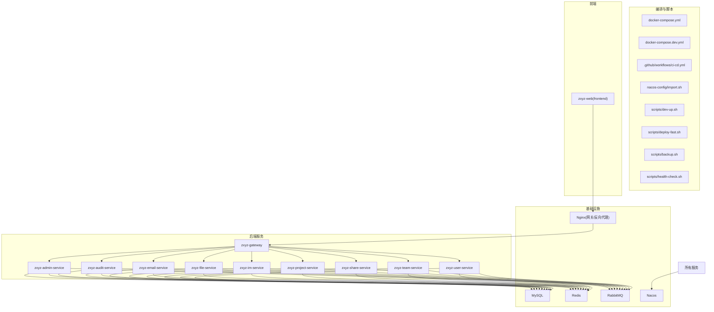
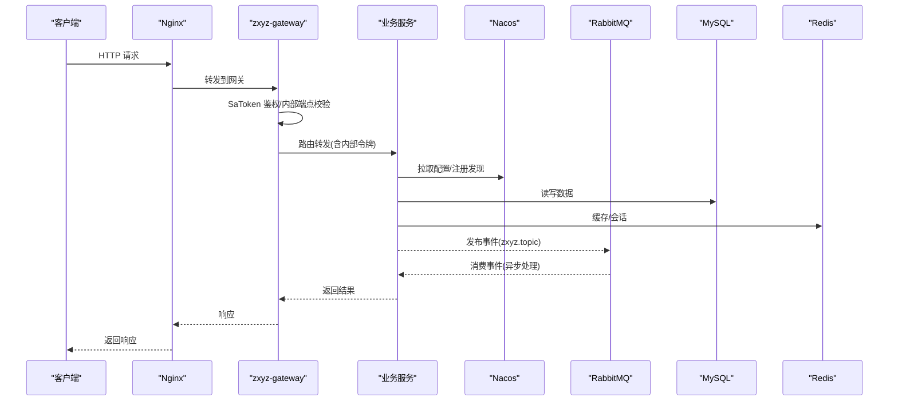
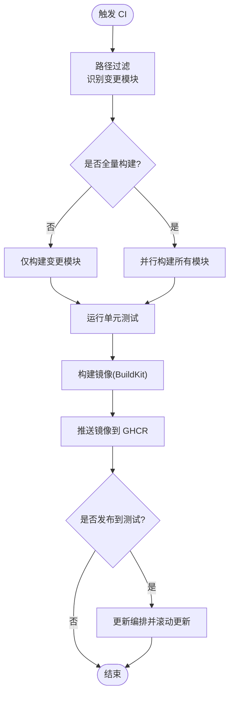
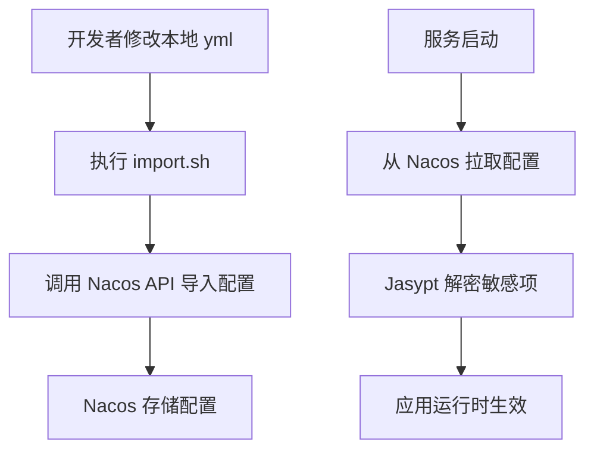
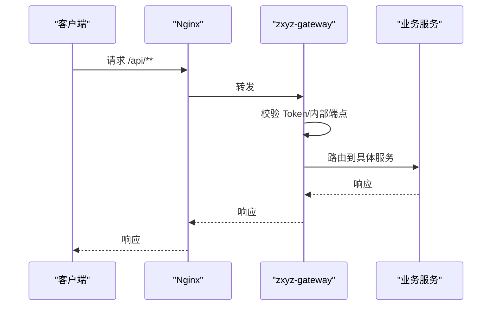
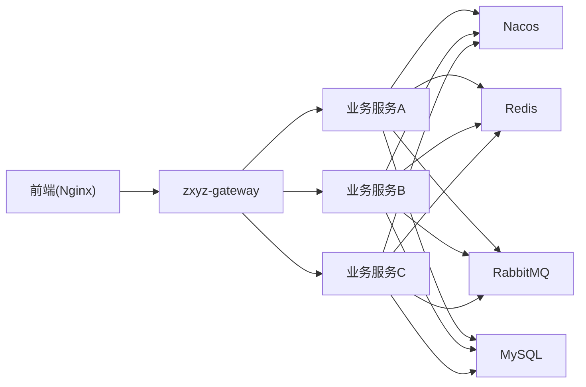

# 部署运维

<cite>
**本文引用的文件**   
- [docker-compose.yml](file://docker-compose.yml)
- [docker-compose.dev.yml](file://docker-compose.dev.yml)
- [.github/workflows/ci-cd.yml](file://.github/workflows/ci-cd.yml)
- [nacos-config/import.sh](file://nacos-config/import.sh)
- [nacos-config/zxyz-dynamic.yml](file://nacos-config/zxyz-dynamic.yml)
- [nacos-config/zxyz-static.yml](file://nacos-config/zxyz-static.yml)
- [deploy/nginx/default.conf](file://deploy/nginx/default.conf)
- [scripts/dev-up.sh](file://scripts/dev-up.sh)
- [scripts/deploy-fast.sh](file://scripts/deploy-fast.sh)
- [scripts/backup.sh](file://scripts/backup.sh)
- [scripts/health-check.sh](file://scripts/health-check.sh)
- [ZXYZdatabaseBack/Dockerfile](file://ZXYZdatabaseBack/Dockerfile)
- [ZXYZdatabaseFront/Dockerfile](file://ZXYZdatabaseFront/Dockerfile)
- [DEPLOYMENT.md](file://DEPLOYMENT.md)
</cite>

## 目录
1. [简介](#简介)
2. [项目结构](#项目结构)
3. [核心组件](#核心组件)
4. [架构总览](#架构总览)
5. [详细组件分析](#详细组件分析)
6. [依赖关系分析](#依赖关系分析)
7. [性能考虑](#性能考虑)
8. [故障排查指南](#故障排查指南)
9. [结论](#结论)
10. [附录](#附录)

## 简介
本文件面向 ZXYZ 项目的部署与运维，覆盖以下关键主题：
- Docker 容器化与 Docker Compose 编排（18 个容器：5 基础设施 + 10 后端服务 + 前端 Nginx + 2 日志栈）
- CI/CD 流水线（GitHub Actions、选择性构建、镜像构建与 GHCR 推送）
- Nacos 配置中心（动态配置、环境隔离、Jasypt 密钥加密）
- 生产拓扑（负载均衡、服务发现、健康检查、监控告警）
- 运维脚本（开发启动、快速部署、备份恢复、健康检查）
- 故障排查、性能调优与扩容策略

## 项目结构
仓库采用前后端分离与微服务架构：
- 后端：多个 Maven 模块（admin、audit、email、file、gateway、im、project、share、team、user），共享公共库 zxyz-common
- 前端：Vue 3 + Vite，独立构建并经由 Nginx 提供静态资源
- 基础设施：MySQL、Redis、RabbitMQ、Nacos、Nginx
- 编排与脚本：Docker Compose、CI/CD、Nacos 初始化脚本、运维脚本

图表来源
- [docker-compose.yml](file://docker-compose.yml)
- [docker-compose.dev.yml](file://docker-compose.dev.yml)
- [.github/workflows/ci-cd.yml](file://.github/workflows/ci-cd.yml)
- [nacos-config/import.sh](file://nacos-config/import.sh)

章节来源
- [docker-compose.yml](file://docker-compose.yml)
- [docker-compose.dev.yml](file://docker-compose.dev.yml)
- [DEPLOYMENT.md](file://DEPLOYMENT.md)

## 核心组件
- 基础设施服务
  - MySQL：持久化存储
  - Redis：会话与缓存
  - RabbitMQ：异步消息总线（Topic Exchange: zxyz.topic）
  - Nacos：配置中心与服务注册发现
  - Nginx：反向代理与静态资源托管
- 后端服务（10 个）
  - gateway：统一入口、鉴权过滤、路由转发
  - admin：系统配置管理
  - audit：操作审计与清理
  - email：邮件发送与模板渲染
  - file：文件上传下载与存储适配
  - im：即时通讯（DDD 分层）
  - project：项目管理
  - share：分享链接与访问控制
  - team：团队与权限
  - user：用户与认证
- 前端
  - Vue 3 + Vite 构建产物由 Nginx 提供

章节来源
- [docker-compose.yml](file://docker-compose.yml)
- [DEPLOYMENT.md](file://DEPLOYMENT.md)

## 架构总览
整体采用“网关 + 微服务 + 中间件”的架构。外部请求经 Nginx 进入 Gateway，Gateway 通过 SaToken 进行鉴权与内部接口保护，再转发至各业务服务。服务间同步调用使用 ServiceClient + X-Internal-Service-Token；异步通信通过 RabbitMQ Topic Exchange。配置与服务发现由 Nacos 统一管理，敏感配置通过 Jasypt 加密。

图表来源
- [docker-compose.yml](file://docker-compose.yml)
- [deploy/nginx/default.conf](file://deploy/nginx/default.conf)

## 详细组件分析

### Docker Compose 编排（18 容器）
- 基础设施（5）：MySQL、Redis、RabbitMQ、Nacos、Nginx
- 后端服务（10）：admin、audit、email、file、gateway、im、project、share、team、user
- 前端（1）：Nginx 静态站点
- 日志栈（2）：Promtail + Loki（或同类采集与聚合）

编排要点
- 网络：统一 bridge 网络，服务间通过服务名互通
- 数据卷：MySQL、Redis、RabbitMQ、Nacos、日志持久化
- 环境变量：数据库连接、Redis/MQ/Nacos 地址、Jasypt 密钥等
- 健康检查：各服务暴露健康端点，Compose 依赖 health 状态启动顺序
- 端口映射：仅对外暴露 Nginx 端口，其余内网互通

章节来源
- [docker-compose.yml](file://docker-compose.yml)
- [docker-compose.dev.yml](file://docker-compose.dev.yml)

### CI/CD 流水线（GitHub Actions）
- 触发条件：代码提交/PR 合并
- 选择性构建：基于 dorny/paths-filter 按模块变更决定构建范围
- 构建步骤：Maven 编译打包、单元测试、构建镜像（BuildKit）
- 镜像推送：推送到 GHCR（ghcr.io）
- 部署：可选自动部署到测试/生产环境（根据分支与标签）

图表来源
- [.github/workflows/ci-cd.yml](file://.github/workflows/ci-cd.yml)

章节来源
- [.github/workflows/ci-cd.yml](file://.github/workflows/ci-cd.yml)

### Nacos 配置中心
- 动态配置：通过 nacos-config/*.yml 导入，支持热更新
- 环境隔离：不同环境使用不同 Data ID 或命名空间
- 密钥加密：Jasypt 对敏感字段加密，运行时解密
- 初始化：import.sh 批量导入配置到 Nacos

图表来源
- [nacos-config/import.sh](file://nacos-config/import.sh)
- [nacos-config/zxyz-dynamic.yml](file://nacos-config/zxyz-dynamic.yml)
- [nacos-config/zxyz-static.yml](file://nacos-config/zxyz-static.yml)

章节来源
- [nacos-config/import.sh](file://nacos-config/import.sh)
- [nacos-config/zxyz-dynamic.yml](file://nacos-config/zxyz-dynamic.yml)
- [nacos-config/zxyz-static.yml](file://nacos-config/zxyz-static.yml)

### 网关与反向代理（Nginx + Gateway）
- Nginx：静态资源托管、HTTPS 终止、反向代理到 Gateway
- Gateway：统一鉴权（SaToken）、内部端点保护、路由转发
- 健康检查：Nginx 可配置 upstream 健康探测

图表来源
- [deploy/nginx/default.conf](file://deploy/nginx/default.conf)

章节来源
- [deploy/nginx/default.conf](file://deploy/nginx/default.conf)

### 镜像构建（后端与前端）
- 后端：多阶段构建，基础镜像复用，按需裁剪依赖
- 前端：Vite 构建静态资源，Nginx 镜像提供服务

章节来源
- [ZXYZdatabaseBack/Dockerfile](file://ZXYZdatabaseBack/Dockerfile)
- [ZXYZdatabaseFront/Dockerfile](file://ZXYZdatabaseFront/Dockerfile)

### 运维脚本
- 开发环境启动：一键拉起全部依赖与服务
- 快速部署：拉取最新镜像并滚动更新
- 备份恢复：数据库与关键数据卷备份/恢复
- 健康检查：检查各服务健康状态与依赖连通性

章节来源
- [scripts/dev-up.sh](file://scripts/dev-up.sh)
- [scripts/deploy-fast.sh](file://scripts/deploy-fast.sh)
- [scripts/backup.sh](file://scripts/backup.sh)
- [scripts/health-check.sh](file://scripts/health-check.sh)

## 依赖关系分析
- 服务间依赖
  - 所有服务依赖 Nacos（配置/注册）
  - 所有服务依赖 Redis（会话/缓存）
  - 所有服务依赖 RabbitMQ（异步事件）
  - 业务服务依赖 MySQL（持久化）
- 网关依赖
  - Gateway 依赖 Nacos（路由/配置）
  - Nginx 依赖 Gateway（反向代理）
- 前端依赖
  - 前端依赖 Nginx（静态资源）

图表来源
- [docker-compose.yml](file://docker-compose.yml)

章节来源
- [docker-compose.yml](file://docker-compose.yml)

## 性能考虑
- 中间件优化
  - MySQL：连接池、索引优化、慢查询分析
  - Redis：内存上限、淘汰策略、持久化模式
  - RabbitMQ：队列分区、消费者并发、死信队列
  - Nacos：配置监听频率、集群节点数
- 应用层优化
  - 连接池参数（HikariCP、HTTP 客户端）
  - 线程池与限流（避免阻塞 I/O）
  - 缓存命中率与热点键治理
- 网关与代理
  - Nginx keepalive、gzip、缓冲大小
  - Gateway 路由缓存与超时设置
- 容器与编排
  - CPU/内存限制与请求配额
  - 滚动更新与蓝绿发布策略
  - 健康检查间隔与失败阈值

[本节为通用指导，不直接分析具体文件]

## 故障排查指南
- 常见问题定位
  - 服务无法启动：检查健康检查、依赖连通性、环境变量
  - 配置未生效：确认 Nacos Data ID、命名空间、Jasypt 密钥
  - 鉴权失败：检查 SaToken Cookie、内部令牌传递
  - 消息堆积：查看 RabbitMQ 队列长度与消费者状态
  - 数据库连接失败：检查连接串、账号权限、防火墙
- 工具与命令
  - 查看容器日志：docker compose logs
  - 进入容器调试：docker compose exec
  - 健康检查脚本：scripts/health-check.sh
  - 备份恢复：scripts/backup.sh

章节来源
- [scripts/health-check.sh](file://scripts/health-check.sh)
- [scripts/backup.sh](file://scripts/backup.sh)

## 结论
ZXYZ 项目通过 Docker Compose 实现标准化容器编排，结合 GitHub Actions 完成自动化构建与发布，Nacos 作为配置中心保障动态配置与环境隔离，Jasypt 确保敏感信息加密。生产环境以 Nginx + Gateway 作为统一入口，配合中间件与监控体系，形成高可用、可扩展的微服务架构。建议在生产中完善监控告警、容量规划与演练预案，持续提升稳定性与交付效率。

[本节为总结性内容，不直接分析具体文件]

## 附录
- 参考文档
  - DEPLOYMENT.md：部署说明与最佳实践
- 常用命令
  - 开发环境：scripts/dev-up.sh
  - 快速部署：scripts/deploy-fast.sh
  - 健康检查：scripts/health-check.sh
  - 备份恢复：scripts/backup.sh

章节来源
- [DEPLOYMENT.md](file://DEPLOYMENT.md)
- [scripts/dev-up.sh](file://scripts/dev-up.sh)
- [scripts/deploy-fast.sh](file://scripts/deploy-fast.sh)
- [scripts/health-check.sh](file://scripts/health-check.sh)
- [scripts/backup.sh](file://scripts/backup.sh)