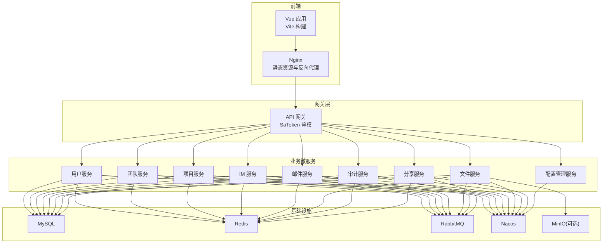
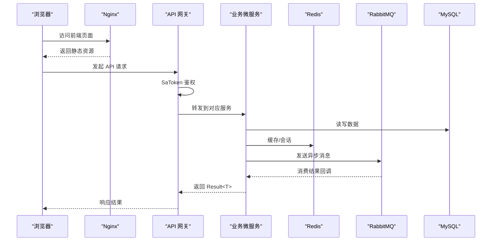
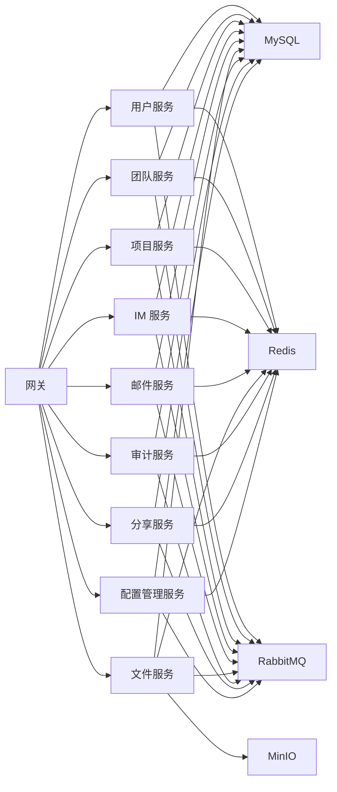

# 快速开始

<cite>
**本文引用的文件**   
- [docker-compose.yml](file://docker-compose.yml)
- [docker-compose.dev.yml](file://docker-compose.dev.yml)
- [scripts/dev-up.sh](file://scripts/dev-up.sh)
- [scripts/deploy-fast.sh](file://scripts/deploy-fast.sh)
- [nacos-config/import.sh](file://nacos-config/import.sh)
- [nacos-config/zxyz-dynamic.yml](file://nacos-config/zxyz-dynamic.yml)
- [nacos-config/zxyz-static.yml](file://nacos-config/zxyz-static.yml)
- [ZXYZdatabaseBack/pom.xml](file://ZXYZdatabaseBack/pom.xml)
- [ZXYZdatabaseFront/package.json](file://ZXYZdatabaseFront/package.json)
- [ZXYZdatabaseFront/vite.config.js](file://ZXYZdatabaseFront/vite.config.js)
- [sql/00-init-zxyz.sh](file://sql/00-init-zxyz.sh)
- [deploy/nginx/default.conf](file://deploy/nginx/default.conf)
- [deploy/nginx/entrypoint.sh](file://deploy/nginx/entrypoint.sh)
- [.github/workflows/ci-cd.yml](file://.github/workflows/ci-cd.yml)
</cite>

## 目录
1. [简介](#简介)
2. [项目结构](#项目结构)
3. [核心组件](#核心组件)
4. [架构总览](#架构总览)
5. [详细组件分析](#详细组件分析)
6. [依赖关系分析](#依赖关系分析)
7. [性能注意事项](#性能注意事项)
8. [故障排查指南](#故障排查指南)
9. [结论](#结论)
10. [附录](#附录)

## 简介
本指南面向首次接触 ZXYZ 项目的开发者与运维人员，目标是在 30 分钟内完成环境准备、依赖安装、数据库初始化、中间件启动，并通过一键脚本拉起开发或快速部署环境。你将了解：
- 环境要求：Java 17+、Node.js 18+、Docker 与 Docker Compose
- 开发环境搭建步骤：克隆仓库、安装依赖、初始化数据库、启动中间件
- 一键启动脚本：dev-up.sh（开发）、deploy-fast.sh（快速部署）
- 配置管理：Nacos 配置中心、环境变量、本地配置文件
- 常见问题与排错方法
- 安装验证与基本功能测试

## 项目结构
ZXYZ 采用前后端分离与微服务架构：
- 后端：基于 Spring Boot 的微服务集合（用户、团队、项目、IM、邮件、文件、审计、网关等），通过 Nacos 注册与配置管理，RabbitMQ 异步通信
- 前端：Vue 3 + Vite + Element Plus，构建静态资源由 Nginx 提供
- 基础设施：MySQL、Redis、RabbitMQ、Nacos、MinIO（可选）、Promtail（日志采集）
- 编排与部署：Docker Compose 编排容器，GitHub Actions 进行 CI/CD

图表来源
- [docker-compose.yml](file://docker-compose.yml)
- [docker-compose.dev.yml](file://docker-compose.dev.yml)

章节来源
- [docker-compose.yml](file://docker-compose.yml)
- [docker-compose.dev.yml](file://docker-compose.dev.yml)

## 核心组件
- 网关层：统一入口、鉴权过滤、内部接口保护
- 业务微服务：用户、团队、项目、IM、邮件、文件、审计、分享、配置管理
- 基础设施：MySQL、Redis、RabbitMQ、Nacos、MinIO
- 前端：Vue 3 + Vite，Nginx 提供静态资源与反向代理

章节来源
- [ZXYZdatabaseBack/pom.xml](file://ZXYZdatabaseBack/pom.xml)
- [ZXYZdatabaseFront/package.json](file://ZXYZdatabaseFront/package.json)

## 架构总览
系统采用“网关 + 微服务 + 基础设施”的分层架构，服务间同步调用使用 ServiceClient + X-Internal-Service-Token 鉴权，异步消息通过 RabbitMQ Topic Exchange zxyz.topic。Nacos 负责配置与服务发现，Jasypt 加密敏感配置。

图表来源
- [docker-compose.yml](file://docker-compose.yml)
- [docker-compose.dev.yml](file://docker-compose.dev.yml)

## 详细组件分析

### 环境与前置条件
- Java 17+：用于编译与运行后端微服务
- Node.js 18+：用于构建前端
- Docker 与 Docker Compose：用于编排基础设施与容器化部署
- Git：用于克隆代码仓库

章节来源
- [ZXYZdatabaseBack/pom.xml](file://ZXYZdatabaseBack/pom.xml)
- [ZXYZdatabaseFront/package.json](file://ZXYZdatabaseFront/package.json)

### 开发环境搭建步骤
1. 克隆代码仓库
   - 使用 Git 将仓库克隆至本地
2. 安装依赖
   - 后端：进入 ZXYZdatabaseBack 目录，使用 Maven 拉取依赖并编译
   - 前端：进入 ZXYZdatabaseFront 目录，使用 npm 安装依赖
3. 初始化数据库
   - 执行 sql/00-init-zxyz.sh 初始化数据库结构与基础数据
4. 启动中间件服务
   - 使用 docker-compose 启动 MySQL、Redis、RabbitMQ、Nacos、MinIO（可选）
5. 导入 Nacos 配置
   - 执行 nacos-config/import.sh 将动态与静态配置导入 Nacos
6. 启动后端服务
   - 在本地 IDE 中运行各微服务，或通过脚本一键启动
7. 启动前端开发服务器
   - 在 ZXYZdatabaseFront 目录下运行开发服务器

章节来源
- [sql/00-init-zxyz.sh](file://sql/00-init-zxyz.sh)
- [nacos-config/import.sh](file://nacos-config/import.sh)
- [docker-compose.yml](file://docker-compose.yml)
- [docker-compose.dev.yml](file://docker-compose.dev.yml)

### 一键启动脚本使用方法
- 开发环境：scripts/dev-up.sh
  - 作用：一键启动开发所需的基础设施与所有微服务，便于本地调试
  - 用法：在项目根目录执行脚本，等待服务就绪后访问前端
- 快速部署：scripts/deploy-fast.sh
  - 作用：快速部署生产或预发布环境，包含镜像拉取、配置导入、服务启动
  - 用法：在项目根目录执行脚本，根据提示完成部署

章节来源
- [scripts/dev-up.sh](file://scripts/dev-up.sh)
- [scripts/deploy-fast.sh](file://scripts/deploy-fast.sh)

### 配置管理说明
- Nacos 配置中心
  - 动态配置：nacos-config/zxyz-dynamic.yml
  - 静态配置：nacos-config/zxyz-static.yml
  - 导入脚本：nacos-config/import.sh
- 环境变量
  - 各服务 application-dev.yml 与 application-prod.yml 支持环境变量覆盖
- 本地配置文件
  - 每个服务的 src/main/resources/application*.yml 用于本地调试

章节来源
- [nacos-config/zxyz-dynamic.yml](file://nacos-config/zxyz-dynamic.yml)
- [nacos-config/zxyz-static.yml](file://nacos-config/zxyz-static.yml)
- [nacos-config/import.sh](file://nacos-config/import.sh)

### 前端开发与构建
- 开发模式
  - 使用 Vite 启动开发服务器，支持热重载与调试
- 构建产物
  - 构建后的静态资源由 Nginx 提供服务
- 代理配置
  - vite.config.js 中配置 API 代理到后端网关

章节来源
- [ZXYZdatabaseFront/package.json](file://ZXYZdatabaseFront/package.json)
- [ZXYZdatabaseFront/vite.config.js](file://ZXYZdatabaseFront/vite.config.js)
- [deploy/nginx/default.conf](file://deploy/nginx/default.conf)

### 后端微服务分层风格
- DDD 分层：im-service 与 email-service 采用 interfaces → application → domain → infrastructure
- 传统分层：其余服务采用 controller → service/impl → mapper → entity

章节来源
- [ZXYZdatabaseBack/pom.xml](file://ZXYZdatabaseBack/pom.xml)

## 依赖关系分析
- 服务间依赖
  - 网关依赖鉴权与路由规则
  - 业务服务依赖数据库、缓存、消息队列与配置中心
  - 文件服务依赖对象存储（MinIO）
- 外部依赖
  - MySQL、Redis、RabbitMQ、Nacos、MinIO
- 前端依赖
  - Vue 3、Element Plus、Pinia、Vite

图表来源
- [docker-compose.yml](file://docker-compose.yml)
- [docker-compose.dev.yml](file://docker-compose.dev.yml)

章节来源
- [docker-compose.yml](file://docker-compose.yml)
- [docker-compose.dev.yml](file://docker-compose.dev.yml)

## 性能注意事项
- 连接池配置：合理设置数据库与 Redis 连接池大小，避免连接耗尽
- 缓存策略：热点数据使用 Redis 缓存，注意过期与一致性
- 消息队列：合理使用 RabbitMQ 分区与消费者数量，提升吞吐
- 网关限流：启用限流与熔断，防止雪崩
- 前端优化：按需加载与懒加载，减少首屏体积

[本节为通用指导，不直接分析具体文件]

## 故障排查指南
- 无法连接数据库
  - 检查 MySQL 容器状态与端口映射
  - 确认数据库初始化脚本是否成功执行
- 无法连接 Redis
  - 检查 Redis 容器状态与密码配置
  - 确认服务配置中的 Redis 地址与端口
- 无法连接 RabbitMQ
  - 检查 RabbitMQ 容器状态与虚拟主机、用户权限
  - 确认服务配置中的连接信息
- Nacos 配置未生效
  - 检查配置导入脚本是否执行成功
  - 确认服务启动时是否正确加载 Nacos 配置
- 前端无法访问 API
  - 检查 Nginx 反向代理配置
  - 确认网关服务是否正常运行
- 鉴权失败
  - 检查 SaToken 配置与 Cookie 设置
  - 确认网关过滤器是否放行内部接口

章节来源
- [docker-compose.yml](file://docker-compose.yml)
- [docker-compose.dev.yml](file://docker-compose.dev.yml)
- [deploy/nginx/default.conf](file://deploy/nginx/default.conf)

## 结论
通过本指南，你可以在 30 分钟内完成 ZXYZ 项目的开发或快速部署环境搭建，理解系统架构与核心组件，掌握配置管理与故障排查方法。建议在实际使用中结合项目文档与源码进一步深入学习。

[本节为总结性内容，不直接分析具体文件]

## 附录
- CI/CD 流程
  - GitHub Actions 工作流定义在 .github/workflows/ci-cd.yml
  - 支持选择性构建与镜像推送
- 部署脚本
  - deploy-fast.sh 用于快速部署，包含镜像拉取、配置导入、服务启动
- 数据库初始化
  - sql/00-init-zxyz.sh 用于初始化数据库结构与基础数据

章节来源
- [.github/workflows/ci-cd.yml](file://.github/workflows/ci-cd.yml)
- [scripts/deploy-fast.sh](file://scripts/deploy-fast.sh)
- [sql/00-init-zxyz.sh](file://sql/00-init-zxyz.sh)