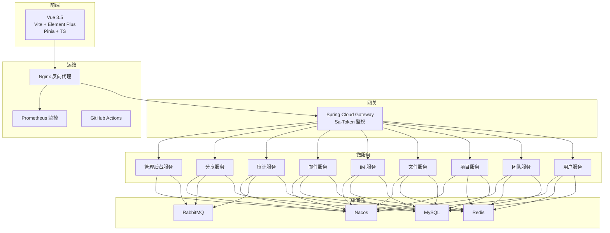
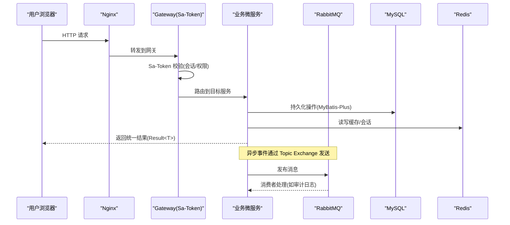
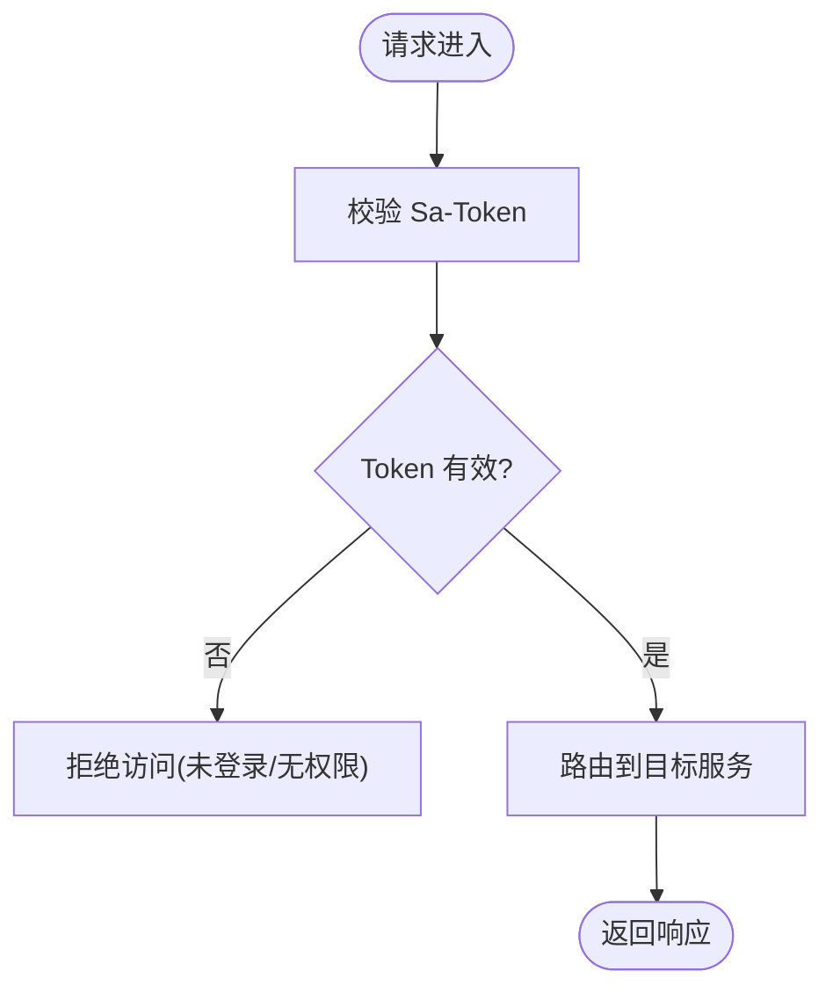
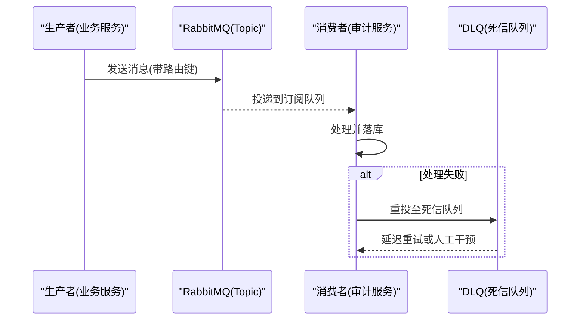
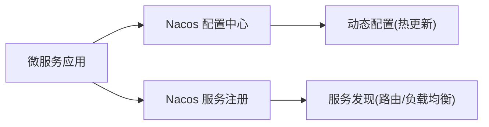
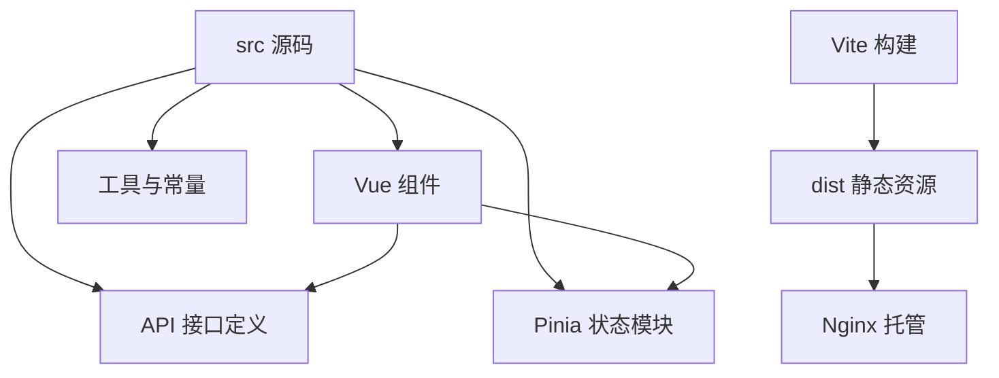
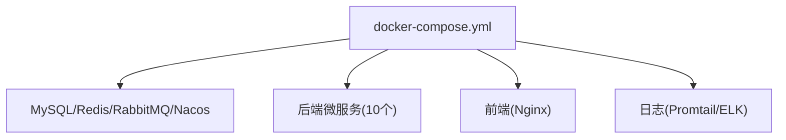
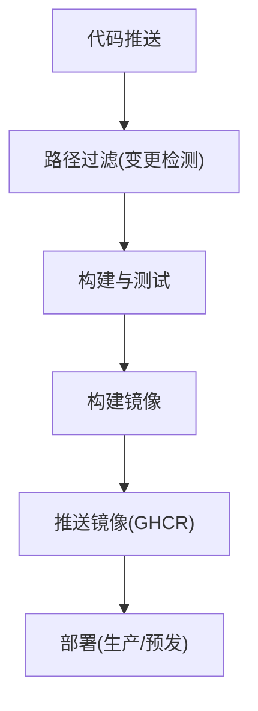
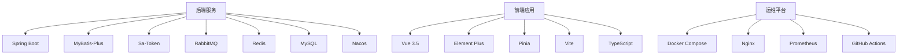

# 技术栈概览

<cite>
**本文引用的文件**   
- [pom.xml](file://ZXYZdatabaseBack/pom.xml)
- [application.yml](file://ZXYZdatabaseBack/zxyz-admin-service/src/main/resources/application.yml)
- [application-dev.yml](file://ZXYZdatabaseBack/zxyz-admin-service/src/main/resources/application-dev.yml)
- [application-prod.yml](file://ZXYZdatabaseBack/zxyz-admin-service/src/main/resources/application-prod.yml)
- [SaTokenConfigure.java](file://ZXYZdatabaseBack/zxyz-admin-service/src/main/java/uno/acloud/admin/config/SaTokenConfigure.java)
- [RabbitMqConfig.java](file://ZXYZdatabaseBack/zxyz-audit-service/src/main/java/uno/acloud/audit/config/RabbitMqConfig.java)
- [OperateLogConsumer.java](file://ZXYZdatabaseBack/zxyz-audit-service/src/main/java/uno/acloud/audit/mq/OperateLogConsumer.java)
- [AuditDlqConsumer.java](file://ZXYZdatabaseBack/zxyz-audit-service/src/main/java/uno/acloud/audit/mq/AuditDlqConsumer.java)
- [package.json](file://ZXYZdatabaseFront/package.json)
- [vite.config.js](file://ZXYZdatabaseFront/vite.config.js)
- [main.js](file://ZXYZdatabaseFront/src/main.js)
- [ci-cd.yml](file://ZXYZdatabaseBack/.github/workflows/ci-cd.yml)
- [docker-compose.yml](file://docker-compose.yml)
- [default.conf](file://deploy/nginx/default.conf)
- [zxyz-dynamic.yml](file://nacos-config/zxyz-dynamic.yml)
- [zxyz-user-service.yml](file://nacos-config/zxyz-user-service.yml)
- [build.yml](file://ZXYZdatabaseFront/.github/workflows/build.yml)
- [deploy.yml](file://ZXYZdatabaseFront/.github/workflows/deploy.yml)
</cite>

## 目录
1. [简介](#简介)
2. [项目结构](#项目结构)
3. [核心组件](#核心组件)
4. [架构总览](#架构总览)
5. [详细组件分析](#详细组件分析)
6. [依赖关系分析](#依赖关系分析)
7. [性能考量](#性能考量)
8. [故障排查指南](#故障排查指南)
9. [结论](#结论)
10. [附录](#附录)

## 简介
本技术栈概览面向 ZXYZ 项目的后端与前端、基础设施及 CI/CD，系统性梳理微服务架构下的技术选型与协作方式。后端采用 Spring Boot 微服务 + MyBatis-Plus + Sa-Token + Nacos + RabbitMQ + Redis + MySQL；前端采用 Vue 3.5 Composition API + Element Plus + Pinia + Vite + TypeScript；基础设施使用 Docker Compose、GitHub Actions、Nginx 反向代理与 Prometheus 监控。文档同时解释各技术选型的优势与原因，并给出版本兼容性与依赖关系说明，帮助读者快速理解系统全貌与落地实践。

## 项目结构
- 后端：多模块 Maven 工程（约 11 个服务模块），每个服务独立配置与启动类，共享公共能力通过 zxyz-common 提供。
- 前端：Vue 3.5 + Vite 构建的单页应用，按功能域拆分路由、视图、组件与状态管理。
- 基础设施：Docker Compose 编排容器化部署，Nacos 作为配置中心与服务注册发现，Nginx 统一入口，Prometheus 采集指标。

**图表来源** 
- [docker-compose.yml](file://docker-compose.yml)
- [default.conf](file://deploy/nginx/default.conf)
- [ci-cd.yml](file://ZXYZdatabaseBack/.github/workflows/ci-cd.yml)

**章节来源**
- [pom.xml](file://ZXYZdatabaseBack/pom.xml)
- [docker-compose.yml](file://docker-compose.yml)

## 核心组件
- 后端框架与数据层
  - Spring Boot：统一的微服务基础能力与生态集成。
  - MyBatis-Plus：简化 CRUD、分页、条件构造与代码生成，提升开发效率。
  - MySQL：关系型数据存储，配合 Flyway/Liquibase 进行数据库版本化管理。
- 认证与安全
  - Sa-Token：轻量级权限认证与授权，支持会话、角色与权限控制，结合 HttpOnly Cookie 提升安全性。
- 配置与服务治理
  - Nacos：动态配置管理与服务注册发现，支持环境隔离与灰度发布。
- 消息与缓存
  - RabbitMQ：异步解耦与削峰填谷，Topic Exchange 实现灵活路由。
  - Redis：会话存储、热点数据缓存与分布式锁等。
- 前端技术
  - Vue 3.5 Composition API：<script setup> 语法与组合式函数封装业务逻辑。
  - Element Plus：丰富的 UI 组件库，加速界面开发。
  - Pinia：轻量状态管理，模块化组织全局状态。
  - Vite：极速开发与构建体验，原生 ES 模块支持。
  - TypeScript：类型安全与更好的 IDE 支持。
- 基础设施
  - Docker Compose：一键编排 18 个容器，标准化运行环境。
  - GitHub Actions：CI/CD 流水线，选择性构建与镜像推送。
  - Nginx：反向代理与静态资源托管。
  - Prometheus：指标采集与可视化监控。

**章节来源**
- [application.yml](file://ZXYZdatabaseBack/zxyz-admin-service/src/main/resources/application.yml)
- [application-dev.yml](file://ZXYZdatabaseBack/zxyz-admin-service/src/main/resources/application-dev.yml)
- [application-prod.yml](file://ZXYZdatabaseBack/zxyz-admin-service/src/main/resources/application-prod.yml)
- [package.json](file://ZXYZdatabaseFront/package.json)
- [vite.config.js](file://ZXYZdatabaseFront/vite.config.js)

## 架构总览
ZXYZ 采用前后端分离与微服务架构，请求经 Nginx 进入 Spring Cloud Gateway，由 Sa-Token 完成鉴权后路由至具体服务。服务间同步调用通过 ServiceClient + X-Internal-Service-Token 保证内部安全，异步通信通过 RabbitMQ Topic Exchange 解耦。配置与服务注册由 Nacos 统一管理，敏感配置通过 Jasypt 加密。前端基于 Vue 3.5 与 Element Plus 构建，状态由 Pinia 管理，API 响应统一 Result<T> 结构。

**图表来源** 
- [default.conf](file://deploy/nginx/default.conf)
- [SaTokenConfigure.java](file://ZXYZdatabaseBack/zxyz-admin-service/src/main/java/uno/acloud/admin/config/SaTokenConfigure.java)
- [RabbitMqConfig.java](file://ZXYZdatabaseBack/zxyz-audit-service/src/main/java/uno/acloud/audit/config/RabbitMqConfig.java)

## 详细组件分析

### 后端认证与授权（Sa-Token）
- 作用：统一鉴权、会话管理、权限控制，结合 HttpOnly Cookie 提升安全性。
- 关键点：
  - 网关层拦截并校验 Token，拒绝公网访问内部端点 /api/internal/**。
  - 服务内可基于角色与权限注解进行细粒度控制。
  - 会话数据落 Redis，支持分布式会话一致性。

**图表来源** 
- [SaTokenConfigure.java](file://ZXYZdatabaseBack/zxyz-admin-service/src/main/java/uno/acloud/admin/config/SaTokenConfigure.java)

**章节来源**
- [SaTokenConfigure.java](file://ZXYZdatabaseBack/zxyz-admin-service/src/main/java/uno/acloud/admin/config/SaTokenConfigure.java)

### 消息队列（RabbitMQ）
- 作用：异步解耦、削峰填谷、审计日志记录与重试机制。
- 关键点：
  - Topic Exchange 路由键匹配，灵活投递。
  - DLQ 死信队列处理失败消息，保障可靠性。
  - 消费者幂等处理，避免重复消费。

**图表来源** 
- [RabbitMqConfig.java](file://ZXYZdatabaseBack/zxyz-audit-service/src/main/java/uno/acloud/audit/config/RabbitMqConfig.java)
- [OperateLogConsumer.java](file://ZXYZdatabaseBack/zxyz-audit-service/src/main/java/uno/acloud/audit/mq/OperateLogConsumer.java)
- [AuditDlqConsumer.java](file://ZXYZdatabaseBack/zxyz-audit-service/src/main/java/uno/acloud/audit/mq/AuditDlqConsumer.java)

**章节来源**
- [RabbitMqConfig.java](file://ZXYZdatabaseBack/zxyz-audit-service/src/main/java/uno/acloud/audit/config/RabbitMqConfig.java)
- [OperateLogConsumer.java](file://ZXYZdatabaseBack/zxyz-audit-service/src/main/java/uno/acloud/audit/mq/OperateLogConsumer.java)
- [AuditDlqConsumer.java](file://ZXYZdatabaseBack/zxyz-audit-service/src/main/java/uno/acloud/audit/mq/AuditDlqConsumer.java)

### 配置中心与服务注册（Nacos）
- 作用：集中化管理配置、服务注册与发现、动态刷新。
- 关键点：
  - 动态配置与环境隔离（dev/prod）。
  - 服务健康检查与负载均衡。
  - 敏感配置加密（Jasypt）。

**图表来源** 
- [zxyz-dynamic.yml](file://nacos-config/zxyz-dynamic.yml)
- [zxyz-user-service.yml](file://nacos-config/zxyz-user-service.yml)

**章节来源**
- [zxyz-dynamic.yml](file://nacos-config/zxyz-dynamic.yml)
- [zxyz-user-service.yml](file://nacos-config/zxyz-user-service.yml)

### 前端技术栈（Vue 3.5 + Element Plus + Pinia + Vite + TS）
- 作用：现代化前端开发体验与高效构建。
- 关键点：
  - Composition API + <script setup> 提升逻辑复用性。
  - Element Plus 提供丰富组件，减少样式与交互成本。
  - Pinia 管理全局状态，模块化清晰。
  - Vite 极速 HMR 与打包优化。
  - TypeScript 增强类型安全与 IDE 支持。

**图表来源** 
- [package.json](file://ZXYZdatabaseFront/package.json)
- [vite.config.js](file://ZXYZdatabaseFront/vite.config.js)
- [main.js](file://ZXYZdatabaseFront/src/main.js)

**章节来源**
- [package.json](file://ZXYZdatabaseFront/package.json)
- [vite.config.js](file://ZXYZdatabaseFront/vite.config.js)
- [main.js](file://ZXYZdatabaseFront/src/main.js)

### 容器化与编排（Docker Compose）
- 作用：标准化运行环境与一键部署。
- 关键点：
  - 编排 18 个容器（基础设施 + 后端服务 + 前端 + 日志）。
  - 环境变量与配置文件注入。
  - 健康检查与重启策略。

**图表来源** 
- [docker-compose.yml](file://docker-compose.yml)

**章节来源**
- [docker-compose.yml](file://docker-compose.yml)

### CI/CD（GitHub Actions）
- 作用：自动化构建、测试、镜像推送与部署。
- 关键点：
  - 路径过滤选择性构建，提高流水线效率。
  - 镜像推送至 GHCR，便于拉取与回滚。
  - 前后端独立流水线，并行执行。

**图表来源** 
- [ci-cd.yml](file://ZXYZdatabaseBack/.github/workflows/ci-cd.yml)
- [build.yml](file://ZXYZdatabaseFront/.github/workflows/build.yml)
- [deploy.yml](file://ZXYZdatabaseFront/.github/workflows/deploy.yml)

**章节来源**
- [ci-cd.yml](file://ZXYZdatabaseBack/.github/workflows/ci-cd.yml)
- [build.yml](file://ZXYZdatabaseFront/.github/workflows/build.yml)
- [deploy.yml](file://ZXYZdatabaseFront/.github/workflows/deploy.yml)

## 依赖关系分析
- 后端依赖
  - Spring Boot 生态：Web、Security、MyBatis-Plus、RabbitMQ、Redis、Nacos 客户端。
  - 服务间通信：ServiceClient + X-Internal-Service-Token 鉴权。
  - 数据层：MyBatis-Plus + MySQL，Flyway/Liquibase 迁移。
- 前端依赖
  - Vue 3.5 + Composition API，Element Plus 组件库，Pinia 状态管理，Vite 构建，TypeScript 支持。
- 基础设施依赖
  - Docker Compose 编排，Nginx 反向代理，Prometheus 监控，GitHub Actions CI/CD。

**图表来源** 
- [pom.xml](file://ZXYZdatabaseBack/pom.xml)
- [package.json](file://ZXYZdatabaseFront/package.json)
- [docker-compose.yml](file://docker-compose.yml)

**章节来源**
- [pom.xml](file://ZXYZdatabaseBack/pom.xml)
- [package.json](file://ZXYZdatabaseFront/package.json)
- [docker-compose.yml](file://docker-compose.yml)

## 性能考量
- 微服务扩展性：按领域拆分服务，独立扩缩容，降低耦合。
- 异步解耦：RabbitMQ 削峰填谷，提升吞吐与稳定性。
- 缓存优化：Redis 缓存热点数据，减轻数据库压力。
- 构建与部署：Vite 快速构建，Docker 标准化环境，CI/CD 自动化提升交付效率。
- 监控与可观测性：Prometheus 采集关键指标，及时发现问题。

[本节为通用指导，不直接分析具体文件]

## 故障排查指南
- 认证问题
  - 检查 Sa-Token 配置与 Redis 会话是否可用。
  - 确认网关过滤器对内部端点的拦截规则。
- 消息丢失或重复
  - 检查 RabbitMQ 连接与队列绑定是否正确。
  - 查看 DLQ 消费者日志，定位失败原因。
- 配置未生效
  - 核对 Nacos 配置项与环境变量优先级。
  - 确认动态刷新是否触发。
- 前端构建失败
  - 检查 Node 版本与依赖安装。
  - 查看 Vite 构建日志与 ESLint/Prettier 规则。

**章节来源**
- [SaTokenConfigure.java](file://ZXYZdatabaseBack/zxyz-admin-service/src/main/java/uno/acloud/admin/config/SaTokenConfigure.java)
- [RabbitMqConfig.java](file://ZXYZdatabaseBack/zxyz-audit-service/src/main/java/uno/acloud/audit/config/RabbitMqConfig.java)
- [OperateLogConsumer.java](file://ZXYZdatabaseBack/zxyz-audit-service/src/main/java/uno/acloud/audit/mq/OperateLogConsumer.java)
- [AuditDlqConsumer.java](file://ZXYZdatabaseBack/zxyz-audit-service/src/main/java/uno/acloud/audit/mq/AuditDlqConsumer.java)
- [zxyz-dynamic.yml](file://nacos-config/zxyz-dynamic.yml)
- [package.json](file://ZXYZdatabaseFront/package.json)
- [vite.config.js](file://ZXYZdatabaseFront/vite.config.js)

## 结论
ZXYZ 项目通过 Spring Boot 微服务、MyBatis-Plus、Sa-Token、Nacos、RabbitMQ、Redis 与 MySQL 构建了高内聚、低耦合的后端体系；前端以 Vue 3.5 + Element Plus + Pinia + Vite + TypeScript 提供现代化开发体验；基础设施借助 Docker Compose、GitHub Actions、Nginx 与 Prometheus 实现标准化部署与可观测性。该技术栈兼顾扩展性、可维护性与部署便利性，适合持续演进的大型协作平台。

[本节为总结性内容，不直接分析具体文件]

## 附录
- 版本兼容性建议
  - Java 17+，Spring Boot 3.x，MyBatis-Plus 3.5+，Sa-Token 1.37+，Nacos 2.x，RabbitMQ 3.12+，Redis 7+，MySQL 8+。
  - Node 18+，Vue 3.5，Element Plus 最新稳定版，Pinia 2.x，Vite 5.x，TypeScript 5.x。
- 参考配置与脚本
  - 应用配置：application.yml、application-dev.yml、application-prod.yml。
  - Nacos 配置：zxyz-dynamic.yml、zxyz-user-service.yml。
  - 编排与代理：docker-compose.yml、default.conf。
  - CI/CD：ci-cd.yml、build.yml、deploy.yml。

**章节来源**
- [application.yml](file://ZXYZdatabaseBack/zxyz-admin-service/src/main/resources/application.yml)
- [application-dev.yml](file://ZXYZdatabaseBack/zxyz-admin-service/src/main/resources/application-dev.yml)
- [application-prod.yml](file://ZXYZdatabaseBack/zxyz-admin-service/src/main/resources/application-prod.yml)
- [zxyz-dynamic.yml](file://nacos-config/zxyz-dynamic.yml)
- [zxyz-user-service.yml](file://nacos-config/zxyz-user-service.yml)
- [docker-compose.yml](file://docker-compose.yml)
- [default.conf](file://deploy/nginx/default.conf)
- [ci-cd.yml](file://ZXYZdatabaseBack/.github/workflows/ci-cd.yml)
- [build.yml](file://ZXYZdatabaseFront/.github/workflows/build.yml)
- [deploy.yml](file://ZXYZdatabaseFront/.github/workflows/deploy.yml)