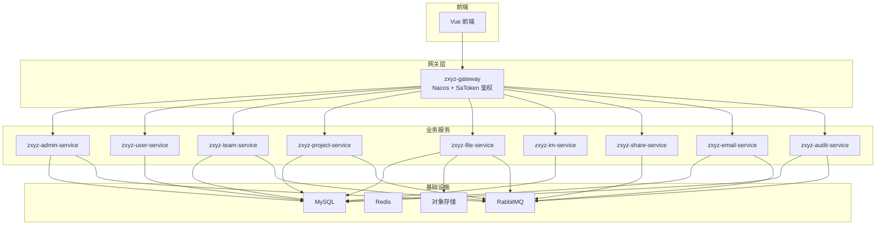
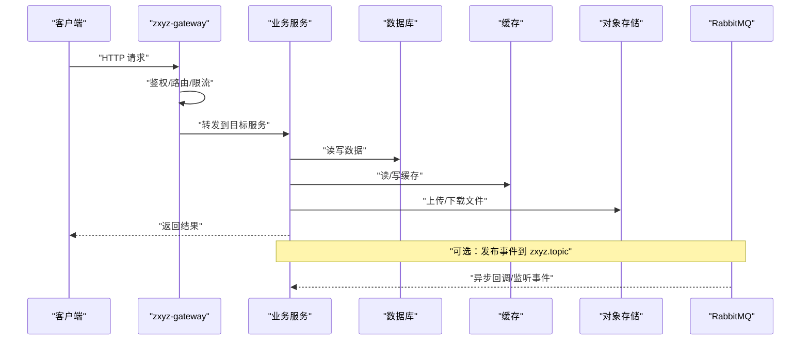
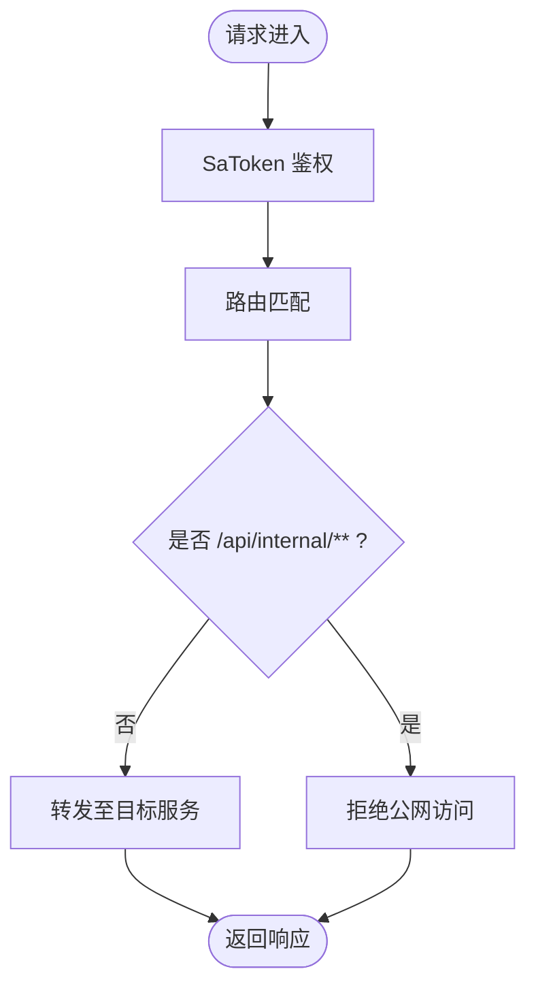
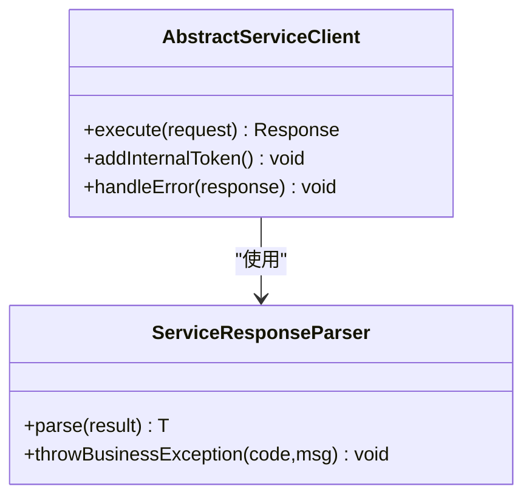
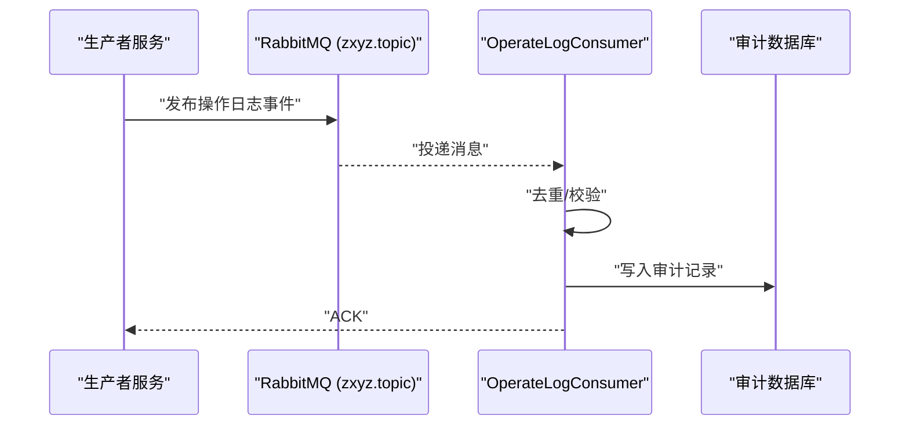
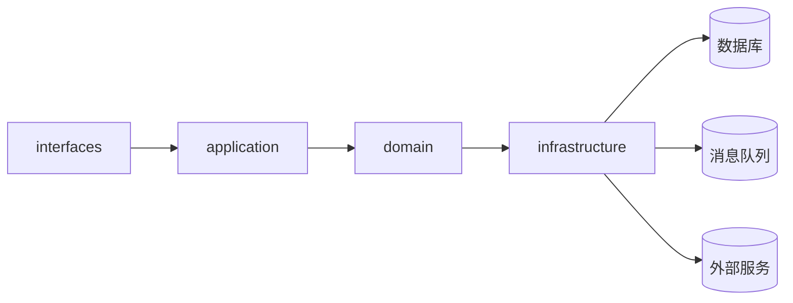
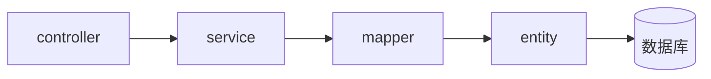
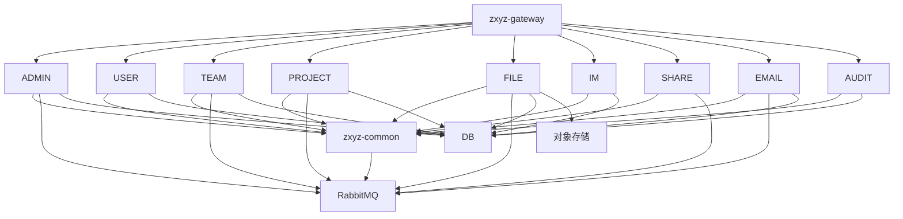

# 架构概览

<cite>
**本文引用的文件**   
- [ZXYZdatabaseBack/pom.xml](file://ZXYZdatabaseBack/pom.xml)
- [ZXYZdatabaseBack/README.md](file://ZXYZdatabaseBack/README.md)
- [ZXYZdatabaseBack/zxyz-gateway/src/main/java/uno/acloud/gateway/ZxyzGatewayApplication.java](file://ZXYZdatabaseBack/zxyz-gateway/src/main/java/uno/acloud/gateway/ZxyzGatewayApplication.java)
- [ZXYZdatabaseBack/zxyz-gateway/src/main/resources/application.yml](file://ZXYZdatabaseBack/zxyz-gateway/src/main/resources/application.yml)
- [ZXYZdatabaseBack/zxyz-common/src/main/java/uno/acloud/client/AbstractServiceClient.java](file://ZXYZdatabaseBack/zxyz-common/src/main/java/uno/acloud/client/AbstractServiceClient.java)
- [ZXYZdatabaseBack/zxyz-common/src/main/java/uno/acloud/client/ServiceResponseParser.java](file://ZXYZdatabaseBack/zxyz-common/src/main/java/uno/acloud/client/ServiceResponseParser.java)
- [ZXYZdatabaseBack/zxyz-audit-service/src/main/java/uno/acloud/audit/config/RabbitMqConfig.java](file://ZXYZdatabaseBack/zxyz-audit-service/src/main/java/uno/acloud/audit/config/RabbitMqConfig.java)
- [ZXYZdatabaseBack/zxyz-audit-service/src/main/java/uno/acloud/audit/mq/OperateLogConsumer.java](file://ZXYZdatabaseBack/zxyz-audit-service/src/main/java/uno/acloud/audit/mq/OperateLogConsumer.java)
- [ZXYZdatabaseBack/zxyz-email-service/src/main/java/uno/acloud/email/ZxyzEmailApplication.java](file://ZXYZdatabaseBack/zxyz-email-service/src/main/java/uno/acloud/email/ZxyzEmailApplication.java)
- [ZXYZdatabaseBack/zxyz-im-service/src/main/java/uno/acloud/im/ZxyzImApplication.java](file://ZXYZdatabaseBack/zxyz-im-service/src/main/java/uno/acloud/im/ZxyzImApplication.java)
- [ZXYZdatabaseBack/nacos-config/zxyz-gateway.yml](file://ZXYZdatabaseBack/nacos-config/zxyz-gateway.yml)
- [ZXYZdatabaseBack/nacos-config/zxyz-dynamic.yml](file://ZXYZdatabaseBack/nacos-config/zxyz-dynamic.yml)
- [ZXYZdatabaseBack/docker-compose.yml](file://ZXYZdatabaseBack/docker-compose.yml)
- [ZXYZdatabaseBack/.github/workflows/ci-cd.yml](file://ZXYZdatabaseBack/.github/workflows/ci-cd.yml)
</cite>

## 目录
1. [简介](#简介)
2. [项目结构](#项目结构)
3. [核心组件](#核心组件)
4. [架构总览](#架构总览)
5. [详细组件分析](#详细组件分析)
6. [依赖关系分析](#依赖关系分析)
7. [性能考量](#性能考量)
8. [故障排查指南](#故障排查指南)
9. [结论](#结论)
10. [附录](#附录)

## 简介
本文件为 ZXYZ 项目的整体架构概览，聚焦微服务设计、服务职责划分、通信模式与数据流向，并解释传统分层与 DDD 分层的混合使用方式。ZXYZ 后端由 11 个 Maven 模块组成：zxyz-admin-service（管理服务）、zxyz-user-service（用户服务）、zxyz-team-service（团队服务）、zxyz-project-service（项目服务）、zxyz-file-service（文件服务）、zxyz-im-service（即时通讯）、zxyz-share-service（分享服务）、zxyz-email-service（邮件服务）、zxyz-audit-service（审计服务）、zxyz-gateway（API 网关）、zxyz-common（公共组件）。客户端请求统一经 Gateway 进入业务服务，再通过同步或异步机制访问数据库、缓存与对象存储等基础设施。

## 项目结构
- 后端采用多模块 Maven 工程，每个业务域一个独立服务模块，共享 zxyz-common 提供通用能力（客户端封装、事件、权限、工具类等）。
- 前端位于 ZXYZdatabaseFront，通过 Nginx 反向代理与 Gateway 对接。
- 配置中心使用 Nacos，敏感配置通过 Jasypt 加密；部署编排使用 Docker Compose，CI/CD 基于 GitHub Actions。

**图表来源** 
- [ZXYZdatabaseBack/zxyz-gateway/src/main/java/uno/acloud/gateway/ZxyzGatewayApplication.java](file://ZXYZdatabaseBack/zxyz-gateway/src/main/java/uno/acloud/gateway/ZxyzGatewayApplication.java)
- [ZXYZdatabaseBack/zxyz-gateway/src/main/resources/application.yml](file://ZXYZdatabaseBack/zxyz-gateway/src/main/resources/application.yml)
- [ZXYZdatabaseBack/zxyz-audit-service/src/main/java/uno/acloud/audit/config/RabbitMqConfig.java](file://ZXYZdatabaseBack/zxyz-audit-service/src/main/java/uno/acloud/audit/config/RabbitMqConfig.java)
- [ZXYZdatabaseBack/zxyz-audit-service/src/main/java/uno/acloud/audit/mq/OperateLogConsumer.java](file://ZXYZdatabaseBack/zxyz-audit-service/src/main/java/uno/acloud/audit/mq/OperateLogConsumer.java)
- [ZXYZdatabaseBack/docker-compose.yml](file://ZXYZdatabaseBack/docker-compose.yml)

**章节来源**
- [ZXYZdatabaseBack/pom.xml](file://ZXYZdatabaseBack/pom.xml)
- [ZXYZdatabaseBack/README.md](file://ZXYZdatabaseBack/README.md)

## 核心组件
- API 网关（zxyz-gateway）
  - 统一入口、路由转发、跨域、限流、鉴权（SaToken），拦截内部端点 /api/internal/** 拒绝公网访问。
  - 配置来源于 Nacos，支持动态刷新。
- 公共组件（zxyz-common）
  - 抽象 ServiceClient 基类与响应解析器，统一内部服务调用与错误处理；提供审计、事件、权限、工具等通用能力。
- 审计服务（zxyz-audit-service）
  - 消费操作日志消息，持久化审计记录，支持死信队列与清理策略。
- DDD 风格服务（zxyz-email-service、zxyz-im-service）
  - 采用 interfaces → application → domain → infrastructure 分层，领域逻辑清晰，基础设施解耦。
- 传统分层服务（admin/user/team/project/file/share）
  - controller → service → mapper → entity 分层，快速实现 CRUD 与业务流程编排。

**章节来源**
- [ZXYZdatabaseBack/zxyz-gateway/src/main/java/uno/acloud/gateway/ZxyzGatewayApplication.java](file://ZXYZdatabaseBack/zxyz-gateway/src/main/java/uno/acloud/gateway/ZxyzGatewayApplication.java)
- [ZXYZdatabaseBack/zxyz-gateway/src/main/resources/application.yml](file://ZXYZdatabaseBack/zxyz-gateway/src/main/resources/application.yml)
- [ZXYZdatabaseBack/zxyz-common/src/main/java/uno/acloud/client/AbstractServiceClient.java](file://ZXYZdatabaseBack/zxyz-common/src/main/java/uno/acloud/client/AbstractServiceClient.java)
- [ZXYZdatabaseBack/zxyz-common/src/main/java/uno/acloud/client/ServiceResponseParser.java](file://ZXYZdatabaseBack/zxyz-common/src/main/java/uno/acloud/client/ServiceResponseParser.java)
- [ZXYZdatabaseBack/zxyz-audit-service/src/main/java/uno/acloud/audit/config/RabbitMqConfig.java](file://ZXYZdatabaseBack/zxyz-audit-service/src/main/java/uno/acloud/audit/config/RabbitMqConfig.java)
- [ZXYZdatabaseBack/zxyz-audit-service/src/main/java/uno/acloud/audit/mq/OperateLogConsumer.java](file://ZXYZdatabaseBack/zxyz-audit-service/src/main/java/uno/acloud/audit/mq/OperateLogConsumer.java)
- [ZXYZdatabaseBack/zxyz-email-service/src/main/java/uno/acloud/email/ZxyzEmailApplication.java](file://ZXYZdatabaseBack/zxyz-email-service/src/main/java/uno/acloud/email/ZxyzEmailApplication.java)
- [ZXYZdatabaseBack/zxyz-im-service/src/main/java/uno/acloud/im/ZxyzImApplication.java](file://ZXYZdatabaseBack/zxyz-im-service/src/main/java/uno/acloud/im/ZxyzImApplication.java)

## 架构总览
- 入口与鉴权
  - 客户端请求先到达 zxyz-gateway，进行路由、鉴权（SaToken）、限流与黑白名单控制。
  - 内部端点 /api/internal/** 仅允许内网调用，外部被拒绝。
- 服务间通信
  - 同步调用：各服务通过 zxyz-common 的 ServiceClient 发起 HTTP 调用，并在请求头注入 X-Internal-Service-Token 完成服务间鉴权。
  - 异步通信：通过 RabbitMQ Topic Exchange（zxyz.topic）发布/订阅事件，如操作审计、用户变更、文件状态更新等。
- 数据流向
  - 客户端 → Gateway → 业务服务 → 数据库/缓存/对象存储。
  - 审计与通知通过 MQ 异步落库与分发。

**图表来源** 
- [ZXYZdatabaseBack/zxyz-gateway/src/main/resources/application.yml](file://ZXYZdatabaseBack/zxyz-gateway/src/main/resources/application.yml)
- [ZXYZdatabaseBack/zxyz-common/src/main/java/uno/acloud/client/AbstractServiceClient.java](file://ZXYZdatabaseBack/zxyz-common/src/main/java/uno/acloud/client/AbstractServiceClient.java)
- [ZXYZdatabaseBack/zxyz-audit-service/src/main/java/uno/acloud/audit/config/RabbitMqConfig.java](file://ZXYZdatabaseBack/zxyz-audit-service/src/main/java/uno/acloud/audit/config/RabbitMqConfig.java)

## 详细组件分析

### API 网关（zxyz-gateway）
- 功能要点
  - 统一入口、路由转发、跨域、限流、鉴权（SaToken）。
  - 拦截内部端点 /api/internal/**，拒绝公网访问。
  - 配置来自 Nacos，支持动态刷新。
- 关键实现
  - 应用启动类与过滤器配置。
  - 配置文件定义路由、鉴权规则与限流策略。

**图表来源** 
- [ZXYZdatabaseBack/zxyz-gateway/src/main/java/uno/acloud/gateway/ZxyzGatewayApplication.java](file://ZXYZdatabaseBack/zxyz-gateway/src/main/java/uno/acloud/gateway/ZxyzGatewayApplication.java)
- [ZXYZdatabaseBack/zxyz-gateway/src/main/resources/application.yml](file://ZXYZdatabaseBack/zxyz-gateway/src/main/resources/application.yml)
- [ZXYZdatabaseBack/nacos-config/zxyz-gateway.yml](file://ZXYZdatabaseBack/nacos-config/zxyz-gateway.yml)

**章节来源**
- [ZXYZdatabaseBack/zxyz-gateway/src/main/java/uno/acloud/gateway/ZxyzGatewayApplication.java](file://ZXYZdatabaseBack/zxyz-gateway/src/main/java/uno/acloud/gateway/ZxyzGatewayApplication.java)
- [ZXYZdatabaseBack/zxyz-gateway/src/main/resources/application.yml](file://ZXYZdatabaseBack/zxyz-gateway/src/main/resources/application.yml)
- [ZXYZdatabaseBack/nacos-config/zxyz-gateway.yml](file://ZXYZdatabaseBack/nacos-config/zxyz-gateway.yml)

### 公共组件（zxyz-common）
- 功能要点
  - 抽象 ServiceClient 基类，统一内部服务调用的构建、重试、异常处理。
  - 响应解析器统一 Result<T> 结构解析与错误映射。
  - 提供审计、事件、权限、工具等通用能力。
- 关键实现
  - AbstractServiceClient：封装 HTTP 客户端、请求头注入（X-Internal-Service-Token）、超时与重试。
  - ServiceResponseParser：解析统一响应体，抛出领域异常。

**图表来源** 
- [ZXYZdatabaseBack/zxyz-common/src/main/java/uno/acloud/client/AbstractServiceClient.java](file://ZXYZdatabaseBack/zxyz-common/src/main/java/uno/acloud/client/AbstractServiceClient.java)
- [ZXYZdatabaseBack/zxyz-common/src/main/java/uno/acloud/client/ServiceResponseParser.java](file://ZXYZdatabaseBack/zxyz-common/src/main/java/uno/acloud/client/ServiceResponseParser.java)

**章节来源**
- [ZXYZdatabaseBack/zxyz-common/src/main/java/uno/acloud/client/AbstractServiceClient.java](file://ZXYZdatabaseBack/zxyz-common/src/main/java/uno/acloud/client/AbstractServiceClient.java)
- [ZXYZdatabaseBack/zxyz-common/src/main/java/uno/acloud/client/ServiceResponseParser.java](file://ZXYZdatabaseBack/zxyz-common/src/main/java/uno/acloud/client/ServiceResponseParser.java)

### 审计服务（zxyz-audit-service）
- 功能要点
  - 消费操作日志消息，去重、持久化审计记录。
  - 支持死信队列与定时清理策略。
- 关键实现
  - RabbitMqConfig：声明交换机、队列、绑定与消费者。
  - OperateLogConsumer：消费消息、校验幂等、写入数据库。

**图表来源** 
- [ZXYZdatabaseBack/zxyz-audit-service/src/main/java/uno/acloud/audit/config/RabbitMqConfig.java](file://ZXYZdatabaseBack/zxyz-audit-service/src/main/java/uno/acloud/audit/config/RabbitMqConfig.java)
- [ZXYZdatabaseBack/zxyz-audit-service/src/main/java/uno/acloud/audit/mq/OperateLogConsumer.java](file://ZXYZdatabaseBack/zxyz-audit-service/src/main/java/uno/acloud/audit/mq/OperateLogConsumer.java)

**章节来源**
- [ZXYZdatabaseBack/zxyz-audit-service/src/main/java/uno/acloud/audit/config/RabbitMqConfig.java](file://ZXYZdatabaseBack/zxyz-audit-service/src/main/java/uno/acloud/audit/config/RabbitMqConfig.java)
- [ZXYZdatabaseBack/zxyz-audit-service/src/main/java/uno/acloud/audit/mq/OperateLogConsumer.java](file://ZXYZdatabaseBack/zxyz-audit-service/src/main/java/uno/acloud/audit/mq/OperateLogConsumer.java)

### DDD 风格服务（email-service、im-service）
- 分层结构
  - interfaces：对外接口（Controller/DTO/VO）。
  - application：用例编排、事务边界、协调器。
  - domain：领域模型、领域服务、值对象、聚合根。
  - infrastructure：基础设施适配（数据库、消息、第三方服务）。
- 优势
  - 领域逻辑集中、易测试、易演进；基础设施替换成本低。

**图表来源** 
- [ZXYZdatabaseBack/zxyz-email-service/src/main/java/uno/acloud/email/ZxyzEmailApplication.java](file://ZXYZdatabaseBack/zxyz-email-service/src/main/java/uno/acloud/email/ZxyzEmailApplication.java)
- [ZXYZdatabaseBack/zxyz-im-service/src/main/java/uno/acloud/im/ZxyzImApplication.java](file://ZXYZdatabaseBack/zxyz-im-service/src/main/java/uno/acloud/im/ZxyzImApplication.java)

**章节来源**
- [ZXYZdatabaseBack/zxyz-email-service/src/main/java/uno/acloud/email/ZxyzEmailApplication.java](file://ZXYZdatabaseBack/zxyz-email-service/src/main/java/uno/acloud/email/ZxyzEmailApplication.java)
- [ZXYZdatabaseBack/zxyz-im-service/src/main/java/uno/acloud/im/ZxyzImApplication.java](file://ZXYZdatabaseBack/zxyz-im-service/src/main/java/uno/acloud/im/ZxyzImApplication.java)

### 传统分层服务（admin/user/team/project/file/share）
- 分层结构
  - controller：接收请求、参数校验、响应封装。
  - service：业务编排、事务管理、跨服务调用。
  - mapper：数据访问（MyBatis/JPA）。
  - entity：数据库实体映射。
- 特点
  - 开发效率高、易于维护；适合以 CRUD 为主的业务域。

**图表来源** 
- [ZXYZdatabaseBack/zxyz-admin-service/src/main/java/uno/acloud/admin/controller/ConfigAdminController.java](file://ZXYZdatabaseBack/zxyz-admin-service/src/main/java/uno/acloud/admin/controller/ConfigAdminController.java)
- [ZXYZdatabaseBack/zxyz-user-service/src/main/java/uno/acloud/user/service/UserService.java](file://ZXYZdatabaseBack/zxyz-user-service/src/main/java/uno/acloud/user/service/UserService.java)
- [ZXYZdatabaseBack/zxyz-team-service/src/main/java/uno/acloud/team/service/TeamService.java](file://ZXYZdatabaseBack/zxyz-team-service/src/main/java/uno/acloud/team/service/TeamService.java)
- [ZXYZdatabaseBack/zxyz-project-service/src/main/java/uno/acloud/project/service/ProjectService.java](file://ZXYZdatabaseBack/zxyz-project-service/src/main/java/uno/acloud/project/service/ProjectService.java)
- [ZXYZdatabaseBack/zxyz-file-service/src/main/java/uno/acloud/file/service/FileService.java](file://ZXYZdatabaseBack/zxyz-file-service/src/main/java/uno/acloud/file/service/FileService.java)
- [ZXYZdatabaseBack/zxyz-share-service/src/main/java/uno/acloud/share/service/ShareService.java](file://ZXYZdatabaseBack/zxyz-share-service/src/main/java/uno/acloud/share/service/ShareService.java)

**章节来源**
- [ZXYZdatabaseBack/zxyz-admin-service/src/main/java/uno/acloud/admin/controller/ConfigAdminController.java](file://ZXYZdatabaseBack/zxyz-admin-service/src/main/java/uno/acloud/admin/controller/ConfigAdminController.java)
- [ZXYZdatabaseBack/zxyz-user-service/src/main/java/uno/acloud/user/service/UserService.java](file://ZXYZdatabaseBack/zxyz-user-service/src/main/java/uno/acloud/user/service/UserService.java)
- [ZXYZdatabaseBack/zxyz-team-service/src/main/java/uno/acloud/team/service/TeamService.java](file://ZXYZdatabaseBack/zxyz-team-service/src/main/java/uno/acloud/team/service/TeamService.java)
- [ZXYZdatabaseBack/zxyz-project-service/src/main/java/uno/acloud/project/service/ProjectService.java](file://ZXYZdatabaseBack/zxyz-project-service/src/main/java/uno/acloud/project/service/ProjectService.java)
- [ZXYZdatabaseBack/zxyz-file-service/src/main/java/uno/acloud/file/service/FileService.java](file://ZXYZdatabaseBack/zxyz-file-service/src/main/java/uno/acloud/file/service/FileService.java)
- [ZXYZdatabaseBack/zxyz-share-service/src/main/java/uno/acloud/share/service/ShareService.java](file://ZXYZdatabaseBack/zxyz-share-service/src/main/java/uno/acloud/share/service/ShareService.java)

## 依赖关系分析
- 服务耦合
  - 通过 zxyz-common 的 ServiceClient 降低直接耦合，遵循窄端点与投影模式。
  - 内部端点 /api/internal/** 仅限内网访问，避免外部依赖泄露。
- 外部依赖
  - MySQL：持久化存储。
  - Redis：会话与缓存。
  - RabbitMQ：异步事件总线。
  - 对象存储：文件与附件。
- 配置与服务发现
  - Nacos：配置中心与服务注册。
  - Jasypt：敏感配置加密。

**图表来源** 
- [ZXYZdatabaseBack/zxyz-common/src/main/java/uno/acloud/client/AbstractServiceClient.java](file://ZXYZdatabaseBack/zxyz-common/src/main/java/uno/acloud/client/AbstractServiceClient.java)
- [ZXYZdatabaseBack/zxyz-audit-service/src/main/java/uno/acloud/audit/config/RabbitMqConfig.java](file://ZXYZdatabaseBack/zxyz-audit-service/src/main/java/uno/acloud/audit/config/RabbitMqConfig.java)
- [ZXYZdatabaseBack/docker-compose.yml](file://ZXYZdatabaseBack/docker-compose.yml)

**章节来源**
- [ZXYZdatabaseBack/zxyz-common/src/main/java/uno/acloud/client/AbstractServiceClient.java](file://ZXYZdatabaseBack/zxyz-common/src/main/java/uno/acloud/client/AbstractServiceClient.java)
- [ZXYZdatabaseBack/zxyz-audit-service/src/main/java/uno/acloud/audit/config/RabbitMqConfig.java](file://ZXYZdatabaseBack/zxyz-audit-service/src/main/java/uno/acloud/audit/config/RabbitMqConfig.java)
- [ZXYZdatabaseBack/docker-compose.yml](file://ZXYZdatabaseBack/docker-compose.yml)

## 性能考量
- 连接池与超时
  - 合理设置 HTTP 客户端连接池、超时与重试次数，避免雪崩。
- 缓存策略
  - 热点数据优先走缓存，减少数据库压力；注意一致性策略（失效/延迟双删）。
- 异步削峰
  - 将耗时操作（邮件发送、审计落库、文件转码）放入 MQ，提升吞吐。
- 限流与熔断
  - Gateway 层限流，服务侧对下游调用做熔断降级。
- 对象存储直传
  - 大文件尽量直传 OSS，减少网关与业务服务带宽占用。

## 故障排查指南
- 鉴权失败
  - 检查 SaToken 配置与 Cookie/Session；确认内部端点未被公网访问。
- 服务间调用异常
  - 查看 ServiceClient 的请求头是否包含 X-Internal-Service-Token；核对目标服务健康状态。
- 消息丢失或重复
  - 检查 RabbitMQ 队列与消费者 ACK；确保幂等性（消息哈希去重）。
- 配置未生效
  - 确认 Nacos 配置是否正确推送；Jasypt 密钥是否一致。
- 容器健康检查
  - 使用 docker-compose 与 health-check 脚本验证各服务状态。

**章节来源**
- [ZXYZdatabaseBack/zxyz-gateway/src/main/resources/application.yml](file://ZXYZdatabaseBack/zxyz-gateway/src/main/resources/application.yml)
- [ZXYZdatabaseBack/zxyz-common/src/main/java/uno/acloud/client/AbstractServiceClient.java](file://ZXYZdatabaseBack/zxyz-common/src/main/java/uno/acloud/client/AbstractServiceClient.java)
- [ZXYZdatabaseBack/zxyz-audit-service/src/main/java/uno/acloud/audit/mq/OperateLogConsumer.java](file://ZXYZdatabaseBack/zxyz-audit-service/src/main/java/uno/acloud/audit/mq/OperateLogConsumer.java)
- [ZXYZdatabaseBack/nacos-config/zxyz-dynamic.yml](file://ZXYZdatabaseBack/nacos-config/zxyz-dynamic.yml)
- [ZXYZdatabaseBack/docker-compose.yml](file://ZXYZdatabaseBack/docker-compose.yml)

## 结论
ZXYZ 采用清晰的微服务架构，通过 Gateway 统一入口与鉴权，结合 zxyz-common 的 ServiceClient 与 RabbitMQ 实现稳定可靠的服务间通信。DDD 与传统分层混用，兼顾复杂领域的可维护性与简单业务的开发效率。借助 Nacos、Docker Compose 与 CI/CD，系统具备良好的可观测性与可运维性。

## 附录
- 部署与 CI/CD
  - Docker Compose 编排 18 个容器（基础设施 + 后端 + 前端 + 日志栈）。
  - GitHub Actions 基于路径过滤选择性构建与推送镜像。
- 配置管理
  - Nacos 统一管理各服务配置，支持动态刷新。
  - Jasypt 加密敏感配置项。

**章节来源**
- [ZXYZdatabaseBack/docker-compose.yml](file://ZXYZdatabaseBack/docker-compose.yml)
- [ZXYZdatabaseBack/.github/workflows/ci-cd.yml](file://ZXYZdatabaseBack/.github/workflows/ci-cd.yml)
- [ZXYZdatabaseBack/nacos-config/zxyz-dynamic.yml](file://ZXYZdatabaseBack/nacos-config/zxyz-dynamic.yml)