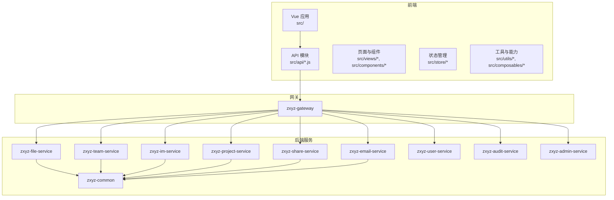
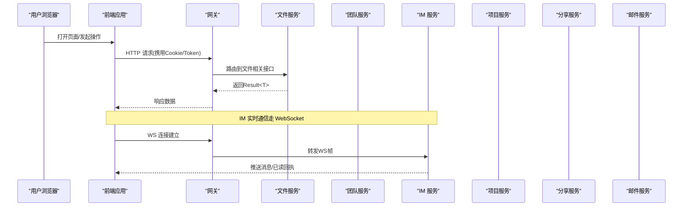
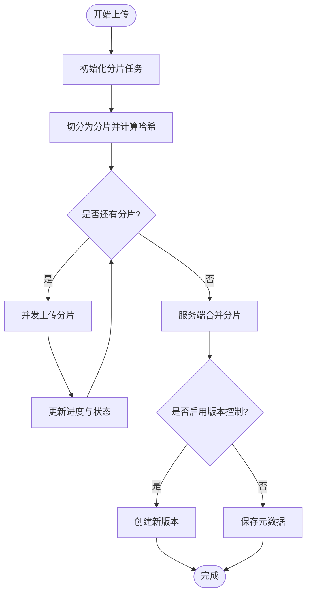
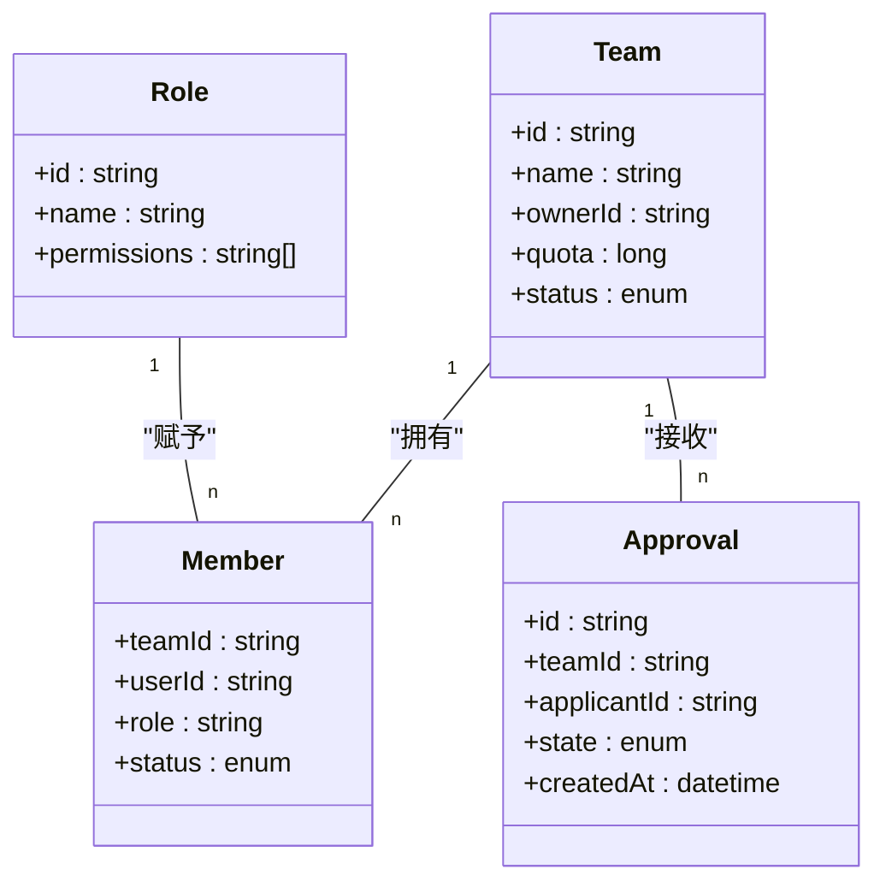
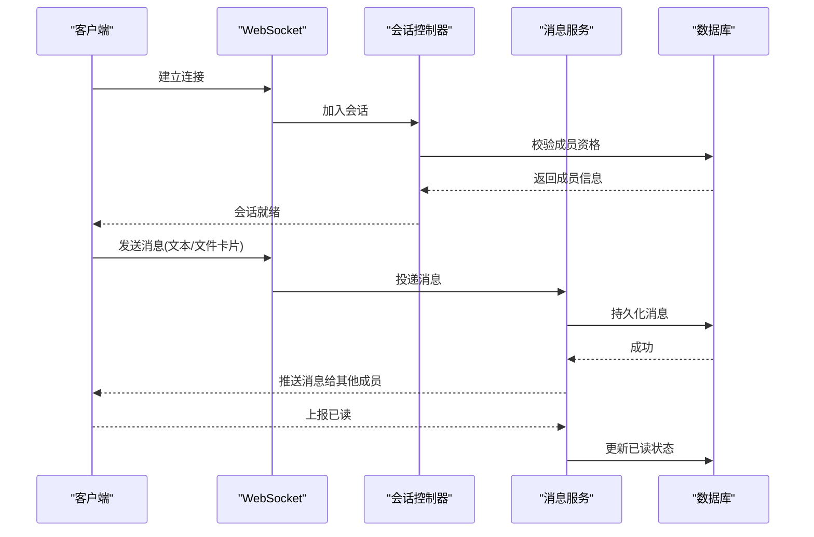
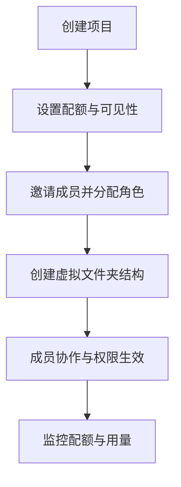
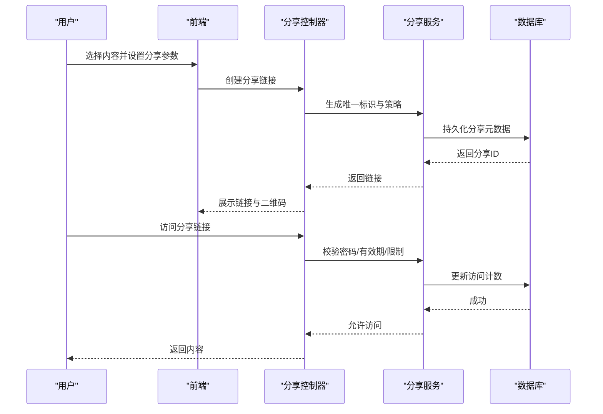
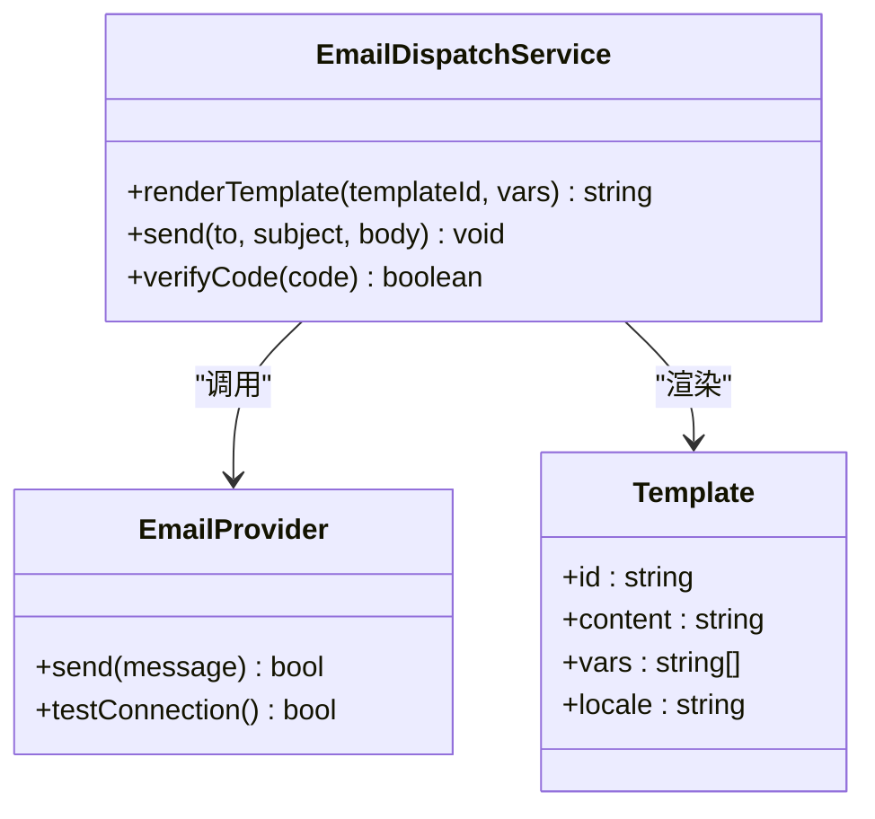
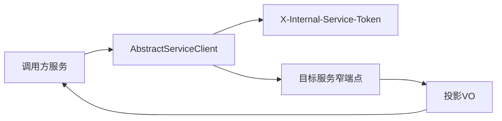

# 核心功能

<cite>
**本文引用的文件**   
- [ZXYZdatabaseBack/README.md](file://ZXYZdatabaseBack/README.md)
- [ZXYZdatabaseBack/pom.xml](file://ZXYZdatabaseBack/pom.xml)
- [ZXYZdatabaseBack/zxyz-file-service/src/main/java/uno/acloud/file/ZxyzFileApplication.java](file://ZXYZdatabaseBack/zxyz-file-service/src/main/java/uno/acloud/file/ZxyzFileApplication.java)
- [ZXYZdatabaseBack/zxyz-file-service/src/main/java/uno/acloud/file/controller/FileController.java](file://ZXYZdatabaseBack/zxyz-file-service/src/main/java/uno/acloud/file/controller/FileController.java)
- [ZXYZdatabaseBack/zxyz-file-service/src/main/java/uno/acloud/file/service/FileService.java](file://ZXYZdatabaseBack/zxyz-file-service/src/main/java/uno/acloud/file/service/FileService.java)
- [ZXYZdatabaseBack/zxyz-file-service/src/main/java/uno/acloud/file/storage/StorageProvider.java](file://ZXYZdatabaseBack/zxyz-file-service/src/main/java/uno/acloud/file/storage/StorageProvider.java)
- [ZXYZdatabaseBack/zxyz-team-service/src/main/java/uno/acloud/team/ZxyzTeamServiceApplication.java](file://ZXYZdatabaseBack/zxyz-team-service/src/main/java/uno/acloud/team/ZxyzTeamServiceApplication.java)
- [ZXYZdatabaseBack/zxyz-team-service/src/main/java/uno/acloud/team/controller/TeamController.java](file://ZXYZdatabaseBack/zxyz-team-service/src/main/java/uno/acloud/team/controller/TeamController.java)
- [ZXYZdatabaseBack/zxyz-team-service/src/main/java/uno/acloud/team/service/TeamService.java](file://ZXYZdatabaseBack/zxyz-team-service/src/main/java/uno/acloud/team/service/TeamService.java)
- [ZXYZdatabaseBack/zxyz-im-service/src/main/java/uno/acloud/im/ZxyzImApplication.java](file://ZXYZdatabaseBack/zxyz-im-service/src/main/java/uno/acloud/im/ZxyzImApplication.java)
- [ZXYZdatabaseBack/zxyz-im-service/src/main/java/uno/acloud/im/application/MessageService.java](file://ZXYZdatabaseBack/zxyz-im-service/src/main/java/uno/acloud/im/application/MessageService.java)
- [ZXYZdatabaseBack/zxyz-im-service/src/main/java/uno/acloud/im/controller/ConversationController.java](file://ZXYZdatabaseBack/zxyz-im-service/src/main/java/uno/acloud/im/controller/ConversationController.java)
- [ZXYZdatabaseBack/zxyz-project-service/src/main/java/uno/acloud/project/ZxyzProjectServiceApplication.java](file://ZXYZdatabaseBack/zxyz-project-service/src/main/java/uno/acloud/project/ZxyzProjectServiceApplication.java)
- [ZXYZdatabaseBack/zxyz-project-service/src/main/java/uno/acloud/project/controller/ProjectController.java](file://ZXYZdatabaseBack/zxyz-project-service/src/main/java/uno/acloud/project/controller/ProjectController.java)
- [ZXYZdatabaseBack/zxyz-project-service/src/main/java/uno/acloud/project/service/ProjectService.java](file://ZXYZdatabaseBack/zxyz-project-service/src/main/java/uno/acloud/project/service/ProjectService.java)
- [ZXYZdatabaseBack/zxyz-share-service/src/main/java/uno/acloud/share/ZxyzShareApplication.java](file://ZXYZdatabaseBack/zxyz-share-service/src/main/java/uno/acloud/share/ZxyzShareApplication.java)
- [ZXYZdatabaseBack/zxyz-share-service/src/main/java/uno/acloud/share/controller/ShareController.java](file://ZXYZdatabaseBack/zxyz-share-service/src/main/java/uno/acloud/share/controller/ShareController.java)
- [ZXYZdatabaseBack/zxyz-share-service/src/main/java/uno/acloud/share/service/ShareService.java](file://ZXYZdatabaseBack/zxyz-share-service/src/main/java/uno/acloud/share/service/ShareService.java)
- [ZXYZdatabaseBack/zxyz-email-service/src/main/java/uno/acloud/email/ZxyzEmailApplication.java](file://ZXYZdatabaseBack/zxyz-email-service/src/main/java/uno/acloud/email/ZxyzEmailApplication.java)
- [ZXYZdatabaseBack/zxyz-email-service/src/main/java/uno/acloud/email/application/EmailDispatchService.java](file://ZXYZdatabaseBack/zxyz-email-service/src/main/java/uno/acloud/email/application/EmailDispatchService.java)
- [ZXYZdatabaseBack/zxyz-email-service/src/main/java/uno/acloud/email/provider/EmailProvider.java](file://ZXYZdatabaseBack/zxyz-email-service/src/main/java/uno/acloud/email/provider/EmailProvider.java)
- [ZXYZdatabaseBack/zxyz-common/src/main/java/uno/acloud/client/AbstractServiceClient.java](file://ZXYZdatabaseBack/zxyz-common/src/main/java/uno/acloud/client/AbstractServiceClient.java)
- [ZXYZdatabaseBack/zxyz-common/src/main/java/uno/acloud/common/web/Result.java](file://ZXYZdatabaseBack/zxyz-common/src/main/java/uno/acloud/common/web/Result.java)
- [ZXYZdatabaseFront/package.json](file://ZXYZdatabaseFront/package.json)
- [ZXYZdatabaseFront/src/api/files.js](file://ZXYZdatabaseFront/src/api/files.js)
- [ZXYZdatabaseFront/src/api/team.js](file://ZXYZdatabaseFront/src/api/team.js)
- [ZXYZdatabaseFront/src/api/im.js](file://ZXYZdatabaseFront/src/api/im.js)
- [ZXYZdatabaseFront/src/api/project.js](file://ZXYZdatabaseFront/src/api/project.js)
- [ZXYZdatabaseFront/src/api/share.js](file://ZXYZdatabaseFront/src/api/share.js)
- [ZXYZdatabaseFront/src/api/emailAdmin.js](file://ZXYZdatabaseFront/src/api/emailAdmin.js)
- [ZXYZdatabaseFront/src/components/FileUploader.vue](file://ZXYZdatabaseFront/src/components/FileUploader.vue)
- [ZXYZdatabaseFront/src/components/uploader/shared.js](file://ZXYZdatabaseFront/src/components/uploader/shared.js)
- [ZXYZdatabaseFront/src/composables/useFileUpload.js](file://ZXYZdatabaseFront/src/composables/useFileUpload.js)
- [ZXYZdatabaseFront/src/utils/uploadProgress.js](file://ZXYZdatabaseFront/src/utils/uploadProgress.js)
- [ZXYZdatabaseFront/src/store/chat.js](file://ZXYZdatabaseFront/src/store/chat.js)
- [ZXYZdatabaseFront/src/utils/imWebSocket.js](file://ZXYZdatabaseFront/src/utils/imWebSocket.js)
- [ZXYZdatabaseFront/src/views/chat/index.vue](file://ZXYZdatabaseFront/src/views/chat/index.vue)
- [ZXYZdatabaseFront/src/views/projects/index.vue](file://ZXYZdatabaseFront/src/views/projects/index.vue)
- [ZXYZdatabaseFront/src/views/my-share/index.vue](file://ZXYZdatabaseFront/src/views/my-share/index.vue)
- [ZXYZdatabaseFront/src/views/recycle-bin/index.vue](file://ZXYZdatabaseFront/src/views/recycle-bin/index.vue)
- [ZXYZdatabaseFront/src/views/setting/SystemAdmin.vue](file://ZXYZdatabaseFront/src/views/setting/SystemAdmin.vue)
- [ZXYZdatabaseFront/src/views/setting/EmailRecordPanel.vue](file://ZXYZdatabaseFront/src/views/setting/EmailRecordPanel.vue)
</cite>

## 目录
1. [简介](#简介)
2. [项目结构](#项目结构)
3. [核心组件](#核心组件)
4. [架构总览](#架构总览)
5. [详细组件分析](#详细组件分析)
6. [依赖分析](#依赖分析)
7. [性能考虑](#性能考虑)
8. [故障排查指南](#故障排查指南)
9. [结论](#结论)
10. [附录](#附录)

## 简介
本文件面向 ZXYZ 项目的六大核心功能模块，提供业务场景、技术实现、接口设计与用户体验的详细说明与最佳实践建议。系统采用微服务架构（后端 Maven 多模块 + Vue 前端），服务间同步调用通过 ServiceClient + 内部令牌鉴权，异步通信基于 RabbitMQ Topic Exchange；认证依赖 HttpOnly Cookie 与 Redis Session，统一响应体为 Result<T>。前端使用 Vue 3 Composition API、Element Plus 自动导入、Pinia 状态管理与 composables 封装业务逻辑。

## 项目结构
后端由多个独立服务组成：文件服务、团队服务、即时通讯服务、项目管理服务、分享服务、邮件服务、用户服务、审计服务、配置管理服务、网关以及公共库。前端以 Vue 3 应用组织，API 层按模块拆分，组件与组合式函数按功能域划分。

图表来源 
- [ZXYZdatabaseBack/pom.xml](file://ZXYZdatabaseBack/pom.xml)
- [ZXYZdatabaseFront/package.json](file://ZXYZdatabaseFront/package.json)

章节来源
- [ZXYZdatabaseBack/README.md](file://ZXYZdatabaseBack/README.md)
- [ZXYZdatabaseBack/pom.xml](file://ZXYZdatabaseBack/pom.xml)
- [ZXYZdatabaseFront/package.json](file://ZXYZdatabaseFront/package.json)

## 核心组件
- 文件管理系统：支持分片上传、版本控制、批量操作、回收站、权限控制。
- 团队协作：团队创建、成员管理、角色权限、审批流程。
- 即时通讯：聊天室、消息推送、文件卡片、已读状态。
- 项目管理：项目创建、虚拟文件夹、配额管理、成员协作。
- 分享功能：链接生成、访问控制、下载统计、有效期管理。
- 邮件服务：多提供商支持、模板渲染、验证码、发送记录。

章节来源
- [ZXYZdatabaseBack/zxyz-file-service/src/main/java/uno/acloud/file/ZxyzFileApplication.java](file://ZXYZdatabaseBack/zxyz-file-service/src/main/java/uno/acloud/file/ZxyzFileApplication.java)
- [ZXYZdatabaseBack/zxyz-team-service/src/main/java/uno/acloud/team/ZxyzTeamServiceApplication.java](file://ZXYZdatabaseBack/zxyz-team-service/src/main/java/uno/acloud/team/ZxyzTeamServiceApplication.java)
- [ZXYZdatabaseBack/zxyz-im-service/src/main/java/uno/acloud/im/ZxyzImApplication.java](file://ZXYZdatabaseBack/zxyz-im-service/src/main/java/uno/acloud/im/ZxyzImApplication.java)
- [ZXYZdatabaseBack/zxyz-project-service/src/main/java/uno/acloud/project/ZxyzProjectServiceApplication.java](file://ZXYZdatabaseBack/zxyz-project-service/src/main/java/uno/acloud/project/ZxyzProjectServiceApplication.java)
- [ZXYZdatabaseBack/zxyz-share-service/src/main/java/uno/acloud/share/ZxyzShareApplication.java](file://ZXYZdatabaseBack/zxyz-share-service/src/main/java/uno/acloud/share/ZxyzShareApplication.java)
- [ZXYZdatabaseBack/zxyz-email-service/src/main/java/uno/acloud/email/ZxyzEmailApplication.java](file://ZXYZdatabaseBack/zxyz-email-service/src/main/java/uno/acloud/email/ZxyzEmailApplication.java)

## 架构总览
系统采用“网关统一入口 + 微服务领域边界”的架构。前端通过 HTTP/WebSocket 与网关交互，网关进行鉴权与路由转发。各服务内部遵循分层或 DDD 风格，服务间通过窄端点与投影 VO 进行解耦，异步事件通过 RabbitMQ 传递。

图表来源 
- [ZXYZdatabaseBack/zxyz-common/src/main/java/uno/acloud/common/web/Result.java](file://ZXYZdatabaseBack/zxyz-common/src/main/java/uno/acloud/common/web/Result.java)
- [ZXYZdatabaseFront/src/utils/imWebSocket.js](file://ZXYZdatabaseFront/src/utils/imWebSocket.js)

章节来源
- [ZXYZdatabaseBack/zxyz-common/src/main/java/uno/acloud/common/web/Result.java](file://ZXYZdatabaseBack/zxyz-common/src/main/java/uno/acloud/common/web/Result.java)
- [ZXYZdatabaseFront/src/utils/imWebSocket.js](file://ZXYZdatabaseFront/src/utils/imWebSocket.js)

## 详细组件分析

### 文件管理系统
- 业务场景
  - 大文件分片上传与断点续传，提升稳定性与吞吐。
  - 版本控制保障历史可追溯，支持回滚与对比。
  - 批量操作（移动、复制、删除）提升效率。
  - 回收站机制避免误删，支持恢复与彻底清理。
  - 权限控制基于团队/项目维度，细粒度到文件级。
- 技术实现
  - 控制器暴露分片上传、合并、版本化、批量操作的 REST 接口。
  - 存储抽象层对接不同对象存储，统一读写路径与元数据。
  - 服务层编排事务、并发分片写入、版本快照与回收站标记。
  - 前端组件封装分片切块、并发上传、进度回调与失败重试。
- 接口设计
  - 分片上传：初始化分片、上传分片、合并分片、查询状态。
  - 版本控制：创建版本、列出版本、回滚至指定版本。
  - 批量操作：批量移动/复制/删除，返回任务ID与结果聚合。
  - 回收站：软删除、恢复、清空回收站。
  - 权限校验：基于团队/项目上下文与角色策略。
- 用户体验
  - 上传进度可视化、错误提示与一键重试。
  - 列表支持排序、筛选、搜索与快捷菜单。
  - 回收站与版本面板直观展示历史与操作轨迹。

图表来源 
- [ZXYZdatabaseBack/zxyz-file-service/src/main/java/uno/acloud/file/controller/FileController.java](file://ZXYZdatabaseBack/zxyz-file-service/src/main/java/uno/acloud/file/controller/FileController.java)
- [ZXYZdatabaseBack/zxyz-file-service/src/main/java/uno/acloud/file/service/FileService.java](file://ZXYZdatabaseBack/zxyz-file-service/src/main/java/uno/acloud/file/service/FileService.java)
- [ZXYZdatabaseBack/zxyz-file-service/src/main/java/uno/acloud/file/storage/StorageProvider.java](file://ZXYZdatabaseBack/zxyz-file-service/src/main/java/uno/acloud/file/storage/StorageProvider.java)
- [ZXYZdatabaseFront/src/components/FileUploader.vue](file://ZXYZdatabaseFront/src/components/FileUploader.vue)
- [ZXYZdatabaseFront/src/components/uploader/shared.js](file://ZXYZdatabaseFront/src/components/uploader/shared.js)
- [ZXYZdatabaseFront/src/composables/useFileUpload.js](file://ZXYZdatabaseFront/src/composables/useFileUpload.js)
- [ZXYZdatabaseFront/src/utils/uploadProgress.js](file://ZXYZdatabaseFront/src/utils/uploadProgress.js)

章节来源
- [ZXYZdatabaseBack/zxyz-file-service/src/main/java/uno/acloud/file/controller/FileController.java](file://ZXYZdatabaseBack/zxyz-file-service/src/main/java/uno/acloud/file/controller/FileController.java)
- [ZXYZdatabaseBack/zxyz-file-service/src/main/java/uno/acloud/file/service/FileService.java](file://ZXYZdatabaseBack/zxyz-file-service/src/main/java/uno/acloud/file/service/FileService.java)
- [ZXYZdatabaseBack/zxyz-file-service/src/main/java/uno/acloud/file/storage/StorageProvider.java](file://ZXYZdatabaseBack/zxyz-file-service/src/main/java/uno/acloud/file/storage/StorageProvider.java)
- [ZXYZdatabaseFront/src/components/FileUploader.vue](file://ZXYZdatabaseFront/src/components/FileUploader.vue)
- [ZXYZdatabaseFront/src/components/uploader/shared.js](file://ZXYZdatabaseFront/src/components/uploader/shared.js)
- [ZXYZdatabaseFront/src/composables/useFileUpload.js](file://ZXYZdatabaseFront/src/composables/useFileUpload.js)
- [ZXYZdatabaseFront/src/utils/uploadProgress.js](file://ZXYZdatabaseFront/src/utils/uploadProgress.js)

### 团队协作功能
- 业务场景
  - 快速创建团队，邀请成员加入，分配角色与权限。
  - 支持审批流程控制成员加入与敏感操作。
  - 资源配额与存储空间管理，保障公平使用。
- 技术实现
  - 团队控制器提供 CRUD、成员增删改、角色授权与审批流。
  - 服务层维护团队-成员关系、角色策略与审批状态机。
  - 前端提供团队设置抽屉、成员面板、角色管理面板与存储配额视图。
- 接口设计
  - 团队管理：创建团队、更新信息、删除团队。
  - 成员管理：邀请、接受/拒绝、移除、查询成员列表。
  - 角色权限：定义角色、绑定权限、继承与覆盖。
  - 审批流程：申请加入、审批通过/拒绝、通知与记录。
- 用户体验
  - 直观的团队成员列表与角色标签。
  - 审批状态清晰可见，支持批量处理。
  - 存储空间用量可视化与告警。

图表来源 
- [ZXYZdatabaseBack/zxyz-team-service/src/main/java/uno/acloud/team/controller/TeamController.java](file://ZXYZdatabaseBack/zxyz-team-service/src/main/java/uno/acloud/team/controller/TeamController.java)
- [ZXYZdatabaseBack/zxyz-team-service/src/main/java/uno/acloud/team/service/TeamService.java](file://ZXYZdatabaseBack/zxyz-team-service/src/main/java/uno/acloud/team/service/TeamService.java)
- [ZXYZdatabaseFront/src/api/team.js](file://ZXYZdatabaseFront/src/api/team.js)
- [ZXYZdatabaseFront/src/components/team-settings/TeamMemberPanel.vue](file://ZXYZdatabaseFront/src/components/team-settings/TeamMemberPanel.vue)
- [ZXYZdatabaseFront/src/components/team-settings/RoleManagementPanel.vue](file://ZXYZdatabaseFront/src/components/team-settings/RoleManagementPanel.vue)

章节来源
- [ZXYZdatabaseBack/zxyz-team-service/src/main/java/uno/acloud/team/controller/TeamController.java](file://ZXYZdatabaseBack/zxyz-team-service/src/main/java/uno/acloud/team/controller/TeamController.java)
- [ZXYZdatabaseBack/zxyz-team-service/src/main/java/uno/acloud/team/service/TeamService.java](file://ZXYZdatabaseBack/zxyz-team-service/src/main/java/uno/acloud/team/service/TeamService.java)
- [ZXYZdatabaseFront/src/api/team.js](file://ZXYZdatabaseFront/src/api/team.js)
- [ZXYZdatabaseFront/src/components/team-settings/TeamMemberPanel.vue](file://ZXYZdatabaseFront/src/components/team-settings/TeamMemberPanel.vue)
- [ZXYZdatabaseFront/src/components/team-settings/RoleManagementPanel.vue](file://ZXYZdatabaseFront/src/components/team-settings/RoleManagementPanel.vue)

### 即时通讯功能
- 业务场景
  - 聊天室支持单聊/群聊，消息类型包括文本、文件卡片等。
  - 实时推送消息与已读状态，提升协作效率。
  - 与文件/项目联动，便于在对话中引用与共享。
- 技术实现
  - DDD 分层：interfaces → application → domain → infrastructure。
  - 消息服务负责消息持久化、去重、投递与已读回执。
  - 前端通过 WebSocket 建立长连接，维护会话与消息队列。
- 接口设计
  - 会话管理：创建/加入/退出、成员列表、置顶与可见性同步。
  - 消息收发：发送文本/文件卡片、分页拉取、已读上报。
  - 通知与状态：在线状态、未读数、消息回执。
- 用户体验
  - 流畅的消息滚动与虚拟列表优化。
  - 文件卡片预览与快速下载。
  - 已读状态实时更新，减少沟通成本。

图表来源 
- [ZXYZdatabaseBack/zxyz-im-service/src/main/java/uno/acloud/im/controller/ConversationController.java](file://ZXYZdatabaseBack/zxyz-im-service/src/main/java/uno/acloud/im/controller/ConversationController.java)
- [ZXYZdatabaseBack/zxyz-im-service/src/main/java/uno/acloud/im/application/MessageService.java](file://ZXYZdatabaseBack/zxyz-im-service/src/main/java/uno/acloud/im/application/MessageService.java)
- [ZXYZdatabaseFront/src/utils/imWebSocket.js](file://ZXYZdatabaseFront/src/utils/imWebSocket.js)
- [ZXYZdatabaseFront/src/store/chat.js](file://ZXYZdatabaseFront/src/store/chat.js)
- [ZXYZdatabaseFront/src/views/chat/index.vue](file://ZXYZdatabaseFront/src/views/chat/index.vue)

章节来源
- [ZXYZdatabaseBack/zxyz-im-service/src/main/java/uno/acloud/im/controller/ConversationController.java](file://ZXYZdatabaseBack/zxyz-im-service/src/main/java/uno/acloud/im/controller/ConversationController.java)
- [ZXYZdatabaseBack/zxyz-im-service/src/main/java/uno/acloud/im/application/MessageService.java](file://ZXYZdatabaseBack/zxyz-im-service/src/main/java/uno/acloud/im/application/MessageService.java)
- [ZXYZdatabaseFront/src/utils/imWebSocket.js](file://ZXYZdatabaseFront/src/utils/imWebSocket.js)
- [ZXYZdatabaseFront/src/store/chat.js](file://ZXYZdatabaseFront/src/store/chat.js)
- [ZXYZdatabaseFront/src/views/chat/index.vue](file://ZXYZdatabaseFront/src/views/chat/index.vue)

### 项目管理功能
- 业务场景
  - 创建项目空间，隔离资源与协作范围。
  - 虚拟文件夹映射项目目录结构，简化文件组织。
  - 配额管理限制项目存储与成员数量。
  - 成员协作与权限继承，确保数据安全。
- 技术实现
  - 项目控制器提供项目 CRUD、成员管理、配额设置。
  - 服务层维护项目-成员关系、配额策略与虚拟文件夹映射。
  - 前端提供项目列表、设置对话框与虚拟文件夹导航。
- 接口设计
  - 项目创建与配置：名称、描述、配额、可见性。
  - 成员协作：邀请、角色分配、权限继承。
  - 虚拟文件夹：创建、重命名、移动、删除。
  - 配额监控：用量统计、阈值告警。
- 用户体验
  - 项目切换与导航便捷。
  - 虚拟文件夹树形展示与拖拽操作。
  - 配额使用可视化与提醒。

图表来源 
- [ZXYZdatabaseBack/zxyz-project-service/src/main/java/uno/acloud/project/controller/ProjectController.java](file://ZXYZdatabaseBack/zxyz-project-service/src/main/java/uno/acloud/project/controller/ProjectController.java)
- [ZXYZdatabaseBack/zxyz-project-service/src/main/java/uno/acloud/project/service/ProjectService.java](file://ZXYZdatabaseBack/zxyz-project-service/src/main/java/uno/acloud/project/service/ProjectService.java)
- [ZXYZdatabaseFront/src/api/project.js](file://ZXYZdatabaseFront/src/api/project.js)
- [ZXYZdatabaseFront/src/views/projects/index.vue](file://ZXYZdatabaseFront/src/views/projects/index.vue)

章节来源
- [ZXYZdatabaseBack/zxyz-project-service/src/main/java/uno/acloud/project/controller/ProjectController.java](file://ZXYZdatabaseBack/zxyz-project-service/src/main/java/uno/acloud/project/controller/ProjectController.java)
- [ZXYZdatabaseBack/zxyz-project-service/src/main/java/uno/acloud/project/service/ProjectService.java](file://ZXYZdatabaseBack/zxyz-project-service/src/main/java/uno/acloud/project/service/ProjectService.java)
- [ZXYZdatabaseFront/src/api/project.js](file://ZXYZdatabaseFront/src/api/project.js)
- [ZXYZdatabaseFront/src/views/projects/index.vue](file://ZXYZdatabaseFront/src/views/projects/index.vue)

### 分享功能
- 业务场景
  - 生成分享链接，支持密码保护与访问次数限制。
  - 下载统计与访问日志，便于追踪与分析。
  - 有效期管理，过期自动失效。
- 技术实现
  - 分享控制器提供链接生成、访问校验、下载统计。
  - 服务层维护分享元数据、访问计数与过期策略。
  - 前端提供分享创建对话框与我的分享列表。
- 接口设计
  - 链接生成：选择内容、设置密码、有效期、访问限制。
  - 访问控制：校验密码、IP/UA 限制、频率限制。
  - 下载统计：累计下载次数、最近访问者。
  - 有效期管理：到期清理、延期操作。
- 用户体验
  - 一键复制链接与二维码生成。
  - 访问状态与统计可视化。
  - 过期提醒与自动清理。

图表来源 
- [ZXYZdatabaseBack/zxyz-share-service/src/main/java/uno/acloud/share/controller/ShareController.java](file://ZXYZdatabaseBack/zxyz-share-service/src/main/java/uno/acloud/share/controller/ShareController.java)
- [ZXYZdatabaseBack/zxyz-share-service/src/main/java/uno/acloud/share/service/ShareService.java](file://ZXYZdatabaseBack/zxyz-share-service/src/main/java/uno/acloud/share/service/ShareService.java)
- [ZXYZdatabaseFront/src/api/share.js](file://ZXYZdatabaseFront/src/api/share.js)
- [ZXYZdatabaseFront/src/views/my-share/index.vue](file://ZXYZdatabaseFront/src/views/my-share/index.vue)

章节来源
- [ZXYZdatabaseBack/zxyz-share-service/src/main/java/uno/acloud/share/controller/ShareController.java](file://ZXYZdatabaseBack/zxyz-share-service/src/main/java/uno/acloud/share/controller/ShareController.java)
- [ZXYZdatabaseBack/zxyz-share-service/src/main/java/uno/acloud/share/service/ShareService.java](file://ZXYZdatabaseBack/zxyz-share-service/src/main/java/uno/acloud/share/service/ShareService.java)
- [ZXYZdatabaseFront/src/api/share.js](file://ZXYZdatabaseFront/src/api/share.js)
- [ZXYZdatabaseFront/src/views/my-share/index.vue](file://ZXYZdatabaseFront/src/views/my-share/index.vue)

### 邮件服务
- 业务场景
  - 多邮件提供商接入（如 SMTP/SendGrid 等）。
  - 模板渲染支持变量替换与多语言。
  - 验证码发送与校验，安全登录与注册。
  - 发送记录查询与审计，便于问题定位。
- 技术实现
  - DDD 分层：interfaces → application → domain → infrastructure。
  - 分发服务负责模板渲染、队列派发与重试。
  - 提供商抽象层统一发送接口，支持动态切换。
- 接口设计
  - 模板管理：创建、编辑、预览、发布。
  - 验证码：生成、校验、过期策略。
  - 发送记录：查询、过滤、导出。
  - 提供商配置：新增、测试、切换。
- 用户体验
  - 管理员界面查看发送记录与状态。
  - 模板可视化编辑与变量提示。
  - 验证码输入框与错误提示。

图表来源 
- [ZXYZdatabaseBack/zxyz-email-service/src/main/java/uno/acloud/email/application/EmailDispatchService.java](file://ZXYZdatabaseBack/zxyz-email-service/src/main/java/uno/acloud/email/application/EmailDispatchService.java)
- [ZXYZdatabaseBack/zxyz-email-service/src/main/java/uno/acloud/email/provider/EmailProvider.java](file://ZXYZdatabaseBack/zxyz-email-service/src/main/java/uno/acloud/email/provider/EmailProvider.java)
- [ZXYZdatabaseFront/src/api/emailAdmin.js](file://ZXYZdatabaseFront/src/api/emailAdmin.js)
- [ZXYZdatabaseFront/src/views/setting/EmailRecordPanel.vue](file://ZXYZdatabaseFront/src/views/setting/EmailRecordPanel.vue)

章节来源
- [ZXYZdatabaseBack/zxyz-email-service/src/main/java/uno/acloud/email/application/EmailDispatchService.java](file://ZXYZdatabaseBack/zxyz-email-service/src/main/java/uno/acloud/email/application/EmailDispatchService.java)
- [ZXYZdatabaseBack/zxyz-email-service/src/main/java/uno/acloud/email/provider/EmailProvider.java](file://ZXYZdatabaseBack/zxyz-email-service/src/main/java/uno/acloud/email/provider/EmailProvider.java)
- [ZXYZdatabaseFront/src/api/emailAdmin.js](file://ZXYZdatabaseFront/src/api/emailAdmin.js)
- [ZXYZdatabaseFront/src/views/setting/EmailRecordPanel.vue](file://ZXYZdatabaseFront/src/views/setting/EmailRecordPanel.vue)

## 依赖分析
- 服务间调用
  - 通过 zxyz-common 中的 AbstractServiceClient 封装内部服务调用，统一鉴权头 X-Internal-Service-Token。
  - 窄端点与投影 VO 模式降低耦合，提供方与调用方独立演进。
- 前端依赖
  - API 模块按功能域拆分，组件与组合式函数复用性强。
  - WebSocket 与状态管理解耦，提升可维护性。
- 外部依赖
  - 对象存储、RabbitMQ、Redis、数据库等基础设施通过配置中心统一管理。

图表来源 
- [ZXYZdatabaseBack/zxyz-common/src/main/java/uno/acloud/client/AbstractServiceClient.java](file://ZXYZdatabaseBack/zxyz-common/src/main/java/uno/acloud/client/AbstractServiceClient.java)

章节来源
- [ZXYZdatabaseBack/zxyz-common/src/main/java/uno/acloud/client/AbstractServiceClient.java](file://ZXYZdatabaseBack/zxyz-common/src/main/java/uno/acloud/client/AbstractServiceClient.java)

## 性能考虑
- 文件上传
  - 分片并发上传与断点续传，结合前端进度反馈与后端幂等校验。
  - 对象存储直传与 CDN 加速，减少服务器负载。
- 即时通讯
  - 虚拟列表与增量更新，降低 DOM 压力。
  - WebSocket 心跳与重连机制，保证连接稳定。
- 分享与下载
  - 访问频率限制与缓存热点链接，防止滥用。
  - 下载统计异步落库，避免阻塞主流程。
- 邮件发送
  - 队列异步派发与重试，提高吞吐与可靠性。
  - 模板预渲染与缓存，缩短响应时间。

[本节为通用指导，不直接分析具体文件]

## 故障排查指南
- 常见问题
  - 上传失败：检查分片大小、网络超时与存储配额。
  - 消息丢失：确认 WebSocket 连接状态与队列消费情况。
  - 分享链接无效：核对密码、有效期与访问限制。
  - 邮件发送失败：验证提供商配置与模板变量。
- 排查步骤
  - 查看网关日志与服务日志，定位错误码与堆栈。
  - 检查数据库记录与对象存储文件是否存在。
  - 使用管理界面查看发送记录与分享统计。
  - 前端控制台与网络面板分析请求与响应。

章节来源
- [ZXYZdatabaseFront/src/views/setting/SystemAdmin.vue](file://ZXYZdatabaseFront/src/views/setting/SystemAdmin.vue)
- [ZXYZdatabaseFront/src/views/setting/EmailRecordPanel.vue](file://ZXYZdatabaseFront/src/views/setting/EmailRecordPanel.vue)
- [ZXYZdatabaseFront/src/views/recycle-bin/index.vue](file://ZXYZdatabaseFront/src/views/recycle-bin/index.vue)

## 结论
ZXYZ 项目通过清晰的微服务边界与前后端分离架构，实现了文件管理、团队协作、即时通讯、项目管理、分享与邮件六大核心功能。各模块在业务场景、技术实现、接口设计与用户体验方面均具备良好实践，适合企业级协作与知识管理场景。建议在后续迭代中持续优化性能与可观测性，完善自动化测试与文档体系。

[本节为总结性内容，不直接分析具体文件]

## 附录
- 最佳实践建议
  - 文件上传：合理设置分片大小与并发数，启用断点续传与失败重试。
  - 权限控制：最小权限原则，定期审计成员与角色。
  - 即时通讯：合理使用已读回执与消息去重，避免重复通知。
  - 分享链接：设置合理有效期与访问限制，定期清理过期链接。
  - 邮件服务：模板标准化与变量校验，发送记录归档与审计。

[本节为通用指导，不直接分析具体文件]