# 项目介绍

<cite>
**本文引用的文件**   
- [ZXYZdatabaseBack/README.md](file://ZXYZdatabaseBack/README.md)
- [ZXYZdatabaseBack/pom.xml](file://ZXYZdatabaseBack/pom.xml)
- [ZXYZdatabaseBack/Dockerfile](file://ZXYZdatabaseBack/Dockerfile)
- [ZXYZdatabaseBack/zxyz-gateway/src/main/java/uno/acloud/gateway/ZxyzGatewayApplication.java](file://ZXYZdatabaseBack/zxyz-gateway/src/main/java/uno/acloud/gateway/ZxyzGatewayApplication.java)
- [ZXYZdatabaseBack/zxyz-file-service/src/main/java/uno/acloud/file/ZxyzFileApplication.java](file://ZXYZdatabaseBack/zxyz-file-service/src/main/java/uno/acloud/file/ZxyzFileApplication.java)
- [ZXYZdatabaseBack/zxyz-team-service/src/main/java/uno/acloud/team/ZxyzTeamServiceApplication.java](file://ZXYZdatabaseBack/zxyz-team-service/src/main/java/uno/acloud/team/ZxyzTeamServiceApplication.java)
- [ZXYZdatabaseBack/zxyz-im-service/src/main/java/uno/acloud/im/ZxyzImApplication.java](file://ZXYZdatabaseBack/zxyz-im-service/src/main/java/uno/acloud/im/ZxyzImApplication.java)
- [ZXYZdatabaseBack/zxyz-project-service/src/main/java/uno/acloud/project/ZxyzProjectServiceApplication.java](file://ZXYZdatabaseBack/zxyz-project-service/src/main/java/uno/acloud/project/ZxyzProjectServiceApplication.java)
- [ZXYZdatabaseBack/zxyz-share-service/src/main/java/uno/acloud/share/ZxyzShareApplication.java](file://ZXYZdatabaseBack/zxyz-share-service/src/main/java/uno/acloud/share/ZxyzShareApplication.java)
- [ZXYZdatabaseBack/zxyz-email-service/src/main/java/uno/acloud/email/ZxyzEmailApplication.java](file://ZXYZdatabaseBack/zxyz-email-service/src/main/java/uno/acloud/email/ZxyzEmailApplication.java)
- [ZXYZdatabaseBack/zxyz-user-service/src/main/java/uno/acloud/user/ZxyzUserApplication.java](file://ZXYZdatabaseBack/zxyz-user-service/src/main/java/uno/acloud/user/ZxyzUserApplication.java)
- [ZXYZdatabaseBack/zxyz-admin-service/src/main/java/uno/acloud/admin/ZxyzAdminApplication.java](file://ZXYZdatabaseBack/zxyz-admin-service/src/main/java/uno/acloud/admin/ZxyzAdminApplication.java)
- [ZXYZdatabaseBack/zxyz-audit-service/src/main/java/uno/acloud/audit/ZxyzAuditServiceApplication.java](file://ZXYZdatabaseBack/zxyz-audit-service/src/main/java/uno/acloud/audit/ZxyzAuditServiceApplication.java)
- [ZXYZdatabaseFront/package.json](file://ZXYZdatabaseFront/package.json)
- [ZXYZdatabaseFront/src/main.js](file://ZXYZdatabaseFront/src/main.js)
- [ZXYZdatabaseFront/src/router/index.js](file://ZXYZdatabaseFront/src/router/index.js)
- [ZXYZdatabaseFront/src/api/files.js](file://ZXYZdatabaseFront/src/api/files.js)
- [ZXYZdatabaseFront/src/api/auth.js](file://ZXYZdatabaseFront/src/api/auth.js)
- [ZXYZdatabaseFront/src/utils/request.js](file://ZXYZdatabaseFront/src/utils/request.js)
- [ZXYZdatabaseFront/src/store/chat.js](file://ZXYZdatabaseFront/src/store/chat.js)
- [docker-compose.yml](file://docker-compose.yml)
- [deploy/nginx/default.conf](file://deploy/nginx/default.conf)
- [.github/workflows/ci-cd.yml](file://.github/workflows/ci-cd.yml)
- [nacos-config/zxyz-dynamic.yml](file://nacos-config/zxyz-dynamic.yml)
- [docs/architecture.md](file://docs/architecture.md)
</cite>

## 目录
1. [简介](#简介)
2. [项目结构](#项目结构)
3. [核心组件](#核心组件)
4. [架构总览](#架构总览)
5. [详细组件分析](#详细组件分析)
6. [依赖关系分析](#依赖关系分析)
7. [性能与弹性](#性能与弹性)
8. [故障排查指南](#故障排查指南)
9. [结论](#结论)
10. [附录](#附录)

## 简介
ZXYZ数据库协作平台是一个面向企业级的微服务架构协作系统，围绕“文件管理、团队协作、即时通讯、项目管理、分享与权限、邮件服务”等核心能力构建。平台通过容器化部署与事件驱动架构，提供高内聚低耦合的服务边界、可观测的运维体系以及弹性的扩展能力，满足大型团队在数据资产协同、版本回溯、安全访问与实时沟通等方面的综合需求。

- 核心价值主张
  - 以微服务解耦业务域，提升迭代效率与稳定性
  - 统一网关与鉴权，保障内部端点安全与外部访问可控
  - 事件驱动与消息队列，增强系统弹性与容错能力
  - 容器化编排与CI/CD，降低运维成本与交付风险
  - 前端现代化（Vue 3 + Pinia + Composition API），提升开发体验与交互质量

- 适用场景
  - 企业级文件与版本管理、跨部门协作
  - 项目空间隔离与配置集中管理
  - 团队即时通讯与消息持久化
  - 分享链接的访问控制与下载统计
  - 模板化邮件发送与验证码服务

**章节来源**
- [ZXYZdatabaseBack/README.md](file://ZXYZdatabaseBack/README.md)
- [docs/architecture.md](file://docs/architecture.md)

## 项目结构
后端采用多模块Maven工程，按业务域拆分为多个独立服务；前端为独立的Vue 3应用；基础设施与部署由Docker Compose统一管理。

- 后端模块概览
  - zxyz-gateway：API网关，统一路由、鉴权与限流
  - zxyz-file-service：文件服务（分片上传、版本控制、回收站）
  - zxyz-team-service：团队服务（成员管理、角色与权限）
  - zxyz-im-service：即时通讯服务（聊天、消息持久化）
  - zxyz-project-service：项目服务（虚拟空间、配置管理）
  - zxyz-share-service：分享服务（访问控制、下载统计）
  - zxyz-email-service：邮件服务（模板渲染、验证码发送）
  - zxyz-user-service：用户服务（认证与会话）
  - zxyz-admin-service：管理服务（配置审计、提供者管理）
  - zxyz-audit-service：审计服务（操作日志、异步处理）
  - zxyz-common：公共库（客户端、通用DTO、工具类）

- 前端结构概览
  - src/api：各域API封装
  - src/components：UI组件（文件上传、对话、分享等）
  - src/composables：组合式逻辑封装
  - src/store：Pinia状态管理（含聊天域）
  - src/router：路由与守卫
  - src/utils：请求封装、WebSocket、错误处理等

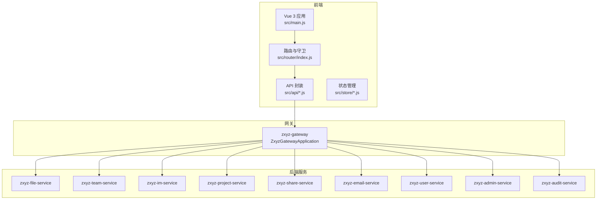

**图表来源**
- [ZXYZdatabaseBack/zxyz-gateway/src/main/java/uno/acloud/gateway/ZxyzGatewayApplication.java](file://ZXYZdatabaseBack/zxyz-gateway/src/main/java/uno/acloud/gateway/ZxyzGatewayApplication.java)
- [ZXYZdatabaseFront/src/main.js](file://ZXYZdatabaseFront/src/main.js)
- [ZXYZdatabaseFront/src/router/index.js](file://ZXYZdatabaseFront/src/router/index.js)

**章节来源**
- [ZXYZdatabaseBack/pom.xml](file://ZXYZdatabaseBack/pom.xml)
- [ZXYZdatabaseFront/package.json](file://ZXYZdatabaseFront/package.json)
- [docker-compose.yml](file://docker-compose.yml)

## 核心组件
- 网关（zxyz-gateway）
  - 统一入口、鉴权过滤、内部端点保护（拒绝公网访问 /api/internal/**）
  - 与Nacos集成进行动态配置与服务发现

- 文件服务（zxyz-file-service）
  - 支持分片上传、断点续传、版本控制、回收站恢复与清理
  - 与对象存储对接，提供统一的文件元数据与路径解析

- 团队服务（zxyz-team-service）
  - 成员邀请、角色分配、权限策略校验
  - 与用户服务、审计服务联动，记录关键操作

- 即时通讯服务（zxyz-im-service）
  - 会话管理、消息收发、离线消息与持久化
  - WebSocket长连接，结合Redis缓存提升吞吐

- 项目服务（zxyz-project-service）
  - 虚拟空间隔离、项目配置管理、资源配额
  - 与文件服务、分享服务协作，实现空间级权限

- 分享服务（zxyz-share-service）
  - 生成分享链接、访问控制、下载统计与限流
  - 与文件服务对接获取内容，与审计服务记录访问

- 邮件服务（zxyz-email-service）
  - 模板渲染、验证码生成与发送、发送记录查询
  - 多提供商适配，失败重试与死信队列

- 用户服务（zxyz-user-service）
  - 登录注册、密码管理、会话管理（Sa-Token + Redis）
  - 与网关鉴权配合，保证HttpOnly Cookie安全

- 管理服务（zxyz-admin-service）
  - 系统配置、审计查看、第三方提供者管理
  - 配置变更审计，确保合规与可追溯

- 审计服务（zxyz-audit-service）
  - 操作日志收集、去重、清理任务
  - 基于RabbitMQ Topic Exchange异步消费

**章节来源**
- [ZXYZdatabaseBack/zxyz-gateway/src/main/java/uno/acloud/gateway/ZxyzGatewayApplication.java](file://ZXYZdatabaseBack/zxyz-gateway/src/main/java/uno/acloud/gateway/ZxyzGatewayApplication.java)
- [ZXYZdatabaseBack/zxyz-file-service/src/main/java/uno/acloud/file/ZxyzFileApplication.java](file://ZXYZdatabaseBack/zxyz-file-service/src/main/java/uno/acloud/file/ZxyzFileApplication.java)
- [ZXYZdatabaseBack/zxyz-team-service/src/main/java/uno/acloud/team/ZxyzTeamServiceApplication.java](file://ZXYZdatabaseBack/zxyz-team-service/src/main/java/uno/acloud/team/ZxyzTeamServiceApplication.java)
- [ZXYZdatabaseBack/zxyz-im-service/src/main/java/uno/acloud/im/ZxyzImApplication.java](file://ZXYZdatabaseBack/zxyz-im-service/src/main/java/uno/acloud/im/ZxyzImApplication.java)
- [ZXYZdatabaseBack/zxyz-project-service/src/main/java/uno/acloud/project/ZxyzProjectServiceApplication.java](file://ZXYZdatabaseBack/zxyz-project-service/src/main/java/uno/acloud/project/ZxyzProjectServiceApplication.java)
- [ZXYZdatabaseBack/zxyz-share-service/src/main/java/uno/acloud/share/ZxyzShareApplication.java](file://ZXYZdatabaseBack/zxyz-share-service/src/main/java/uno/acloud/share/ZxyzShareApplication.java)
- [ZXYZdatabaseBack/zxyz-email-service/src/main/java/uno/acloud/email/ZxyzEmailApplication.java](file://ZXYZdatabaseBack/zxyz-email-service/src/main/java/uno/acloud/email/ZxyzEmailApplication.java)
- [ZXYZdatabaseBack/zxyz-user-service/src/main/java/uno/acloud/user/ZxyzUserApplication.java](file://ZXYZdatabaseBack/zxyz-user-service/src/main/java/uno/acloud/user/ZxyzUserApplication.java)
- [ZXYZdatabaseBack/zxyz-admin-service/src/main/java/uno/acloud/admin/ZxyzAdminApplication.java](file://ZXYZdatabaseBack/zxyz-admin-service/src/main/java/uno/acloud/admin/ZxyzAdminApplication.java)
- [ZXYZdatabaseBack/zxyz-audit-service/src/main/java/uno/acloud/audit/ZxyzAuditServiceApplication.java](file://ZXYZdatabaseBack/zxyz-audit-service/src/main/java/uno/acloud/audit/ZxyzAuditServiceApplication.java)

## 架构总览
平台采用“前端 + 网关 + 微服务 + 基础设施”的分层架构。前端通过HTTP/WebSocket与网关通信，网关将请求路由至对应服务；服务间通过窄端点与投影模式调用，并使用RabbitMQ进行异步解耦。Nacos负责配置管理与服务注册，Jasypt加密敏感配置，Docker Compose编排容器。

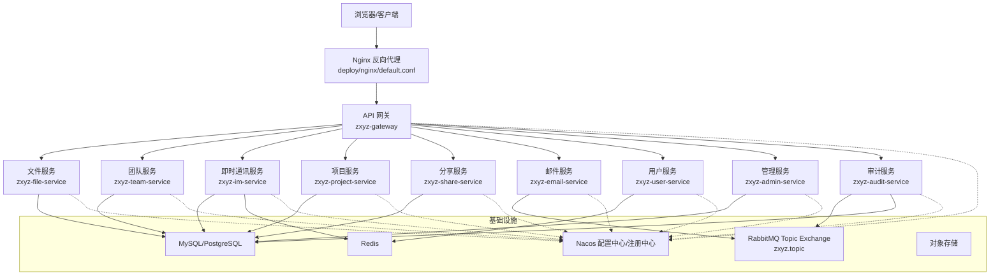

**图表来源**
- [docker-compose.yml](file://docker-compose.yml)
- [deploy/nginx/default.conf](file://deploy/nginx/default.conf)
- [nacos-config/zxyz-dynamic.yml](file://nacos-config/zxyz-dynamic.yml)

**章节来源**
- [docs/architecture.md](file://docs/architecture.md)
- [docker-compose.yml](file://docker-compose.yml)

## 详细组件分析

### 文件服务（zxyz-file-service）
- 功能要点
  - 分片上传与合并、断点续传、并发控制
  - 版本控制与差异快照、回收站软删除与恢复
  - 与对象存储对接，统一路径解析与访问签名
- 关键流程（分片上传）
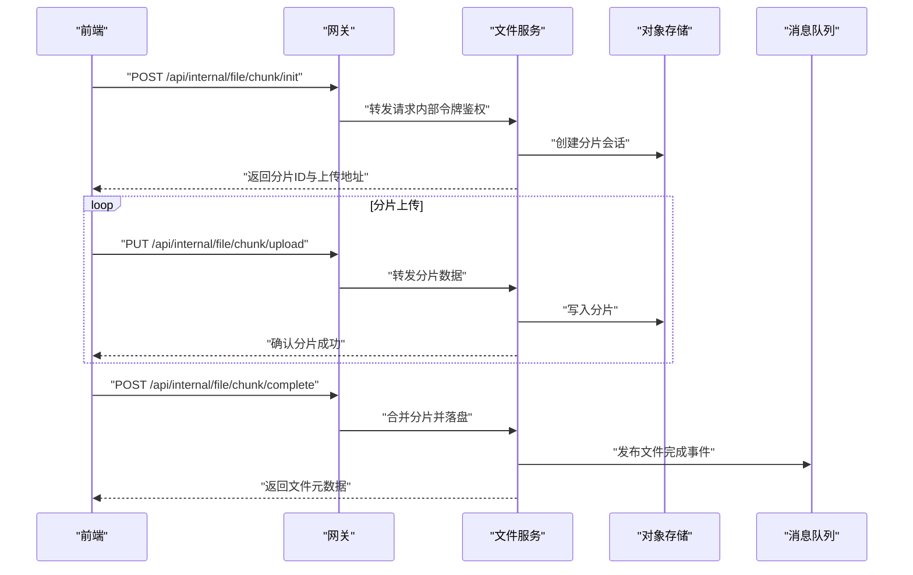

**图表来源**
- [ZXYZdatabaseBack/zxyz-file-service/src/main/java/uno/acloud/file/ZxyzFileApplication.java](file://ZXYZdatabaseBack/zxyz-file-service/src/main/java/uno/acloud/file/ZxyzFileApplication.java)

**章节来源**
- [ZXYZdatabaseBack/zxyz-file-service/src/main/java/uno/acloud/file/ZxyzFileApplication.java](file://ZXYZdatabaseBack/zxyz-file-service/src/main/java/uno/acloud/file/ZxyzFileApplication.java)

### 团队服务（zxyz-team-service）
- 功能要点
  - 成员邀请与审批、角色与权限模型
  - 团队资源配额与存储使用统计
- 权限校验流程（示例）
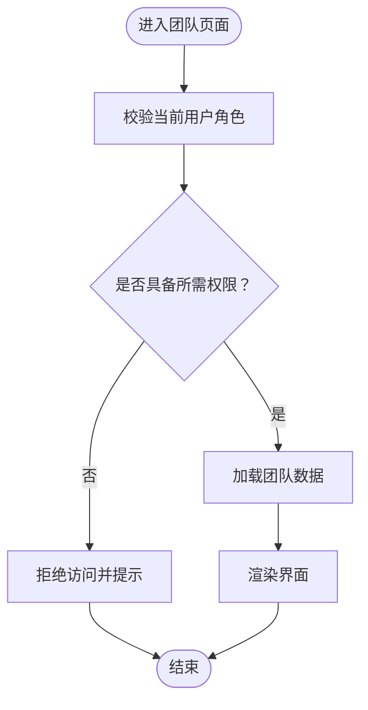

**图表来源**
- [ZXYZdatabaseBack/zxyz-team-service/src/main/java/uno/acloud/team/ZxyzTeamServiceApplication.java](file://ZXYZdatabaseBack/zxyz-team-service/src/main/java/uno/acloud/team/ZxyzTeamServiceApplication.java)

**章节来源**
- [ZXYZdatabaseBack/zxyz-team-service/src/main/java/uno/acloud/team/ZxyzTeamServiceApplication.java](file://ZXYZdatabaseBack/zxyz-team-service/src/main/java/uno/acloud/team/ZxyzTeamServiceApplication.java)

### 即时通讯服务（zxyz-im-service）
- 功能要点
  - 会话管理、消息持久化、在线状态同步
  - WebSocket长连接，结合Redis缓存提升性能
- 消息发送流程（示例）
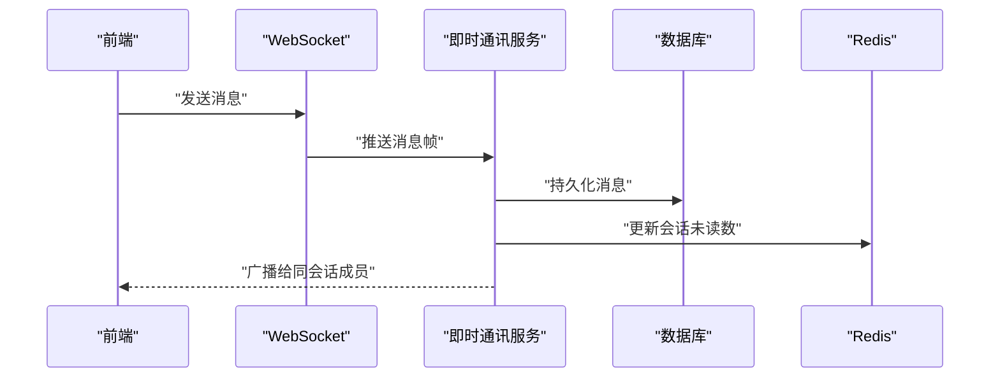

**图表来源**
- [ZXYZdatabaseBack/zxyz-im-service/src/main/java/uno/acloud/im/ZxyzImApplication.java](file://ZXYZdatabaseBack/zxyz-im-service/src/main/java/uno/acloud/im/ZxyzImApplication.java)
- [ZXYZdatabaseFront/src/store/chat.js](file://ZXYZdatabaseFront/src/store/chat.js)

**章节来源**
- [ZXYZdatabaseBack/zxyz-im-service/src/main/java/uno/acloud/im/ZxyzImApplication.java](file://ZXYZdatabaseBack/zxyz-im-service/src/main/java/uno/acloud/im/ZxyzImApplication.java)
- [ZXYZdatabaseFront/src/store/chat.js](file://ZXYZdatabaseFront/src/store/chat.js)

### 项目服务（zxyz-project-service）
- 功能要点
  - 虚拟空间隔离、项目配置管理、资源配额
  - 与文件服务、分享服务协作，实现空间级权限
- 配置管理流程（示例）
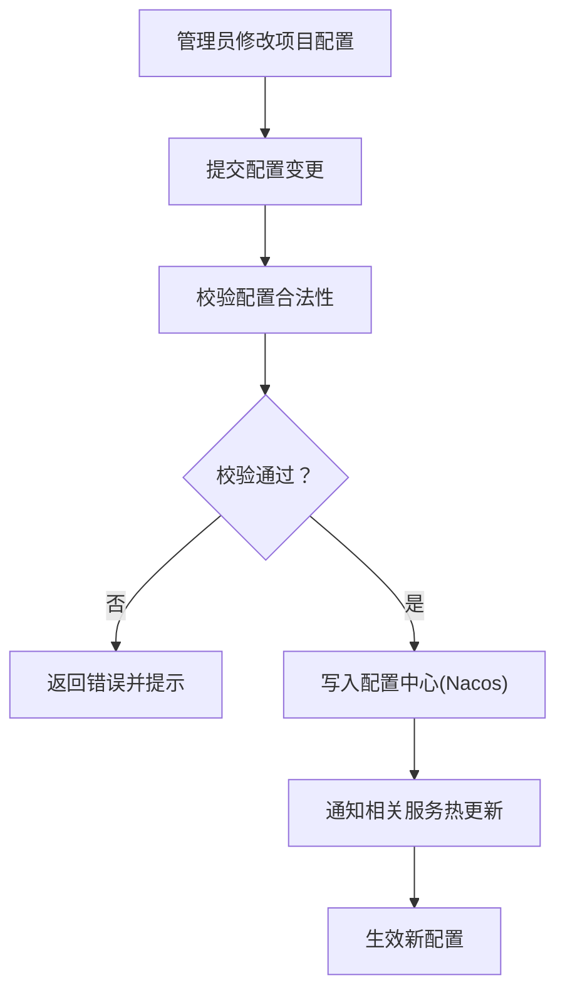

**图表来源**
- [ZXYZdatabaseBack/zxyz-project-service/src/main/java/uno/acloud/project/ZxyzProjectServiceApplication.java](file://ZXYZdatabaseBack/zxyz-project-service/src/main/java/uno/acloud/project/ZxyzProjectServiceApplication.java)
- [nacos-config/zxyz-dynamic.yml](file://nacos-config/zxyz-dynamic.yml)

**章节来源**
- [ZXYZdatabaseBack/zxyz-project-service/src/main/java/uno/acloud/project/ZxyzProjectServiceApplication.java](file://ZXYZdatabaseBack/zxyz-project-service/src/main/java/uno/acloud/project/ZxyzProjectServiceApplication.java)
- [nacos-config/zxyz-dynamic.yml](file://nacos-config/zxyz-dynamic.yml)

### 分享服务（zxyz-share-service）
- 功能要点
  - 分享链接生成、访问控制、下载统计与限流
  - 与文件服务对接获取内容，与审计服务记录访问
- 访问控制流程（示例）
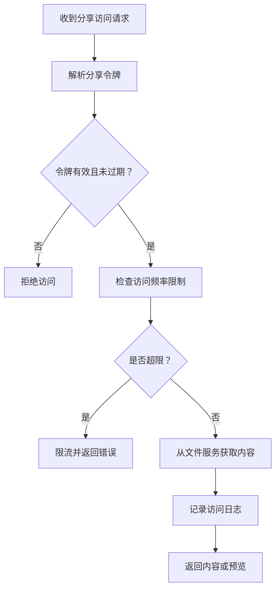

**图表来源**
- [ZXYZdatabaseBack/zxyz-share-service/src/main/java/uno/acloud/share/ZxyzShareApplication.java](file://ZXYZdatabaseBack/zxyz-share-service/src/main/java/uno/acloud/share/ZxyzShareApplication.java)

**章节来源**
- [ZXYZdatabaseBack/zxyz-share-service/src/main/java/uno/acloud/share/ZxyzShareApplication.java](file://ZXYZdatabaseBack/zxyz-share-service/src/main/java/uno/acloud/share/ZxyzShareApplication.java)

### 邮件服务（zxyz-email-service）
- 功能要点
  - 模板渲染、验证码生成与发送、发送记录查询
  - 多提供商适配，失败重试与死信队列
- 验证码发送流程（示例）
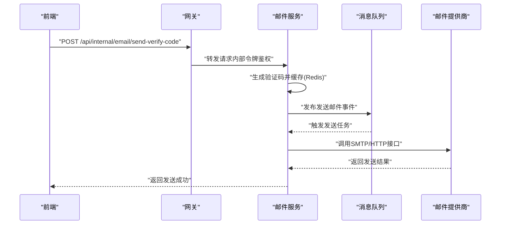

**图表来源**
- [ZXYZdatabaseBack/zxyz-email-service/src/main/java/uno/acloud/email/ZxyzEmailApplication.java](file://ZXYZdatabaseBack/zxyz-email-service/src/main/java/uno/acloud/email/ZxyzEmailApplication.java)

**章节来源**
- [ZXYZdatabaseBack/zxyz-email-service/src/main/java/uno/acloud/email/ZxyzEmailApplication.java](file://ZXYZdatabaseBack/zxyz-email-service/src/main/java/uno/acloud/email/ZxyzEmailApplication.java)

### 用户服务（zxyz-user-service）
- 功能要点
  - 登录注册、密码管理、会话管理（Sa-Token + Redis）
  - 与网关鉴权配合，保证HttpOnly Cookie安全
- 登录流程（示例）
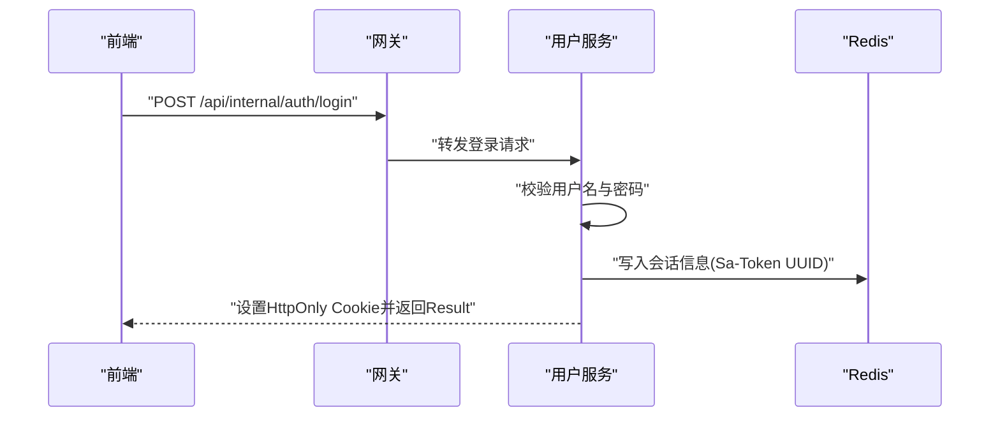

**图表来源**
- [ZXYZdatabaseBack/zxyz-user-service/src/main/java/uno/acloud/user/ZxyzUserApplication.java](file://ZXYZdatabaseBack/zxyz-user-service/src/main/java/uno/acloud/user/ZxyzUserApplication.java)
- [ZXYZdatabaseFront/src/api/auth.js](file://ZXYZdatabaseFront/src/api/auth.js)

**章节来源**
- [ZXYZdatabaseBack/zxyz-user-service/src/main/java/uno/acloud/user/ZxyzUserApplication.java](file://ZXYZdatabaseBack/zxyz-user-service/src/main/java/uno/acloud/user/ZxyzUserApplication.java)
- [ZXYZdatabaseFront/src/api/auth.js](file://ZXYZdatabaseFront/src/api/auth.js)

### 管理服务（zxyz-admin-service）
- 功能要点
  - 系统配置、审计查看、第三方提供者管理
  - 配置变更审计，确保合规与可追溯
- 配置审计流程（示例）
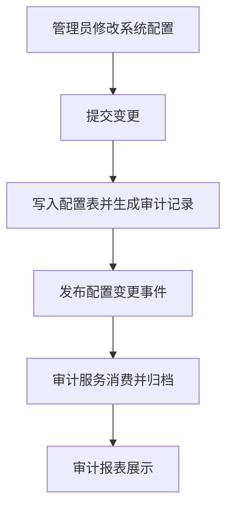

**图表来源**
- [ZXYZdatabaseBack/zxyz-admin-service/src/main/java/uno/acloud/admin/ZxyzAdminApplication.java](file://ZXYZdatabaseBack/zxyz-admin-service/src/main/java/uno/acloud/admin/ZxyzAdminApplication.java)

**章节来源**
- [ZXYZdatabaseBack/zxyz-admin-service/src/main/java/uno/acloud/admin/ZxyzAdminApplication.java](file://ZXYZdatabaseBack/zxyz-admin-service/src/main/java/uno/acloud/admin/ZxyzAdminApplication.java)

### 审计服务（zxyz-audit-service）
- 功能要点
  - 操作日志收集、去重、清理任务
  - 基于RabbitMQ Topic Exchange异步消费
- 日志消费流程（示例）
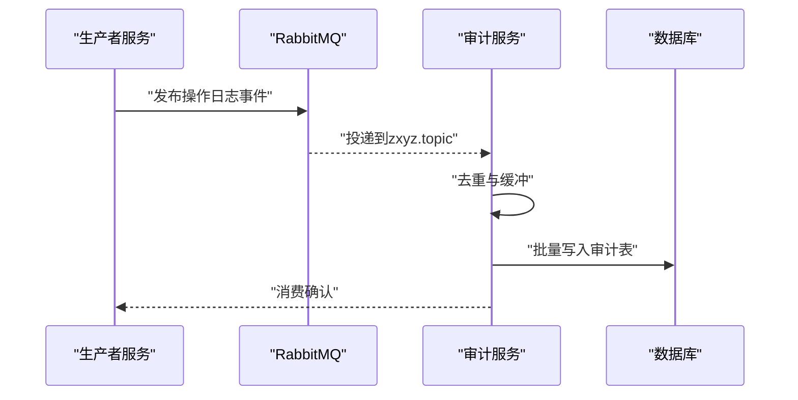

**图表来源**
- [ZXYZdatabaseBack/zxyz-audit-service/src/main/java/uno/acloud/audit/ZxyzAuditServiceApplication.java](file://ZXYZdatabaseBack/zxyz-audit-service/src/main/java/uno/acloud/audit/ZxyzAuditServiceApplication.java)

**章节来源**
- [ZXYZdatabaseBack/zxyz-audit-service/src/main/java/uno/acloud/audit/ZxyzAuditServiceApplication.java](file://ZXYZdatabaseBack/zxyz-audit-service/src/main/java/uno/acloud/audit/ZxyzAuditServiceApplication.java)

## 依赖关系分析
- 服务间调用遵循窄端点与投影模式：内部接口返回调用方专用Projection VO，禁止返回胖DTO；JsonNode手动字段映射，不使用treeToValue；提供方与调用方投影类独立演进，不放入zxyz-common。
- 内部端点前缀/api/internal/**，被网关SaToken过滤器拒绝公网访问，仅允许内部服务互调。
- 异步通信使用RabbitMQ Topic Exchange zxyz.topic，解耦生产与消费，提高弹性。

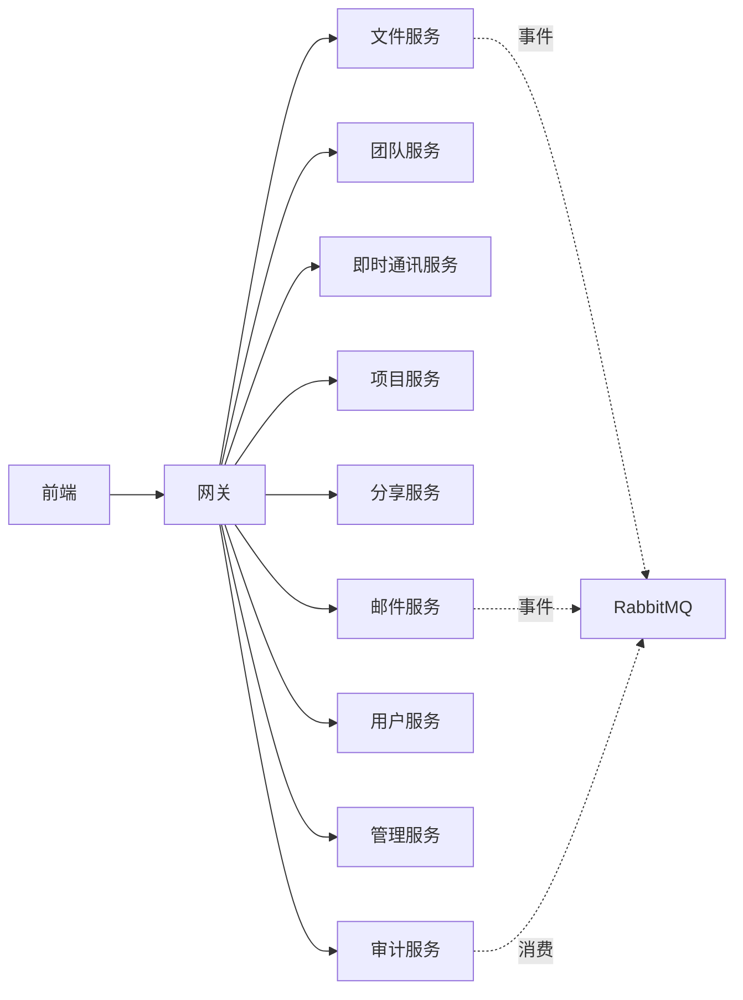

**图表来源**
- [ZXYZdatabaseBack/zxyz-gateway/src/main/java/uno/acloud/gateway/ZxyzGatewayApplication.java](file://ZXYZdatabaseBack/zxyz-gateway/src/main/java/uno/acloud/gateway/ZxyzGatewayApplication.java)
- [ZXYZdatabaseBack/zxyz-audit-service/src/main/java/uno/acloud/audit/ZxyzAuditServiceApplication.java](file://ZXYZdatabaseBack/zxyz-audit-service/src/main/java/uno/acloud/audit/ZxyzAuditServiceApplication.java)

**章节来源**
- [ZXYZdatabaseBack/zxyz-gateway/src/main/java/uno/acloud/gateway/ZxyzGatewayApplication.java](file://ZXYZdatabaseBack/zxyz-gateway/src/main/java/uno/acloud/gateway/ZxyzGatewayApplication.java)
- [ZXYZdatabaseBack/zxyz-audit-service/src/main/java/uno/acloud/audit/ZxyzAuditServiceApplication.java](file://ZXYZdatabaseBack/zxyz-audit-service/src/main/java/uno/acloud/audit/ZxyzAuditServiceApplication.java)

## 性能与弹性
- 微服务架构带来的高内聚低耦合
  - 每个服务聚焦单一职责，便于独立扩缩容与优化
  - 服务间通过窄端点与投影减少数据传输与序列化开销
- 容器化部署提升运维效率
  - Docker Compose编排18个容器（5基础设施+10后端+frontend-nginx+2日志栈）
  - CI/CD基于GitHub Actions + dorny/paths-filter选择性构建，镜像推送GHCR
- 事件驱动架构保证系统弹性
  - RabbitMQ Topic Exchange zxyz.topic用于异步解耦
  - 失败重试与死信队列提升可靠性
- 前端性能优化
  - Vue 3 Composition API + <script setup>，Element Plus auto-import
  - Pinia状态管理，composables封装业务逻辑，减少重复代码

**章节来源**
- [docker-compose.yml](file://docker-compose.yml)
- [.github/workflows/ci-cd.yml](file://.github/workflows/ci-cd.yml)
- [ZXYZdatabaseFront/package.json](file://ZXYZdatabaseFront/package.json)

## 故障排查指南
- 常见问题定位
  - 网关鉴权失败：检查SaToken过滤器与内部令牌传递
  - 文件上传失败：检查分片会话、对象存储权限与网络连通性
  - 即时通讯断连：检查WebSocket连接、Redis缓存与会话状态
  - 邮件发送失败：检查邮件提供商配置、SMTP/HTTP接口与重试策略
  - 审计日志缺失：检查RabbitMQ队列、消费者状态与数据库写入
- 调试建议
  - 启用服务日志与链路追踪
  - 使用健康检查脚本验证服务状态
  - 通过Nacos动态配置调整日志级别与限流阈值

**章节来源**
- [ZXYZdatabaseBack/zxyz-gateway/src/main/java/uno/acloud/gateway/ZxyzGatewayApplication.java](file://ZXYZdatabaseBack/zxyz-gateway/src/main/java/uno/acloud/gateway/ZxyzGatewayApplication.java)
- [ZXYZdatabaseBack/zxyz-file-service/src/main/java/uno/acloud/file/ZxyzFileApplication.java](file://ZXYZdatabaseBack/zxyz-file-service/src/main/java/uno/acloud/file/ZxyzFileApplication.java)
- [ZXYZdatabaseBack/zxyz-im-service/src/main/java/uno/acloud/im/ZxyzImApplication.java](file://ZXYZdatabaseBack/zxyz-im-service/src/main/java/uno/acloud/im/ZxyzImApplication.java)
- [ZXYZdatabaseBack/zxyz-email-service/src/main/java/uno/acloud/email/ZxyzEmailApplication.java](file://ZXYZdatabaseBack/zxyz-email-service/src/main/java/uno/acloud/email/ZxyzEmailApplication.java)
- [ZXYZdatabaseBack/zxyz-audit-service/src/main/java/uno/acloud/audit/ZxyzAuditServiceApplication.java](file://ZXYZdatabaseBack/zxyz-audit-service/src/main/java/uno/acloud/audit/ZxyzAuditServiceApplication.java)

## 结论
ZXYZ数据库协作平台以微服务架构为核心，结合容器化与事件驱动，提供了企业级的文件管理、团队协作、即时通讯、项目管理、分享与权限、邮件服务等综合能力。平台在安全性、可扩展性与可维护性方面具备显著优势，适合大型团队在数据资产协同与实时沟通方面的综合需求。

## 附录
- 技术栈概览
  - 后端：Spring Boot + Sa-Token + Nacos + RabbitMQ + Docker
  - 前端：Vue 3 + Element Plus + Pinia + WebSocket
  - 基础设施：MySQL/PostgreSQL、Redis、对象存储、Nginx
- 部署与运维
  - Docker Compose编排、CI/CD流水线、Nacos配置管理、Jasypt加密敏感配置

**章节来源**
- [ZXYZdatabaseBack/Dockerfile](file://ZXYZdatabaseBack/Dockerfile)
- [ZXYZdatabaseFront/src/main.js](file://ZXYZdatabaseFront/src/main.js)
- [ZXYZdatabaseFront/src/utils/request.js](file://ZXYZdatabaseFront/src/utils/request.js)
- [ZXYZdatabaseFront/src/api/files.js](file://ZXYZdatabaseFront/src/api/files.js)
- [docs/architecture.md](file://docs/architecture.md)