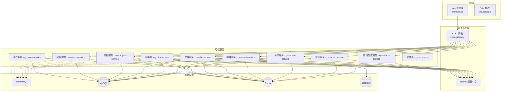
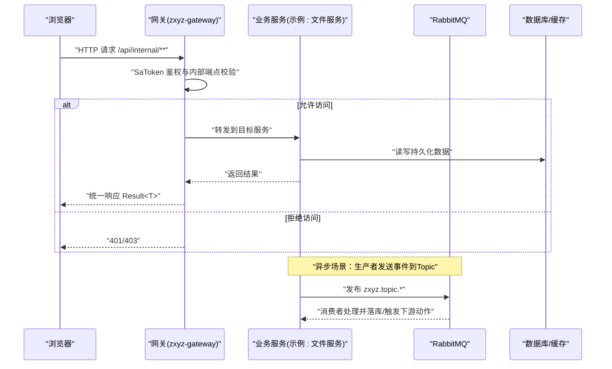
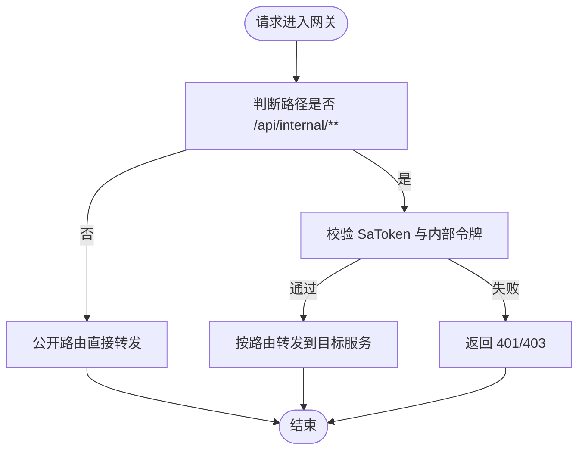
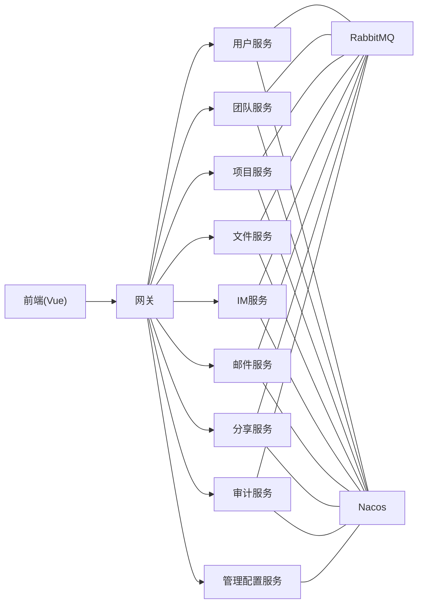

# 项目概述

<cite>
**本文引用的文件**
- [README.md](file://ZXYZdatabaseBack/README.md)
- [pom.xml](file://ZXYZdatabaseBack/pom.xml)
- [docker-compose.yml](file://docker-compose.yml)
- [docker-compose.dev.yml](file://docker-compose.dev.yml)
- [ci-cd.yml](file://ZXYZdatabaseBack/.github/workflows/ci-cd.yml)
- [build.yml](file://ZXYZdatabaseFront/.github/workflows/build.yml)
- [deploy.yml](file://ZXYZdatabaseFront/.github/workflows/deploy.yml)
- [index.html](file://ZXYZdatabaseFront/index.html)
- [main.js](file://ZXYZdatabaseFront/src/main.js)
- [package.json](file://ZXYZdatabaseFront/package.json)
- [vite.config.js](file://ZXYZdatabaseFront/vite.config.js)
- [application.yml](file://ZXYZdatabaseBack/zxyz-gateway/src/main/resources/application.yml)
- [zxyz-gateway.yml](file://nacos-config/zxyz-gateway.yml)
- [zxyz-dynamic.yml](file://nacos-config/zxyz-dynamic.yml)
- [zxyz-static.yml](file://nacos-config/zxyz-static.yml)
- [architecture.md](file://docs/architecture.md)
- [api-contract.md](file://docs/api-contract.md)
- [infrastructure.md](file://docs/infrastructure.md)
- [CLAUDE.md](file://CLAUDE.md)
- [DEPLOYMENT.md](file://DEPLOYMENT.md)
</cite>

## 目录
1. [简介](#简介)
2. [项目结构](#项目结构)
3. [核心组件](#核心组件)
4. [架构总览](#架构总览)
5. [详细组件分析](#详细组件分析)
6. [依赖关系分析](#依赖关系分析)
7. [性能考量](#性能考量)
8. [故障排查指南](#故障排查指南)
9. [结论](#结论)
10. [附录](#附录)

## 简介
ZXYZ数据库协作平台是一个面向团队协作的数据库与文档协作系统，提供用户与团队管理、项目管理、即时通讯、文件存储与分享、邮件通知、审计日志以及统一网关与配置中心等能力。项目采用微服务架构，后端由11个Spring Boot服务模块组成，前端为基于Vue 3 Composition API的单页应用，通过Nacos进行配置与服务治理，使用RabbitMQ实现异步解耦，整体容器化部署于Docker Compose环境，并通过GitHub Actions完成CI/CD流水线。

核心价值主张：
- 以“空间（团队）+项目”为核心的协作模型，支持成员权限与资源隔离
- 统一的认证鉴权与网关路由，保障内部接口安全
- 高内聚低耦合的微服务边界，便于独立演进与扩展
- 完善的审计与消息机制，提升可观测性与可靠性
- 前后端分离与现代化技术栈，提升开发效率与用户体验

**章节来源**
- [CLAUDE.md](file://CLAUDE.md)
- [DEPLOYMENT.md](file://DEPLOYMENT.md)

## 项目结构
后端采用多模块Maven工程组织，每个业务域一个独立服务，共享通用库；前端为独立的Vue工程，构建产物由Nginx托管。基础设施层包含Nacos、RabbitMQ、MySQL、Redis等，通过Docker Compose编排启动。

**图表来源**
- [docker-compose.yml](file://docker-compose.yml)
- [docker-compose.dev.yml](file://docker-compose.dev.yml)
- [application.yml](file://ZXYZdatabaseBack/zxyz-gateway/src/main/resources/application.yml)
- [zxyz-gateway.yml](file://nacos-config/zxyz-gateway.yml)

**章节来源**
- [pom.xml](file://ZXYZdatabaseBack/pom.xml)
- [docker-compose.yml](file://docker-compose.yml)
- [docker-compose.dev.yml](file://docker-compose.dev.yml)

## 核心组件
- 网关（zxyz-gateway）：统一入口、路由转发、SaToken鉴权过滤、内部端点访问控制
- 用户服务（zxyz-user-service）：用户注册登录、会话管理、基础信息维护
- 团队服务（zxyz-team-service）：团队创建、成员管理、角色权限、配额与存储策略
- 项目服务（zxyz-project-service）：项目生命周期、空间划分、任务与元数据管理
- 文件服务（zxyz-file-service）：文件上传下载、版本管理、回收站、分片与断点续传
- IM服务（zxyz-im-service）：会话、消息、成员、在线状态、WebSocket实时通信
- 邮件服务（zxyz-email-service）：模板渲染、发送队列、记录查询、验证码
- 分享服务（zxyz-share-service）：分享链接生成、访问控制、限流与审计
- 审计服务（zxyz-audit-service）：操作日志采集、去重、清理与归档
- 管理配置服务（zxyz-admin-service）：系统配置、提供者管理、热更新
- 公共库（zxyz-common）：通用DTO、工具类、事件定义、客户端抽象

职责划分遵循单一职责原则，服务间通过窄端点与投影VO交互，避免胖DTO跨服务传播。

**章节来源**
- [CLAUDE.md](file://CLAUDE.md)
- [architecture.md](file://docs/architecture.md)

## 架构总览
ZXYZ平台采用“前端 + 网关 + 微服务 + 基础设施”的分层架构。前端通过HTTP/WebSocket与网关交互，网关将请求路由至对应服务并进行鉴权。服务之间同步调用通过ServiceClient并携带内部令牌，异步通信通过RabbitMQ Topic Exchange进行事件驱动。配置与服务发现由Nacos统一管理，敏感配置通过Jasypt加密。

**图表来源**
- [application.yml](file://ZXYZdatabaseBack/zxyz-gateway/src/main/resources/application.yml)
- [zxyz-gateway.yml](file://nacos-config/zxyz-gateway.yml)
- [CLAUDE.md](file://CLAUDE.md)

**章节来源**
- [CLAUDE.md](file://CLAUDE.md)
- [api-contract.md](file://docs/api-contract.md)

## 详细组件分析

### 网关与鉴权（zxyz-gateway）
- 功能：统一入口、路由、CORS、限流、SaToken过滤器、内部端点拦截
- 关键点：/api/internal/** 仅允许内部服务访问，外部被拒绝；JWT/UUID Token与会话在Redis中校验

**图表来源**
- [application.yml](file://ZXYZdatabaseBack/zxyz-gateway/src/main/resources/application.yml)
- [zxyz-gateway.yml](file://nacos-config/zxyz-gateway.yml)

**章节来源**
- [application.yml](file://ZXYZdatabaseBack/zxyz-gateway/src/main/resources/application.yml)
- [zxyz-gateway.yml](file://nacos-config/zxyz-gateway.yml)

### 用户服务（zxyz-user-service）
- 功能：注册、登录、密码修改、头像上传、会话管理
- 技术：SaToken + Redis Session，Result<T>统一响应
- 集成：与网关鉴权联动，与其他服务通过UserQueryClient获取用户信息

**章节来源**
- [CLAUDE.md](file://CLAUDE.md)
- [api-contract.md](file://docs/api-contract.md)

### 团队与项目（zxyz-team-service, zxyz-project-service）
- 团队：成员邀请、角色权限、存储配额、策略配置
- 项目：项目创建、空间划分、权限继承、与文件/IM的关联
- 事件：成员变更、权限变更通过RabbitMQ广播

**章节来源**
- [CLAUDE.md](file://CLAUDE.md)
- [api-contract.md](file://docs/api-contract.md)

### 文件服务（zxyz-file-service）
- 功能：上传、下载、预览、分片、断点续传、回收站、批量打包下载
- 存储：对接对象存储（OSS），本地缓存与元数据持久化
- 事件：删除、移动、重命名等事件通过MQ异步处理

**章节来源**
- [CLAUDE.md](file://CLAUDE.md)
- [api-contract.md](file://docs/api-contract.md)

### IM服务（zxyz-im-service）
- 分层：interfaces → application → domain → infrastructure（DDD风格）
- 功能：会话、消息、成员、在线状态、WebSocket实时推送
- 存储：消息与会话持久化，状态缓存于Redis

**章节来源**
- [CLAUDE.md](file://CLAUDE.md)
- [api-contract.md](file://docs/api-contract.md)

### 邮件服务（zxyz-email-service）
- 分层：interfaces → application → domain → infrastructure（DDD风格）
- 功能：模板渲染、发送队列、记录查询、验证码生成与校验
- 集成：SMTP提供商抽象，支持多供应商切换

**章节来源**
- [CLAUDE.md](file://CLAUDE.md)
- [api-contract.md](file://docs/api-contract.md)

### 分享服务（zxyz-share-service）
- 功能：分享链接生成、访问控制、限流、审计
- 特性：短链、有效期、访问统计、防刷

**章节来源**
- [CLAUDE.md](file://CLAUDE.md)
- [api-contract.md](file://docs/api-contract.md)

### 审计服务（zxyz-audit-service）
- 功能：操作日志采集、去重、清理与归档
- 机制：监听MQ事件，写入审计表，定期清理历史数据

**章节来源**
- [CLAUDE.md](file://CLAUDE.md)
- [api-contract.md](file://docs/api-contract.md)

### 管理配置服务（zxyz-admin-service）
- 功能：系统配置项管理、提供者管理、热更新
- 集成：Nacos动态配置，Jasypt加密敏感字段

**章节来源**
- [CLAUDE.md](file://CLAUDE.md)
- [api-contract.md](file://docs/api-contract.md)

### 公共库（zxyz-common）
- 内容：通用DTO、工具类、事件定义、客户端抽象、异常处理
- 约束：禁止跨服务传递胖DTO，使用窄端点与投影VO

**章节来源**
- [CLAUDE.md](file://CLAUDE.md)

## 依赖关系分析
- 服务间同步调用：ServiceClient + X-Internal-Service-Token 鉴权
- 异步通信：RabbitMQ Topic Exchange “zxyz.topic”，事件驱动
- 配置中心：Nacos集中管理，支持动态刷新
- 数据存储：MySQL持久化，Redis缓存与会话，对象存储文件
- 前端依赖：Vue 3 Composition API、Element Plus、Pinia、Vite构建

**图表来源**
- [docker-compose.yml](file://docker-compose.yml)
- [zxyz-dynamic.yml](file://nacos-config/zxyz-dynamic.yml)
- [zxyz-static.yml](file://nacos-config/zxyz-static.yml)

**章节来源**
- [CLAUDE.md](file://CLAUDE.md)
- [infrastructure.md](file://docs/infrastructure.md)

## 性能考量
- 网关层限流与熔断：对热点接口实施限流，保护后端服务
- 异步化：耗时操作（如邮件发送、文件转码、审计写入）通过MQ异步处理
- 缓存：热点数据与会话缓存于Redis，降低DB压力
- 分片与断点续传：大文件上传分片并行，提升吞吐与稳定性
- 连接池与线程池：合理配置数据库连接池与线程池大小，避免资源争用
- 监控与告警：结合Promtail与日志收集，定位性能瓶颈

[本节为通用指导，不直接分析具体文件]

## 故障排查指南
- 网关鉴权失败：检查SaToken配置与Redis会话，确认内部令牌是否正确传递
- 服务不可达：查看Nacos服务注册与健康检查，确认服务实例状态
- 消息堆积：检查RabbitMQ队列消费情况，排查消费者异常与死信队列
- 文件上传失败：核对对象存储凭证与网络连通性，检查分片重试逻辑
- 配置未生效：确认Nacos配置分组与DataId，检查Jasypt解密是否正常

**章节来源**
- [CLAUDE.md](file://CLAUDE.md)
- [DEPLOYMENT.md](file://DEPLOYMENT.md)

## 结论
ZXYZ数据库协作平台以清晰的微服务边界与现代化的技术栈，构建了可扩展、可维护、高可用的协作系统。通过网关统一鉴权、Nacos配置中心、RabbitMQ异步解耦，以及容器化与CI/CD自动化，平台具备良好的工程实践与运维能力。建议在新功能开发中严格遵循窄端点与投影模式，保持服务间的松耦合与独立演进。

[本节为总结性内容，不直接分析具体文件]

## 附录

### 快速开始
- 环境要求
  - Docker与Docker Compose
  - Git
  - Node.js（前端开发）
- 依赖安装
  - 克隆仓库，进入根目录
  - 安装前端依赖（可选）：npm install
- 基本启动步骤
  - 启动基础设施与后端：docker compose up -d
  - 等待服务健康检查通过
  - 访问前端页面（默认端口由Nginx暴露）
  - 首次登录可通过管理员账号或注册流程初始化

**章节来源**
- [docker-compose.yml](file://docker-compose.yml)
- [docker-compose.dev.yml](file://docker-compose.dev.yml)
- [package.json](file://ZXYZdatabaseFront/package.json)

### 核心技术栈
- 后端：Spring Boot微服务、SaToken、MyBatis、RabbitMQ、Nacos、Jasypt
- 前端：Vue 3 Composition API、Element Plus、Pinia、Vite
- 基础设施：Docker、Nginx、MySQL、Redis、对象存储

**章节来源**
- [CLAUDE.md](file://CLAUDE.md)
- [infrastructure.md](file://docs/infrastructure.md)

### CI/CD与部署
- GitHub Actions工作流：后端与前端分别构建与测试，镜像推送GHCR
- 选择性构建：基于路径过滤减少构建时间
- 部署脚本：一键部署与回滚，健康检查确保服务可用

**章节来源**
- [ci-cd.yml](file://ZXYZdatabaseBack/.github/workflows/ci-cd.yml)
- [build.yml](file://ZXYZdatabaseFront/.github/workflows/build.yml)
- [deploy.yml](file://ZXYZdatabaseFront/.github/workflows/deploy.yml)
- [DEPLOYMENT.md](file://DEPLOYMENT.md)

### 前端结构与运行
- 入口文件：index.html与src/main.js
- 构建配置：vite.config.js
- 包管理：package.json

**章节来源**
- [index.html](file://ZXYZdatabaseFront/index.html)
- [main.js](file://ZXYZdatabaseFront/src/main.js)
- [package.json](file://ZXYZdatabaseFront/package.json)
- [vite.config.js](file://ZXYZdatabaseFront/vite.config.js)